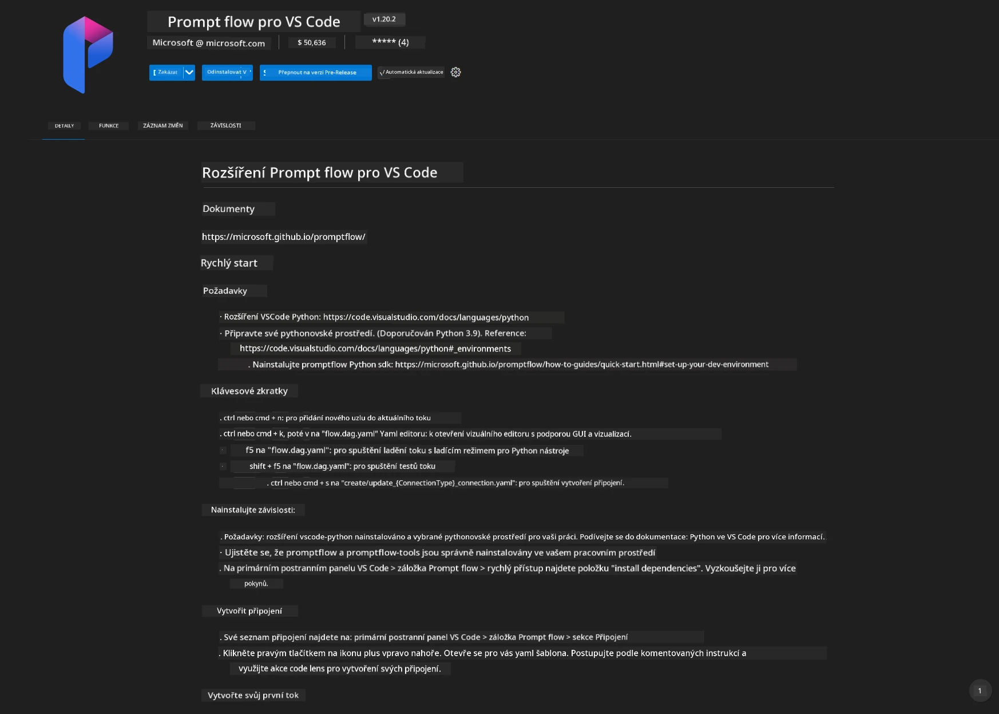
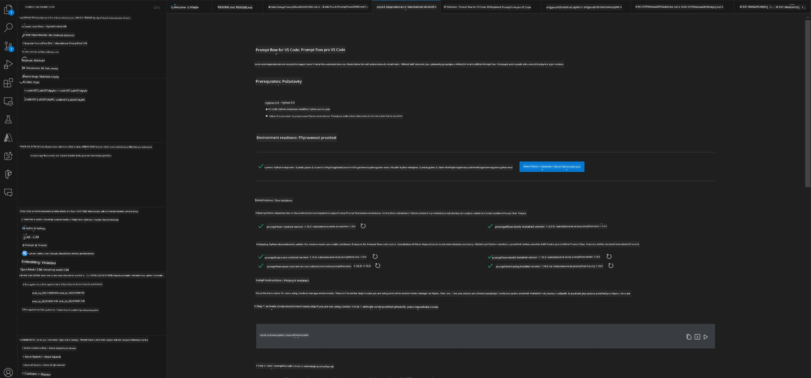
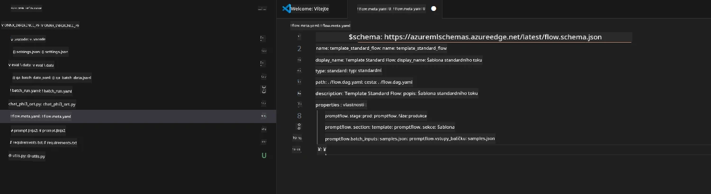
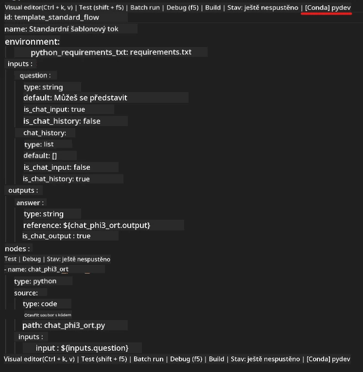
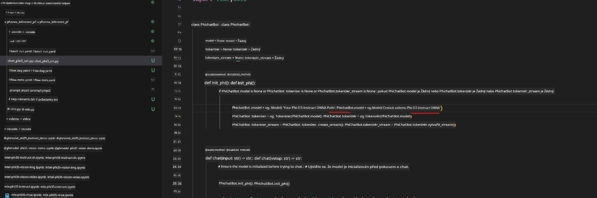
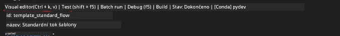
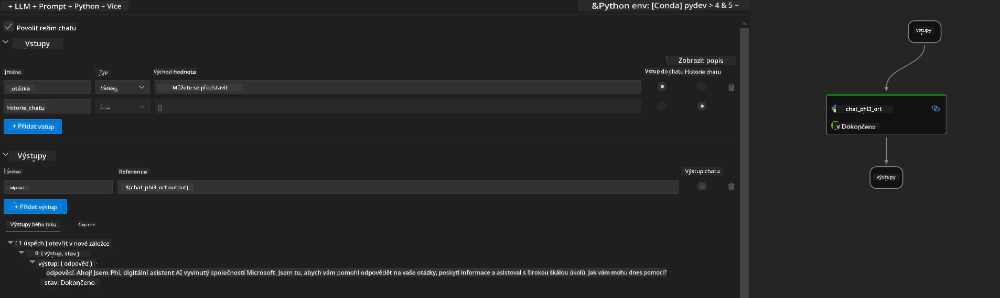
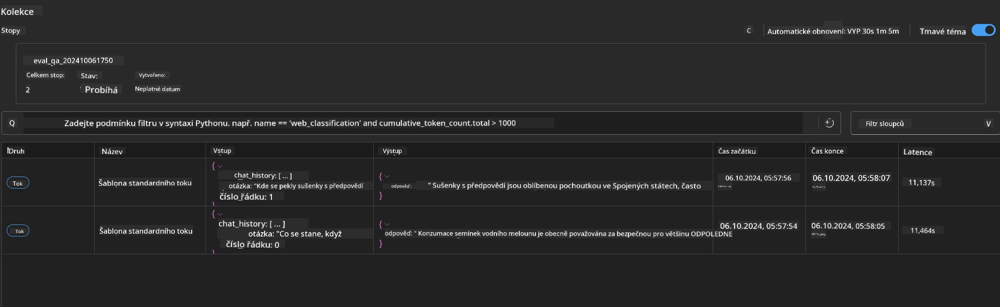

# Použití Windows GPU k vytvoření řešení Prompt flow s Phi-3.5-Instruct ONNX 

Následující dokument je příkladem, jak používat PromptFlow s ONNX (Open Neural Network Exchange) pro vývoj AI aplikací založených na modelech Phi-3.

PromptFlow je sada vývojářských nástrojů navržených ke zjednodušení kompletního vývojového cyklu AI aplikací založených na LLM (Large Language Model), od nápadu a prototypování po testování a hodnocení.

Integrací PromptFlow s ONNX mohou vývojáři:

- Optimalizovat výkon modelu: Využít ONNX pro efektivní inferenci a nasazení modelu.
- Zjednodušit vývoj: Používat PromptFlow pro správu workflow a automatizaci opakujících se úkolů.
- Zlepšit spolupráci: Facilituje lepší spolupráci mezi členy týmu díky sjednocenému vývojovému prostředí.

**Prompt flow** je sada vývojářských nástrojů určených ke zefektivnění kompletního vývojového cyklu AI aplikací založených na LLM, od nápadu, prototypování, testování, hodnocení až po produkční nasazení a monitorování. Usnadňuje prompt engineering a umožňuje vytvářet aplikace LLM s produkční kvalitou.

Prompt flow může pracovat s OpenAI, Azure OpenAI Service a přizpůsobitelnými modely (Huggingface, lokální LLM/SLM). Doufáme, že nasadíme kvantovaný ONNX model Phi-3.5 do lokálních aplikací. Prompt flow nám může pomoci lépe plánovat byznys a dokončit lokální řešení založená na Phi-3.5. V tomto příkladu spojíme ONNX Runtime GenAI knihovnu k dokončení Prompt flow řešení založeného na Windows GPU.

## **Instalace**

### **ONNX Runtime GenAI pro Windows GPU**

Přečtěte si tento návod ke konfiguraci ONNX Runtime GenAI pro Windows GPU [klikněte zde](./ORTWindowGPUGuideline.md)

### **Nastavení Prompt flow ve VSCode**

1. Nainstalujte rozšíření Prompt flow pro VS Code



2. Po instalaci rozšíření Prompt flow VS Code klikněte na rozšíření a vyberte **Installation dependencies** podle tohoto návodu nainstalujte Prompt flow SDK ve vašem prostředí



3. Stáhněte [Ukázkový kód](../../../../../../code/09.UpdateSamples/Aug/pf/onnx_inference_pf) a otevřete tento vzorek ve VS Code



4. Otevřete **flow.dag.yaml** a vyberte své Python prostředí



   Otevřete **chat_phi3_ort.py** a změňte umístění Phi-3.5-instruct ONNX modelu



5. Spusťte váš Prompt flow k otestování

Otevřete **flow.dag.yaml** a klikněte na vizuální editor



po kliknutí spusťte test



1. Můžete spustit dávku v terminálu a zkontrolovat více výsledků


```bash

pf run create --file batch_run.yaml --stream --name 'Your eval qa name'    

```

Výsledky můžete zkontrolovat ve vašem výchozím prohlížeči




---

<!-- CO-OP TRANSLATOR DISCLAIMER START -->
**Prohlášení o omezení odpovědnosti**:
Tento dokument byl přeložen pomocí AI překladatelské služby [Co-op Translator](https://github.com/Azure/co-op-translator). Přestože usilujeme o co největší přesnost, mějte prosím na paměti, že automatizované překlady mohou obsahovat chyby nebo nepřesnosti. Originální dokument v jeho mateřském jazyce by měl být považován za autoritativní zdroj. Pro kritické informace se doporučuje profesionální lidský překlad. Nejsme odpovědní za jakékoli nedorozumění nebo nesprávné interpretace vzniklé použitím tohoto překladu.
<!-- CO-OP TRANSLATOR DISCLAIMER END -->