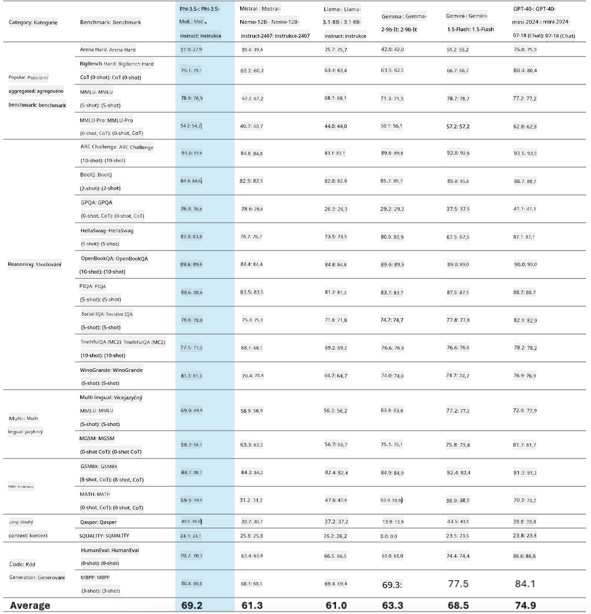
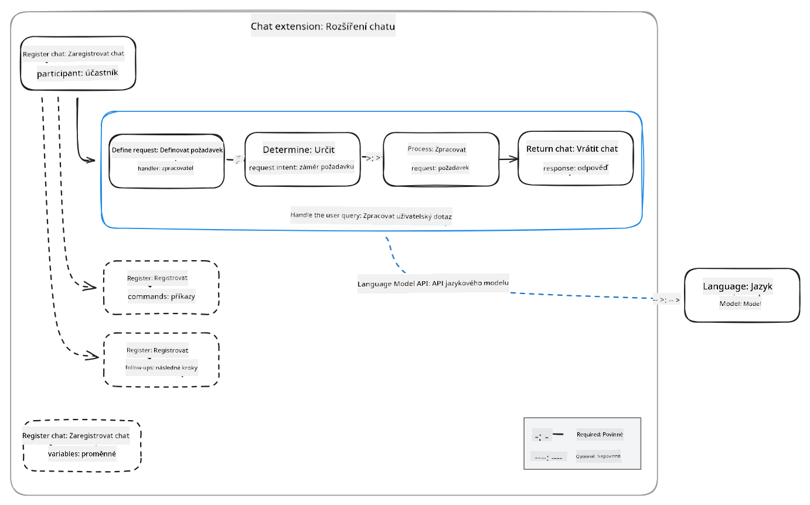
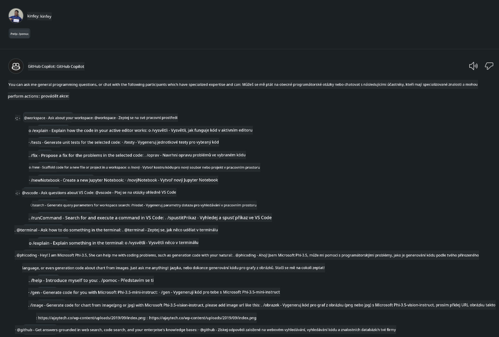
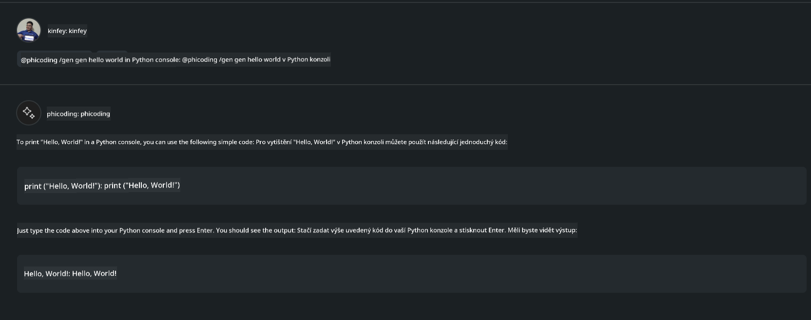
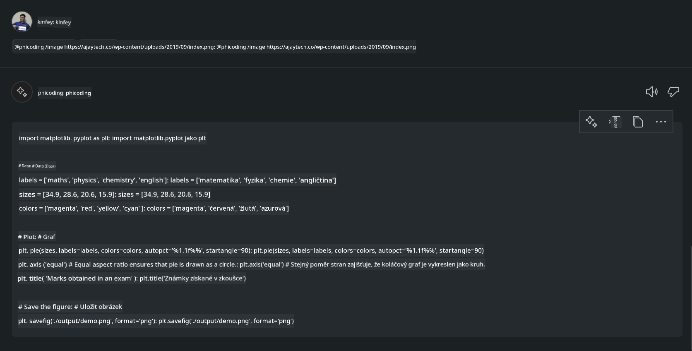

<!--
CO_OP_TRANSLATOR_METADATA:
{
  "original_hash": "35bf81388ac6917277b8d9a0c39bdc70",
  "translation_date": "2025-07-17T03:29:43+00:00",
  "source_file": "md/02.Application/02.Code/Phi3/CreateVSCodeChatAgentWithGitHubModels.md",
  "language_code": "cs"
}
-->
# **Vytvořte si vlastního agenta Visual Studio Code Chat Copilot s Phi-3.5 od GitHub Models**

Používáte Visual Studio Code Copilot? Zejména v chatu můžete využít různé agenty, kteří zlepší schopnost vytvářet, psát a udržovat projekty ve Visual Studio Code. Visual Studio Code nabízí API, které umožňuje firmám i jednotlivcům vytvářet různé agenty podle jejich potřeb a rozšiřovat tak možnosti v různých specializovaných oblastech. V tomto článku se zaměříme na **Phi-3.5-mini-instruct (128k)** a **Phi-3.5-vision-instruct (128k)** od GitHub Models, abychom vytvořili vlastního agenta pro Visual Studio Code.

## **O Phi-3.5 na GitHub Models**

Ví se, že Phi-3/3.5-mini-instruct z rodiny Phi-3/3.5 má silné schopnosti porozumění a generování kódu a má výhody oproti Gemma-2-9b a Mistral-Nemo-12B-instruct-2407.



Nejnovější GitHub Models již poskytují přístup k modelům Phi-3.5-mini-instruct (128k) a Phi-3.5-vision-instruct (128k). Vývojáři k nim mohou přistupovat přes OpenAI SDK, Azure AI Inference SDK a REST API.


***Poznámka:*** Doporučuje se zde používat Azure AI Inference SDK, protože lépe přepíná s Azure Model Catalog v produkčním prostředí.

Následují výsledky **Phi-3.5-mini-instruct (128k)** a **Phi-3.5-vision-instruct (128k)** v scénáři generování kódu po napojení na GitHub Models, a také příprava na následující příklady.

**Demo: GitHub Models Phi-3.5-mini-instruct (128k) generuje kód z Promptu** ([klikněte zde](../../../../../../code/09.UpdateSamples/Aug/ghmodel_phi35_instruct_demo.ipynb))

**Demo: GitHub Models Phi-3.5-vision-instruct (128k) generuje kód z obrázku** ([klikněte zde](../../../../../../code/09.UpdateSamples/Aug/ghmodel_phi35_vision_demo.ipynb))


## **O GitHub Copilot Chat Agent**

GitHub Copilot Chat Agent dokáže dokončit různé úkoly v různých projektových scénářích na základě kódu. Systém má čtyři agenty: workspace, github, terminal, vscode.


Přidáním jména agenta s ‘@’ můžete rychle dokončit odpovídající práci. Pro firmy, pokud přidáte vlastní obsah související s byznysem, jako jsou požadavky, kódování, testovací specifikace a vydání, můžete získat výkonnější privátní firemní funkce založené na GitHub Copilot.

Visual Studio Code Chat Agent nyní oficiálně vydal své API, které umožňuje firmám nebo vývojářům ve firmách vyvíjet agenty založené na různých softwarových byznysových ekosystémech. Na základě vývojové metody Visual Studio Code Extension Development můžete snadno přistupovat k rozhraní Visual Studio Code Chat Agent API. Vývoj můžeme provádět podle tohoto postupu.



Vývojový scénář podporuje přístup k API třetích stran (například GitHub Models, Azure Model Catalog a vlastní služby založené na open source modelech) a také lze využít modely gpt-35-turbo, gpt-4 a gpt-4o poskytované GitHub Copilot.

## **Přidání agenta @phicoding založeného na Phi-3.5**

Snažíme se integrovat programovací schopnosti Phi-3.5 pro dokončení psaní kódu, generování kódu z obrázků a dalších úkolů. Vytvoříme agenta postaveného kolem Phi-3.5 - @PHI, zde jsou některé funkce:

1. Generování představení na základě GPT-4o poskytovaného GitHub Copilot pomocí příkazu **@phicoding /help**

2. Generování kódu pro různé programovací jazyky na základě **Phi-3.5-mini-instruct (128k)** pomocí příkazu **@phicoding /gen**

3. Generování kódu na základě **Phi-3.5-vision-instruct (128k)** a doplnění obrázku pomocí příkazu **@phicoding /image**


## **Související kroky**

1. Nainstalujte podporu pro vývoj Visual Studio Code Extension pomocí npm

```bash

npm install --global yo generator-code 

```
2. Vytvořte plugin Visual Studio Code Extension (použijte vývojový režim Typescript, pojmenujte phiext)

```bash

yo code 

```

3. Otevřete vytvořený projekt a upravte package.json. Zde jsou související instrukce a konfigurace, včetně nastavení GitHub Models. Pozor, je potřeba zde přidat svůj GitHub Models token.

```json

{
  "name": "phiext",
  "displayName": "phiext",
  "description": "",
  "version": "0.0.1",
  "engines": {
    "vscode": "^1.93.0"
  },
  "categories": [
    "AI",
    "Chat"
  ],
  "activationEvents": [],
  "enabledApiProposals": [
      "chatVariableResolver"
  ],
  "main": "./dist/extension.js",
  "contributes": {
    "chatParticipants": [
        {
            "id": "chat.phicoding",
            "name": "phicoding",
            "description": "Hey! I am Microsoft Phi-3.5, She can help me with coding problems, such as generation code with your natural language, or even generation code about chart from images. Just ask me anything!",
            "isSticky": true,
            "commands": [
                {
                    "name": "help",
                    "description": "Introduce myself to you"
                },
                {
                    "name": "gen",
                    "description": "Generate code for you with Microsoft Phi-3.5-mini-instruct"
                },
                {
                    "name": "image",
                    "description": "Generate code for chart from image(png or jpg) with Microsoft Phi-3.5-vision-instruct, please add image url like this : https://ajaytech.co/wp-content/uploads/2019/09/index.png"
                }
            ]
        }
    ],
    "commands": [
        {
            "command": "phicoding.namesInEditor",
            "title": "Use Microsoft Phi 3.5 in Editor"
        }
    ],
    "configuration": {
      "type": "object",
      "title": "githubmodels",
      "properties": {
        "githubmodels.endpoint": {
          "type": "string",
          "default": "https://models.inference.ai.azure.com",
          "description": "Your GitHub Models Endpoint",
          "order": 0
        },
        "githubmodels.api_key": {
          "type": "string",
          "default": "Your GitHub Models Token",
          "description": "Your GitHub Models Token",
          "order": 1
        },
        "githubmodels.phi35instruct": {
          "type": "string",
          "default": "Phi-3.5-mini-instruct",
          "description": "Your Phi-35-Instruct Model",
          "order": 2
        },
        "githubmodels.phi35vision": {
          "type": "string",
          "default": "Phi-3.5-vision-instruct",
          "description": "Your Phi-35-Vision Model",
          "order": 3
        }
      }
    }
  },
  "scripts": {
    "vscode:prepublish": "npm run package",
    "compile": "webpack",
    "watch": "webpack --watch",
    "package": "webpack --mode production --devtool hidden-source-map",
    "compile-tests": "tsc -p . --outDir out",
    "watch-tests": "tsc -p . -w --outDir out",
    "pretest": "npm run compile-tests && npm run compile && npm run lint",
    "lint": "eslint src",
    "test": "vscode-test"
  },
  "devDependencies": {
    "@types/vscode": "^1.93.0",
    "@types/mocha": "^10.0.7",
    "@types/node": "20.x",
    "@typescript-eslint/eslint-plugin": "^8.3.0",
    "@typescript-eslint/parser": "^8.3.0",
    "eslint": "^9.9.1",
    "typescript": "^5.5.4",
    "ts-loader": "^9.5.1",
    "webpack": "^5.94.0",
    "webpack-cli": "^5.1.4",
    "@vscode/test-cli": "^0.0.10",
    "@vscode/test-electron": "^2.4.1"
  },
  "dependencies": {
    "@types/node-fetch": "^2.6.11",
    "node-fetch": "^3.3.2",
    "@azure-rest/ai-inference": "latest",
    "@azure/core-auth": "latest",
    "@azure/core-sse": "latest"
  }
}


```

4. Upravte src/extension.ts

```typescript

// The module 'vscode' contains the VS Code extensibility API
// Import the module and reference it with the alias vscode in your code below
import * as vscode from 'vscode';
import ModelClient from "@azure-rest/ai-inference";
import { AzureKeyCredential } from "@azure/core-auth";


interface IPhiChatResult extends vscode.ChatResult {
    metadata: {
        command: string;
    };
}


const MODEL_SELECTOR: vscode.LanguageModelChatSelector = { vendor: 'copilot', family: 'gpt-4o' };

function isValidImageUrl(url: string): boolean {
    const regex = /^(https?:\/\/.*\.(?:png|jpg))$/i;
    return regex.test(url);
}
  

// This method is called when your extension is activated
// Your extension is activated the very first time the command is executed
export function activate(context: vscode.ExtensionContext) {

    const codinghandler: vscode.ChatRequestHandler = async (request: vscode.ChatRequest, context: vscode.ChatContext, stream: vscode.ChatResponseStream, token: vscode.CancellationToken): Promise<IPhiChatResult> => {


        const config : any = vscode.workspace.getConfiguration('githubmodels');
        const endPoint: string = config.get('endpoint');
        const apiKey: string = config.get('api_key');
        const phi35instruct: string = config.get('phi35instruct');
        const phi35vision: string = config.get('phi35vision');
        
        if (request.command === 'help') {

            const content = "Welcome to Coding assistant with Microsoft Phi-3.5"; 
            stream.progress(content);


            try {
                const [model] = await vscode.lm.selectChatModels(MODEL_SELECTOR);
                if (model) {
                    const messages = [
                        vscode.LanguageModelChatMessage.User("Please help me express this content in a humorous way: I am a programming assistant who can help you convert natural language into code and generate code based on the charts in the images. output format like this : Hey I am Phi ......")
                    ];
                    const chatResponse = await model.sendRequest(messages, {}, token);
                    for await (const fragment of chatResponse.text) {
                        stream.markdown(fragment);
                    }
                }
            } catch(err) {
                console.log(err);
            }


            return { metadata: { command: 'help' } };

        }

        
        if (request.command === 'gen') {

            const content = "Welcome to use phi-3.5 to generate code";

            stream.progress(content);

            const client = new ModelClient(endPoint, new AzureKeyCredential(apiKey));

            const response = await client.path("/chat/completions").post({
              body: {
                messages: [
                  { role:"system", content: "You are a coding assistant.Help answer all code generation questions." },
                  { role:"user", content: request.prompt }
                ],
                model: phi35instruct,
                temperature: 0.4,
                max_tokens: 1000,
                top_p: 1.
              }
            });

            stream.markdown(response.body.choices[0].message.content);

            return { metadata: { command: 'gen' } };

        }


        
        if (request.command === 'image') {


            const content = "Welcome to use phi-3.5 to generate code from image(png or jpg),image url like this:https://ajaytech.co/wp-content/uploads/2019/09/index.png";

            stream.progress(content);

            if (!isValidImageUrl(request.prompt)) {
                stream.markdown('Please provide a valid image URL');
                return { metadata: { command: 'image' } };
            }
            else
            {

                const client = new ModelClient(endPoint, new AzureKeyCredential(apiKey));
    
                const response = await client.path("/chat/completions").post({
                    body: {
                      messages: [
                        { role: "system", content: "You are a helpful assistant that describes images in details." },
                        { role: "user", content: [
                            { type: "text", text: "Please generate code according to the chart in the picture according to the following requirements\n1. Keep all information in the chart, including data and text\n2. Do not generate additional information that is not included in the chart\n3. Please extract data from the picture, do not generate it from csv\n4. Please save the regenerated chart as a chart and save it to ./output/demo.png"},
                            { type: "image_url", image_url: {url: request.prompt}
                            }
                          ]
                        }
                      ],
                      model: phi35vision,
                      temperature: 0.4,
                      max_tokens: 2048,
                      top_p: 1.
                    }
                  });
    
                
                stream.markdown(response.body.choices[0].message.content);
    
                return { metadata: { command: 'image' } };
            }


        }


        return { metadata: { command: '' } };
    };


    const phi_ext = vscode.chat.createChatParticipant("chat.phicoding", codinghandler);

    phi_ext.iconPath = new vscode.ThemeIcon('sparkle');


    phi_ext.followupProvider = {
        provideFollowups(result: IPhiChatResult, context: vscode.ChatContext, token: vscode.CancellationToken) {
            return [{
                prompt: 'Let us coding with Phi-3.5 😋😋😋😋',
                label: vscode.l10n.t('Enjoy coding with Phi-3.5'),
                command: 'help'
            } satisfies vscode.ChatFollowup];
        }
    };

    context.subscriptions.push(phi_ext);
}

// This method is called when your extension is deactivated
export function deactivate() {}


```

6. Spuštění

***/help***



***@phicoding /help***


***@phicoding /gen***



***@phicoding /image***



Můžete si stáhnout ukázkový kód: [klikněte zde](../../../../../../code/09.UpdateSamples/Aug/vscode)

## **Zdroje**

1. Registrace GitHub Models [https://gh.io/models](https://gh.io/models)

2. Naučte se vývoj Visual Studio Code Extension [https://code.visualstudio.com/api/get-started/your-first-extension](https://code.visualstudio.com/api/get-started/your-first-extension)

3. Seznamte se s Visual Studio Code Copilot Chat API [https://code.visualstudio.com/api/extension-guides/chat](https://code.visualstudio.com/api/extension-guides/chat)

**Prohlášení o vyloučení odpovědnosti**:  
Tento dokument byl přeložen pomocí AI překladatelské služby [Co-op Translator](https://github.com/Azure/co-op-translator). I když usilujeme o přesnost, mějte prosím na paměti, že automatické překlady mohou obsahovat chyby nebo nepřesnosti. Původní dokument v jeho mateřském jazyce by měl být považován za autoritativní zdroj. Pro důležité informace se doporučuje profesionální lidský překlad. Nejsme odpovědní za jakékoliv nedorozumění nebo nesprávné výklady vyplývající z použití tohoto překladu.