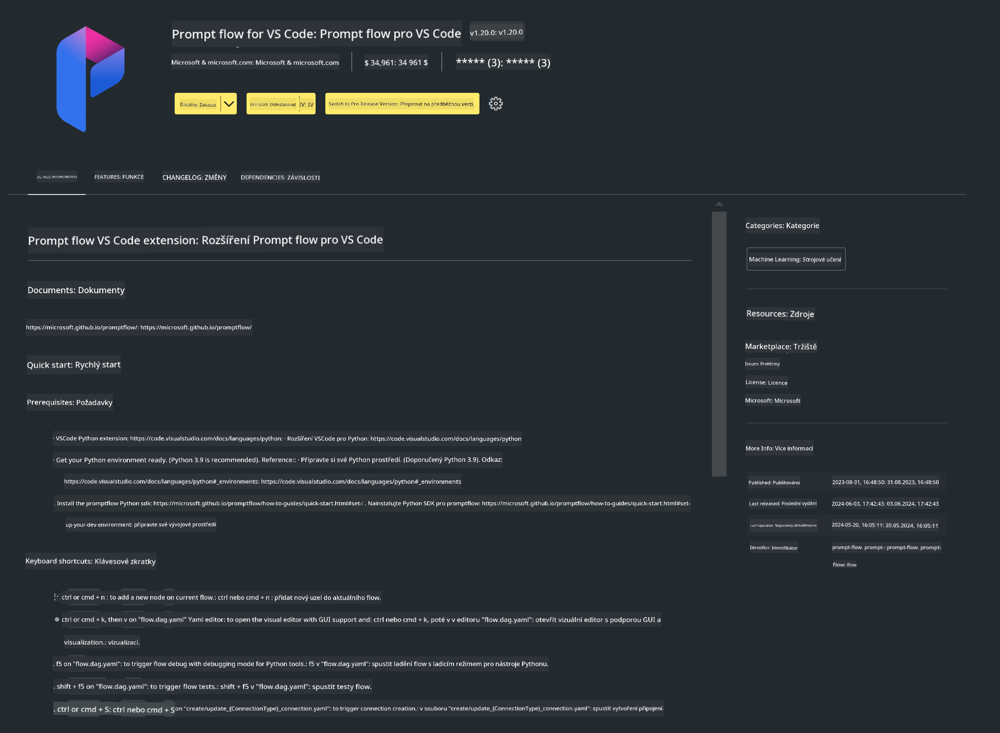

<!--
CO_OP_TRANSLATOR_METADATA:
{
  "original_hash": "a4ef39027902e82f2c33d568d2a2259a",
  "translation_date": "2025-05-09T19:21:09+00:00",
  "source_file": "md/02.Application/02.Code/Phi3/VSCodeExt/HOL/AIPC/01.Installations.md",
  "language_code": "cs"
}
-->
# **Lab 0 - 安装**

进入实验时，我们需要配置相关环境：


### **1. Python 3.11+**

建议使用 miniforge 来配置你的 Python 环境

有关 miniforge 的配置，请参考 [https://github.com/conda-forge/miniforge](https://github.com/conda-forge/miniforge)

配置好 miniforge 后，在 Power Shell 中运行以下命令

```bash

conda create -n pyenv python==3.11.8 -y

conda activate pyenv

```


### **2. 安装 Prompt flow SDK**

在实验 1 中，我们会使用 Prompt flow，因此需要配置 Prompt flow SDK。

```bash

pip install promptflow --upgrade

```

你可以用以下命令检查 promptflow sdk

```bash

pf --version

```

### **3. 安装 Visual Studio Code Prompt flow 扩展**




### **4. Intel NPU 加速库**

Intel 新一代处理器支持 NPU。如果你想使用 NPU 在本地运行 LLMs / SLMs，可以使用 ***Intel NPU 加速库***。想了解更多，可以阅读 [https://github.com/microsoft/PhiCookBook/blob/main/md/01.Introduction/03/AIPC_Inference.md](https://github.com/microsoft/PhiCookBook/blob/main/md/01.Introduction/03/AIPC_Inference.md)。

在 bash 中安装 Intel NPU 加速库

```bash

pip install intel-npu-acceleration-library

```

***Note***：请注意该库支持 transformers ***4.40.2***，请确认版本


### **5. 其他 Python 库**

创建 requirements.txt 并添加以下内容

```txt

notebook
numpy 
scipy 
scikit-learn 
matplotlib 
pandas 
pillow 
graphviz

```


### **6. 安装 NVM**

在 Powershell 中安装 nvm

```bash

winget install -e --id CoreyButler.NVMforWindows

```

安装 nodejs 18.20

```bash

nvm install 18.20.0

nvm use 18.20.0

```

### **7. 安装 Visual Studio Code 开发支持**

```bash

npm install --global yo generator-code

```

恭喜！你已成功配置好 SDK，接下来开始动手操作。

**Prohlášení o vyloučení odpovědnosti**:  
Tento dokument byl přeložen pomocí AI překladatelské služby [Co-op Translator](https://github.com/Azure/co-op-translator). Přestože usilujeme o přesnost, mějte prosím na paměti, že automatické překlady mohou obsahovat chyby nebo nepřesnosti. Originální dokument v jeho mateřském jazyce by měl být považován za závazný zdroj. Pro důležité informace se doporučuje využít profesionální lidský překlad. Nejsme odpovědní za jakékoliv nedorozumění nebo nesprávné výklady vyplývající z použití tohoto překladu.