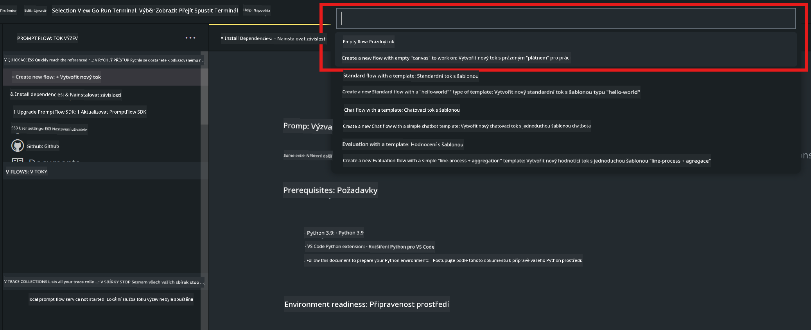

<!--
CO_OP_TRANSLATOR_METADATA:
{
  "original_hash": "bc29f7fe7fc16bed6932733eac8c81b8",
  "translation_date": "2025-07-17T04:01:23+00:00",
  "source_file": "md/02.Application/02.Code/Phi3/VSCodeExt/HOL/AIPC/02.PromptflowWithNPU.md",
  "language_code": "cs"
}
-->
# **Lab 2 - Spuštění Prompt flow s Phi-3-mini v AIPC**

## **Co je Prompt flow**

Prompt flow je sada vývojových nástrojů navržených k zefektivnění celého vývojového cyklu AI aplikací založených na LLM, od nápadu, prototypování, testování, hodnocení až po nasazení do produkce a monitoring. Usnadňuje práci s prompt engineeringem a umožňuje vytvářet LLM aplikace s kvalitou vhodnou pro produkci.

S Prompt flow budete moci:

- Vytvářet toky, které propojují LLM, prompty, Python kód a další nástroje do spustitelného workflow.

- Snadno ladit a iterovat své toky, zejména interakci s LLM.

- Hodnotit své toky, počítat metriky kvality a výkonu na větších datech.

- Integrovat testování a hodnocení do vašeho CI/CD systému pro zajištění kvality toku.

- Nasadit své toky na vámi zvolenou platformu pro servírování nebo je snadno integrovat do kódu vaší aplikace.

- (Volitelné, ale velmi doporučené) Spolupracovat s týmem využitím cloudové verze Prompt flow v Azure AI.

## **Co je AIPC**

AI PC má CPU, GPU a NPU, z nichž každý má specifické schopnosti akcelerace AI. NPU, neboli neural processing unit, je specializovaný akcelerátor, který zpracovává úlohy umělé inteligence (AI) a strojového učení (ML) přímo na vašem PC, místo aby data posílal do cloudu. GPU a CPU také zvládnou tyto úlohy, ale NPU je obzvlášť efektivní při nízkonákladových AI výpočtech. AI PC představuje zásadní změnu v tom, jak naše počítače fungují. Není to řešení problému, který dříve neexistoval, ale slibuje výrazné zlepšení běžného používání PC.

Jak to funguje? Ve srovnání s generativní AI a obrovskými velkými jazykovými modely (LLM) trénovanými na obrovském množství veřejných dat, AI běžící na vašem PC je dostupnější prakticky na všech úrovních. Koncept je snáze pochopitelný a protože je trénován na vašich datech bez nutnosti přístupu do cloudu, výhody jsou okamžitě atraktivnější pro širší okruh uživatelů.

V blízké budoucnosti AI PC zahrnuje osobní asistenty a menší AI modely běžící přímo na vašem PC, které využívají vaše data k poskytování osobních, soukromých a bezpečnějších AI vylepšení pro věci, které děláte každý den – zapisování zápisů ze schůzek, organizaci fantasy fotbalové ligy, automatizaci úprav fotografií a videí nebo sestavení ideálního itineráře pro rodinné setkání na základě příjezdů a odjezdů všech účastníků.

## **Vytváření generativních kódových toků na AIPC**

***Note*** ：Pokud jste ještě nedokončili instalaci prostředí, navštivte prosím [Lab 0 -Installations](./01.Installations.md)

1. Otevřete rozšíření Prompt flow ve Visual Studio Code a vytvořte prázdný projekt toku



2. Přidejte vstupní a výstupní parametry a přidejte Python kód jako nový tok


Můžete se řídit touto strukturou (flow.dag.yaml) pro sestavení vašeho toku

```yaml

inputs:
  question:
    type: string
    default: how to write Bubble Algorithm
outputs:
  answer:
    type: string
    reference: ${Chat_With_Phi3.output}
nodes:
- name: Chat_With_Phi3
  type: python
  source:
    type: code
    path: Chat_With_Phi3.py
  inputs:
    question: ${inputs.question}


```

3. Přidejte kód do souboru ***Chat_With_Phi3.py***

```python


from promptflow.core import tool

# import torch
from transformers import AutoTokenizer, pipeline,TextStreamer
import intel_npu_acceleration_library as npu_lib

import warnings

import asyncio
import platform

class Phi3CodeAgent:
    
    model = None
    tokenizer = None
    text_streamer = None
    
    model_id = "microsoft/Phi-3-mini-4k-instruct"

    @staticmethod
    def init_phi3():
        
        if Phi3CodeAgent.model is None or Phi3CodeAgent.tokenizer is None or Phi3CodeAgent.text_streamer is None:
            Phi3CodeAgent.model = npu_lib.NPUModelForCausalLM.from_pretrained(
                                    Phi3CodeAgent.model_id,
                                    torch_dtype="auto",
                                    dtype=npu_lib.int4,
                                    trust_remote_code=True
                                )
            Phi3CodeAgent.tokenizer = AutoTokenizer.from_pretrained(Phi3CodeAgent.model_id)
            Phi3CodeAgent.text_streamer = TextStreamer(Phi3CodeAgent.tokenizer, skip_prompt=True)

    

    @staticmethod
    def chat_with_phi3(prompt):
        
        Phi3CodeAgent.init_phi3()

        messages = "<|system|>You are a AI Python coding assistant. Please help me to generate code in Python.The answer only genertated Python code, but any comments and instructions do not need to be generated<|end|><|user|>" + prompt +"<|end|><|assistant|>"


        generation_args = {
            "max_new_tokens": 1024,
            "return_full_text": False,
            "temperature": 0.3,
            "do_sample": False,
            "streamer": Phi3CodeAgent.text_streamer,
        }

        pipe = pipeline(
            "text-generation",
            model=Phi3CodeAgent.model,
            tokenizer=Phi3CodeAgent.tokenizer,
            # **generation_args
        )

        result = ''

        with warnings.catch_warnings():
            warnings.simplefilter("ignore")
            response = pipe(messages, **generation_args)
            result =response[0]['generated_text']
            return result


@tool
def my_python_tool(question: str) -> str:
    if platform.system() == 'Windows':
        asyncio.set_event_loop_policy(asyncio.WindowsSelectorEventLoopPolicy())
    return Phi3CodeAgent.chat_with_phi3(question)


```

4. Tok můžete otestovat pomocí Debug nebo Run, abyste zkontrolovali, zda generování kódu funguje správně


5. Spusťte tok jako vývojové API v terminálu

```

pf flow serve --source ./ --port 8080 --host localhost   

```

Můžete jej otestovat v Postman / Thunder Client

### **Note**

1. První spuštění trvá déle. Doporučuje se stáhnout model phi-3 pomocí Hugging face CLI.

2. Vzhledem k omezenému výpočetnímu výkonu Intel NPU se doporučuje používat Phi-3-mini-4k-instruct.

3. Používáme Intel NPU akceleraci pro kvantizaci na INT4, ale pokud službu znovu spustíte, je potřeba smazat složky cache a nc_workshop.

## **Zdroje**

1. Naučte se Promptflow [https://microsoft.github.io/promptflow/](https://microsoft.github.io/promptflow/)

2. Naučte se Intel NPU Acceleration [https://github.com/intel/intel-npu-acceleration-library](https://github.com/intel/intel-npu-acceleration-library)

3. Ukázkový kód, stáhněte [Local NPU Agent Sample Code](../../../../../../../../../code/07.Lab/01/AIPC)

**Prohlášení o vyloučení odpovědnosti**:  
Tento dokument byl přeložen pomocí AI překladatelské služby [Co-op Translator](https://github.com/Azure/co-op-translator). I když usilujeme o přesnost, mějte prosím na paměti, že automatizované překlady mohou obsahovat chyby nebo nepřesnosti. Původní dokument v jeho mateřském jazyce by měl být považován za autoritativní zdroj. Pro důležité informace se doporučuje profesionální lidský překlad. Nejsme odpovědní za jakékoliv nedorozumění nebo nesprávné výklady vyplývající z použití tohoto překladu.