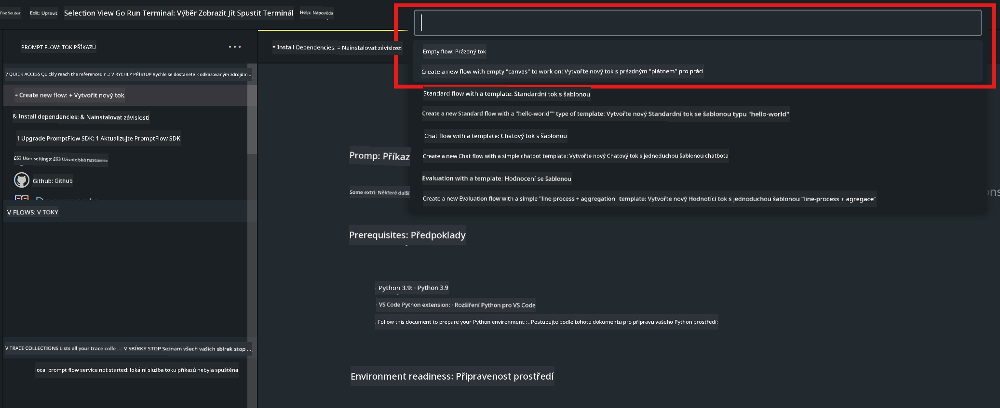
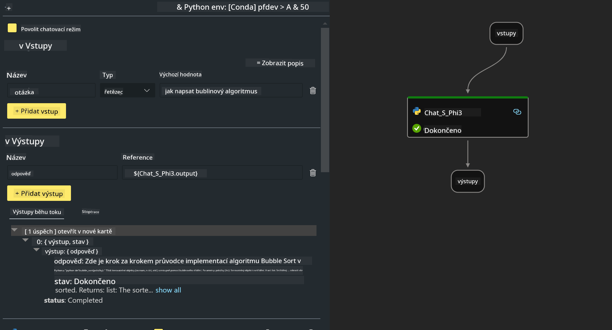

<!--
CO_OP_TRANSLATOR_METADATA:
{
  "original_hash": "bc29f7fe7fc16bed6932733eac8c81b8",
  "translation_date": "2025-05-09T19:26:00+00:00",
  "source_file": "md/02.Application/02.Code/Phi3/VSCodeExt/HOL/AIPC/02.PromptflowWithNPU.md",
  "language_code": "cs"
}
-->
# **实验2 - 在AIPC上运行Phi-3-mini的Prompt flow**

## **什么是Prompt flow**

Prompt flow是一套开发工具，旨在简化基于大型语言模型（LLM）的AI应用从构思、原型设计、测试、评估到生产部署和监控的端到端开发流程。它让prompt工程变得更加简单，帮助你构建具备生产质量的LLM应用。

通过Prompt flow，你可以：

- 创建将LLM、prompts、Python代码及其他工具连接成可执行工作流的流程。

- 轻松调试和迭代你的流程，尤其是与LLM的交互部分。

- 评估流程，使用更大数据集计算质量和性能指标。

- 将测试和评估集成到你的CI/CD系统中，确保流程质量。

- 将流程部署到你选择的服务平台，或轻松集成到应用代码库中。

- （可选但强烈推荐）通过Azure AI的云版本与团队协作。

## **什么是AIPC**

AI PC配备CPU、GPU和NPU，每个都具备特定的AI加速能力。NPU（神经处理单元）是一种专用加速器，能在本地PC上处理人工智能（AI）和机器学习（ML）任务，无需将数据发送到云端。GPU和CPU也能处理这些任务，但NPU特别擅长低功耗的AI计算。AI PC代表了计算机运作方式的根本变革。它不是为了解决之前不存在的问题，而是对日常PC使用体验的巨大提升。

那么它是如何工作的？与基于大量公开数据训练的生成式AI和大型语言模型（LLM）相比，运行在你PC上的AI在各个层面都更易于接触。概念更容易理解，且因为它基于你的数据训练，无需访问云端，其优势对更广泛用户群更具吸引力。

在短期内，AI PC主要涉及个人助理和较小的AI模型直接运行于PC上，利用你的数据提供个性化、私密且更安全的AI增强，应用于日常工作——如会议记录、管理幻想足球联盟、自动优化照片和视频编辑，或根据每个人的到达和离开时间规划家庭聚会的完美行程。

## **在AIPC上构建生成代码流程**

***注意*** ：如果尚未完成环境安装，请访问 [Lab 0 -Installations](./01.Installations.md)

1. 在Visual Studio Code中打开Prompt flow扩展，创建一个空白流程项目



2. 添加输入和输出参数，并添加Python代码作为新流程



你可以参考此结构（flow.dag.yaml）来构建你的流程

```yaml

inputs:
  question:
    type: string
    default: how to write Bubble Algorithm
outputs:
  answer:
    type: string
    reference: ${Chat_With_Phi3.output}
nodes:
- name: Chat_With_Phi3
  type: python
  source:
    type: code
    path: Chat_With_Phi3.py
  inputs:
    question: ${inputs.question}


```

3. 在***Chat_With_Phi3.py***中添加代码

```python


from promptflow.core import tool

# import torch
from transformers import AutoTokenizer, pipeline,TextStreamer
import intel_npu_acceleration_library as npu_lib

import warnings

import asyncio
import platform

class Phi3CodeAgent:
    
    model = None
    tokenizer = None
    text_streamer = None
    
    model_id = "microsoft/Phi-3-mini-4k-instruct"

    @staticmethod
    def init_phi3():
        
        if Phi3CodeAgent.model is None or Phi3CodeAgent.tokenizer is None or Phi3CodeAgent.text_streamer is None:
            Phi3CodeAgent.model = npu_lib.NPUModelForCausalLM.from_pretrained(
                                    Phi3CodeAgent.model_id,
                                    torch_dtype="auto",
                                    dtype=npu_lib.int4,
                                    trust_remote_code=True
                                )
            Phi3CodeAgent.tokenizer = AutoTokenizer.from_pretrained(Phi3CodeAgent.model_id)
            Phi3CodeAgent.text_streamer = TextStreamer(Phi3CodeAgent.tokenizer, skip_prompt=True)

    

    @staticmethod
    def chat_with_phi3(prompt):
        
        Phi3CodeAgent.init_phi3()

        messages = "<|system|>You are a AI Python coding assistant. Please help me to generate code in Python.The answer only genertated Python code, but any comments and instructions do not need to be generated<|end|><|user|>" + prompt +"<|end|><|assistant|>"


        generation_args = {
            "max_new_tokens": 1024,
            "return_full_text": False,
            "temperature": 0.3,
            "do_sample": False,
            "streamer": Phi3CodeAgent.text_streamer,
        }

        pipe = pipeline(
            "text-generation",
            model=Phi3CodeAgent.model,
            tokenizer=Phi3CodeAgent.tokenizer,
            # **generation_args
        )

        result = ''

        with warnings.catch_warnings():
            warnings.simplefilter("ignore")
            response = pipe(messages, **generation_args)
            result =response[0]['generated_text']
            return result


@tool
def my_python_tool(question: str) -> str:
    if platform.system() == 'Windows':
        asyncio.set_event_loop_policy(asyncio.WindowsSelectorEventLoopPolicy())
    return Phi3CodeAgent.chat_with_phi3(question)


```

4. 你可以通过调试或运行来测试流程，检查生成代码是否正常


5. 在终端运行流程作为开发API

```

pf flow serve --source ./ --port 8080 --host localhost   

```

你可以使用Postman / Thunder Client进行测试

### **注意**

1. 第一次运行时间较长，建议通过Hugging face CLI下载phi-3模型。

2. 鉴于Intel NPU的算力有限，推荐使用Phi-3-mini-4k-instruct模型。

3. 我们使用Intel NPU加速进行INT4量化转换，但如果重新运行服务，需要删除cache和nc_workshop文件夹。

## **资源**

1. 学习Promptflow [https://microsoft.github.io/promptflow/](https://microsoft.github.io/promptflow/)

2. 学习Intel NPU加速 [https://github.com/intel/intel-npu-acceleration-library](https://github.com/intel/intel-npu-acceleration-library)

3. 示例代码，下载[本地NPU代理示例代码](../../../../../../../../../code/07.Lab/01/AIPC)

**Prohlášení o vyloučení odpovědnosti**:  
Tento dokument byl přeložen pomocí AI překladatelské služby [Co-op Translator](https://github.com/Azure/co-op-translator). I když usilujeme o přesnost, mějte prosím na paměti, že automatické překlady mohou obsahovat chyby nebo nepřesnosti. Původní dokument v jeho mateřském jazyce by měl být považován za autoritativní zdroj. Pro kritické informace se doporučuje profesionální lidský překlad. Nejsme odpovědní za jakékoliv nedorozumění nebo nesprávné interpretace vzniklé použitím tohoto překladu.