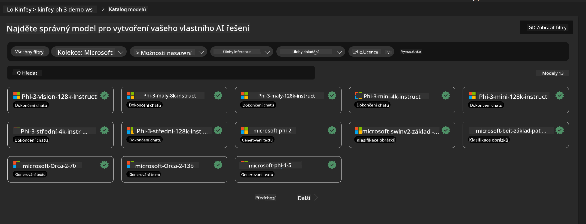
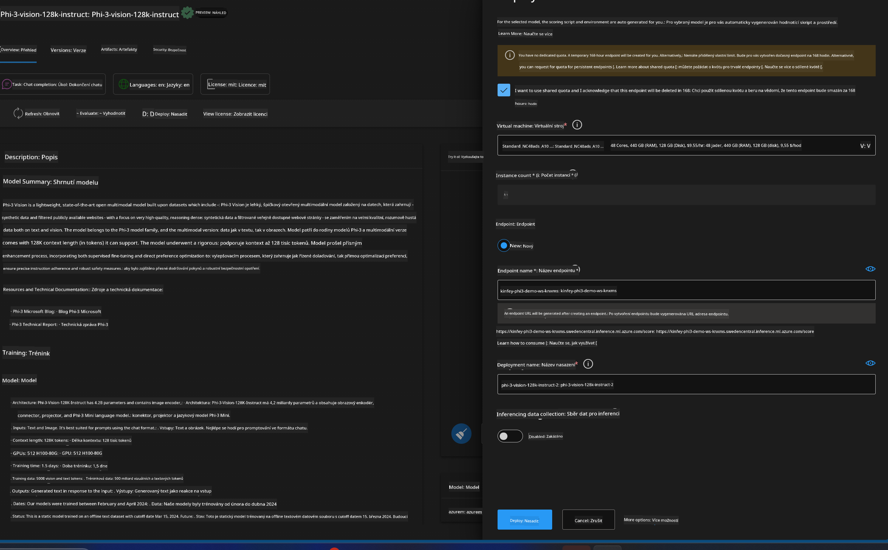
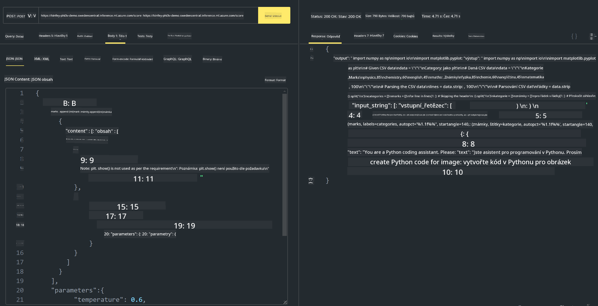

<!--
CO_OP_TRANSLATOR_METADATA:
{
  "original_hash": "20cb4e6ac1686248e8be913ccf6c2bc2",
  "translation_date": "2025-05-09T19:30:00+00:00",
  "source_file": "md/02.Application/02.Code/Phi3/VSCodeExt/HOL/AIPC/03.DeployPhi3VisionOnAzure.md",
  "language_code": "cs"
}
-->
# **Lab 3 - 在 Azure 机器学习服务上部署 Phi-3-vision**

我们使用 NPU 完成本地代码的生产部署，然后希望通过它引入 PHI-3-VISION 的能力，实现图片生成代码。

在本介绍中，我们可以快速构建一个基于模型即服务的 Phi-3 Vision 服务，运行在 Azure 机器学习服务中。

***Note***： Phi-3 Vision 需要较强的算力以更快生成内容，我们需要云计算能力来帮助实现这一点。


### **1. 创建 Azure 机器学习服务**

我们需要在 Azure 门户中创建一个 Azure 机器学习服务。如果想了解如何操作，请访问此链接 [https://learn.microsoft.com/azure/machine-learning/quickstart-create-resources?view=azureml-api-2](https://learn.microsoft.com/azure/machine-learning/quickstart-create-resources?view=azureml-api-2)


### **2. 在 Azure 机器学习服务中选择 Phi-3 Vision**




### **3. 在 Azure 上部署 Phi-3-Vision**





### **4. 在 Postman 中测试端点**





***Note***

1. 传输的参数必须包含 Authorization、azureml-model-deployment 和 Content-Type。你需要查看部署信息以获取这些参数。

2. 传输参数时，Phi-3-Vision 需要传递图片链接。请参考 GPT-4-Vision 的参数传递方式，例如

```json

{
  "input_data":{
    "input_string":[
      {
        "role":"user",
        "content":[ 
          {
            "type": "text",
            "text": "You are a Python coding assistant.Please create Python code for image "
          },
          {
              "type": "image_url",
              "image_url": {
                "url": "https://ajaytech.co/wp-content/uploads/2019/09/index.png"
              }
          }
        ]
      }
    ],
    "parameters":{
          "temperature": 0.6,
          "top_p": 0.9,
          "do_sample": false,
          "max_new_tokens": 2048
    }
  }
}

```

3. 使用 Post 方法调用 **/score**

**恭喜**！你已完成快速部署 PHI-3-VISION，并尝试了如何通过图片生成代码。接下来，我们可以结合 NPU 和云端构建应用。

**Prohlášení o vyloučení odpovědnosti**:  
Tento dokument byl přeložen pomocí AI překladatelské služby [Co-op Translator](https://github.com/Azure/co-op-translator). Přestože usilujeme o přesnost, mějte prosím na paměti, že automatické překlady mohou obsahovat chyby nebo nepřesnosti. Původní dokument v jeho mateřském jazyce by měl být považován za závazný zdroj. Pro důležité informace se doporučuje profesionální lidský překlad. Nejsme odpovědní za jakékoliv nedorozumění nebo nesprávné výklady vzniklé použitím tohoto překladu.