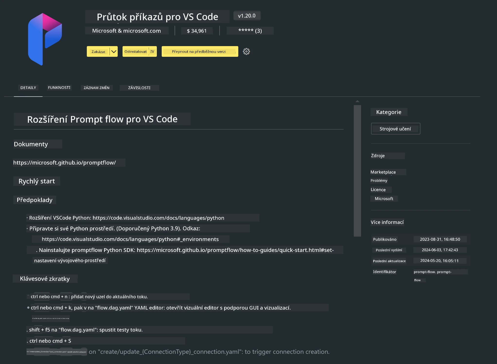

# **Lab 0 - Instalace**

Když vstoupíme do laboratoře, je potřeba nastavit příslušné prostředí:


### **1. Python 3.11+**

Doporučuje se použít miniforge pro nastavení Python prostředí.

Pro konfiguraci miniforge navštivte [https://github.com/conda-forge/miniforge](https://github.com/conda-forge/miniforge)

Po nastavení miniforge spusťte následující příkaz v Power Shellu

```bash

conda create -n pyenv python==3.11.8 -y

conda activate pyenv

```


### **2. Instalace Prompt flow SDK**

V Lab 1 budeme používat Prompt flow, proto je potřeba nastavit Prompt flow SDK.

```bash

pip install promptflow --upgrade

```

Promptflow SDK můžete ověřit tímto příkazem


```bash

pf --version

```

### **3. Instalace rozšíření Prompt flow pro Visual Studio Code**



### **4. Apple MLX Framework**

MLX je framework pro strojové učení na Apple silicon, vyvinutý týmem Apple machine learning research. Pomocí **Apple MLX frameworku** můžete zrychlit LLM / SLM na Apple Silicon. Pokud chcete vědět více, přečtěte si [https://github.com/microsoft/PhiCookBook/blob/main/md/01.Introduction/03/MLX_Inference.md](https://github.com/microsoft/PhiCookBook/blob/main/md/01.Introduction/03/MLX_Inference.md).

Nainstalujte MLX framework knihovnu v bash


```bash

pip install mlx-lm

```


### **5. Další Python knihovny**


vytvořte soubor requirements.txt a vložte do něj tento obsah

```txt

notebook
numpy 
scipy 
scikit-learn 
matplotlib 
pandas 
pillow 
graphviz

```


### **6. Instalace NVM**

nainstalujte nvm v Powershellu


```bash

brew install nvm

```

nainstalujte nodejs 18.20


```bash

nvm install 18.20.0

nvm use 18.20.0

```

### **7. Instalace podpory vývoje ve Visual Studio Code**


```bash

npm install --global yo generator-code

```

Gratulujeme! SDK máte úspěšně nastavené. Nyní pokračujte k praktickým krokům.

**Prohlášení o vyloučení odpovědnosti**:  
Tento dokument byl přeložen pomocí AI překladatelské služby [Co-op Translator](https://github.com/Azure/co-op-translator). I když usilujeme o přesnost, mějte prosím na paměti, že automatizované překlady mohou obsahovat chyby nebo nepřesnosti. Původní dokument v jeho mateřském jazyce by měl být považován za autoritativní zdroj. Pro důležité informace se doporučuje profesionální lidský překlad. Nejsme odpovědní za jakékoliv nedorozumění nebo nesprávné výklady vyplývající z použití tohoto překladu.