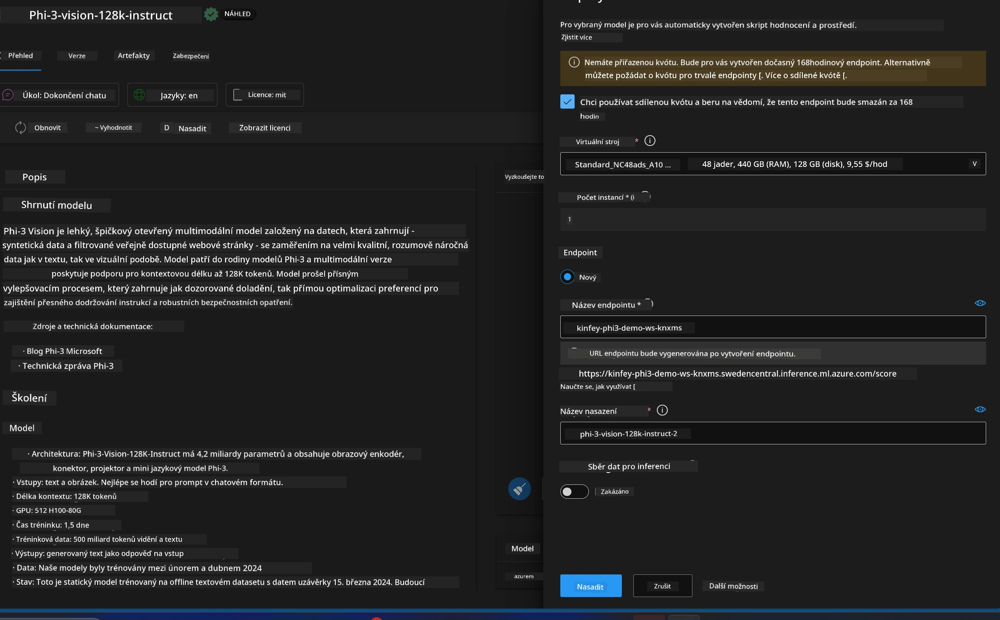
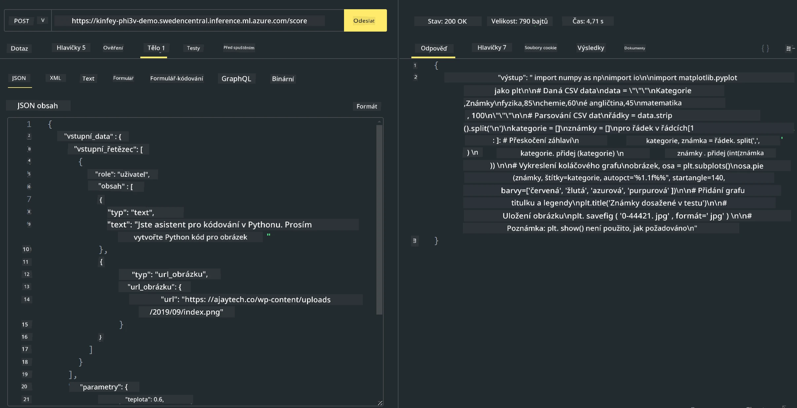

# **Lab 3 - Nasazení Phi-3-vision na Azure Machine Learning Service**

Používáme NPU k dokončení produkčního nasazení lokálního kódu a poté chceme zavést možnost využití PHI-3-VISION, která umožní generování kódu z obrázků.

V tomto úvodu si rychle vytvoříme službu Model As Service Phi-3 Vision v Azure Machine Learning Service.

***Note***: Phi-3 Vision vyžaduje výpočetní výkon pro rychlejší generování obsahu. Potřebujeme cloudový výpočetní výkon, který nám s tím pomůže.


### **1. Vytvoření Azure Machine Learning Service**

Musíme vytvořit Azure Machine Learning Service v Azure Portálu. Pokud chcete vědět, jak na to, navštivte tento odkaz [https://learn.microsoft.com/azure/machine-learning/quickstart-create-resources?view=azureml-api-2](https://learn.microsoft.com/azure/machine-learning/quickstart-create-resources?view=azureml-api-2)


### **2. Výběr Phi-3 Vision v Azure Machine Learning Service**


### **3. Nasazení Phi-3-Vision v Azure**





### **4. Testování endpointu v Postmanu**





***Note***

1. Parametry, které je třeba předat, musí obsahovat Authorization, azureml-model-deployment a Content-Type. Tyto informace získáte z detailů nasazení.

2. Pro předání parametrů Phi-3-Vision potřebuje odkaz na obrázek. Podívejte se na způsob předání parametrů u GPT-4-Vision, například

```json

{
  "input_data":{
    "input_string":[
      {
        "role":"user",
        "content":[ 
          {
            "type": "text",
            "text": "You are a Python coding assistant.Please create Python code for image "
          },
          {
              "type": "image_url",
              "image_url": {
                "url": "https://ajaytech.co/wp-content/uploads/2019/09/index.png"
              }
          }
        ]
      }
    ],
    "parameters":{
          "temperature": 0.6,
          "top_p": 0.9,
          "do_sample": false,
          "max_new_tokens": 2048
    }
  }
}

```

3. Zavolejte **/score** pomocí metody Post

**Gratulujeme**! Úspěšně jste dokončili rychlé nasazení PHI-3-VISION a vyzkoušeli, jak generovat kód z obrázků. Nyní můžeme pokračovat ve vytváření aplikací v kombinaci s NPU a cloudem.

**Prohlášení o vyloučení odpovědnosti**:  
Tento dokument byl přeložen pomocí AI překladatelské služby [Co-op Translator](https://github.com/Azure/co-op-translator). I když usilujeme o přesnost, mějte prosím na paměti, že automatické překlady mohou obsahovat chyby nebo nepřesnosti. Původní dokument v jeho mateřském jazyce by měl být považován za autoritativní zdroj. Pro důležité informace se doporučuje profesionální lidský překlad. Nejsme odpovědní za jakékoliv nedorozumění nebo nesprávné výklady vyplývající z použití tohoto překladu.