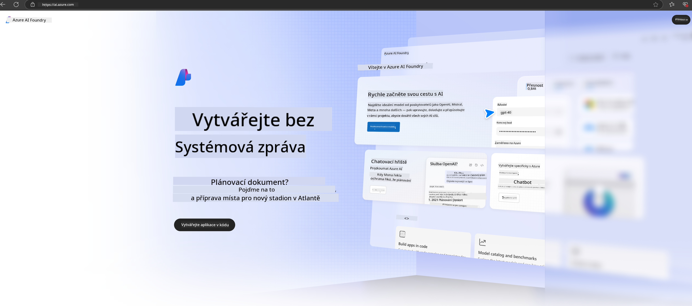

<!--
CO_OP_TRANSLATOR_METADATA:
{
  "original_hash": "3a1e48b628022485aac989c9f733e792",
  "translation_date": "2025-05-09T20:14:29+00:00",
  "source_file": "md/02.QuickStart/AzureAIFoundry_QuickStart.md",
  "language_code": "cs"
}
-->
# **Using Phi-3 in Azure AI Foundry**

With the rise of Generative AI, we aim to use a unified platform to manage various LLMs and SLMs, integrate enterprise data, handle fine-tuning/RAG operations, and evaluate different enterprise applications after integrating LLMs and SLMs, enabling smarter generative AI applications. [Azure AI Foundry](https://ai.azure.com) is an enterprise-grade platform for generative AI applications.

Azure AI Foundry lets you evaluate large language model (LLM) responses and orchestrate prompt components with prompt flow to enhance performance. The platform supports scalability, making it easy to move from proof of concept to full production. Continuous monitoring and refinement ensure long-term success.

We can quickly deploy the Phi-3 model on Azure AI Foundry with simple steps, then use Azure AI Foundry to complete related Playground/Chat, fine-tuning, evaluation, and other tasks.

## **1. Preparation**

If you already have the [Azure Developer CLI](https://learn.microsoft.com/azure/developer/azure-developer-cli/overview?WT.mc_id=aiml-138114-kinfeylo) installed on your machine, using this template is as easy as running this command in a new folder.

## Manual Creation

Creating a Microsoft Azure AI Foundry project and hub is a great way to organize and manage your AI work. Here's a step-by-step guide to get started:

### Creating a Project in Azure AI Foundry

1. **Go to Azure AI Foundry**: Sign in to the Azure AI Foundry portal.
2. **Create a Project**:
   - If you’re already inside a project, click "Azure AI Foundry" at the top left to go to the Home page.
   - Click "+ Create project".
   - Enter a name for your project.
   - If you have a hub, it will be selected by default. If you have access to multiple hubs, you can choose another from the dropdown. To create a new hub, select "Create new hub" and provide a name.
   - Click "Create".

### Creating a Hub in Azure AI Foundry

1. **Go to Azure AI Foundry**: Sign in with your Azure account.
2. **Create a Hub**:
   - Click the Management center from the left menu.
   - Click "All resources", then the down arrow next to "+ New project" and select "+ New hub".
   - In the "Create a new hub" dialog, enter a name for your hub (e.g., contoso-hub) and adjust other fields as needed.
   - Click "Next", review the information, and then click "Create".

For more detailed instructions, see the official [Microsoft documentation](https://learn.microsoft.com/azure/ai-studio/how-to/create-projects).

After successful creation, you can access your studio through [ai.azure.com](https://ai.azure.com/).

You can have multiple projects in one AI Foundry. Create a project to get started.

Create Azure AI Foundry [QuickStarts](https://learn.microsoft.com/azure/ai-studio/quickstarts/get-started-code)

## **2. Deploy a Phi model in Azure AI Foundry**

Click Explore on the project to enter the Model Catalog and select Phi-3.

Select Phi-3-mini-4k-instruct.

Click 'Deploy' to deploy the Phi-3-mini-4k-instruct model.

> [!NOTE]
>
> You can select the computing power during deployment.

## **3. Playground Chat Phi in Azure AI Foundry**

Go to the deployment page, select Playground, and chat with Phi-3 on Azure AI Foundry.

## **4. Deploying the Model from Azure AI Foundry**

To deploy a model from the Azure Model Catalog, follow these steps:

- Sign in to Azure AI Foundry.
- Choose the model you want to deploy from the Azure AI Foundry model catalog.
- On the model’s Details page, click Deploy, then select Serverless API with Azure AI Content Safety.
- Select the project where you want to deploy your models. To use the Serverless API, your workspace must be in the East US 2 or Sweden Central region. You can customize the Deployment name.
- In the deployment wizard, review Pricing and terms to understand costs and usage policies.
- Click Deploy. Wait for the deployment to finish and you’ll be redirected to the Deployments page.
- Click Open in playground to start interacting with the model.
- You can return to the Deployments page, select your deployment, and find the endpoint’s Target URL and Secret Key, which you’ll use to call the deployment and generate completions.
- Endpoint details, URLs, and access keys are always available under the Build tab in the Deployments section.

> [!NOTE]
> Ensure your account has Azure AI Developer role permissions on the Resource Group to perform these steps.

## **5. Using Phi API in Azure AI Foundry**

You can access https://{Your project name}.region.inference.ml.azure.com/swagger.json using Postman with a GET request and combine it with your Key to explore the available interfaces.

Request and response parameters are conveniently provided for your use.

**Prohlášení o vyloučení odpovědnosti**:  
Tento dokument byl přeložen pomocí AI překladatelské služby [Co-op Translator](https://github.com/Azure/co-op-translator). Přestože usilujeme o přesnost, mějte prosím na paměti, že automatické překlady mohou obsahovat chyby nebo nepřesnosti. Originální dokument v jeho původním jazyce by měl být považován za autoritativní zdroj. Pro důležité informace se doporučuje profesionální lidský překlad. Nejsme odpovědní za jakékoliv nedorozumění nebo nesprávné výklady vyplývající z použití tohoto překladu.