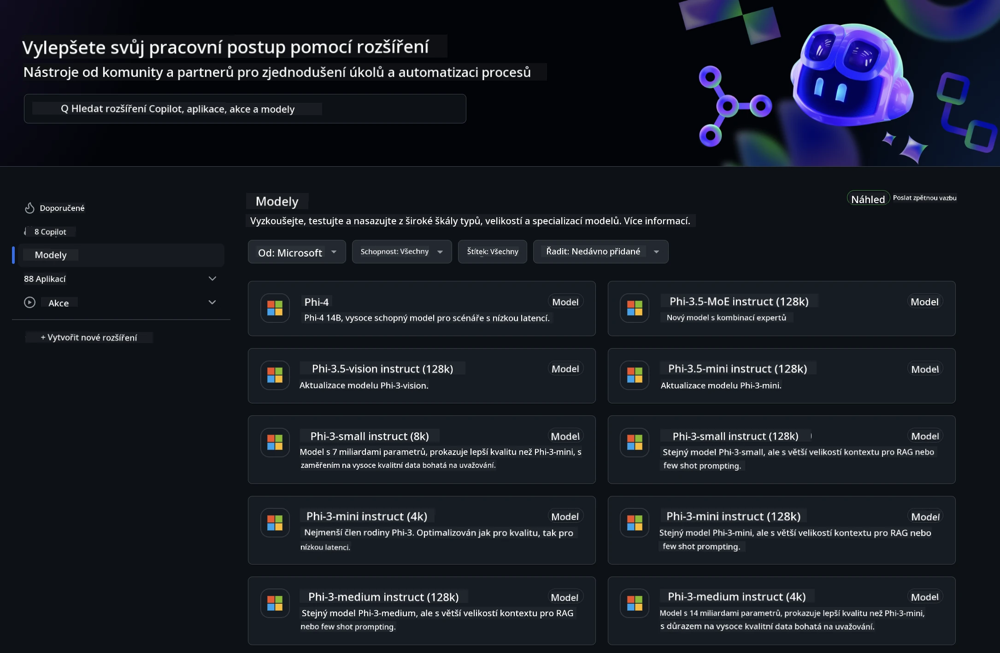
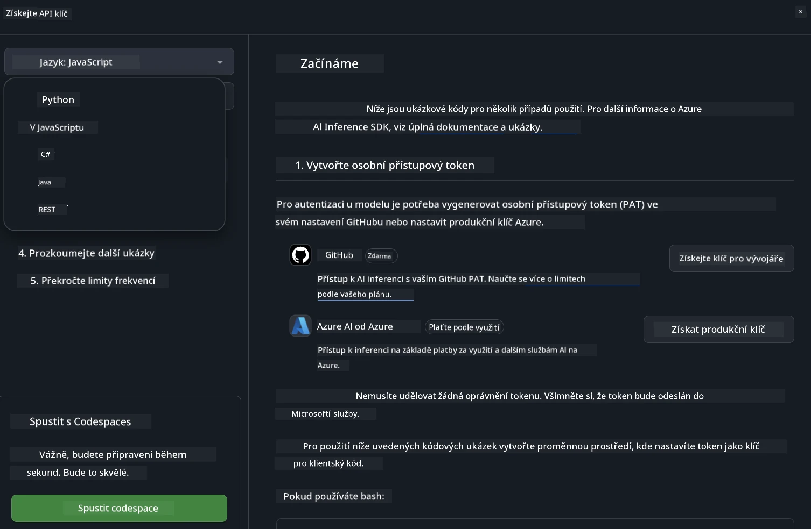
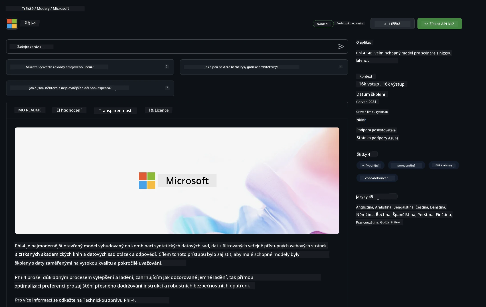

## GitHub Models - Omezená veřejná beta

Vítejte na [GitHub Models](https://github.com/marketplace/models)! Vše je připraveno a můžete začít objevovat AI modely hostované na Azure AI.



Pro více informací o modelech dostupných na GitHub Models navštivte [GitHub Model Marketplace](https://github.com/marketplace/models)

## Dostupné modely

Každý model má vlastní playground a ukázkový kód


### Phi-3 modely v GitHub Model Catalog

[Phi-3-Medium-128k-Instruct](https://github.com/marketplace/models/azureml/Phi-3-medium-128k-instruct)

[Phi-3-medium-4k-instruct](https://github.com/marketplace/models/azureml/Phi-3-medium-4k-instruct)

[Phi-3-mini-128k-instruct](https://github.com/marketplace/models/azureml/Phi-3-mini-128k-instruct)

[Phi-3-mini-4k-instruct](https://github.com/marketplace/models/azureml/Phi-3-mini-4k-instruct)

[Phi-3-small-128k-instruct](https://github.com/marketplace/models/azureml/Phi-3-small-128k-instruct)

[Phi-3-small-8k-instruct](https://github.com/marketplace/models/azureml/Phi-3-small-8k-instruct)

## Začínáme

K dispozici je několik základních příkladů, které můžete rovnou spustit. Najdete je ve složce samples. Pokud chcete přejít rovnou na svůj oblíbený jazyk, příklady jsou dostupné v těchto jazycích:

- Python
- JavaScript
- cURL

K dispozici je také speciální Codespaces prostředí pro spouštění příkladů a modelů.



## Ukázkový kód

Níže najdete ukázky kódu pro několik scénářů použití. Pro další informace o Azure AI Inference SDK si prohlédněte kompletní dokumentaci a příklady.

## Nastavení

1. Vytvořte osobní přístupový token  
Nemusíte tokenu udělovat žádná oprávnění. Upozornění: token bude odesílán do služby Microsoft.

Pro použití níže uvedených ukázek kódu si vytvořte proměnnou prostředí, kde nastavíte svůj token jako klíč pro klientský kód.

Pokud používáte bash:  
```
export GITHUB_TOKEN="<your-github-token-goes-here>"
```  
Pokud používáte powershell:  

```
$Env:GITHUB_TOKEN="<your-github-token-goes-here>"
```  

Pokud používáte Windows příkazový řádek:  

```
set GITHUB_TOKEN=<your-github-token-goes-here>
```  

## Python ukázka

### Instalace závislostí  
Nainstalujte Azure AI Inference SDK pomocí pip (vyžaduje Python >=3.8):

```
pip install azure-ai-inference
```  
### Spuštění základního příkladu

Tento příklad ukazuje základní volání chat completion API. Využívá GitHub AI model inference endpoint a váš GitHub token. Volání je synchronní.

```
import os
from azure.ai.inference import ChatCompletionsClient
from azure.ai.inference.models import SystemMessage, UserMessage
from azure.core.credentials import AzureKeyCredential

endpoint = "https://models.inference.ai.azure.com"
# Replace Model_Name 
model_name = "Phi-3-small-8k-instruct"
token = os.environ["GITHUB_TOKEN"]

client = ChatCompletionsClient(
    endpoint=endpoint,
    credential=AzureKeyCredential(token),
)

response = client.complete(
    messages=[
        SystemMessage(content="You are a helpful assistant."),
        UserMessage(content="What is the capital of France?"),
    ],
    model=model_name,
    temperature=1.,
    max_tokens=1000,
    top_p=1.
)

print(response.choices[0].message.content)
```

### Spuštění vícetahové konverzace

Tento příklad ukazuje vícetahovou konverzaci s chat completion API. Při použití modelu pro chatovací aplikaci je potřeba spravovat historii konverzace a posílat modelu nejnovější zprávy.

```
import os
from azure.ai.inference import ChatCompletionsClient
from azure.ai.inference.models import AssistantMessage, SystemMessage, UserMessage
from azure.core.credentials import AzureKeyCredential

token = os.environ["GITHUB_TOKEN"]
endpoint = "https://models.inference.ai.azure.com"
# Replace Model_Name
model_name = "Phi-3-small-8k-instruct"

client = ChatCompletionsClient(
    endpoint=endpoint,
    credential=AzureKeyCredential(token),
)

messages = [
    SystemMessage(content="You are a helpful assistant."),
    UserMessage(content="What is the capital of France?"),
    AssistantMessage(content="The capital of France is Paris."),
    UserMessage(content="What about Spain?"),
]

response = client.complete(messages=messages, model=model_name)

print(response.choices[0].message.content)
```

### Streamování výstupu

Pro lepší uživatelský zážitek je vhodné streamovat odpověď modelu, aby se první token zobrazil co nejdříve a vy jste nemuseli čekat na dlouhé odpovědi.

```
import os
from azure.ai.inference import ChatCompletionsClient
from azure.ai.inference.models import SystemMessage, UserMessage
from azure.core.credentials import AzureKeyCredential

token = os.environ["GITHUB_TOKEN"]
endpoint = "https://models.inference.ai.azure.com"
# Replace Model_Name
model_name = "Phi-3-small-8k-instruct"

client = ChatCompletionsClient(
    endpoint=endpoint,
    credential=AzureKeyCredential(token),
)

response = client.complete(
    stream=True,
    messages=[
        SystemMessage(content="You are a helpful assistant."),
        UserMessage(content="Give me 5 good reasons why I should exercise every day."),
    ],
    model=model_name,
)

for update in response:
    if update.choices:
        print(update.choices[0].delta.content or "", end="")

client.close()
```

## JavaScript

### Instalace závislostí

Nainstalujte Node.js.

Zkopírujte následující řádky a uložte je jako soubor package.json do své složky.

```
{
  "type": "module",
  "dependencies": {
    "@azure-rest/ai-inference": "latest",
    "@azure/core-auth": "latest",
    "@azure/core-sse": "latest"
  }
}
```

Poznámka: @azure/core-sse je potřeba pouze při streamování odpovědí chat completions.

Otevřete terminál ve složce a spusťte npm install.

Pro každý z níže uvedených kódů zkopírujte obsah do souboru sample.js a spusťte pomocí node sample.js.

### Spuštění základního příkladu

Tento příklad ukazuje základní volání chat completion API. Využívá GitHub AI model inference endpoint a váš GitHub token. Volání je synchronní.

```
import ModelClient from "@azure-rest/ai-inference";
import { AzureKeyCredential } from "@azure/core-auth";

const token = process.env["GITHUB_TOKEN"];
const endpoint = "https://models.inference.ai.azure.com";
// Update your modelname
const modelName = "Phi-3-small-8k-instruct";

export async function main() {

  const client = new ModelClient(endpoint, new AzureKeyCredential(token));

  const response = await client.path("/chat/completions").post({
    body: {
      messages: [
        { role:"system", content: "You are a helpful assistant." },
        { role:"user", content: "What is the capital of France?" }
      ],
      model: modelName,
      temperature: 1.,
      max_tokens: 1000,
      top_p: 1.
    }
  });

  if (response.status !== "200") {
    throw response.body.error;
  }
  console.log(response.body.choices[0].message.content);
}

main().catch((err) => {
  console.error("The sample encountered an error:", err);
});
```

### Spuštění vícetahové konverzace

Tento příklad ukazuje vícetahovou konverzaci s chat completion API. Při použití modelu pro chatovací aplikaci je potřeba spravovat historii konverzace a posílat modelu nejnovější zprávy.

```
import ModelClient from "@azure-rest/ai-inference";
import { AzureKeyCredential } from "@azure/core-auth";

const token = process.env["GITHUB_TOKEN"];
const endpoint = "https://models.inference.ai.azure.com";
// Update your modelname
const modelName = "Phi-3-small-8k-instruct";

export async function main() {

  const client = new ModelClient(endpoint, new AzureKeyCredential(token));

  const response = await client.path("/chat/completions").post({
    body: {
      messages: [
        { role: "system", content: "You are a helpful assistant." },
        { role: "user", content: "What is the capital of France?" },
        { role: "assistant", content: "The capital of France is Paris." },
        { role: "user", content: "What about Spain?" },
      ],
      model: modelName,
    }
  });

  if (response.status !== "200") {
    throw response.body.error;
  }

  for (const choice of response.body.choices) {
    console.log(choice.message.content);
  }
}

main().catch((err) => {
  console.error("The sample encountered an error:", err);
});
```

### Streamování výstupu

Pro lepší uživatelský zážitek je vhodné streamovat odpověď modelu, aby se první token zobrazil co nejdříve a vy jste nemuseli čekat na dlouhé odpovědi.

```
import ModelClient from "@azure-rest/ai-inference";
import { AzureKeyCredential } from "@azure/core-auth";
import { createSseStream } from "@azure/core-sse";

const token = process.env["GITHUB_TOKEN"];
const endpoint = "https://models.inference.ai.azure.com";
// Update your modelname
const modelName = "Phi-3-small-8k-instruct";

export async function main() {

  const client = new ModelClient(endpoint, new AzureKeyCredential(token));

  const response = await client.path("/chat/completions").post({
    body: {
      messages: [
        { role: "system", content: "You are a helpful assistant." },
        { role: "user", content: "Give me 5 good reasons why I should exercise every day." },
      ],
      model: modelName,
      stream: true
    }
  }).asNodeStream();

  const stream = response.body;
  if (!stream) {
    throw new Error("The response stream is undefined");
  }

  if (response.status !== "200") {
    stream.destroy();
    throw new Error(`Failed to get chat completions, http operation failed with ${response.status} code`);
  }

  const sseStream = createSseStream(stream);

  for await (const event of sseStream) {
    if (event.data === "[DONE]") {
      return;
    }
    for (const choice of (JSON.parse(event.data)).choices) {
        process.stdout.write(choice.delta?.content ?? ``);
    }
  }
}

main().catch((err) => {
  console.error("The sample encountered an error:", err);
});
```

## REST

### Spuštění základního příkladu

Vložte následující příkaz do shellu:

```
curl -X POST "https://models.inference.ai.azure.com/chat/completions" \
    -H "Content-Type: application/json" \
    -H "Authorization: Bearer $GITHUB_TOKEN" \
    -d '{
        "messages": [
            {
                "role": "system",
                "content": "You are a helpful assistant."
            },
            {
                "role": "user",
                "content": "What is the capital of France?"
            }
        ],
        "model": "Phi-3-small-8k-instruct"
    }'
```

### Spuštění vícetahové konverzace

Zavolejte chat completion API a předejte historii chatu:

```
curl -X POST "https://models.inference.ai.azure.com/chat/completions" \
    -H "Content-Type: application/json" \
    -H "Authorization: Bearer $GITHUB_TOKEN" \
    -d '{
        "messages": [
            {
                "role": "system",
                "content": "You are a helpful assistant."
            },
            {
                "role": "user",
                "content": "What is the capital of France?"
            },
            {
                "role": "assistant",
                "content": "The capital of France is Paris."
            },
            {
                "role": "user",
                "content": "What about Spain?"
            }
        ],
        "model": "Phi-3-small-8k-instruct"
    }'
```

### Streamování výstupu

Příklad volání endpointu se streamováním odpovědi.

```
curl -X POST "https://models.inference.ai.azure.com/chat/completions" \
    -H "Content-Type: application/json" \
    -H "Authorization: Bearer $GITHUB_TOKEN" \
    -d '{
        "messages": [
            {
                "role": "system",
                "content": "You are a helpful assistant."
            },
            {
                "role": "user",
                "content": "Give me 5 good reasons why I should exercise every day."
            }
        ],
        "stream": true,
        "model": "Phi-3-small-8k-instruct"
    }'
```

## BEZPLATNÉ použití a limity pro GitHub Models



[Limity pro playground a bezplatné API použití](https://docs.github.com/en/github-models/prototyping-with-ai-models#rate-limits) jsou nastaveny tak, aby vám umožnily experimentovat s modely a prototypovat AI aplikace. Pro použití nad rámec těchto limitů a pro škálování aplikace je potřeba zajistit prostředky z Azure účtu a autentizovat se tam místo pomocí osobního GitHub tokenu. V kódu není potřeba nic dalšího měnit. Použijte tento odkaz, kde zjistíte, jak překročit limity bezplatné úrovně v Azure AI.

### Upozornění

Pamatujte, že při práci s modelem experimentujete s AI, takže se mohou vyskytnout chyby v obsahu.

Funkce podléhá různým omezením (včetně počtu požadavků za minutu, za den, tokenů na požadavek a současných požadavků) a není určena pro produkční nasazení.

GitHub Models využívá Azure AI Content Safety. Tyto filtry nelze v rámci GitHub Models vypnout. Pokud se rozhodnete používat modely přes placenou službu, nakonfigurujte si filtry obsahu podle svých potřeb.

Tato služba je poskytována podle GitHub Pre-release Terms.

**Prohlášení o vyloučení odpovědnosti**:  
Tento dokument byl přeložen pomocí AI překladatelské služby [Co-op Translator](https://github.com/Azure/co-op-translator). I když usilujeme o přesnost, mějte prosím na paměti, že automatizované překlady mohou obsahovat chyby nebo nepřesnosti. Původní dokument v jeho mateřském jazyce by měl být považován za autoritativní zdroj. Pro důležité informace se doporučuje profesionální lidský překlad. Nejsme odpovědní za jakékoliv nedorozumění nebo nesprávné výklady vyplývající z použití tohoto překladu.