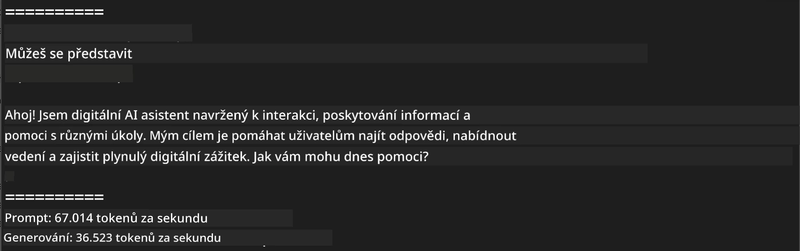
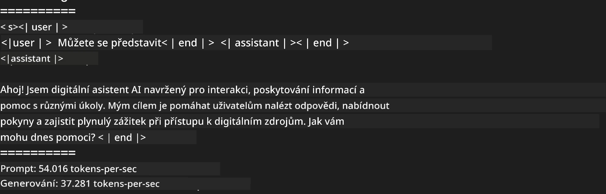
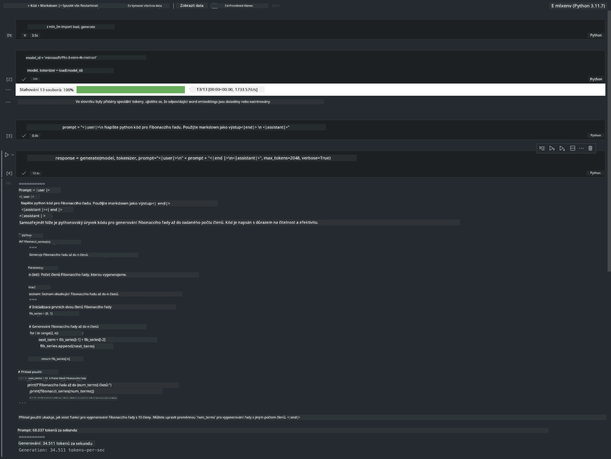

<!--
CO_OP_TRANSLATOR_METADATA:
{
  "original_hash": "dcb656f3d206fc4968e236deec5d4384",
  "translation_date": "2025-07-17T10:08:58+00:00",
  "source_file": "md/03.FineTuning/03.Inference/MLX_Inference.md",
  "language_code": "cs"
}
-->
# **Inference Phi-3 s Apple MLX Framework**

## **Co je MLX Framework**

MLX je framework pro pole určený pro výzkum strojového učení na Apple silicon, vyvinutý týmem Apple machine learning research.

MLX je navržený výzkumníky strojového učení pro výzkumníky strojového učení. Framework je zaměřený na uživatelskou přívětivost, ale zároveň efektivní pro trénování a nasazení modelů. Design frameworku je také konceptuálně jednoduchý. Naším cílem je usnadnit výzkumníkům rozšiřování a vylepšování MLX, aby mohli rychle zkoumat nové nápady.

LLM lze na zařízeních Apple Silicon zrychlit pomocí MLX a modely lze velmi pohodlně spouštět lokálně.

## **Použití MLX pro inference Phi-3-mini**

### **1. Nastavení MLX prostředí**

1. Python 3.11.x  
2. Instalace MLX knihovny

```bash

pip install mlx-lm

```

### **2. Spuštění Phi-3-mini v Terminálu s MLX**

```bash

python -m mlx_lm.generate --model microsoft/Phi-3-mini-4k-instruct --max-token 2048 --prompt  "<|user|>\nCan you introduce yourself<|end|>\n<|assistant|>"

```

Výsledek (moje prostředí je Apple M1 Max, 64GB) je



### **3. Kvantizace Phi-3-mini s MLX v Terminálu**

```bash

python -m mlx_lm.convert --hf-path microsoft/Phi-3-mini-4k-instruct

```

***Note：*** Model lze kvantizovat pomocí mlx_lm.convert, přičemž výchozí kvantizace je INT4. Tento příklad kvantizuje Phi-3-mini do INT4.

Model lze kvantizovat pomocí mlx_lm.convert, přičemž výchozí kvantizace je INT4. Tento příklad ukazuje kvantizaci Phi-3-mini do INT4. Po kvantizaci bude uložen ve výchozím adresáři ./mlx_model.

Model kvantizovaný pomocí MLX můžeme otestovat z terminálu

```bash

python -m mlx_lm.generate --model ./mlx_model/ --max-token 2048 --prompt  "<|user|>\nCan you introduce yourself<|end|>\n<|assistant|>"

```

Výsledek je



### **4. Spuštění Phi-3-mini s MLX v Jupyter Notebooku**



***Note:*** Prostudujte si tento příklad [klikněte na tento odkaz](../../../../../code/03.Inference/MLX/MLX_DEMO.ipynb)

## **Zdroje**

1. Seznamte se s Apple MLX Frameworkem [https://ml-explore.github.io](https://ml-explore.github.io/mlx/build/html/index.html)

2. Apple MLX GitHub Repo [https://github.com/ml-explore](https://github.com/ml-explore)

**Prohlášení o vyloučení odpovědnosti**:  
Tento dokument byl přeložen pomocí AI překladatelské služby [Co-op Translator](https://github.com/Azure/co-op-translator). I když usilujeme o přesnost, mějte prosím na paměti, že automatizované překlady mohou obsahovat chyby nebo nepřesnosti. Původní dokument v jeho mateřském jazyce by měl být považován za autoritativní zdroj. Pro důležité informace se doporučuje profesionální lidský překlad. Nejsme odpovědní za jakékoliv nedorozumění nebo nesprávné výklady vyplývající z použití tohoto překladu.