<!--
CO_OP_TRANSLATOR_METADATA:
{
  "original_hash": "c1559c5af6caccf6f623fd43a6b3a9a3",
  "translation_date": "2025-07-17T06:12:12+00:00",
  "source_file": "md/03.FineTuning/FineTuning_AIFoundry.md",
  "language_code": "cs"
}
-->
# Doladění Phi-3 pomocí Azure AI Foundry

Pojďme prozkoumat, jak doladit jazykový model Phi-3 Mini od Microsoftu pomocí Azure AI Foundry. Doladění vám umožní přizpůsobit Phi-3 Mini konkrétním úkolům, čímž se stane ještě výkonnějším a lépe kontextově uvědomělým.

## Úvahy

- **Možnosti:** Které modely lze doladit? Co lze základní model naučit dělat?
- **Cena:** Jaký je cenový model doladění?
- **Přizpůsobitelnost:** Do jaké míry mohu upravit základní model – a jakými způsoby?
- **Pohodlí:** Jak doladění probíhá – musím psát vlastní kód? Potřebuji vlastní výpočetní zdroje?
- **Bezpečnost:** Doladěné modely mohou nést bezpečnostní rizika – existují nějaké ochranné mechanismy proti nechtěným škodám?

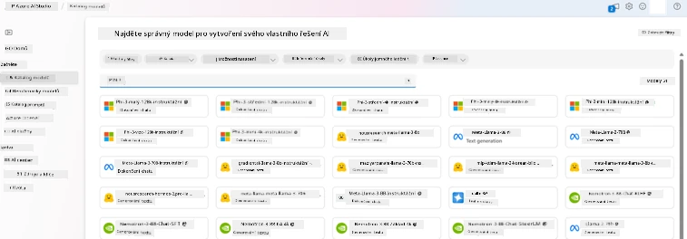

## Příprava na doladění

### Požadavky

> [!NOTE]
> U modelů rodiny Phi-3 je nabídka doladění na principu pay-as-you-go dostupná pouze u hubů vytvořených v regionech **East US 2**.

- Azure předplatné. Pokud ho nemáte, vytvořte si [placený Azure účet](https://azure.microsoft.com/pricing/purchase-options/pay-as-you-go) a začněte.

- [AI Foundry projekt](https://ai.azure.com?WT.mc_id=aiml-138114-kinfeylo).
- Pro přístup k operacím v Azure AI Foundry se používají role založené na přístupu (Azure RBAC). Pro provedení kroků v tomto článku musí mít váš uživatelský účet přiřazenou __roli Azure AI Developer__ v rámci skupiny prostředků.

### Registrace poskytovatele předplatného

Ověřte, že je předplatné registrováno u poskytovatele zdrojů `Microsoft.Network`.

1. Přihlaste se do [Azure portálu](https://portal.azure.com).
1. V levém menu vyberte **Subscriptions**.
1. Vyberte předplatné, které chcete použít.
1. V levém menu vyberte **AI project settings** > **Resource providers**.
1. Potvrďte, že **Microsoft.Network** je v seznamu poskytovatelů zdrojů. Pokud ne, přidejte ho.

### Příprava dat

Připravte si tréninková a validační data pro doladění modelu. Vaše tréninková a validační data by měla obsahovat příklady vstupů a výstupů, jak chcete, aby model fungoval.

Ujistěte se, že všechny tréninkové příklady odpovídají očekávanému formátu pro inferenci. Pro efektivní doladění modelů zajistěte vyvážený a různorodý dataset.

To zahrnuje udržování rovnováhy dat, zahrnutí různých scénářů a pravidelnou úpravu tréninkových dat tak, aby odpovídala reálným očekáváním, což vede k přesnějším a vyváženějším odpovědím modelu.

Různé typy modelů vyžadují odlišný formát tréninkových dat.

### Chat Completion

Tréninková a validační data musí být ve formátu JSON Lines (JSONL). Pro `Phi-3-mini-128k-instruct` musí být dataset pro doladění ve formátu konverzačním, který používá API pro chat completions.

### Příklad formátu souboru

```json
    {"messages": [{"role": "system", "content": "You are an Xbox customer support agent whose primary goal is to help users with issues they are experiencing with their Xbox devices. You are friendly and concise. You only provide factual answers to queries, and do not provide answers that are not related to Xbox."}, {"role": "user", "content": "Is Xbox better than PlayStation?"}, {"role": "assistant", "content": "I apologize, but I cannot provide personal opinions. My primary job is to assist you with any issues related to your Xbox device. Do you have any Xbox-related issues that need addressing?"}]}
    {"messages": [{"role": "system", "content": "You are an Xbox customer support agent whose primary goal is to help users with issues they are experiencing with their Xbox devices. You are friendly and concise. You only provide factual answers to queries, and do not provide answers that are not related to Xbox."}, {"role": "user", "content": "Can I play PC games on my Xbox?"}, {"role": "assistant", "content": "While Xbox consoles don't natively support PC games, they can play an array of Xbox games, many of which are also available on PC. Can I assist you with finding games compatible with your Xbox device?"}]}
    {"messages": [{"role": "system", "content": "You are an Xbox customer support agent whose primary goal is to help users with issues they are experiencing with their Xbox devices. You are friendly and concise. You only provide factual answers to queries, and do not provide answers that are not related to Xbox."}, {"role": "user", "content": "I'm having trouble connecting my Xbox to the Wi-Fi."}, {"role": "assistant", "content": "No worries, let's go through the network settings on your Xbox. Can you please tell me what happens when you try to connect it to the Wi-Fi?"}]}
```

Podporovaný typ souboru je JSON Lines. Soubory se nahrávají do výchozího datového úložiště a zpřístupňují se ve vašem projektu.

## Doladění Phi-3 pomocí Azure AI Foundry

Azure AI Foundry vám umožňuje přizpůsobit velké jazykové modely vašim vlastním datům pomocí procesu zvaného doladění. Doladění přináší významnou hodnotu tím, že umožňuje přizpůsobení a optimalizaci pro konkrétní úkoly a aplikace. Výsledkem je lepší výkon, úspora nákladů, nižší latence a cílené výstupy.

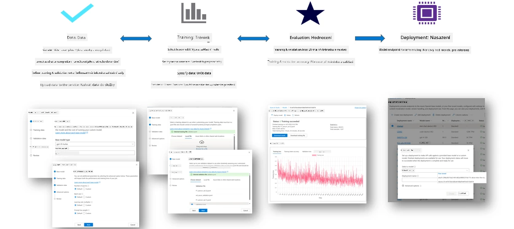

### Vytvoření nového projektu

1. Přihlaste se do [Azure AI Foundry](https://ai.azure.com).

1. Vyberte **+New project** pro vytvoření nového projektu v Azure AI Foundry.

    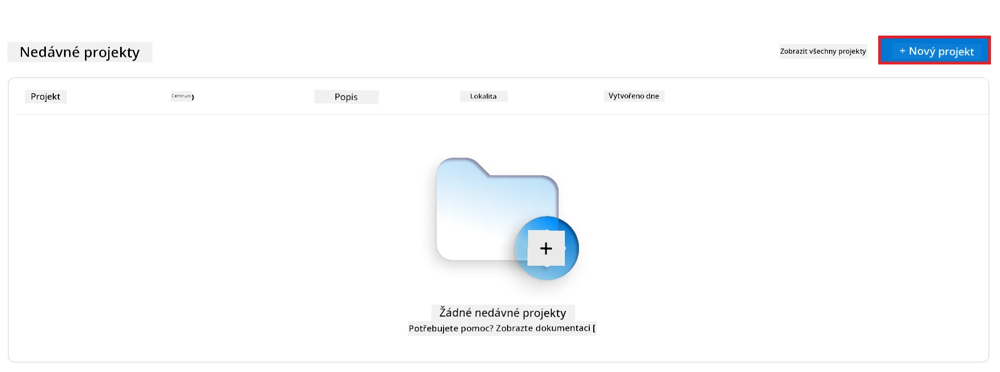

1. Proveďte následující kroky:

    - Název projektu **Hub name**. Musí být jedinečný.
    - Vyberte **Hub**, který chcete použít (vytvořte nový, pokud je potřeba).

    

1. Pro vytvoření nového hubu proveďte následující:

    - Zadejte **Hub name**. Musí být jedinečný.
    - Vyberte své Azure **Subscription**.
    - Vyberte **Resource group** (vytvořte novou, pokud je potřeba).
    - Vyberte **Location**, kterou chcete použít.
    - Vyberte **Connect Azure AI Services** (vytvořte nové, pokud je potřeba).
    - U **Connect Azure AI Search** vyberte **Skip connecting**.

    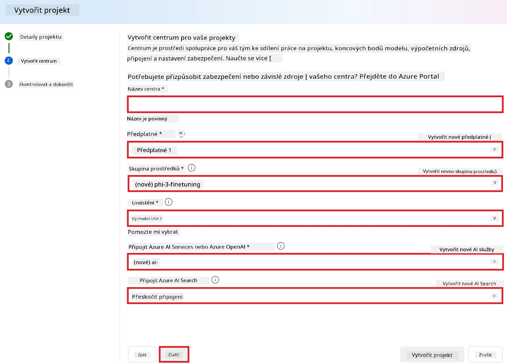

1. Vyberte **Next**.
1. Vyberte **Create a project**.

### Příprava dat

Před doladěním shromážděte nebo vytvořte dataset relevantní pro váš úkol, například chatové instrukce, páry otázek a odpovědí nebo jiná textová data. Data vyčistěte a předzpracujte odstraněním šumu, řešením chybějících hodnot a tokenizací textu.

### Doladění modelů Phi-3 v Azure AI Foundry

> [!NOTE]
> Doladění modelů Phi-3 je momentálně podporováno pouze v projektech umístěných v regionu East US 2.

1. V levém panelu vyberte **Model catalog**.

1. Do **search bar** zadejte *phi-3* a vyberte model phi-3, který chcete použít.

    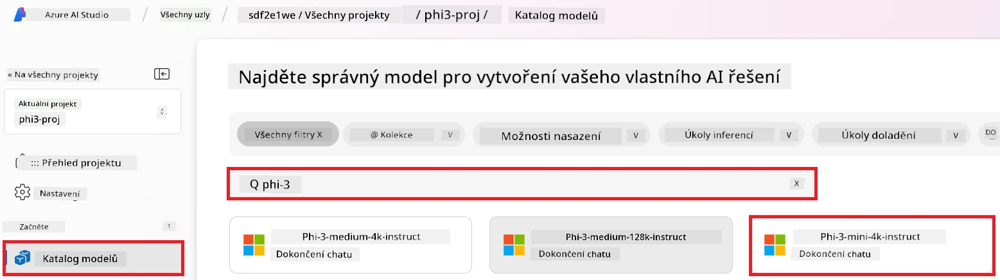

1. Vyberte **Fine-tune**.

    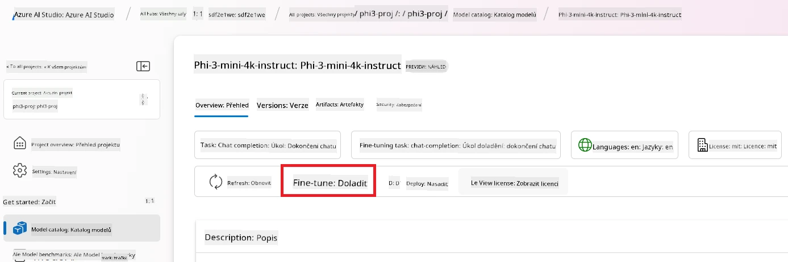

1. Zadejte **Fine-tuned model name**.

    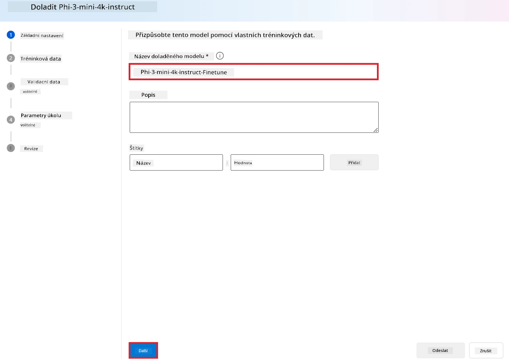

1. Vyberte **Next**.

1. Proveďte následující:

    - Vyberte **task type** jako **Chat completion**.
    - Vyberte **Training data**, které chcete použít. Můžete je nahrát přes Azure AI Foundry nebo z lokálního prostředí.

    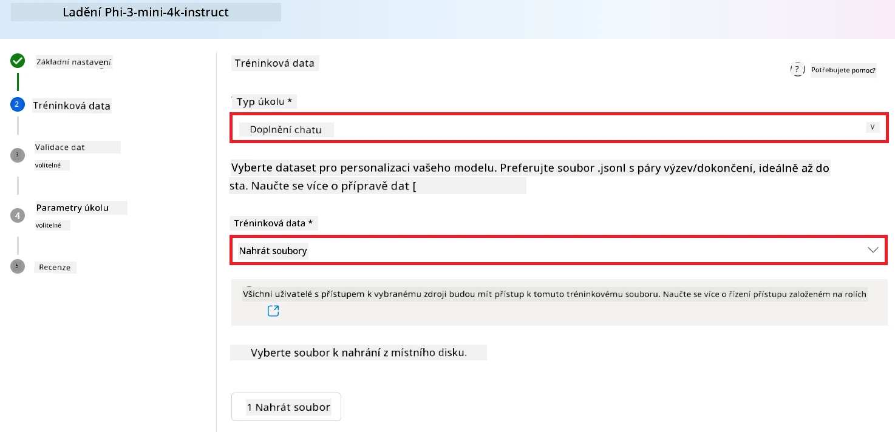

1. Vyberte **Next**.

1. Nahrajte **Validation data**, které chcete použít, nebo vyberte **Automatic split of training data**.

    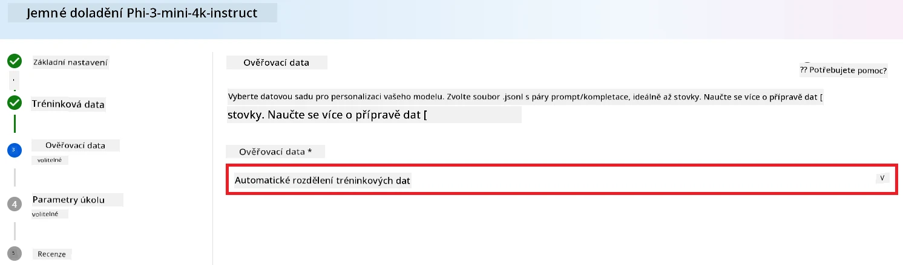

1. Vyberte **Next**.

1. Proveďte následující:

    - Vyberte **Batch size multiplier**.
    - Vyberte **Learning rate**.
    - Vyberte **Epochs**.

    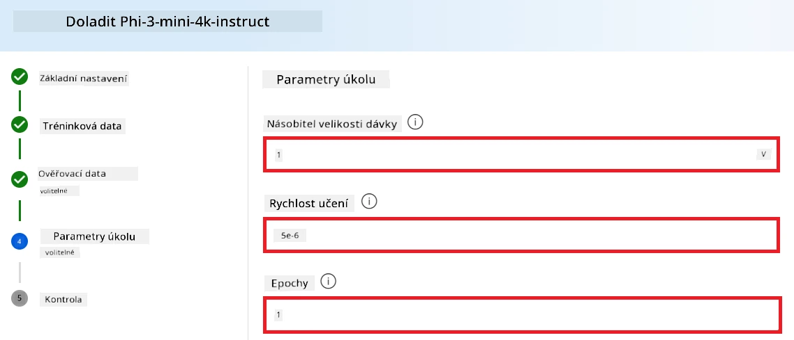

1. Vyberte **Submit** pro spuštění procesu doladění.

    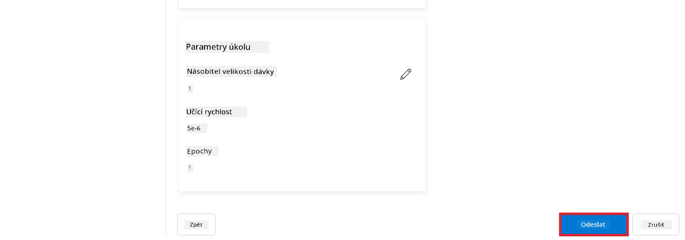

1. Jakmile je model doladěn, stav se zobrazí jako **Completed**, jak je vidět na obrázku níže. Nyní můžete model nasadit a používat ho ve své aplikaci, v playgroundu nebo v prompt flow. Více informací najdete v [Jak nasadit rodinu malých jazykových modelů Phi-3 pomocí Azure AI Foundry](https://learn.microsoft.com/azure/ai-studio/how-to/deploy-models-phi-3?tabs=phi-3-5&pivots=programming-language-python).

    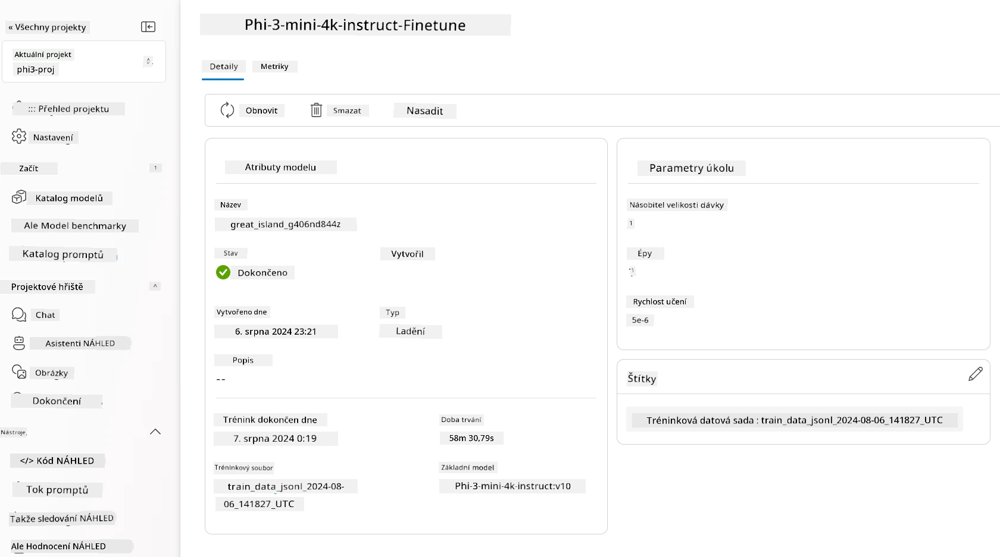

> [!NOTE]
> Pro podrobnější informace o doladění Phi-3 navštivte [Fine-tune Phi-3 models in Azure AI Foundry](https://learn.microsoft.com/azure/ai-studio/how-to/fine-tune-phi-3?tabs=phi-3-mini).

## Odstranění doladěných modelů

Doladěný model můžete smazat ze seznamu doladěných modelů v [Azure AI Foundry](https://ai.azure.com) nebo ze stránky s detaily modelu. Vyberte model, který chcete smazat, na stránce Fine-tuning a poté klikněte na tlačítko Delete.

> [!NOTE]
> Nelze smazat vlastní model, pokud má aktivní nasazení. Nejprve musíte odstranit nasazení modelu, teprve potom můžete smazat vlastní model.

## Náklady a limity

### Úvahy o nákladech a limitech pro modely Phi-3 doladěné jako služba

Modely Phi doladěné jako služba nabízí Microsoft a jsou integrovány s Azure AI Foundry. Ceny najdete při [nasazení](https://learn.microsoft.com/azure/ai-studio/how-to/deploy-models-phi-3?tabs=phi-3-5&pivots=programming-language-python) nebo doladění modelů v záložce Pricing and terms v průvodci nasazením.

## Filtrování obsahu

Modely nasazené jako služba s pay-as-you-go jsou chráněny Azure AI Content Safety. Při nasazení na real-time endpointy můžete tuto funkci vypnout. S povolenou ochranou Azure AI Content Safety prochází jak prompt, tak i výstup souborem klasifikačních modelů, které detekují a zabraňují výstupu škodlivého obsahu. Systém filtrování obsahu detekuje a reaguje na specifické kategorie potenciálně škodlivého obsahu ve vstupních promtech i výstupech. Více informací o [Azure AI Content Safety](https://learn.microsoft.com/azure/ai-studio/concepts/content-filtering).

**Konfigurace doladění**

Hyperparametry: Definujte hyperparametry jako learning rate, velikost batch a počet epoch.

**Funkce ztráty**

Vyberte vhodnou funkci ztráty pro váš úkol (např. cross-entropy).

**Optimalizátor**

Vyberte optimalizátor (např. Adam) pro aktualizace gradientů během tréninku.

**Proces doladění**

- Načtení předtrénovaného modelu: Načtěte checkpoint Phi-3 Mini.
- Přidání vlastních vrstev: Přidejte vrstvy specifické pro úkol (např. klasifikační hlavu pro chatové instrukce).

**Trénink modelu**  
Doladěte model pomocí připraveného datasetu. Sledujte průběh tréninku a podle potřeby upravujte hyperparametry.

**Hodnocení a validace**

Validační sada: Rozdělte data na tréninkovou a validační část.

**Vyhodnocení výkonu**

Použijte metriky jako přesnost, F1-skóre nebo perplexitu pro posouzení výkonu modelu.

## Uložení doladěného modelu

**Checkpoint**  
Uložte checkpoint doladěného modelu pro budoucí použití.

## Nasazení

- Nasazení jako webová služba: Nasadíte svůj doladěný model jako webovou službu v Azure AI Foundry.
- Testování endpointu: Posílejte testovací dotazy na nasazený endpoint a ověřte jeho funkčnost.

## Iterace a zlepšování

Iterujte: Pokud výkon není uspokojivý, upravujte hyperparametry, přidávejte data nebo doladěte model na více epoch.

## Monitorování a ladění

Průběžně sledujte chování modelu a podle potřeby ho dolaďujte.

## Přizpůsobení a rozšíření

Vlastní úkoly: Phi-3 Mini lze doladit pro různé úkoly nad rámec chatových instrukcí. Prozkoumejte další možnosti využití!  
Experimentujte: Zkoušejte různé architektury, kombinace vrstev a techniky pro zlepšení výkonu.

> [!NOTE]
> Doladění je iterativní proces. Experimentujte, učte se a přizpůsobujte model, abyste dosáhli nejlepších výsledků pro váš konkrétní úkol!

**Prohlášení o vyloučení odpovědnosti**:  
Tento dokument byl přeložen pomocí AI překladatelské služby [Co-op Translator](https://github.com/Azure/co-op-translator). I když usilujeme o přesnost, mějte prosím na paměti, že automatizované překlady mohou obsahovat chyby nebo nepřesnosti. Původní dokument v jeho mateřském jazyce by měl být považován za autoritativní zdroj. Pro důležité informace se doporučuje profesionální lidský překlad. Nejsme odpovědní za jakékoliv nedorozumění nebo nesprávné výklady vyplývající z použití tohoto překladu.