<!--
CO_OP_TRANSLATOR_METADATA:
{
  "original_hash": "c1559c5af6caccf6f623fd43a6b3a9a3",
  "translation_date": "2025-05-09T20:36:30+00:00",
  "source_file": "md/03.FineTuning/FineTuning_AIFoundry.md",
  "language_code": "cs"
}
-->
# Тонкая настройка Phi-3 с помощью Azure AI Foundry

Давайте рассмотрим, как тонко настроить языковую модель Phi-3 Mini от Microsoft с использованием Azure AI Foundry. Тонкая настройка позволяет адаптировать Phi-3 Mini под конкретные задачи, делая её ещё более мощной и контекстно ориентированной.

## Важные моменты

- **Возможности:** Какие модели можно тонко настраивать? Какие задачи может выполнять базовая модель после тонкой настройки?
- **Стоимость:** Какова модель ценообразования для тонкой настройки?
- **Настраиваемость:** Насколько можно изменять базовую модель и какими способами?
- **Удобство:** Как происходит процесс тонкой настройки – нужно ли писать собственный код? Нужно ли предоставлять собственные вычислительные ресурсы?
- **Безопасность:** Известно, что тонко настроенные модели могут представлять риски безопасности – существуют ли защитные механизмы для предотвращения нежелательных последствий?

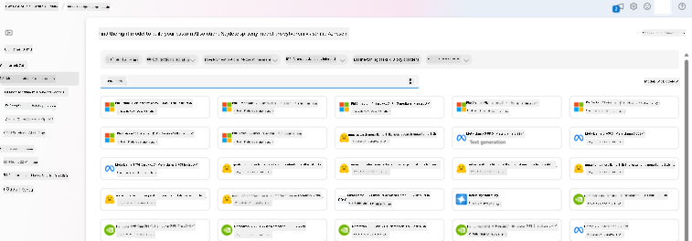

## Подготовка к тонкой настройке

### Требования

> [!NOTE]
> Для моделей семейства Phi-3 предложение по тонкой настройке с оплатой по факту доступно только для хабов, созданных в регионах **East US 2**.

- Подписка Azure. Если у вас нет подписки, создайте [платный аккаунт Azure](https://azure.microsoft.com/pricing/purchase-options/pay-as-you-go) для начала.

- Проект [AI Foundry](https://ai.azure.com?WT.mc_id=aiml-138114-kinfeylo).
- Для доступа к операциям в Azure AI Foundry используются ролевые права доступа Azure (Azure RBAC). Для выполнения шагов из этой статьи ваша учетная запись должна иметь роль __Azure AI Developer__ в группе ресурсов.

### Регистрация провайдера подписки

Проверьте, что подписка зарегистрирована для провайдера ресурсов `Microsoft.Network`.

1. Войдите в [портал Azure](https://portal.azure.com).
1. В меню слева выберите **Subscriptions**.
1. Выберите нужную подписку.
1. В меню слева выберите **AI project settings** > **Resource providers**.
1. Убедитесь, что **Microsoft.Network** есть в списке провайдеров ресурсов. Если нет – добавьте его.

### Подготовка данных

Подготовьте данные для обучения и валидации для тонкой настройки модели. Ваши тренировочные и валидационные наборы данных должны содержать примеры входных и выходных данных, показывающих, как вы хотите, чтобы модель работала.

Убедитесь, что все тренировочные примеры соответствуют ожидаемому формату для инференса. Для эффективной тонкой настройки важно иметь сбалансированный и разнообразный набор данных.

Это включает поддержание баланса данных, охват различных сценариев и периодическую корректировку тренировочных данных для соответствия реальным ожиданиям, что в итоге ведет к более точным и сбалансированным ответам модели.

Разные типы моделей требуют разных форматов тренировочных данных.

### Chat Completion

Данные для обучения и валидации **должны** быть в формате JSON Lines (JSONL). Для `Phi-3-mini-128k-instruct` набор данных для тонкой настройки должен быть оформлен в разговорном формате, который используется API для Chat completions.

### Пример формата файла

```json
    {"messages": [{"role": "system", "content": "You are an Xbox customer support agent whose primary goal is to help users with issues they are experiencing with their Xbox devices. You are friendly and concise. You only provide factual answers to queries, and do not provide answers that are not related to Xbox."}, {"role": "user", "content": "Is Xbox better than PlayStation?"}, {"role": "assistant", "content": "I apologize, but I cannot provide personal opinions. My primary job is to assist you with any issues related to your Xbox device. Do you have any Xbox-related issues that need addressing?"}]}
    {"messages": [{"role": "system", "content": "You are an Xbox customer support agent whose primary goal is to help users with issues they are experiencing with their Xbox devices. You are friendly and concise. You only provide factual answers to queries, and do not provide answers that are not related to Xbox."}, {"role": "user", "content": "Can I play PC games on my Xbox?"}, {"role": "assistant", "content": "While Xbox consoles don't natively support PC games, they can play an array of Xbox games, many of which are also available on PC. Can I assist you with finding games compatible with your Xbox device?"}]}
    {"messages": [{"role": "system", "content": "You are an Xbox customer support agent whose primary goal is to help users with issues they are experiencing with their Xbox devices. You are friendly and concise. You only provide factual answers to queries, and do not provide answers that are not related to Xbox."}, {"role": "user", "content": "I'm having trouble connecting my Xbox to the Wi-Fi."}, {"role": "assistant", "content": "No worries, let's go through the network settings on your Xbox. Can you please tell me what happens when you try to connect it to the Wi-Fi?"}]}
```

Поддерживаемый тип файла — JSON Lines. Файлы загружаются в хранилище по умолчанию и становятся доступными в вашем проекте.

## Тонкая настройка Phi-3 с Azure AI Foundry

Azure AI Foundry позволяет адаптировать крупные языковые модели под ваши собственные данные с помощью процесса тонкой настройки. Тонкая настройка приносит значительную пользу, позволяя кастомизировать и оптимизировать модели под конкретные задачи и приложения. Это улучшает производительность, экономит средства, снижает задержки и обеспечивает более точные результаты.

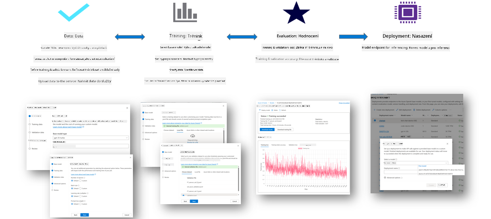

### Создание нового проекта

1. Войдите в [Azure AI Foundry](https://ai.azure.com).

1. Выберите **+New project** для создания нового проекта в Azure AI Foundry.

    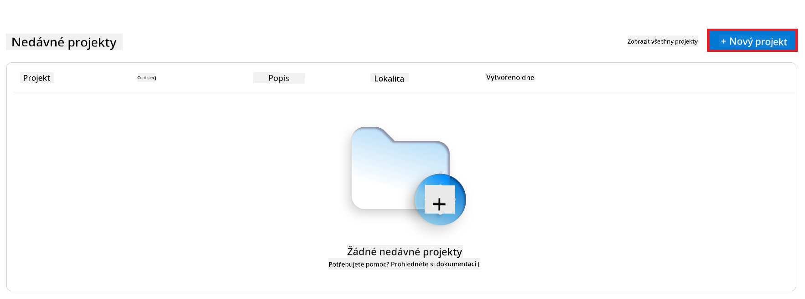

1. Выполните следующие действия:

    - Укажите уникальное имя проекта **Hub name**.
    - Выберите **Hub** для использования (при необходимости создайте новый).

    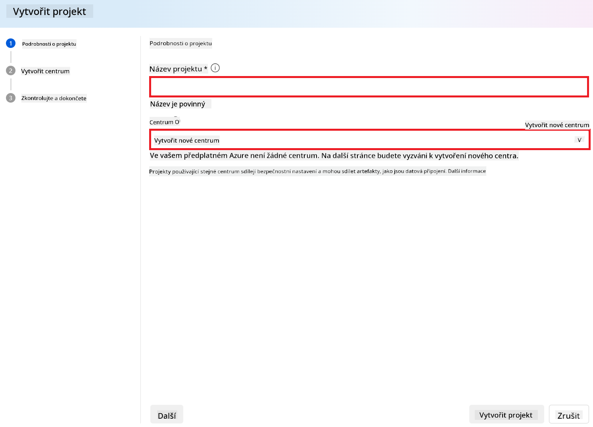

1. Для создания нового хаба выполните следующие шаги:

    - Введите уникальное имя **Hub name**.
    - Выберите подписку Azure **Subscription**.
    - Выберите группу ресурсов **Resource group** (при необходимости создайте новую).
    - Выберите регион **Location**.
    - Выберите сервис Azure AI для подключения **Connect Azure AI Services** (создайте новый, если нужно).
    - Для Azure AI Search выберите **Skip connecting**.

    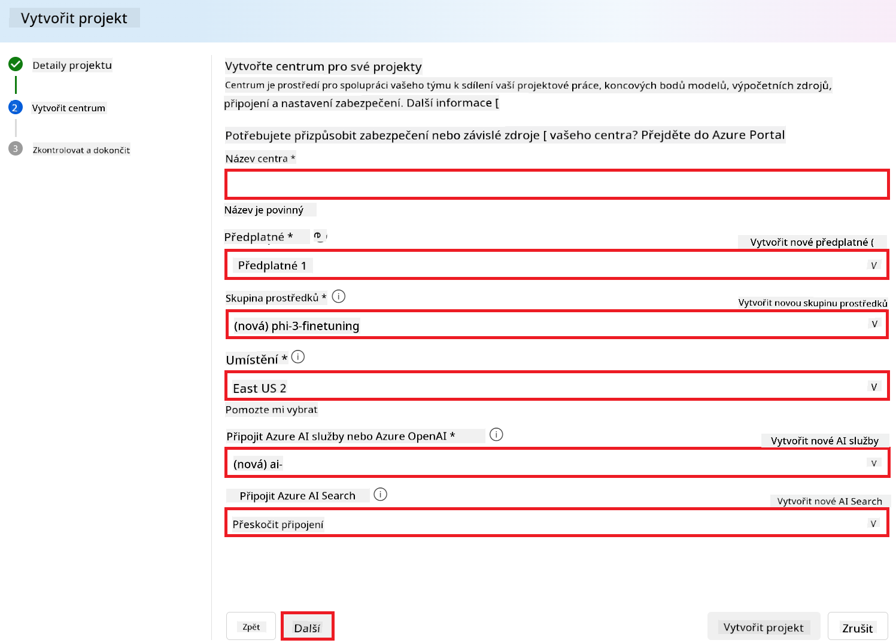

1. Нажмите **Next**.
1. Нажмите **Create a project**.

### Подготовка данных

Перед тонкой настройкой соберите или создайте набор данных, релевантный вашей задаче, например, инструкции для чата, пары вопросов и ответов или другие текстовые данные. Очистите и предобработайте данные, удалив шум, обработав пропущенные значения и токенизировав текст.

### Тонкая настройка моделей Phi-3 в Azure AI Foundry

> [!NOTE]
> Тонкая настройка моделей Phi-3 поддерживается только для проектов, расположенных в регионе East US 2.

1. В левой панели выберите **Model catalog**.

1. В строке поиска введите *phi-3* и выберите нужную модель phi-3.

    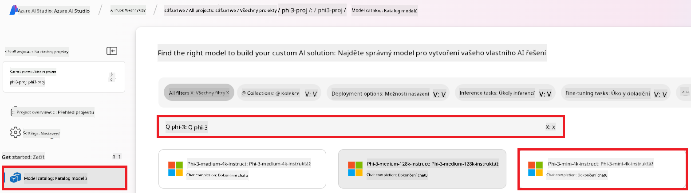

1. Нажмите **Fine-tune**.

    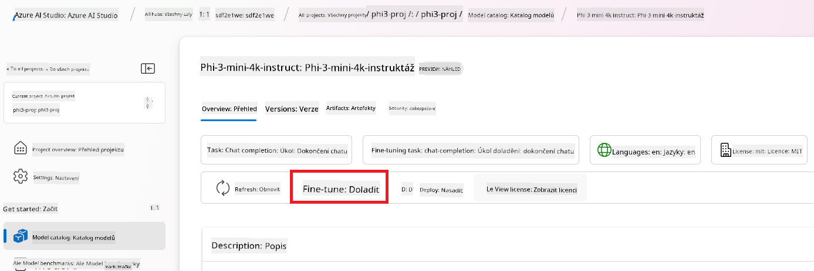

1. Введите имя для **Fine-tuned model name**.

    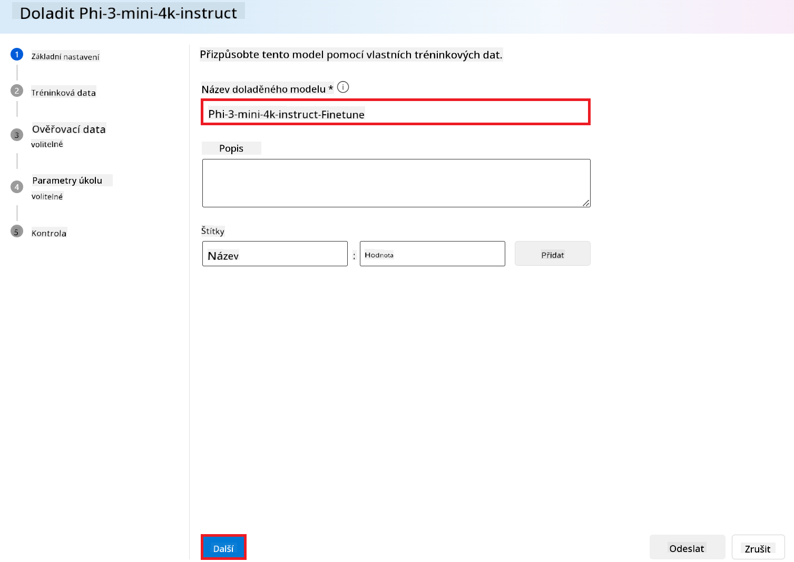

1. Нажмите **Next**.

1. Выполните следующие действия:

    - Выберите тип задачи **task type** — **Chat completion**.
    - Выберите тренировочные данные. Можно загрузить через Azure AI Foundry или из локального окружения.

    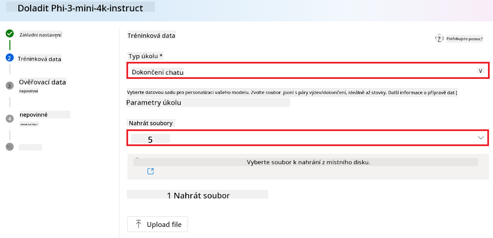

1. Нажмите **Next**.

1. Загрузите валидационные данные или выберите **Automatic split of training data**.

    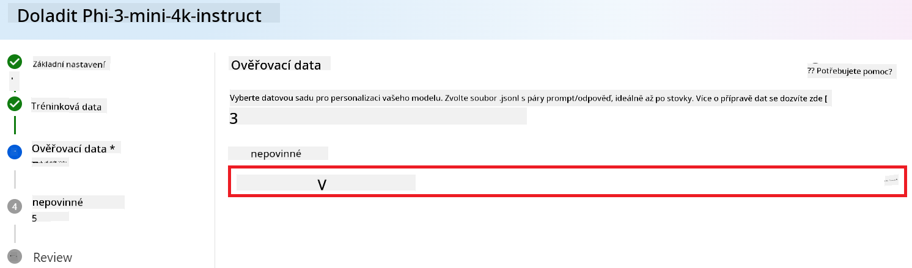

1. Нажмите **Next**.

1. Выполните следующие действия:

    - Выберите множитель размера пакета **Batch size multiplier**.
    - Выберите скорость обучения **Learning rate**.
    - Выберите количество эпох **Epochs**.

    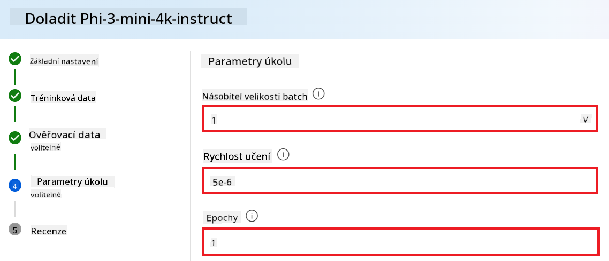

1. Нажмите **Submit** для запуска процесса тонкой настройки.

    

1. После завершения тонкой настройки статус модели будет отображаться как **Completed**, как показано ниже. Теперь вы можете развернуть модель и использовать её в своём приложении, в playground или в prompt flow. Подробнее см. [How to deploy Phi-3 family of small language models with Azure AI Foundry](https://learn.microsoft.com/azure/ai-studio/how-to/deploy-models-phi-3?tabs=phi-3-5&pivots=programming-language-python).

    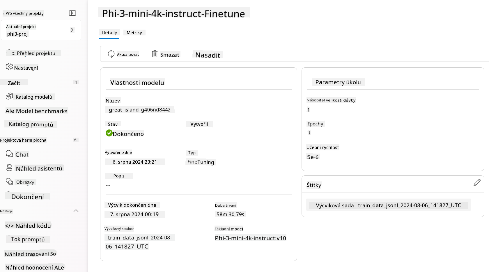

> [!NOTE]
> Более подробную информацию о тонкой настройке Phi-3 смотрите на странице [Fine-tune Phi-3 models in Azure AI Foundry](https://learn.microsoft.com/azure/ai-studio/how-to/fine-tune-phi-3?tabs=phi-3-mini).

## Очистка тонко настроенных моделей

Вы можете удалить тонко настроенную модель из списка тонкой настройки в [Azure AI Foundry](https://ai.azure.com) или на странице сведений о модели. Выберите модель для удаления на странице Fine-tuning, затем нажмите кнопку Delete для удаления.

> [!NOTE]
> Нельзя удалить кастомную модель, если у неё есть активное развертывание. Сначала удалите развертывание модели, затем можно удалить саму модель.

## Стоимость и квоты

### Особенности стоимости и квот для моделей Phi-3, тонко настроенных как сервис

Модели Phi, тонко настроенные как сервис, предоставляются Microsoft и интегрированы с Azure AI Foundry. Цены можно посмотреть при [развертывании](https://learn.microsoft.com/azure/ai-studio/how-to/deploy-models-phi-3?tabs=phi-3-5&pivots=programming-language-python) или тонкой настройке моделей во вкладке Pricing and terms в мастере развертывания.

## Фильтрация контента

Модели, развернутые как сервис с оплатой по факту, защищены Azure AI Content Safety. При развертывании на конечных точках в реальном времени вы можете отказаться от этой функции. При включённой Azure AI Content Safety и запрос, и ответ проходят через ансамбль моделей классификации, направленных на обнаружение и предотвращение вывода вредоносного контента. Система фильтрации обнаруживает и реагирует на определённые категории потенциально опасного контента как во входных запросах, так и в ответах. Подробнее о [Azure AI Content Safety](https://learn.microsoft.com/azure/ai-studio/concepts/content-filtering).

**Конфигурация тонкой настройки**

Гиперпараметры: задайте такие параметры, как скорость обучения, размер пакета и количество эпох.

**Функция потерь**

Выберите подходящую функцию потерь для вашей задачи (например, кросс-энтропию).

**Оптимизатор**

Выберите оптимизатор (например, Adam) для обновления градиентов во время обучения.

**Процесс тонкой настройки**

- Загрузите предобученную модель: загрузите чекпоинт Phi-3 Mini.
- Добавьте кастомные слои: добавьте слои, специфичные для задачи (например, классификационную голову для инструкций чата).

**Обучение модели**

Тонко настройте модель на подготовленном наборе данных. Следите за процессом обучения и при необходимости корректируйте гиперпараметры.

**Оценка и валидация**

Валидационный набор: разделите данные на тренировочный и валидационный наборы.

**Оценка производительности**

Используйте метрики, такие как точность, F1-score или perplexity, для оценки качества модели.

## Сохранение тонко настроенной модели

**Чекпоинт**

Сохраните чекпоинт тонко настроенной модели для дальнейшего использования.

## Развёртывание

- Разверните как веб-сервис: разместите вашу тонко настроенную модель как веб-сервис в Azure AI Foundry.
- Проверьте конечную точку: отправьте тестовые запросы на развернутую конечную точку для проверки её работы.

## Итерации и улучшения

Итерации: если результаты не удовлетворительны, повторите процесс, изменяя гиперпараметры, добавляя данные или увеличивая количество эпох.

## Мониторинг и доработка

Постоянно отслеживайте поведение модели и при необходимости корректируйте её.

## Кастомизация и расширение

Кастомные задачи: Phi-3 Mini можно тонко настраивать для различных задач помимо инструкций чата. Исследуйте другие варианты использования!
Эксперименты: пробуйте разные архитектуры, комбинации слоёв и методы для улучшения производительности.

> [!NOTE]
> Тонкая настройка – это итеративный процесс. Экспериментируйте, учитесь и адаптируйте модель для достижения наилучших результатов в вашей конкретной задаче!

**Prohlášení o vyloučení odpovědnosti**:  
Tento dokument byl přeložen pomocí AI překladatelské služby [Co-op Translator](https://github.com/Azure/co-op-translator). I když usilujeme o přesnost, mějte prosím na paměti, že automatické překlady mohou obsahovat chyby nebo nepřesnosti. Původní dokument v jeho mateřském jazyce by měl být považován za autoritativní zdroj. Pro důležité informace se doporučuje profesionální lidský překlad. Nejsme odpovědní za jakékoliv nedorozumění nebo nesprávné výklady vyplývající z použití tohoto překladu.