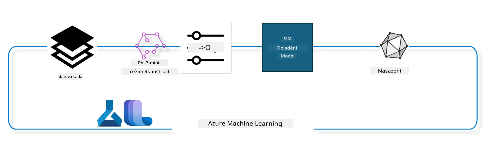

<!--
CO_OP_TRANSLATOR_METADATA:
{
  "original_hash": "944949f040e61b2ea25b3460f7394fd4",
  "translation_date": "2025-07-17T07:42:03+00:00",
  "source_file": "md/03.FineTuning/FineTuning_MLSDK.md",
  "language_code": "cs"
}
-->
## Jak používat komponenty chat-completion ze systémového registru Azure ML pro doladění modelu

V tomto příkladu provedeme doladění modelu Phi-3-mini-4k-instruct, aby dokončil konverzaci mezi dvěma lidmi pomocí datasetu ultrachat_200k.



Příklad vám ukáže, jak provést doladění pomocí Azure ML SDK a Pythonu a poté nasadit doladěný model na online endpoint pro inferenci v reálném čase.

### Tréninková data

Použijeme dataset ultrachat_200k. Jedná se o silně filtrovanou verzi datasetu UltraChat, která byla použita k tréninku Zephyr-7B-β, špičkového 7b chat modelu.

### Model

Použijeme model Phi-3-mini-4k-instruct, abychom ukázali, jak uživatel může doladit model pro úlohu chat-completion. Pokud jste otevřeli tento notebook z konkrétního modelového karty, nezapomeňte nahradit název modelu.

### Úkoly

- Vybrat model k doladění.
- Vybrat a prozkoumat tréninková data.
- Nakonfigurovat úlohu doladění.
- Spustit úlohu doladění.
- Zkontrolovat metriky tréninku a vyhodnocení.
- Zaregistrovat doladěný model.
- Nasadit doladěný model pro inferenci v reálném čase.
- Uklidit zdroje.

## 1. Nastavení předpokladů

- Nainstalujte závislosti
- Připojte se k AzureML Workspace. Více informací najdete v nastavení autentizace SDK. Nahraďte <WORKSPACE_NAME>, <RESOURCE_GROUP> a <SUBSCRIPTION_ID> níže.
- Připojte se k systémovému registru azureml
- Nastavte volitelný název experimentu
- Zkontrolujte nebo vytvořte výpočetní prostředek.

> [!NOTE]
> Požadavky: jeden GPU uzel může mít více GPU karet. Například jeden uzel Standard_NC24rs_v3 má 4 NVIDIA V100 GPU, zatímco Standard_NC12s_v3 má 2 NVIDIA V100 GPU. Podrobnosti najdete v dokumentaci. Počet GPU karet na uzel je nastaven v parametru gpus_per_node níže. Správné nastavení zajistí využití všech GPU v uzlu. Doporučené GPU compute SKU najdete zde a zde.

### Python knihovny

Nainstalujte závislosti spuštěním níže uvedené buňky. Tento krok není volitelný, pokud běžíte v novém prostředí.

```bash
pip install azure-ai-ml
pip install azure-identity
pip install datasets==2.9.0
pip install mlflow
pip install azureml-mlflow
```

### Interakce s Azure ML

1. Tento Python skript slouží k interakci se službou Azure Machine Learning (Azure ML). Zde je přehled, co dělá:

    - Importuje potřebné moduly z balíčků azure.ai.ml, azure.identity a azure.ai.ml.entities. Také importuje modul time.

    - Pokouší se autentizovat pomocí DefaultAzureCredential(), který poskytuje zjednodušený způsob autentizace pro rychlý start vývoje aplikací běžících v Azure cloudu. Pokud to selže, použije InteractiveBrowserCredential(), který nabízí interaktivní přihlašovací výzvu.

    - Poté se pokouší vytvořit instanci MLClient pomocí metody from_config, která načítá konfiguraci z výchozího konfiguračního souboru (config.json). Pokud to selže, vytvoří MLClient ručním zadáním subscription_id, resource_group_name a workspace_name.

    - Vytvoří další instanci MLClient, tentokrát pro Azure ML registr s názvem "azureml". Tento registr slouží k ukládání modelů, pipeline pro doladění a prostředí.

    - Nastaví experiment_name na "chat_completion_Phi-3-mini-4k-instruct".

    - Vygeneruje unikátní časové razítko převedením aktuálního času (v sekundách od epochy, jako desetinné číslo) na celé číslo a poté na řetězec. Toto časové razítko lze použít pro vytváření unikátních názvů a verzí.

    ```python
    # Import necessary modules from Azure ML and Azure Identity
    from azure.ai.ml import MLClient
    from azure.identity import (
        DefaultAzureCredential,
        InteractiveBrowserCredential,
    )
    from azure.ai.ml.entities import AmlCompute
    import time  # Import time module
    
    # Try to authenticate using DefaultAzureCredential
    try:
        credential = DefaultAzureCredential()
        credential.get_token("https://management.azure.com/.default")
    except Exception as ex:  # If DefaultAzureCredential fails, use InteractiveBrowserCredential
        credential = InteractiveBrowserCredential()
    
    # Try to create an MLClient instance using the default config file
    try:
        workspace_ml_client = MLClient.from_config(credential=credential)
    except:  # If that fails, create an MLClient instance by manually providing the details
        workspace_ml_client = MLClient(
            credential,
            subscription_id="<SUBSCRIPTION_ID>",
            resource_group_name="<RESOURCE_GROUP>",
            workspace_name="<WORKSPACE_NAME>",
        )
    
    # Create another MLClient instance for the Azure ML registry named "azureml"
    # This registry is where models, fine-tuning pipelines, and environments are stored
    registry_ml_client = MLClient(credential, registry_name="azureml")
    
    # Set the experiment name
    experiment_name = "chat_completion_Phi-3-mini-4k-instruct"
    
    # Generate a unique timestamp that can be used for names and versions that need to be unique
    timestamp = str(int(time.time()))
    ```

## 2. Vyberte základní model k doladění

1. Phi-3-mini-4k-instruct je model s 3,8 miliardami parametrů, lehký, špičkový otevřený model založený na datech použitých pro Phi-2. Model patří do rodiny Phi-3 a verze Mini je dostupná ve dvou variantách 4K a 128K, což je délka kontextu (v tokenech), kterou dokáže zpracovat. Pro použití je potřeba model doladit pro náš konkrétní účel. Tyto modely můžete prohlížet v katalogu modelů v AzureML Studiu, filtrované podle úlohy chat-completion. V tomto příkladu používáme model Phi-3-mini-4k-instruct. Pokud jste otevřeli tento notebook pro jiný model, nahraďte název a verzi modelu podle potřeby.

    > [!NOTE]
    > vlastnost model_id modelu. Ta bude předána jako vstup do úlohy doladění. Je také dostupná jako pole Asset ID na stránce detailů modelu v katalogu modelů AzureML Studia.

2. Tento Python skript komunikuje se službou Azure Machine Learning (Azure ML). Zde je přehled, co dělá:

    - Nastaví model_name na "Phi-3-mini-4k-instruct".

    - Použije metodu get vlastnosti models objektu registry_ml_client k získání nejnovější verze modelu se zadaným názvem ze systémového registru Azure ML. Metoda get je volána se dvěma argumenty: názvem modelu a štítkem, který specifikuje, že má být získána nejnovější verze modelu.

    - Vypíše zprávu do konzole, která uvádí název, verzi a id modelu, který bude použit pro doladění. Metoda format řetězce se používá k vložení názvu, verze a id modelu do zprávy. Název, verze a id modelu jsou přístupné jako vlastnosti objektu foundation_model.

    ```python
    # Set the model name
    model_name = "Phi-3-mini-4k-instruct"
    
    # Get the latest version of the model from the Azure ML registry
    foundation_model = registry_ml_client.models.get(model_name, label="latest")
    
    # Print the model name, version, and id
    # This information is useful for tracking and debugging
    print(
        "\n\nUsing model name: {0}, version: {1}, id: {2} for fine tuning".format(
            foundation_model.name, foundation_model.version, foundation_model.id
        )
    )
    ```

## 3. Vytvořte výpočetní prostředek pro úlohu

Úloha doladění funguje POUZE s GPU výpočetním prostředkem. Velikost výpočetního prostředku závisí na velikosti modelu a ve většině případů je obtížné vybrat správný výpočetní prostředek pro úlohu. V této buňce uživatele provedeme výběrem správného výpočetního prostředku.

> [!NOTE]
> Níže uvedené výpočetní prostředky pracují s nejoptimalizovanější konfigurací. Jakékoliv změny konfigurace mohou vést k chybě Cuda Out Of Memory. V takovém případě zkuste upgradovat výpočetní prostředek na větší velikost.

> [!NOTE]
> Při výběru compute_cluster_size níže se ujistěte, že výpočetní prostředek je dostupný ve vaší resource group. Pokud konkrétní výpočetní prostředek není dostupný, můžete požádat o přístup k výpočetním zdrojům.

### Kontrola podpory modelu pro doladění

1. Tento Python skript komunikuje s modelem Azure Machine Learning (Azure ML). Zde je přehled, co dělá:

    - Importuje modul ast, který poskytuje funkce pro zpracování stromů abstraktní syntaxe Pythonu.

    - Kontroluje, zda objekt foundation_model (který reprezentuje model v Azure ML) má tag s názvem finetune_compute_allow_list. Tagy v Azure ML jsou páry klíč-hodnota, které můžete vytvářet a používat k filtrování a třídění modelů.

    - Pokud je tag finetune_compute_allow_list přítomen, použije funkci ast.literal_eval k bezpečnému převodu hodnoty tagu (řetězce) na Python seznam. Tento seznam je pak přiřazen do proměnné computes_allow_list. Poté vypíše zprávu, že by měl být vytvořen výpočetní prostředek ze seznamu.

    - Pokud tag finetune_compute_allow_list není přítomen, nastaví computes_allow_list na None a vypíše zprávu, že tag finetune_compute_allow_list není součástí tagů modelu.

    - Shrnutí: skript kontroluje specifický tag v metadatech modelu, převádí hodnotu tagu na seznam, pokud existuje, a poskytuje uživateli odpovídající zpětnou vazbu.

    ```python
    # Import the ast module, which provides functions to process trees of the Python abstract syntax grammar
    import ast
    
    # Check if the 'finetune_compute_allow_list' tag is present in the model's tags
    if "finetune_compute_allow_list" in foundation_model.tags:
        # If the tag is present, use ast.literal_eval to safely parse the tag's value (a string) into a Python list
        computes_allow_list = ast.literal_eval(
            foundation_model.tags["finetune_compute_allow_list"]
        )  # convert string to python list
        # Print a message indicating that a compute should be created from the list
        print(f"Please create a compute from the above list - {computes_allow_list}")
    else:
        # If the tag is not present, set computes_allow_list to None
        computes_allow_list = None
        # Print a message indicating that the 'finetune_compute_allow_list' tag is not part of the model's tags
        print("`finetune_compute_allow_list` is not part of model tags")
    ```

### Kontrola výpočetního instance

1. Tento Python skript komunikuje se službou Azure Machine Learning (Azure ML) a provádí několik kontrol na výpočetní instanci. Zde je přehled, co dělá:

    - Pokouší se získat výpočetní instanci s názvem uloženým v proměnné compute_cluster z Azure ML workspace. Pokud je stav provisioning této instance "failed", vyvolá ValueError.

    - Kontroluje, zda computes_allow_list není None. Pokud není, převede všechny velikosti výpočetních prostředků v seznamu na malá písmena a zkontroluje, zda velikost aktuální výpočetní instance je v tomto seznamu. Pokud není, vyvolá ValueError.

    - Pokud je computes_allow_list None, zkontroluje, zda velikost výpočetní instance není v seznamu nepodporovaných GPU VM velikostí. Pokud ano, vyvolá ValueError.

    - Získá seznam všech dostupných velikostí výpočetních prostředků ve workspace. Poté prochází tento seznam a pro každou velikost zkontroluje, zda její název odpovídá velikosti aktuální výpočetní instance. Pokud ano, získá počet GPU pro tuto velikost a nastaví gpu_count_found na True.

    - Pokud je gpu_count_found True, vypíše počet GPU ve výpočetní instanci. Pokud je False, vyvolá ValueError.

    - Shrnutí: skript provádí několik kontrol výpočetní instance v Azure ML workspace, včetně stavu provisioning, velikosti vůči povolenému nebo zakázanému seznamu a počtu GPU.

    ```python
    # Print the exception message
    print(e)
    # Raise a ValueError if the compute size is not available in the workspace
    raise ValueError(
        f"WARNING! Compute size {compute_cluster_size} not available in workspace"
    )
    
    # Retrieve the compute instance from the Azure ML workspace
    compute = workspace_ml_client.compute.get(compute_cluster)
    # Check if the provisioning state of the compute instance is "failed"
    if compute.provisioning_state.lower() == "failed":
        # Raise a ValueError if the provisioning state is "failed"
        raise ValueError(
            f"Provisioning failed, Compute '{compute_cluster}' is in failed state. "
            f"please try creating a different compute"
        )
    
    # Check if computes_allow_list is not None
    if computes_allow_list is not None:
        # Convert all compute sizes in computes_allow_list to lowercase
        computes_allow_list_lower_case = [x.lower() for x in computes_allow_list]
        # Check if the size of the compute instance is in computes_allow_list_lower_case
        if compute.size.lower() not in computes_allow_list_lower_case:
            # Raise a ValueError if the size of the compute instance is not in computes_allow_list_lower_case
            raise ValueError(
                f"VM size {compute.size} is not in the allow-listed computes for finetuning"
            )
    else:
        # Define a list of unsupported GPU VM sizes
        unsupported_gpu_vm_list = [
            "standard_nc6",
            "standard_nc12",
            "standard_nc24",
            "standard_nc24r",
        ]
        # Check if the size of the compute instance is in unsupported_gpu_vm_list
        if compute.size.lower() in unsupported_gpu_vm_list:
            # Raise a ValueError if the size of the compute instance is in unsupported_gpu_vm_list
            raise ValueError(
                f"VM size {compute.size} is currently not supported for finetuning"
            )
    
    # Initialize a flag to check if the number of GPUs in the compute instance has been found
    gpu_count_found = False
    # Retrieve a list of all available compute sizes in the workspace
    workspace_compute_sku_list = workspace_ml_client.compute.list_sizes()
    available_sku_sizes = []
    # Iterate over the list of available compute sizes
    for compute_sku in workspace_compute_sku_list:
        available_sku_sizes.append(compute_sku.name)
        # Check if the name of the compute size matches the size of the compute instance
        if compute_sku.name.lower() == compute.size.lower():
            # If it does, retrieve the number of GPUs for that compute size and set gpu_count_found to True
            gpus_per_node = compute_sku.gpus
            gpu_count_found = True
    # If gpu_count_found is True, print the number of GPUs in the compute instance
    if gpu_count_found:
        print(f"Number of GPU's in compute {compute.size}: {gpus_per_node}")
    else:
        # If gpu_count_found is False, raise a ValueError
        raise ValueError(
            f"Number of GPU's in compute {compute.size} not found. Available skus are: {available_sku_sizes}."
            f"This should not happen. Please check the selected compute cluster: {compute_cluster} and try again."
        )
    ```

## 4. Vyberte dataset pro doladění modelu

1. Používáme dataset ultrachat_200k. Dataset má čtyři části, vhodné pro Supervised fine-tuning (sft).
Generační hodnocení (gen). Počet příkladů v jednotlivých částech je uveden níže:

    ```bash
    train_sft test_sft  train_gen  test_gen
    207865  23110  256032  28304
    ```

1. Následující buňky ukazují základní přípravu dat pro doladění:

### Vizualizace několika řádků dat

Chceme, aby tento vzorek běžel rychle, proto uložíme soubory train_sft, test_sft obsahující 5 % již ořezaných řádků. To znamená, že doladěný model bude mít nižší přesnost, a proto by neměl být použit v reálném nasazení.
Skript download-dataset.py slouží ke stažení datasetu ultrachat_200k a transformaci datasetu do formátu vhodného pro komponentu pipeline doladění. Jelikož je dataset velký, zde máme pouze část datasetu.

1. Spuštěním níže uvedeného skriptu se stáhne pouze 5 % dat. Toto lze zvýšit změnou parametru dataset_split_pc na požadované procento.

    > [!NOTE]
    > Některé jazykové modely mají různé jazykové kódy, a proto by názvy sloupců v datasetu měly odpovídat těmto kódům.

1. Zde je příklad, jak by data měla vypadat
Dataset chat-completion je uložen ve formátu parquet, kde každý záznam používá následující schéma:

    - Jedná se o JSON (JavaScript Object Notation) dokument, což je populární formát pro výměnu dat. Není to spustitelný kód, ale způsob ukládání a přenosu dat. Zde je rozbor jeho struktury:

    - "prompt": Tento klíč obsahuje řetězec, který představuje úkol nebo otázku položenou AI asistentovi.

    - "messages": Tento klíč obsahuje pole objektů. Každý objekt představuje zprávu v konverzaci mezi uživatelem a AI asistentem. Každá zpráva má dva klíče:

    - "content": Tento klíč obsahuje řetězec představující obsah zprávy.
    - "role": Tento klíč obsahuje řetězec, který označuje roli entity, která zprávu odeslala. Může to být "user" nebo "assistant".
    - "prompt_id": Tento klíč obsahuje řetězec, který představuje unikátní identifikátor promptu.

1. V tomto konkrétním JSON dokumentu je reprezentována konverzace, kde uživatel žádá AI asistenta o vytvoření protagonisty pro dystopický příběh. Asistent odpovídá a uživatel pak žádá o více detailů. Asistent souhlasí, že poskytne více detailů. Celá konverzace je spojena s konkrétním prompt_id.

    ```python
    {
        // The task or question posed to an AI assistant
        "prompt": "Create a fully-developed protagonist who is challenged to survive within a dystopian society under the rule of a tyrant. ...",
        
        // An array of objects, each representing a message in a conversation between a user and an AI assistant
        "messages":[
            {
                // The content of the user's message
                "content": "Create a fully-developed protagonist who is challenged to survive within a dystopian society under the rule of a tyrant. ...",
                // The role of the entity that sent the message
                "role": "user"
            },
            {
                // The content of the assistant's message
                "content": "Name: Ava\n\n Ava was just 16 years old when the world as she knew it came crashing down. The government had collapsed, leaving behind a chaotic and lawless society. ...",
                // The role of the entity that sent the message
                "role": "assistant"
            },
            {
                // The content of the user's message
                "content": "Wow, Ava's story is so intense and inspiring! Can you provide me with more details.  ...",
                // The role of the entity that sent the message
                "role": "user"
            }, 
            {
                // The content of the assistant's message
                "content": "Certainly! ....",
                // The role of the entity that sent the message
                "role": "assistant"
            }
        ],
        
        // A unique identifier for the prompt
        "prompt_id": "d938b65dfe31f05f80eb8572964c6673eddbd68eff3db6bd234d7f1e3b86c2af"
    }
    ```

### Stažení dat

1. Tento Python skript slouží ke stažení datasetu pomocí pomocného skriptu download-dataset.py. Zde je přehled, co dělá:

    - Importuje modul os, který poskytuje přenositelné funkce pro práci s operačním systémem.

    - Používá funkci os.system ke spuštění skriptu download-dataset.py v shellu s konkrétními argumenty příkazové řádky. Argumenty specifikují dataset ke stažení (HuggingFaceH4/ultrachat_200k), adresář pro stažení (ultrachat_200k_dataset) a procento rozdělení datasetu (5). Funkce os.system vrací stav ukončení příkazu, který je uložen v proměnné exit_status.

    - Kontroluje, zda exit_status není 0. V operačních systémech podobných Unixu znamená stav 0 úspěšné dokončení příkazu, jiné číslo značí chybu. Pokud exit_status není 0, vyvolá výjimku Exception s hlášením o chybě při stahování datasetu.

    - Shrnutí: skript spouští příkaz ke stažení datasetu pomocí pomocného skriptu a v případě chyby vyvolá výjimku.

    ```python
    # Import the os module, which provides a way of using operating system dependent functionality
    import os
    
    # Use the os.system function to run the download-dataset.py script in the shell with specific command-line arguments
    # The arguments specify the dataset to download (HuggingFaceH4/ultrachat_200k), the directory to download it to (ultrachat_200k_dataset), and the percentage of the dataset to split (5)
    # The os.system function returns the exit status of the command it executed; this status is stored in the exit_status variable
    exit_status = os.system(
        "python ./download-dataset.py --dataset HuggingFaceH4/ultrachat_200k --download_dir ultrachat_200k_dataset --dataset_split_pc 5"
    )
    
    # Check if exit_status is not 0
    # In Unix-like operating systems, an exit status of 0 usually indicates that a command has succeeded, while any other number indicates an error
    # If exit_status is not 0, raise an Exception with a message indicating that there was an error downloading the dataset
    if exit_status != 0:
        raise Exception("Error downloading dataset")
    ```

### Načtení dat do DataFrame

1. Tento Python skript načítá soubor ve formátu JSON Lines do pandas DataFrame a zobrazuje prvních 5 řádků. Zde je přehled, co dělá:

    - Importuje knihovnu pandas, která je výkonným nástrojem pro manipulaci a analýzu dat.

    - Nastaví maximální šířku sloupce pro zobrazení pandas na 0. To znamená, že při tisku DataFrame bude zobrazen celý text každého sloupce bez zkracování.

    - Používá funkci pd.read_json k načtení souboru train_sft.jsonl z adresáře ultrachat_200k_dataset do DataFrame. Argument lines=True znamená, že soubor je ve formátu JSON Lines, kde každý řádek je samostatný JSON objekt.
- Používá metodu head k zobrazení prvních 5 řádků DataFrame. Pokud má DataFrame méně než 5 řádků, zobrazí všechny.

- Stručně řečeno, tento skript načítá soubor ve formátu JSON Lines do DataFrame a zobrazuje prvních 5 řádků s plným textem sloupců.

```python
    # Import the pandas library, which is a powerful data manipulation and analysis library
    import pandas as pd
    
    # Set the maximum column width for pandas' display options to 0
    # This means that the full text of each column will be displayed without truncation when the DataFrame is printed
    pd.set_option("display.max_colwidth", 0)
    
    # Use the pd.read_json function to load the train_sft.jsonl file from the ultrachat_200k_dataset directory into a DataFrame
    # The lines=True argument indicates that the file is in JSON Lines format, where each line is a separate JSON object
    df = pd.read_json("./ultrachat_200k_dataset/train_sft.jsonl", lines=True)
    
    # Use the head method to display the first 5 rows of the DataFrame
    # If the DataFrame has less than 5 rows, it will display all of them
    df.head()
    ```

## 5. Odeslání úlohy pro doladění modelu s použitím modelu a dat jako vstupů

Vytvořte úlohu, která využívá komponentu pipeline chat-completion. Více informací o všech podporovaných parametrech pro doladění najdete zde.

### Definice parametrů doladění

1. Parametry doladění lze rozdělit do 2 kategorií – tréninkové parametry a optimalizační parametry.

1. Tréninkové parametry definují aspekty tréninku, jako jsou:

    - Optimalizátor, scheduler, který se použije
    - Metoda, podle které se doladění optimalizuje
    - Počet tréninkových kroků, velikost batch a další
    - Optimalizační parametry pomáhají optimalizovat paměť GPU a efektivně využívat výpočetní zdroje.

1. Níže jsou uvedeny některé parametry patřící do této kategorie. Optimalizační parametry se liší pro každý model a jsou součástí balíčku modelu, aby se tyto rozdíly zvládly.

    - Povolení deepspeed a LoRA
    - Povolení tréninku s mixovanou přesností
    - Povolení tréninku na více uzlech


> [!NOTE]
> Supervised finetuning může vést ke ztrátě zarovnání nebo katastrofickému zapomenutí. Doporučujeme tuto problematiku zkontrolovat a po doladění spustit fázi zarovnání.

### Parametry doladění

1. Tento Python skript nastavuje parametry pro doladění strojového učení. Zde je přehled, co dělá:

    - Nastavuje výchozí tréninkové parametry, jako je počet epoch, velikost batch pro trénink a vyhodnocení, učící rychlost a typ scheduleru učící rychlosti.

    - Nastavuje výchozí optimalizační parametry, například zda použít Layer-wise Relevance Propagation (LoRa) a DeepSpeed, a fázi DeepSpeed.

    - Kombinuje tréninkové a optimalizační parametry do jednoho slovníku s názvem finetune_parameters.

    - Kontroluje, zda foundation_model obsahuje nějaké model-specifické výchozí parametry. Pokud ano, vypíše varovnou zprávu a aktualizuje slovník finetune_parameters těmito model-specifickými výchozími hodnotami. Funkce ast.literal_eval se používá k převodu těchto parametrů ze stringu na Python slovník.

    - Vypíše finální sadu parametrů doladění, které budou použity při spuštění.

    - Stručně řečeno, tento skript nastavuje a zobrazuje parametry pro doladění modelu strojového učení s možností přepsání výchozích parametrů model-specifickými.

```python
    # Set up default training parameters such as the number of training epochs, batch sizes for training and evaluation, learning rate, and learning rate scheduler type
    training_parameters = dict(
        num_train_epochs=3,
        per_device_train_batch_size=1,
        per_device_eval_batch_size=1,
        learning_rate=5e-6,
        lr_scheduler_type="cosine",
    )
    
    # Set up default optimization parameters such as whether to apply Layer-wise Relevance Propagation (LoRa) and DeepSpeed, and the DeepSpeed stage
    optimization_parameters = dict(
        apply_lora="true",
        apply_deepspeed="true",
        deepspeed_stage=2,
    )
    
    # Combine the training and optimization parameters into a single dictionary called finetune_parameters
    finetune_parameters = {**training_parameters, **optimization_parameters}
    
    # Check if the foundation_model has any model-specific default parameters
    # If it does, print a warning message and update the finetune_parameters dictionary with these model-specific defaults
    # The ast.literal_eval function is used to convert the model-specific defaults from a string to a Python dictionary
    if "model_specific_defaults" in foundation_model.tags:
        print("Warning! Model specific defaults exist. The defaults could be overridden.")
        finetune_parameters.update(
            ast.literal_eval(  # convert string to python dict
                foundation_model.tags["model_specific_defaults"]
            )
        )
    
    # Print the final set of fine-tuning parameters that will be used for the run
    print(
        f"The following finetune parameters are going to be set for the run: {finetune_parameters}"
    )
    ```

### Tréninková pipeline

1. Tento Python skript definuje funkci pro generování zobrazovaného názvu tréninkové pipeline a poté tuto funkci volá, aby název vygeneroval a vytiskl. Zde je přehled, co dělá:

1. Definuje se funkce get_pipeline_display_name, která generuje zobrazovaný název na základě různých parametrů souvisejících s tréninkovou pipeline.

1. Uvnitř funkce se vypočítá celková velikost batch jako součin velikosti batch na zařízení, počtu kroků akumulace gradientu, počtu GPU na uzel a počtu uzlů použitých pro doladění.

1. Získávají se další parametry, jako typ scheduleru učící rychlosti, zda je použit DeepSpeed, fáze DeepSpeed, zda je použito Layer-wise Relevance Propagation (LoRa), limit počtu uchovávaných checkpointů modelu a maximální délka sekvence.

1. Sestaví se řetězec obsahující všechny tyto parametry, oddělené pomlčkami. Pokud je použit DeepSpeed nebo LoRa, řetězec obsahuje "ds" následované fází DeepSpeed, nebo "lora". Pokud ne, obsahuje "nods" nebo "nolora".

1. Funkce vrací tento řetězec, který slouží jako zobrazovaný název tréninkové pipeline.

1. Po definici funkce je tato funkce zavolána, aby název vygenerovala, a ten je poté vytištěn.

1. Stručně řečeno, tento skript generuje zobrazovaný název tréninkové pipeline na základě různých parametrů a poté tento název vypisuje.

```python
    # Define a function to generate a display name for the training pipeline
    def get_pipeline_display_name():
        # Calculate the total batch size by multiplying the per-device batch size, the number of gradient accumulation steps, the number of GPUs per node, and the number of nodes used for fine-tuning
        batch_size = (
            int(finetune_parameters.get("per_device_train_batch_size", 1))
            * int(finetune_parameters.get("gradient_accumulation_steps", 1))
            * int(gpus_per_node)
            * int(finetune_parameters.get("num_nodes_finetune", 1))
        )
        # Retrieve the learning rate scheduler type
        scheduler = finetune_parameters.get("lr_scheduler_type", "linear")
        # Retrieve whether DeepSpeed is applied
        deepspeed = finetune_parameters.get("apply_deepspeed", "false")
        # Retrieve the DeepSpeed stage
        ds_stage = finetune_parameters.get("deepspeed_stage", "2")
        # If DeepSpeed is applied, include "ds" followed by the DeepSpeed stage in the display name; if not, include "nods"
        if deepspeed == "true":
            ds_string = f"ds{ds_stage}"
        else:
            ds_string = "nods"
        # Retrieve whether Layer-wise Relevance Propagation (LoRa) is applied
        lora = finetune_parameters.get("apply_lora", "false")
        # If LoRa is applied, include "lora" in the display name; if not, include "nolora"
        if lora == "true":
            lora_string = "lora"
        else:
            lora_string = "nolora"
        # Retrieve the limit on the number of model checkpoints to keep
        save_limit = finetune_parameters.get("save_total_limit", -1)
        # Retrieve the maximum sequence length
        seq_len = finetune_parameters.get("max_seq_length", -1)
        # Construct the display name by concatenating all these parameters, separated by hyphens
        return (
            model_name
            + "-"
            + "ultrachat"
            + "-"
            + f"bs{batch_size}"
            + "-"
            + f"{scheduler}"
            + "-"
            + ds_string
            + "-"
            + lora_string
            + f"-save_limit{save_limit}"
            + f"-seqlen{seq_len}"
        )
    
    # Call the function to generate the display name
    pipeline_display_name = get_pipeline_display_name()
    # Print the display name
    print(f"Display name used for the run: {pipeline_display_name}")
    ```

### Konfigurace pipeline

Tento Python skript definuje a konfiguruje pipeline strojového učení pomocí Azure Machine Learning SDK. Zde je přehled, co dělá:

1. Importuje potřebné moduly z Azure AI ML SDK.

1. Načte komponentu pipeline s názvem "chat_completion_pipeline" z registru.

1. Definuje pipeline job pomocí dekorátoru `@pipeline` a funkce `create_pipeline`. Název pipeline je nastaven na `pipeline_display_name`.

1. Uvnitř funkce `create_pipeline` inicializuje načtenou komponentu pipeline s různými parametry, včetně cesty k modelu, výpočetních clusterů pro různé fáze, datasetů pro trénink a testování, počtu GPU pro doladění a dalších parametrů doladění.

1. Mapuje výstup doladění na výstup pipeline jobu. To umožňuje snadnou registraci doladěného modelu, což je potřeba pro nasazení modelu na online nebo batch endpoint.

1. Vytvoří instanci pipeline zavoláním funkce `create_pipeline`.

1. Nastaví parametr `force_rerun` pipeline na `True`, což znamená, že nebudou použity výsledky z cache předchozích úloh.

1. Nastaví parametr `continue_on_step_failure` pipeline na `False`, což znamená, že pipeline se zastaví, pokud některý krok selže.

1. Stručně řečeno, tento skript definuje a konfiguruje pipeline strojového učení pro úlohu chat completion pomocí Azure Machine Learning SDK.

```python
    # Import necessary modules from the Azure AI ML SDK
    from azure.ai.ml.dsl import pipeline
    from azure.ai.ml import Input
    
    # Fetch the pipeline component named "chat_completion_pipeline" from the registry
    pipeline_component_func = registry_ml_client.components.get(
        name="chat_completion_pipeline", label="latest"
    )
    
    # Define the pipeline job using the @pipeline decorator and the function create_pipeline
    # The name of the pipeline is set to pipeline_display_name
    @pipeline(name=pipeline_display_name)
    def create_pipeline():
        # Initialize the fetched pipeline component with various parameters
        # These include the model path, compute clusters for different stages, dataset splits for training and testing, the number of GPUs to use for fine-tuning, and other fine-tuning parameters
        chat_completion_pipeline = pipeline_component_func(
            mlflow_model_path=foundation_model.id,
            compute_model_import=compute_cluster,
            compute_preprocess=compute_cluster,
            compute_finetune=compute_cluster,
            compute_model_evaluation=compute_cluster,
            # Map the dataset splits to parameters
            train_file_path=Input(
                type="uri_file", path="./ultrachat_200k_dataset/train_sft.jsonl"
            ),
            test_file_path=Input(
                type="uri_file", path="./ultrachat_200k_dataset/test_sft.jsonl"
            ),
            # Training settings
            number_of_gpu_to_use_finetuning=gpus_per_node,  # Set to the number of GPUs available in the compute
            **finetune_parameters
        )
        return {
            # Map the output of the fine tuning job to the output of pipeline job
            # This is done so that we can easily register the fine tuned model
            # Registering the model is required to deploy the model to an online or batch endpoint
            "trained_model": chat_completion_pipeline.outputs.mlflow_model_folder
        }
    
    # Create an instance of the pipeline by calling the create_pipeline function
    pipeline_object = create_pipeline()
    
    # Don't use cached results from previous jobs
    pipeline_object.settings.force_rerun = True
    
    # Set continue on step failure to False
    # This means that the pipeline will stop if any step fails
    pipeline_object.settings.continue_on_step_failure = False
    ```

### Odeslání úlohy

1. Tento Python skript odesílá pipeline job strojového učení do Azure Machine Learning workspace a poté čeká na dokončení úlohy. Zde je přehled, co dělá:

    - Volá metodu create_or_update objektu jobs ve workspace_ml_client pro odeslání pipeline jobu. Pipeline, která se má spustit, je specifikována objektem pipeline_object a experiment, pod kterým se úloha spouští, je určen parametrem experiment_name.

    - Poté volá metodu stream objektu jobs ve workspace_ml_client, aby čekal na dokončení pipeline jobu. Úloha, na kterou se čeká, je určena atributem name objektu pipeline_job.

    - Stručně řečeno, tento skript odesílá pipeline job do Azure Machine Learning workspace a čeká na jeho dokončení.

```python
    # Submit the pipeline job to the Azure Machine Learning workspace
    # The pipeline to be run is specified by pipeline_object
    # The experiment under which the job is run is specified by experiment_name
    pipeline_job = workspace_ml_client.jobs.create_or_update(
        pipeline_object, experiment_name=experiment_name
    )
    
    # Wait for the pipeline job to complete
    # The job to wait for is specified by the name attribute of the pipeline_job object
    workspace_ml_client.jobs.stream(pipeline_job.name)
    ```

## 6. Registrace doladěného modelu ve workspace

Model z výstupu doladění zaregistrujeme. Tím se sleduje původ modelu mezi doladěným modelem a úlohou doladění. Úloha doladění dále sleduje původ k základnímu modelu, datům a tréninkovému kódu.

### Registrace ML modelu

1. Tento Python skript registruje model strojového učení, který byl natrénován v Azure Machine Learning pipeline. Zde je přehled, co dělá:

    - Importuje potřebné moduly z Azure AI ML SDK.

    - Kontroluje, zda je výstup trained_model dostupný z pipeline jobu voláním metody get objektu jobs ve workspace_ml_client a přístupem k jeho atributu outputs.

    - Sestavuje cestu k natrénovanému modelu formátováním řetězce s názvem pipeline jobu a názvem výstupu ("trained_model").

    - Definuje název pro doladěný model přidáním "-ultrachat-200k" k původnímu názvu modelu a nahrazením lomítek pomlčkami.

    - Připravuje registraci modelu vytvořením objektu Model s různými parametry, včetně cesty k modelu, typu modelu (MLflow model), názvu a verze modelu a popisu modelu.

    - Registruje model voláním metody create_or_update objektu models ve workspace_ml_client s objektem Model jako argumentem.

    - Vypisuje registrovaný model.

1. Stručně řečeno, tento skript registruje model strojového učení, který byl natrénován v Azure Machine Learning pipeline.

```python
    # Import necessary modules from the Azure AI ML SDK
    from azure.ai.ml.entities import Model
    from azure.ai.ml.constants import AssetTypes
    
    # Check if the `trained_model` output is available from the pipeline job
    print("pipeline job outputs: ", workspace_ml_client.jobs.get(pipeline_job.name).outputs)
    
    # Construct a path to the trained model by formatting a string with the name of the pipeline job and the name of the output ("trained_model")
    model_path_from_job = "azureml://jobs/{0}/outputs/{1}".format(
        pipeline_job.name, "trained_model"
    )
    
    # Define a name for the fine-tuned model by appending "-ultrachat-200k" to the original model name and replacing any slashes with hyphens
    finetuned_model_name = model_name + "-ultrachat-200k"
    finetuned_model_name = finetuned_model_name.replace("/", "-")
    
    print("path to register model: ", model_path_from_job)
    
    # Prepare to register the model by creating a Model object with various parameters
    # These include the path to the model, the type of the model (MLflow model), the name and version of the model, and a description of the model
    prepare_to_register_model = Model(
        path=model_path_from_job,
        type=AssetTypes.MLFLOW_MODEL,
        name=finetuned_model_name,
        version=timestamp,  # Use timestamp as version to avoid version conflict
        description=model_name + " fine tuned model for ultrachat 200k chat-completion",
    )
    
    print("prepare to register model: \n", prepare_to_register_model)
    
    # Register the model by calling the create_or_update method of the models object in the workspace_ml_client with the Model object as the argument
    registered_model = workspace_ml_client.models.create_or_update(
        prepare_to_register_model
    )
    
    # Print the registered model
    print("registered model: \n", registered_model)
    ```

## 7. Nasazení doladěného modelu na online endpoint

Online endpointy poskytují trvalé REST API, které lze použít k integraci s aplikacemi, které potřebují model využívat.

### Správa endpointu

1. Tento Python skript vytváří spravovaný online endpoint v Azure Machine Learning pro registrovaný model. Zde je přehled, co dělá:

    - Importuje potřebné moduly z Azure AI ML SDK.

    - Definuje unikátní název online endpointu přidáním časové značky k řetězci "ultrachat-completion-".

    - Připravuje vytvoření online endpointu vytvořením objektu ManagedOnlineEndpoint s různými parametry, včetně názvu endpointu, popisu endpointu a režimu autentizace ("key").

    - Vytváří online endpoint voláním metody begin_create_or_update workspace_ml_client s objektem ManagedOnlineEndpoint jako argumentem. Poté čeká na dokončení operace voláním metody wait.

1. Stručně řečeno, tento skript vytváří spravovaný online endpoint v Azure Machine Learning pro registrovaný model.

```python
    # Import necessary modules from the Azure AI ML SDK
    from azure.ai.ml.entities import (
        ManagedOnlineEndpoint,
        ManagedOnlineDeployment,
        ProbeSettings,
        OnlineRequestSettings,
    )
    
    # Define a unique name for the online endpoint by appending a timestamp to the string "ultrachat-completion-"
    online_endpoint_name = "ultrachat-completion-" + timestamp
    
    # Prepare to create the online endpoint by creating a ManagedOnlineEndpoint object with various parameters
    # These include the name of the endpoint, a description of the endpoint, and the authentication mode ("key")
    endpoint = ManagedOnlineEndpoint(
        name=online_endpoint_name,
        description="Online endpoint for "
        + registered_model.name
        + ", fine tuned model for ultrachat-200k-chat-completion",
        auth_mode="key",
    )
    
    # Create the online endpoint by calling the begin_create_or_update method of the workspace_ml_client with the ManagedOnlineEndpoint object as the argument
    # Then wait for the creation operation to complete by calling the wait method
    workspace_ml_client.begin_create_or_update(endpoint).wait()
    ```

> [!NOTE]
> Zde najdete seznam SKU podporovaných pro nasazení - [Managed online endpoints SKU list](https://learn.microsoft.com/azure/machine-learning/reference-managed-online-endpoints-vm-sku-list)

### Nasazení ML modelu

1. Tento Python skript nasazuje registrovaný model strojového učení na spravovaný online endpoint v Azure Machine Learning. Zde je přehled, co dělá:

    - Importuje modul ast, který poskytuje funkce pro zpracování stromů abstraktní syntaxe Pythonu.

    - Nastavuje typ instance pro nasazení na "Standard_NC6s_v3".

    - Kontroluje, zda je v foundation modelu přítagován tag inference_compute_allow_list. Pokud ano, převede hodnotu tagu ze stringu na Python seznam a přiřadí ji do inference_computes_allow_list. Pokud ne, nastaví inference_computes_allow_list na None.

    - Kontroluje, zda je zvolený typ instance v seznamu povolených. Pokud není, vypíše zprávu, aby uživatel vybral typ instance ze seznamu povolených.

    - Připravuje vytvoření nasazení vytvořením objektu ManagedOnlineDeployment s různými parametry, včetně názvu nasazení, názvu endpointu, ID modelu, typu a počtu instancí, nastavení liveness probe a nastavení požadavků.

    - Vytváří nasazení voláním metody begin_create_or_update workspace_ml_client s objektem ManagedOnlineDeployment jako argumentem. Poté čeká na dokončení operace voláním metody wait.

    - Nastavuje traffic endpointu tak, aby 100 % provozu směřovalo na nasazení "demo".

    - Aktualizuje endpoint voláním metody begin_create_or_update workspace_ml_client s objektem endpoint jako argumentem. Poté čeká na dokončení aktualizace voláním metody result.

1. Stručně řečeno, tento skript nasazuje registrovaný model strojového učení na spravovaný online endpoint v Azure Machine Learning.

```python
    # Import the ast module, which provides functions to process trees of the Python abstract syntax grammar
    import ast
    
    # Set the instance type for the deployment
    instance_type = "Standard_NC6s_v3"
    
    # Check if the `inference_compute_allow_list` tag is present in the foundation model
    if "inference_compute_allow_list" in foundation_model.tags:
        # If it is, convert the tag value from a string to a Python list and assign it to `inference_computes_allow_list`
        inference_computes_allow_list = ast.literal_eval(
            foundation_model.tags["inference_compute_allow_list"]
        )
        print(f"Please create a compute from the above list - {computes_allow_list}")
    else:
        # If it's not, set `inference_computes_allow_list` to `None`
        inference_computes_allow_list = None
        print("`inference_compute_allow_list` is not part of model tags")
    
    # Check if the specified instance type is in the allow list
    if (
        inference_computes_allow_list is not None
        and instance_type not in inference_computes_allow_list
    ):
        print(
            f"`instance_type` is not in the allow listed compute. Please select a value from {inference_computes_allow_list}"
        )
    
    # Prepare to create the deployment by creating a `ManagedOnlineDeployment` object with various parameters
    demo_deployment = ManagedOnlineDeployment(
        name="demo",
        endpoint_name=online_endpoint_name,
        model=registered_model.id,
        instance_type=instance_type,
        instance_count=1,
        liveness_probe=ProbeSettings(initial_delay=600),
        request_settings=OnlineRequestSettings(request_timeout_ms=90000),
    )
    
    # Create the deployment by calling the `begin_create_or_update` method of the `workspace_ml_client` with the `ManagedOnlineDeployment` object as the argument
    # Then wait for the creation operation to complete by calling the `wait` method
    workspace_ml_client.online_deployments.begin_create_or_update(demo_deployment).wait()
    
    # Set the traffic of the endpoint to direct 100% of the traffic to the "demo" deployment
    endpoint.traffic = {"demo": 100}
    
    # Update the endpoint by calling the `begin_create_or_update` method of the `workspace_ml_client` with the `endpoint` object as the argument
    # Then wait for the update operation to complete by calling the `result` method
    workspace_ml_client.begin_create_or_update(endpoint).result()
    ```

## 8. Testování endpointu na vzorových datech

Načteme vzorová data z testovacího datasetu a odešleme je na online endpoint pro inferenci. Poté zobrazíme vyhodnocené štítky vedle skutečných štítků.

### Čtení výsledků

1. Tento Python skript načítá soubor ve formátu JSON Lines do pandas DataFrame, vezme náhodný vzorek a resetuje index. Zde je přehled, co dělá:

    - Načte soubor ./ultrachat_200k_dataset/test_gen.jsonl do pandas DataFrame. Funkce read_json je použita s argumentem lines=True, protože soubor je ve formátu JSON Lines, kde každý řádek je samostatný JSON objekt.

    - Vezme náhodný vzorek 1 řádku z DataFrame. Funkce sample je použita s argumentem n=1 pro určení počtu náhodných řádků.

    - Resetuje index DataFrame. Funkce reset_index je použita s argumentem drop=True, aby se původní index odstranil a nahradil novým indexem s výchozími celočíselnými hodnotami.

    - Zobrazí prvních 2 řádky DataFrame pomocí funkce head s argumentem 2. Nicméně, protože DataFrame obsahuje po vzorkování pouze jeden řádek, zobrazí se pouze tento jeden řádek.

1. Stručně řečeno, tento skript načítá soubor ve formátu JSON Lines do pandas DataFrame, vezme náhodný vzorek 1 řádku, resetuje index a zobrazí první řádek.

```python
    # Import pandas library
    import pandas as pd
    
    # Read the JSON Lines file './ultrachat_200k_dataset/test_gen.jsonl' into a pandas DataFrame
    # The 'lines=True' argument indicates that the file is in JSON Lines format, where each line is a separate JSON object
    test_df = pd.read_json("./ultrachat_200k_dataset/test_gen.jsonl", lines=True)
    
    # Take a random sample of 1 row from the DataFrame
    # The 'n=1' argument specifies the number of random rows to select
    test_df = test_df.sample(n=1)
    
    # Reset the index of the DataFrame
    # The 'drop=True' argument indicates that the original index should be dropped and replaced with a new index of default integer values
    # The 'inplace=True' argument indicates that the DataFrame should be modified in place (without creating a new object)
    test_df.reset_index(drop=True, inplace=True)
    
    # Display the first 2 rows of the DataFrame
    # However, since the DataFrame only contains one row after the sampling, this will only display that one row
    test_df.head(2)
    ```

### Vytvoření JSON objektu

1. Tento Python skript vytváří JSON objekt se specifickými parametry a ukládá ho do souboru. Zde je přehled, co dělá:

    - Importuje modul json, který poskytuje funkce pro práci s JSON daty.

    - Vytváří slovník parameters s klíči a hodnotami, které představují parametry pro model strojového učení. Klíče jsou "temperature", "top_p", "do_sample" a "max_new_tokens" a jejich odpovídající hodnoty jsou 0.6, 0.9, True a 200.

    - Vytváří další slovník test_json se dvěma klíči: "input_data" a "params". Hodnota "input_data" je další slovník s klíči "input_string" a "parameters". Hodnota "input_string" je seznam obsahující první zprávu z DataFrame test_df. Hodnota "parameters" je slovník parameters vytvořený dříve. Hodnota "params" je prázdný slovník.
- Otevírá soubor s názvem sample_score.json

```python
    # Import the json module, which provides functions to work with JSON data
    import json
    
    # Create a dictionary `parameters` with keys and values that represent parameters for a machine learning model
    # The keys are "temperature", "top_p", "do_sample", and "max_new_tokens", and their corresponding values are 0.6, 0.9, True, and 200 respectively
    parameters = {
        "temperature": 0.6,
        "top_p": 0.9,
        "do_sample": True,
        "max_new_tokens": 200,
    }
    
    # Create another dictionary `test_json` with two keys: "input_data" and "params"
    # The value of "input_data" is another dictionary with keys "input_string" and "parameters"
    # The value of "input_string" is a list containing the first message from the `test_df` DataFrame
    # The value of "parameters" is the `parameters` dictionary created earlier
    # The value of "params" is an empty dictionary
    test_json = {
        "input_data": {
            "input_string": [test_df["messages"][0]],
            "parameters": parameters,
        },
        "params": {},
    }
    
    # Open a file named `sample_score.json` in the `./ultrachat_200k_dataset` directory in write mode
    with open("./ultrachat_200k_dataset/sample_score.json", "w") as f:
        # Write the `test_json` dictionary to the file in JSON format using the `json.dump` function
        json.dump(test_json, f)
    ```

### Volání endpointu

1. Tento Python skript volá online endpoint v Azure Machine Learning, aby ohodnotil JSON soubor. Zde je rozpis, co dělá:

    - Volá metodu invoke vlastnosti online_endpoints objektu workspace_ml_client. Tato metoda slouží k odeslání požadavku na online endpoint a získání odpovědi.

    - Určuje název endpointu a nasazení pomocí argumentů endpoint_name a deployment_name. V tomto případě je název endpointu uložen v proměnné online_endpoint_name a název nasazení je "demo".

    - Určuje cestu k JSON souboru, který má být ohodnocen, pomocí argumentu request_file. V tomto případě je soubor ./ultrachat_200k_dataset/sample_score.json.

    - Ukládá odpověď z endpointu do proměnné response.

    - Vypisuje surovou odpověď.

1. Shrnutí: tento skript volá online endpoint v Azure Machine Learning, aby ohodnotil JSON soubor, a vypisuje odpověď.

```python
    # Invoke the online endpoint in Azure Machine Learning to score the `sample_score.json` file
    # The `invoke` method of the `online_endpoints` property of the `workspace_ml_client` object is used to send a request to an online endpoint and get a response
    # The `endpoint_name` argument specifies the name of the endpoint, which is stored in the `online_endpoint_name` variable
    # The `deployment_name` argument specifies the name of the deployment, which is "demo"
    # The `request_file` argument specifies the path to the JSON file to be scored, which is `./ultrachat_200k_dataset/sample_score.json`
    response = workspace_ml_client.online_endpoints.invoke(
        endpoint_name=online_endpoint_name,
        deployment_name="demo",
        request_file="./ultrachat_200k_dataset/sample_score.json",
    )
    
    # Print the raw response from the endpoint
    print("raw response: \n", response, "\n")
    ```

## 9. Smazání online endpointu

1. Nezapomeňte smazat online endpoint, jinak vám bude běžet měření nákladů za výpočetní prostředky používané endpointem. Tento řádek Python kódu maže online endpoint v Azure Machine Learning. Zde je rozpis, co dělá:

    - Volá metodu begin_delete vlastnosti online_endpoints objektu workspace_ml_client. Tato metoda zahajuje mazání online endpointu.

    - Určuje název endpointu, který má být smazán, pomocí argumentu name. V tomto případě je název endpointu uložen v proměnné online_endpoint_name.

    - Volá metodu wait, aby počkal na dokončení operace mazání. Jedná se o blokující operaci, což znamená, že skript nebude pokračovat, dokud mazání neskončí.

    - Shrnutí: tento řádek kódu zahajuje mazání online endpointu v Azure Machine Learning a čeká na dokončení operace.

```python
    # Delete the online endpoint in Azure Machine Learning
    # The `begin_delete` method of the `online_endpoints` property of the `workspace_ml_client` object is used to start the deletion of an online endpoint
    # The `name` argument specifies the name of the endpoint to be deleted, which is stored in the `online_endpoint_name` variable
    # The `wait` method is called to wait for the deletion operation to complete. This is a blocking operation, meaning that it will prevent the script from continuing until the deletion is finished
    workspace_ml_client.online_endpoints.begin_delete(name=online_endpoint_name).wait()
    ```

**Prohlášení o vyloučení odpovědnosti**:  
Tento dokument byl přeložen pomocí AI překladatelské služby [Co-op Translator](https://github.com/Azure/co-op-translator). I když usilujeme o přesnost, mějte prosím na paměti, že automatické překlady mohou obsahovat chyby nebo nepřesnosti. Původní dokument v jeho mateřském jazyce by měl být považován za autoritativní zdroj. Pro důležité informace se doporučuje profesionální lidský překlad. Nejsme odpovědní za jakékoliv nedorozumění nebo nesprávné výklady vyplývající z použití tohoto překladu.