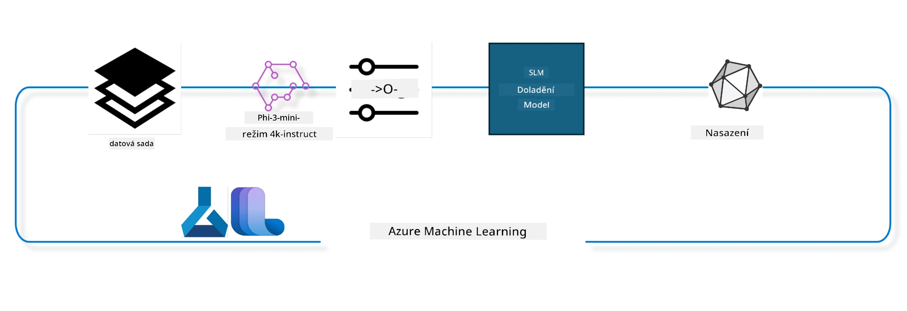

## Jak používat komponenty chat-completion ze systémového registru Azure ML k doladění modelu

V tomto příkladu budeme provádět doladění modelu Phi-3-mini-4k-instruct pro dokončení konverzace mezi 2 lidmi pomocí datasetu ultrachat_200k.



Příklad vám ukáže, jak provést doladění pomocí Azure ML SDK a Pythonu a poté nasadit doladěný model na online endpoint pro inference v reálném čase.

### Výcviková data

Použijeme dataset ultrachat_200k. Toto je silně filtrovaná verze datasetu UltraChat a byl použit k tréninku modelu Zephyr-7B-β, špičkového 7b chat modelu.

### Model

Použijeme model Phi-3-mini-4k-instruct, abychom ukázali, jak uživatel může doladit model pro úlohu chat-completion. Pokud jste tento notebook otevřeli z konkrétní karty modelu, nezapomeňte nahradit konkrétní název modelu.

### Úkoly

- Vybrat model k doladění.
- Vybrat a prozkoumat tréninková data.
- Nakonfigurovat úlohu doladění.
- Spustit úlohu doladění.
- Zkontrolovat metriky tréninku a vyhodnocení.
- Registrovat doladěný model.
- Nasadit doladěný model pro inference v reálném čase.
- Uklidit zdroje.

## 1. Nastavení předpokladů

- Nainstalovat závislosti
- Připojit se k AzureML Workspace. Více informací najdete v nastavení autentizace SDK. Nahraďte <WORKSPACE_NAME>, <RESOURCE_GROUP> a <SUBSCRIPTION_ID> níže.
- Připojit se k systémovému registru Azureml
- Nastavit volitelný název experimentu
- Zkontrolovat nebo vytvořit výpočetní prostředek.

> [!NOTE]
> Požadavky: Jeden GPU uzel může mít více GPU karet. Například v jednom uzlu Standard_NC24rs_v3 jsou 4 NVIDIA V100 GPU, zatímco ve Standard_NC12s_v3 jsou 2 NVIDIA V100 GPU. Viz dokumentace pro tyto informace. Počet GPU karet na uzel je nastaven v parametru gpus_per_node níže. Správné nastavení této hodnoty zajistí využití všech GPU v uzlu. Doporučené GPU výpočetní typy lze nalézt zde a zde.

### Python knihovny

Nainstalujte závislosti spuštěním níže uvedeného bloku. Toto není volitelný krok při spuštění v novém prostředí.

```bash
pip install azure-ai-ml
pip install azure-identity
pip install datasets==2.9.0
pip install mlflow
pip install azureml-mlflow
```

### Interakce s Azure ML

1. Tento Python skript slouží k interakci se službou Azure Machine Learning (Azure ML). Zde je přehled, co dělá:

    - Importuje potřebné moduly z balíčků azure.ai.ml, azure.identity a azure.ai.ml.entities. Také importuje modul time.

    - Pokouší se autentizovat pomocí DefaultAzureCredential(), která poskytuje zjednodušený autentizační zážitek pro rychlý start vývoje aplikací v Azure cloudu. Pokud to selže, použije InteractiveBrowserCredential(), která poskytuje interaktivní přihlašovací prompt.

    - Poté se pokouší vytvořit instanci MLClient pomocí metody from_config, která načítá konfiguraci z výchozího konfiguračního souboru (config.json). Pokud to selže, vytvoří instanci MLClient manuálním zadáním subscription_id, resource_group_name a workspace_name.

    - Vytvoří další instanci MLClient tentokrát pro Azure ML registr nazvaný "azureml". Tento registr slouží k ukládání modelů, pipeline doladění a prostředí.

    - Nastaví experiment_name na "chat_completion_Phi-3-mini-4k-instruct".

    - Vygeneruje unikátní časové razítko převodem aktuálního času (v sekundách od epochy, jako desetinné číslo) na celé číslo a poté na řetězec. Toto časové razítko může být použito pro vytváření unikátních jmen a verzí.

    ```python
    # Importujte potřebné moduly z Azure ML a Azure Identity
    from azure.ai.ml import MLClient
    from azure.identity import (
        DefaultAzureCredential,
        InteractiveBrowserCredential,
    )
    from azure.ai.ml.entities import AmlCompute
    import time  # Importujte modul time
    
    # Pokuste se autentizovat pomocí DefaultAzureCredential
    try:
        credential = DefaultAzureCredential()
        credential.get_token("https://management.azure.com/.default")
    except Exception as ex:  # Pokud DefaultAzureCredential selže, použijte InteractiveBrowserCredential
        credential = InteractiveBrowserCredential()
    
    # Pokuste se vytvořit instanci MLClient pomocí výchozího konfiguračního souboru
    try:
        workspace_ml_client = MLClient.from_config(credential=credential)
    except:  # Pokud to selže, vytvořte instanci MLClient ručním zadáním údajů
        workspace_ml_client = MLClient(
            credential,
            subscription_id="<SUBSCRIPTION_ID>",
            resource_group_name="<RESOURCE_GROUP>",
            workspace_name="<WORKSPACE_NAME>",
        )
    
    # Vytvořte další instanci MLClient pro Azure ML registr s názvem "azureml"
    # Tento registr je místo, kde jsou uloženy modely, ladicí pipeline a prostředí
    registry_ml_client = MLClient(credential, registry_name="azureml")
    
    # Nastavte název experimentu
    experiment_name = "chat_completion_Phi-3-mini-4k-instruct"
    
    # Vygenerujte jedinečný časový údaj, který lze použít pro názvy a verze, které musí být jedinečné
    timestamp = str(int(time.time()))
    ```

## 2. Vyberte základní model k doladění

1. Phi-3-mini-4k-instruct je model s 3,8 miliardami parametrů, lehký, špičkový otevřený model založený na datasetech použitých pro Phi-2. Model patří do rodiny modelů Phi-3 a verze Mini je dostupná ve dvou variantách 4K a 128K, což je délka kontextu (v tokenech), kterou dokáže podporovat. Model je potřeba doladit pro náš konkrétní účel. Tyto modely můžete prohlížet v Katalogu modelů v AzureML Studiu, filtrující podle úlohy chat-completion. V tomto příkladu používáme model Phi-3-mini-4k-instruct. Pokud máte otevřený tento notebook pro jiný model, nahraďte prosím název a verzi modelu podle potřeby.

> [!NOTE]
> vlastnost model_id modelu. Ta bude předána jako vstup do úlohy doladění. Je dostupná také jako Asset ID pole na stránce detailů modelu v Katalogu modelů AzureML Studia.

2. Tento Python skript interaguje se službou Azure Machine Learning (Azure ML). Zde je přehled, co dělá:

    - Nastaví model_name na "Phi-3-mini-4k-instruct".

    - Používá metodu get z vlastnosti models objektu registry_ml_client pro získání nejnovější verze modelu s tímto názvem ze systému Azure ML registry. Metoda get je volána se dvěma argumenty: názvem modelu a štítkem, který specifikuje, že má být získána nejnovější verze modelu.

    - Vypíše na konzoli zprávu uvádějící název, verzi a id modelu, který bude použit pro doladění. Metoda format řetězce používá hodnoty name, version a id objektu foundation_model.

    ```python
    # Nastavte jméno modelu
    model_name = "Phi-3-mini-4k-instruct"
    
    # Získejte nejnovější verzi modelu z registru Azure ML
    foundation_model = registry_ml_client.models.get(model_name, label="latest")
    
    # Vytiskněte jméno modelu, verzi a ID
    # Tyto informace jsou užitečné pro sledování a ladění
    print(
        "\n\nUsing model name: {0}, version: {1}, id: {2} for fine tuning".format(
            foundation_model.name, foundation_model.version, foundation_model.id
        )
    )
    ```

## 3. Vytvořte výpočetní prostředek, který bude použit pro úlohu

Úloha doladění funguje POUZE s GPU výpočetním prostředkem. Velikost výpočetního prostředku závisí na velikosti modelu a ve většině případů je obtížné vybrat správný výpočetní prostředek pro úlohu. V tomto bloku uživatele navedeme, jak vybrat správný výpočetní prostředek.

> [!NOTE]
> Níže vyjmenované výpočetní prostředky pracují s nejoptimalizovanější konfigurací. Jakékoliv změny konfigurace mohou vést k chybě Cuda Out Of Memory. V takovém případě se pokuste upgradovat výpočetní prostředek na větší velikost.

> [!NOTE]
> Při výběru compute_cluster_size níže se ujistěte, že výpočetní prostředek je dostupný ve vaší resource group. Pokud není, můžete požádat o přístup k výpočetním zdrojům.

### Kontrola podpory doladění modelu

1. Tento Python skript interaguje s modelem Azure Machine Learning (Azure ML). Zde je přehled, co dělá:

    - Importuje modul ast, který poskytuje funkce pro zpracování stromů abstraktní syntaxe Pythonu.

    - Kontroluje, zda objekt foundation_model (který představuje model v Azure ML) má štítek s názvem finetune_compute_allow_list. Štítky v Azure ML jsou klíč-hodnota páry, které můžete vytvářet a používat k filtrování a řazení modelů.

    - Pokud je štítek finetune_compute_allow_list přítomen, použije funkci ast.literal_eval pro bezpečné převod hodnoty štítku (řetězce) do Python seznamu. Tento seznam je přiřazen k proměnné computes_allow_list. Poté vypíše zprávu, že by měl být vytvořen výpočetní prostředek ze seznamu.

    - Pokud štítek finetune_compute_allow_list chybí, nastaví computes_allow_list na None a vypíše zprávu, že štítek není součástí štítků modelu.

    - Shrnutí: tento skript kontroluje specifický štítek v metadatech modelu, pokud existuje, převádí jeho hodnotu na seznam a podle toho informuje uživatele.

    ```python
    # Importujte modul ast, který poskytuje funkce pro zpracování stromů abstraktní syntaxové gramatiky Pythonu
    import ast
    
    # Zkontrolujte, zda je v tagech modelu přítomen tag 'finetune_compute_allow_list'
    if "finetune_compute_allow_list" in foundation_model.tags:
        # Pokud je tag přítomen, použijte ast.literal_eval pro bezpečné zpracování hodnoty tagu (řetězce) na Python seznam
        computes_allow_list = ast.literal_eval(
            foundation_model.tags["finetune_compute_allow_list"]
        )  # převést řetězec na Python seznam
        # Vytiskněte zprávu indikující, že by měl být vytvořen compute ze seznamu
        print(f"Please create a compute from the above list - {computes_allow_list}")
    else:
        # Pokud tag není přítomen, nastavte computes_allow_list na None
        computes_allow_list = None
        # Vytiskněte zprávu indikující, že tag 'finetune_compute_allow_list' není součástí tagů modelu
        print("`finetune_compute_allow_list` is not part of model tags")
    ```

### Kontrola Compute Instance

1. Tento Python skript interaguje se službou Azure Machine Learning (Azure ML) a provádí několik kontrol na výpočetní instanci. Zde je přehled, co dělá:

    - Pokouší se získat výpočetní instanci se jménem uloženým v proměnné compute_cluster z Azure ML workspace. Pokud je stav provisioning této instance "failed", vyvolá ValueError.

    - Kontroluje, zda computes_allow_list není None. Pokud není, převede všechny velikosti výpočetních prostředků ve seznamu na malá písmena a ověří, zda je velikost aktuální výpočetní instance v tomto seznamu. Pokud není, vyvolá ValueError.

    - Pokud je computes_allow_list None, zkontroluje, zda velikost výpočetní instance není v seznamu nepodporovaných velikostí GPU VM. Pokud ano, vyvolá ValueError.

    - Získá seznam všech dostupných velikostí compute ve workspace. Poté iteruje přes tento seznam, a pro každou velikost ověří, zda její jméno odpovídá velikosti aktuální compute instance. Pokud ano, získá počet GPU pro tuto velikost a nastaví gpu_count_found na True.

    - Pokud je gpu_count_found True, vypíše počet GPU na výpočetní instanci. V opačném případě vyvolá ValueError.

    - Shrnutí: skript provádí několik kontrol na výpočetní instanci v Azure ML workspace, včetně stavu provisioning, velikosti vůči povolenému/nepovolenému seznamu a počtu GPU.

    ```python
    # Vytiskněte zprávu výjimky
    print(e)
    # Vyvolejte ValueError, pokud velikost výpočetního výkonu není dostupná v pracovním prostoru
    raise ValueError(
        f"WARNING! Compute size {compute_cluster_size} not available in workspace"
    )
    
    # Získejte výpočetní instanci z pracovního prostoru Azure ML
    compute = workspace_ml_client.compute.get(compute_cluster)
    # Zkontrolujte, zda stav provisioning výpočetní instance je "failed"
    if compute.provisioning_state.lower() == "failed":
        # Vyvolejte ValueError, pokud je stav provisioning "failed"
        raise ValueError(
            f"Provisioning failed, Compute '{compute_cluster}' is in failed state. "
            f"please try creating a different compute"
        )
    
    # Zkontrolujte, zda není computes_allow_list None
    if computes_allow_list is not None:
        # Převést všechny velikosti výpočetního výkonu v computes_allow_list na malá písmena
        computes_allow_list_lower_case = [x.lower() for x in computes_allow_list]
        # Zkontrolujte, zda je velikost výpočetní instance v computes_allow_list_lower_case
        if compute.size.lower() not in computes_allow_list_lower_case:
            # Vyvolejte ValueError, pokud velikost výpočetní instance není v computes_allow_list_lower_case
            raise ValueError(
                f"VM size {compute.size} is not in the allow-listed computes for finetuning"
            )
    else:
        # Definujte seznam nepodporovaných velikostí GPU VM
        unsupported_gpu_vm_list = [
            "standard_nc6",
            "standard_nc12",
            "standard_nc24",
            "standard_nc24r",
        ]
        # Zkontrolujte, zda je velikost výpočetní instance v unsupported_gpu_vm_list
        if compute.size.lower() in unsupported_gpu_vm_list:
            # Vyvolejte ValueError, pokud je velikost výpočetní instance v unsupported_gpu_vm_list
            raise ValueError(
                f"VM size {compute.size} is currently not supported for finetuning"
            )
    
    # Inicializujte příznak pro kontrolu, zda byl nalezen počet GPU ve výpočetní instanci
    gpu_count_found = False
    # Získejte seznam všech dostupných velikostí výpočetního výkonu v pracovním prostoru
    workspace_compute_sku_list = workspace_ml_client.compute.list_sizes()
    available_sku_sizes = []
    # Iterujte přes seznam dostupných velikostí výpočetního výkonu
    for compute_sku in workspace_compute_sku_list:
        available_sku_sizes.append(compute_sku.name)
        # Zkontrolujte, zda název velikosti výpočetního výkonu odpovídá velikosti výpočetní instance
        if compute_sku.name.lower() == compute.size.lower():
            # Pokud ano, získejte počet GPU pro tuto velikost výpočetního výkonu a nastavte gpu_count_found na True
            gpus_per_node = compute_sku.gpus
            gpu_count_found = True
    # Pokud je gpu_count_found True, vytiskněte počet GPU ve výpočetní instanci
    if gpu_count_found:
        print(f"Number of GPU's in compute {compute.size}: {gpus_per_node}")
    else:
        # Pokud je gpu_count_found False, vyvolejte ValueError
        raise ValueError(
            f"Number of GPU's in compute {compute.size} not found. Available skus are: {available_sku_sizes}."
            f"This should not happen. Please check the selected compute cluster: {compute_cluster} and try again."
        )
    ```

## 4. Vyberte dataset pro doladění modelu

1. Používáme dataset ultrachat_200k. Dataset má čtyři části, vhodné pro Supervised fine-tuning (sft).
Generační hodnocení (gen). Počet příkladů v jednotlivých částech je uveden následovně:

    ```bash
    train_sft test_sft  train_gen  test_gen
    207865  23110  256032  28304
    ```

1. Následující buňky ukazují základní přípravu dat pro doladění:

### Vizualizace několika řádků dat

Chceme, aby se tato ukázka spustila rychle, proto uložíme soubory train_sft, test_sft obsahující 5 % již ořezaných řádků. To znamená, že doladěný model bude mít nižší přesnost, proto by neměl být použit v reálném nasazení.
download-dataset.py slouží ke stažení datasetu ultrachat_200k a transformaci datasetu do formátu, který komponenta pipeline pro doladění může konzumovat. Dataset je velmi rozsáhlý, proto zde máme pouze část.

1. Spuštěním níže uvedeného skriptu se stáhne pouze 5 % dat. Toto lze zvýšit změnou parametru dataset_split_pc na požadované procento.

> [!NOTE]
> Některé jazykové modely mají odlišné jazykové kódy, tudíž názvy sloupců v datasetu by měly odpovídat těmto kódům.

1. Zde je příklad, jak by data měla vypadat
Dataset chat-completion je uložen v parquet formátu, kde každý záznam odpovídá následující schématu:

    - Jedná se o JSON (JavaScript Object Notation) dokument, což je populární formát pro výměnu dat. Není to spustitelný kód, ale způsob uložení a přenosu dat. Zde je rozbor jeho struktury:

    - "prompt": Tento klíč drží textový řetězec, který představuje úkol nebo otázku položenou AI asistentovi.

    - "messages": Tento klíč drží pole objektů. Každý objekt představuje zprávu v konverzaci mezi uživatelem a AI asistentem. Každý objekt zprávy má dva klíče:

    - "content": Drží textový řetězec obsahující obsah zprávy.
    - "role": Drží textový řetězec označující roli entity, která zprávu poslala. Může to být "user" nebo "assistant".
    - "prompt_id": Drží jedinečný identifikátor promptu jako textový řetězec.

1. V tomto konkrétním JSON dokumentu je zobrazena konverzace, kde uživatel žádá AI asistenta, aby vytvořil protagonistu pro dystopický příběh. Asistent odpovídá a uživatel pak žádá o další podrobnosti. Asistent souhlasí s poskytnutím více detailů. Celá konverzace je spojena s konkrétním prompt_id.

    ```python
    {
        // The task or question posed to an AI assistant
        "prompt": "Create a fully-developed protagonist who is challenged to survive within a dystopian society under the rule of a tyrant. ...",
        
        // An array of objects, each representing a message in a conversation between a user and an AI assistant
        "messages":[
            {
                // The content of the user's message
                "content": "Create a fully-developed protagonist who is challenged to survive within a dystopian society under the rule of a tyrant. ...",
                // The role of the entity that sent the message
                "role": "user"
            },
            {
                // The content of the assistant's message
                "content": "Name: Ava\n\n Ava was just 16 years old when the world as she knew it came crashing down. The government had collapsed, leaving behind a chaotic and lawless society. ...",
                // The role of the entity that sent the message
                "role": "assistant"
            },
            {
                // The content of the user's message
                "content": "Wow, Ava's story is so intense and inspiring! Can you provide me with more details.  ...",
                // The role of the entity that sent the message
                "role": "user"
            }, 
            {
                // The content of the assistant's message
                "content": "Certainly! ....",
                // The role of the entity that sent the message
                "role": "assistant"
            }
        ],
        
        // A unique identifier for the prompt
        "prompt_id": "d938b65dfe31f05f80eb8572964c6673eddbd68eff3db6bd234d7f1e3b86c2af"
    }
    ```

### Stažení dat

1. Tento Python skript slouží ke stažení datasetu pomocí pomocného skriptu download-dataset.py. Zde je, co dělá:

    - Importuje modul os, který poskytuje přenositelné funkce pro práci s operačním systémem.

    - Používá funkci os.system ke spuštění skriptu download-dataset.py v shellu s konkrétními argumenty příkazové řádky. Argumenty specifikují dataset ke stažení (HuggingFaceH4/ultrachat_200k), adresář, kam se má stáhnout (ultrachat_200k_dataset), a procento dat ke stažení (5). Funkce os.system vrací stav ukončení příkazu; tato hodnota je uložena do proměnné exit_status.

    - Kontroluje, zda exit_status není 0. V Unixových systémech obvykle znamená 0 úspěšné vykonání příkazu, jiná hodnota značí chybu. Pokud exit_status není 0, vyvolá výjimku Exception s hlášením o chybě při stahování datasetu.

    - Shrnutí: tento skript spouští příkaz ke stažení datasetu pomocí pomocného skriptu a v případě chyby vyvolá výjimku.

    ```python
    # Importujte modul os, který poskytuje způsob použití funkcí závislých na operačním systému
    import os
    
    # Použijte funkci os.system k spuštění skriptu download-dataset.py v shellu se specifickými argumenty příkazového řádku
    # Argumenty specifikují dataset ke stažení (HuggingFaceH4/ultrachat_200k), adresář, kam se má stáhnout (ultrachat_200k_dataset), a procento datasetu k rozdělení (5)
    # Funkce os.system vrací stav ukončení příkazu, který spustila; tento stav je uložen v proměnné exit_status
    exit_status = os.system(
        "python ./download-dataset.py --dataset HuggingFaceH4/ultrachat_200k --download_dir ultrachat_200k_dataset --dataset_split_pc 5"
    )
    
    # Zkontrolujte, zda exit_status není 0
    # V unixových operačních systémech obvykle stav ukončení 0 znamená, že příkaz byl úspěšný, zatímco jakékoli jiné číslo značí chybu
    # Pokud exit_status není 0, vyvolejte výjimku s hlášením, že došlo k chybě při stahování datasetu
    if exit_status != 0:
        raise Exception("Error downloading dataset")
    ```

### Načtení dat do DataFrame
1. Tento Python skript načítá soubor ve formátu JSON Lines do pandas DataFrame a zobrazuje prvních 5 řádků. Zde je rozpis, co dělá:

    - Importuje knihovnu pandas, která je výkonnou knihovnou pro manipulaci s daty a jejich analýzu.

    - Nastavuje maximální šířku sloupce pro zobrazení pandas na 0. To znamená, že při výpisu DataFrame se celý text každého sloupce zobrazí bez ořezání.

    - Používá funkci pd.read_json pro načtení souboru train_sft.jsonl z adresáře ultrachat_200k_dataset do DataFrame. Argument lines=True označuje, že soubor je ve formátu JSON Lines, kde každý řádek je samostatný JSON objekt.

    - Používá metodu head k zobrazení prvních 5 řádků DataFrame. Pokud má DataFrame méně než 5 řádků, zobrazí všechny.

    - Ve shrnutí, tento skript načítá soubor ve formátu JSON Lines do DataFrame a zobrazuje prvních 5 řádků s celým textem sloupců.
    
    ```python
    # Importujte knihovnu pandas, která je výkonnou knihovnou pro manipulaci a analýzu dat
    import pandas as pd
    
    # Nastavte maximální šířku sloupce v možnostech zobrazení pandas na 0
    # To znamená, že celý text každého sloupce bude zobrazen bez oříznutí při tisku DataFrame
    pd.set_option("display.max_colwidth", 0)
    
    # Použijte funkci pd.read_json k načtení souboru train_sft.jsonl z adresáře ultrachat_200k_dataset do DataFrame
    # Argument lines=True označuje, že soubor je ve formátu JSON Lines, kde každý řádek je samostatný JSON objekt
    df = pd.read_json("./ultrachat_200k_dataset/train_sft.jsonl", lines=True)
    
    # Použijte metodu head k zobrazení prvních 5 řádků DataFrame
    # Pokud má DataFrame méně než 5 řádků, zobrazí všechny z nich
    df.head()
    ```

## 5. Odeslat úlohu finetuningu s modelem a daty jako vstupy

Vytvořte úlohu, která používá komponentu pipeline pro dokončování chatu. Naučte se více o všech parametrech podporovaných pro finetuning.

### Definice parametrů finetuningu

1. Parametry finetuningu lze rozdělit do 2 kategorií - parametry trénování, parametry optimalizace

1. Parametry trénování definují aspekty tréninku, jako například -

    - Optimalizátor, scheduler, který se použije
    - Metriku pro optimalizaci finetuningu
    - Počet trénovacích kroků, velikost batch a tak dále
    - Parametry optimalizace pomáhají optimalizovat paměť GPU a efektivně využívat výpočetní zdroje. 

1. Níže jsou některé z parametrů, které patří do této kategorie. Parametry optimalizace se liší pro každý model a jsou zabaleny s modelem, aby zvládaly tyto rozdíly.

    - Zapnutí deepspeed a LoRA
    - Zapnutí tréninku s smíšenou přesností
    - Zapnutí multuzlového tréninku

> [!NOTE]
> Supervised finetuning může vést ke ztrátě zarovnání nebo katastrofickému zapomenutí. Doporučujeme zkontrolovat tento problém a po finetuningu spustit fázi zarovnání.

### Parametry finetuningu

1. Tento Python skript nastavuje parametry pro finetuning modelu strojového učení. Zde je rozpis jeho funkcí:

    - Nastavuje výchozí parametry tréninku jako počet epoch, velikost batch pro trénink i evaluaci, rychlost učení a typ scheduleru rychlosti učení.

    - Nastavuje výchozí parametry optimalizace, jako je použití Layer-wise Relevance Propagation (LoRa) a DeepSpeed, a fázi DeepSpeed.

    - Kombinuje parametry tréninku a optimalizace do jednoho slovníku nazvaného finetune_parameters.

    - Kontroluje, zda foundation_model má nějaké model-specifické výchozí parametry. Pokud ano, vypíše varovnou zprávu a aktualizuje slovník finetune_parameters těmito parametry. Funkce ast.literal_eval se používá k převodu výchozích model-specifických parametrů ze stringu na Python slovník.

    - Vypisuje finální sadu parametrů finetuningu, které budou použity při běhu.

    - Ve shrnutí, tento skript nastavuje a zobrazuje parametry pro finetuning modelu strojového učení s možností přepsání výchozích parametrů model-specifickými.

    ```python
    # Nastavte výchozí parametry tréninku, jako je počet epoch tréninku, velikosti batchů pro trénink a vyhodnocení, učící rychlost a typ plánovače učící rychlosti
    training_parameters = dict(
        num_train_epochs=3,
        per_device_train_batch_size=1,
        per_device_eval_batch_size=1,
        learning_rate=5e-6,
        lr_scheduler_type="cosine",
    )
    
    # Nastavte výchozí parametry optimalizace, jako je použití Layer-wise Relevance Propagation (LoRa) a DeepSpeed, a stupeň DeepSpeed
    optimization_parameters = dict(
        apply_lora="true",
        apply_deepspeed="true",
        deepspeed_stage=2,
    )
    
    # Sloučte parametry tréninku a optimalizace do jednoho slovníku nazvaného finetune_parameters
    finetune_parameters = {**training_parameters, **optimization_parameters}
    
    # Zkontrolujte, zda foundation_model má nějaké model-specifické výchozí parametry
    # Pokud ano, vytiskněte varovnou zprávu a aktualizujte slovník finetune_parameters těmito model-specifickými výchozími hodnotami
    # Funkce ast.literal_eval se používá k převodu model-specifických výchozích hodnot ze stringu na Python slovník
    if "model_specific_defaults" in foundation_model.tags:
        print("Warning! Model specific defaults exist. The defaults could be overridden.")
        finetune_parameters.update(
            ast.literal_eval(  # převést řetězec na python slovník
                foundation_model.tags["model_specific_defaults"]
            )
        )
    
    # Vytiskněte konečnou sadu parametrů doladění, které budou použity pro běh
    print(
        f"The following finetune parameters are going to be set for the run: {finetune_parameters}"
    )
    ```

### Trénovací pipeline

1. Tento Python skript definuje funkci pro generování zobrazovaného jména pro tréninkovou pipeline modelu strojového učení a poté tuto funkci volá, aby jméno vytvořil a vytiskl. Zde je rozpis, co dělá:

1. Je definována funkce get_pipeline_display_name, která vytváří zobrazované jméno na základě různých parametrů týkajících se tréninkové pipeline.

1. Uvnitř funkce vypočítá celkovou velikost batch vynásobením velikosti batch na zařízení, počtu kroků akumulace gradientu, počtu GPU na uzel a počtu uzlů používaných pro finetuning.

1. Získává další parametry jako typ scheduleru rychlosti učení, zda je použit DeepSpeed, fázi DeepSpeed, zda je použit LoRa, limit počtu uchovávaných checkpointů a maximální délku sekvence.

1. Sestaví řetězec, který zahrnuje všechny tyto parametry, oddělené pomlčkami. Pokud je použit DeepSpeed nebo LoRa, řetězec obsahuje "ds" následované fází DeepSpeed, nebo "lora". Pokud ne, obsahuje "nods" nebo "nolora".

1. Funkce vrací tento řetězec, který slouží jako zobrazované jméno tréninkové pipeline.

1. Po definici funkce je volána, aby vygenerovala zobrazované jméno, které je následně vytištěno.

1. Ve shrnutí, tento skript generuje zobrazované jméno tréninkové pipeline modelu strojového učení založené na různých parametrech a poté toto jméno vytiskne.

    ```python
    # Definujte funkci pro generování zobrazovaného jména pro tréninkový proces
    def get_pipeline_display_name():
        # Vypočítejte celkovou velikost batche vynásobením velikosti batche na jedno zařízení, počtu kroků akumulace gradientu, počtu GPU na uzel a počtu uzlů použitých pro doladění
        batch_size = (
            int(finetune_parameters.get("per_device_train_batch_size", 1))
            * int(finetune_parameters.get("gradient_accumulation_steps", 1))
            * int(gpus_per_node)
            * int(finetune_parameters.get("num_nodes_finetune", 1))
        )
        # Získejte typ plánovače učící rychlosti
        scheduler = finetune_parameters.get("lr_scheduler_type", "linear")
        # Zjistěte, zda je aplikován DeepSpeed
        deepspeed = finetune_parameters.get("apply_deepspeed", "false")
        # Získejte fázi DeepSpeed
        ds_stage = finetune_parameters.get("deepspeed_stage", "2")
        # Pokud je DeepSpeed aplikován, zahrňte do zobrazovaného jména "ds" následované fází DeepSpeed; pokud ne, zahrňte "nods"
        if deepspeed == "true":
            ds_string = f"ds{ds_stage}"
        else:
            ds_string = "nods"
        # Zjistěte, zda je aplikována vrstvená relevance propagace (LoRa)
        lora = finetune_parameters.get("apply_lora", "false")
        # Pokud je LoRa aplikována, zahrňte do zobrazovaného jména "lora"; pokud ne, zahrňte "nolora"
        if lora == "true":
            lora_string = "lora"
        else:
            lora_string = "nolora"
        # Získejte limit počtu ukládaných kontrolních bodů modelu
        save_limit = finetune_parameters.get("save_total_limit", -1)
        # Získejte maximální délku sekvence
        seq_len = finetune_parameters.get("max_seq_length", -1)
        # Sestavte zobrazované jméno spojením všech těchto parametrů oddělených pomlčkami
        return (
            model_name
            + "-"
            + "ultrachat"
            + "-"
            + f"bs{batch_size}"
            + "-"
            + f"{scheduler}"
            + "-"
            + ds_string
            + "-"
            + lora_string
            + f"-save_limit{save_limit}"
            + f"-seqlen{seq_len}"
        )
    
    # Zavolejte funkci pro generování zobrazovaného jména
    pipeline_display_name = get_pipeline_display_name()
    # Vytiskněte zobrazované jméno
    print(f"Display name used for the run: {pipeline_display_name}")
    ```

### Konfigurace pipeline

Tento Python skript definuje a konfiguruje pipeline strojového učení pomocí Azure Machine Learning SDK. Zde je rozpis, co dělá:

1. Importuje potřebné moduly z Azure AI ML SDK.

1. Načítá komponentu pipeline s názvem "chat_completion_pipeline" ze registru.

1. Definuje pipeline job pomocí dekorátoru `@pipeline` a funkce `create_pipeline`. Název pipeline je nastaven na `pipeline_display_name`.

1. Uvnitř funkce `create_pipeline` inicializuje načtenou komponentu pipeline s různými parametry, včetně cesty k modelu, výpočetních clusterů pro různé fáze, datasetů pro trénink a testování, počtu GPU pro finetuning a dalších parametrů finetuningu.

1. Mapuje výstup úlohy finetuningu na výstup pipeline jobu. To se dělá proto, aby bylo možné snadno registrovat finetunovaný model, což je požadováno pro nasazení modelu na online nebo batch endpoint.

1. Vytváří instanci pipeline zavoláním funkce `create_pipeline`.

1. Nastavuje nastavení `force_rerun` pipeline na `True`, což znamená, že nebudou použity cachované výsledky z předchozích úloh.

1. Nastavuje nastavení `continue_on_step_failure` pipeline na `False`, tedy pipeline se zastaví, pokud některý krok selže.

1. Ve shrnutí, tento skript definuje a konfiguruje pipeline strojového učení pro úlohu dokončování chatu pomocí Azure Machine Learning SDK.

    ```python
    # Importujte potřebné moduly ze SDK Azure AI ML
    from azure.ai.ml.dsl import pipeline
    from azure.ai.ml import Input
    
    # Získejte komponentu pipeline s názvem "chat_completion_pipeline" z registru
    pipeline_component_func = registry_ml_client.components.get(
        name="chat_completion_pipeline", label="latest"
    )
    
    # Definujte úlohu pipeline pomocí dekorátoru @pipeline a funkce create_pipeline
    # Název pipeline je nastaven na pipeline_display_name
    @pipeline(name=pipeline_display_name)
    def create_pipeline():
        # Inicializujte získanou komponentu pipeline s různými parametry
        # To zahrnuje cestu k modelu, výpočetní klastry pro různé fáze, rozdělení datasetu pro trénink a testování, počet GPU pro doladění a další parametry doladění
        chat_completion_pipeline = pipeline_component_func(
            mlflow_model_path=foundation_model.id,
            compute_model_import=compute_cluster,
            compute_preprocess=compute_cluster,
            compute_finetune=compute_cluster,
            compute_model_evaluation=compute_cluster,
            # Namapujte rozdělení datasetu na parametry
            train_file_path=Input(
                type="uri_file", path="./ultrachat_200k_dataset/train_sft.jsonl"
            ),
            test_file_path=Input(
                type="uri_file", path="./ultrachat_200k_dataset/test_sft.jsonl"
            ),
            # Nastavení tréninku
            number_of_gpu_to_use_finetuning=gpus_per_node,  # Nastaveno na počet dostupných GPU ve výpočetním prostředí
            **finetune_parameters
        )
        return {
            # Namapujte výstup úlohy doladění na výstup úlohy pipeline
            # Toto se provádí, aby bylo možné snadno zaregistrovat doladěný model
            # Registrace modelu je vyžadována pro nasazení modelu do online nebo dávkového endpointu
            "trained_model": chat_completion_pipeline.outputs.mlflow_model_folder
        }
    
    # Vytvořte instanci pipeline zavoláním funkce create_pipeline
    pipeline_object = create_pipeline()
    
    # Nepoužívejte uložené výsledky z předchozích úloh
    pipeline_object.settings.force_rerun = True
    
    # Nastavte pokračování při selhání kroku na False
    # To znamená, že pipeline se zastaví, pokud některý krok selže
    pipeline_object.settings.continue_on_step_failure = False
    ```

### Odeslat úlohu

1. Tento Python skript odesílá úlohu pipeline modelu strojového učení do Azure Machine Learning workspace a následně čeká na dokončení úlohy. Zde je rozpis, co dělá:

    - Volá metodu create_or_update objektu jobs ve workspace_ml_client, aby odeslal pipeline job. Pipeline, která má běžet, je specifikována objektem pipeline_object a experiment, v rámci kterého job běží, je určen názvem experiment_name.

    - Poté volá metodu stream objektu jobs ve workspace_ml_client, aby čekal na dokončení pipeline jobu. Úloha, na kterou čeká, je určená atributem name objektu pipeline_job.

    - Ve shrnutí, tento skript odesílá pipeline job modelu strojového učení do Azure Machine Learning workspace a čeká na jeho dokončení.

    ```python
    # Odešlete úlohu pipeline do pracovního prostoru Azure Machine Learning
    # Pipeline, která má být spuštěna, je specifikována objektem pipeline_object
    # Experiment, pod kterým je úloha spuštěna, je specifikován názvem experiment_name
    pipeline_job = workspace_ml_client.jobs.create_or_update(
        pipeline_object, experiment_name=experiment_name
    )
    
    # Počkejte na dokončení úlohy pipeline
    # Úloha, na kterou se čeká, je specifikována atributem name objektu pipeline_job
    workspace_ml_client.jobs.stream(pipeline_job.name)
    ```

## 6. Registrovat finetunovaný model do workspace

Registrovat budeme model z výstupu úlohy finetuningu. To umožní sledování souvislostí mezi finetunovaným modelem a úlohou finetuningu. Úloha finetuningu dále sleduje souvislosti ke foundation modelu, datům a trénovacímu kódu.

### Registrace ML modelu

1. Tento Python skript registruje model strojového učení, který byl vytrénován v pipeline Azure Machine Learning. Zde je rozpis, co dělá:

    - Importuje potřebné moduly z Azure AI ML SDK.

    - Kontroluje, zda je výstup trained_model dostupný z pipeline jobu voláním metody get objektu jobs ve workspace_ml_client a přístupem k atributu outputs.

    - Sestavuje cestu k vytrénovanému modelu formátováním řetězce s názvem pipeline jobu a názvem výstupu ("trained_model").

    - Definuje jméno finetunovaného modelu přidáním "-ultrachat-200k" k původnímu názvu modelu a nahrazením lomítek pomlčkami.

    - Připravuje registraci modelu vytvořením objektu Model s různými parametry, včetně cesty k modelu, typu modelu (MLflow model), jména a verze modelu a popisu modelu.

    - Registruje model voláním metody create_or_update objektu models ve workspace_ml_client s objektem Model jako argumentem.

    - Vypisuje registrovaný model.

1. Ve shrnutí, tento skript registruje model strojového učení, který byl vytrénován v Azure Machine Learning pipeline.

    ```python
    # Naimportujte potřebné moduly z Azure AI ML SDK
    from azure.ai.ml.entities import Model
    from azure.ai.ml.constants import AssetTypes
    
    # Zkontrolujte, zda je výstup `trained_model` k dispozici z pipeline jobu
    print("pipeline job outputs: ", workspace_ml_client.jobs.get(pipeline_job.name).outputs)
    
    # Vytvořte cestu k natrénovanému modelu formátováním řetězce s názvem pipeline jobu a názvem výstupu ("trained_model")
    model_path_from_job = "azureml://jobs/{0}/outputs/{1}".format(
        pipeline_job.name, "trained_model"
    )
    
    # Definujte název pro doladěný model připojením "-ultrachat-200k" k původnímu názvu modelu a nahrazením lomítek pomlčkami
    finetuned_model_name = model_name + "-ultrachat-200k"
    finetuned_model_name = finetuned_model_name.replace("/", "-")
    
    print("path to register model: ", model_path_from_job)
    
    # Připravte se na registraci modelu vytvořením objektu Model s různými parametry
    # Ty zahrnují cestu k modelu, typ modelu (MLflow model), název a verzi modelu a popis modelu
    prepare_to_register_model = Model(
        path=model_path_from_job,
        type=AssetTypes.MLFLOW_MODEL,
        name=finetuned_model_name,
        version=timestamp,  # Použijte časové razítko jako verzi, aby se předešlo konfliktu verzí
        description=model_name + " fine tuned model for ultrachat 200k chat-completion",
    )
    
    print("prepare to register model: \n", prepare_to_register_model)
    
    # Zaregistrujte model zavoláním metody create_or_update objektu models ve workspace_ml_client s objektem Model jako argumentem
    registered_model = workspace_ml_client.models.create_or_update(
        prepare_to_register_model
    )
    
    # Vytiskněte zaregistrovaný model
    print("registered model: \n", registered_model)
    ```

## 7. Nasadit finetunovaný model na online endpoint

Online endpointy poskytují trvalé REST API, které lze použít pro integraci s aplikacemi potřebujícími využívat model.

### Správa endpointu

1. Tento Python skript vytváří spravovaný online endpoint v Azure Machine Learning pro registrovaný model. Zde je rozpis, co dělá:

    - Importuje potřebné moduly z Azure AI ML SDK.

    - Definuje unikátní název online endpointu přidáním časové značky k řetězci "ultrachat-completion-".

    - Připravuje vytvoření online endpointu vytvořením objektu ManagedOnlineEndpoint s různými parametry, včetně názvu endpointu, popisu endpointu a režimu autentizace ("key").

    - Vytváří online endpoint voláním metody begin_create_or_update workspace_ml_client s objektem ManagedOnlineEndpoint jako argumentem, poté čeká na dokončení operace voláním metody wait.

1. Ve shrnutí, tento skript vytváří spravovaný online endpoint v Azure Machine Learning pro registrovaný model.

    ```python
    # Importujte nezbytné moduly ze sady Azure AI ML SDK
    from azure.ai.ml.entities import (
        ManagedOnlineEndpoint,
        ManagedOnlineDeployment,
        ProbeSettings,
        OnlineRequestSettings,
    )
    
    # Definujte jedinečný název pro online koncový bod připojením časové značky ke stringu "ultrachat-completion-"
    online_endpoint_name = "ultrachat-completion-" + timestamp
    
    # Připravte se na vytvoření online koncového bodu vytvořením objektu ManagedOnlineEndpoint s různými parametry
    # Mezi tyto parametry patří název koncového bodu, popis koncového bodu a způsob autentizace ("key")
    endpoint = ManagedOnlineEndpoint(
        name=online_endpoint_name,
        description="Online endpoint for "
        + registered_model.name
        + ", fine tuned model for ultrachat-200k-chat-completion",
        auth_mode="key",
    )
    
    # Vytvořte online koncový bod zavoláním metody begin_create_or_update klienta workspace_ml_client s objektem ManagedOnlineEndpoint jako argumentem
    # Poté počkejte na dokončení operace vytvoření zavoláním metody wait
    workspace_ml_client.begin_create_or_update(endpoint).wait()
    ```

> [!NOTE]
> Zde naleznete seznam SKU podporovaných pro nasazení - [Seznam SKU spravovaných online endpointů](https://learn.microsoft.com/azure/machine-learning/reference-managed-online-endpoints-vm-sku-list)

### Nasazení ML modelu

1. Tento Python skript nasazuje registrovaný model strojového učení na spravovaný online endpoint v Azure Machine Learning. Zde je rozpis, co dělá:

    - Importuje modul ast, který poskytuje funkce pro zpracování stromů abstraktní syntaxe Pythonu.

    - Nastavuje typ instance pro nasazení na "Standard_NC6s_v3".

    - Kontroluje, zda základní model (foundation model) obsahuje tag inference_compute_allow_list. Pokud ano, převádí hodnotu tagu ze stringu na Python seznam a přiřadí jej do inference_computes_allow_list. Pokud ne, nastaví inference_computes_allow_list na None.

    - Kontroluje, zda zadaný typ instance je na seznamu povolených. Pokud ne, vypíše zprávu, aby uživatel vybral typ instance ze seznamu povolených.

    - Připravuje vytvoření nasazení vytvořením objektu ManagedOnlineDeployment s různými parametry, včetně názvu nasazení, názvu endpointu, ID modelu, typu a počtu instancí, nastavení liveness probe a nastavení požadavků.

    - Vytváří nasazení voláním metody begin_create_or_update workspace_ml_client s objektem ManagedOnlineDeployment jako argumentem, poté čeká na dokončení voláním metody wait.

    - Nastavuje traffic endpointu, aby přesměroval 100 % provozu na nasazení "demo".

    - Aktualizuje endpoint voláním metody begin_create_or_update workspace_ml_client s objektem endpoint jako argumentem, poté čeká na dokončení voláním metody result.

1. Ve shrnutí, tento skript nasazuje registrovaný model strojového učení na spravovaný online endpoint v Azure Machine Learning.

    ```python
    # Importujte modul ast, který poskytuje funkce pro zpracování stromů abstraktního syntaktického gramatického jazyka Python
    import ast
    
    # Nastavte typ instance pro nasazení
    instance_type = "Standard_NC6s_v3"
    
    # Zkontrolujte, zda je v základním modelu přítomen štítek `inference_compute_allow_list`
    if "inference_compute_allow_list" in foundation_model.tags:
        # Pokud ano, převeďte hodnotu štítku ze stringu na Python seznam a přiřaďte ji do `inference_computes_allow_list`
        inference_computes_allow_list = ast.literal_eval(
            foundation_model.tags["inference_compute_allow_list"]
        )
        print(f"Please create a compute from the above list - {computes_allow_list}")
    else:
        # Pokud ne, nastavte `inference_computes_allow_list` na `None`
        inference_computes_allow_list = None
        print("`inference_compute_allow_list` is not part of model tags")
    
    # Zkontrolujte, zda je uvedený typ instance na povoleném seznamu
    if (
        inference_computes_allow_list is not None
        and instance_type not in inference_computes_allow_list
    ):
        print(
            f"`instance_type` is not in the allow listed compute. Please select a value from {inference_computes_allow_list}"
        )
    
    # Připravte se na vytvoření nasazení vytvořením objektu `ManagedOnlineDeployment` s různými parametry
    demo_deployment = ManagedOnlineDeployment(
        name="demo",
        endpoint_name=online_endpoint_name,
        model=registered_model.id,
        instance_type=instance_type,
        instance_count=1,
        liveness_probe=ProbeSettings(initial_delay=600),
        request_settings=OnlineRequestSettings(request_timeout_ms=90000),
    )
    
    # Vytvořte nasazení vyvoláním metody `begin_create_or_update` klienta `workspace_ml_client` s objektem `ManagedOnlineDeployment` jako argumentem
    # Poté počkejte na dokončení operace vytvoření vyvoláním metody `wait`
    workspace_ml_client.online_deployments.begin_create_or_update(demo_deployment).wait()
    
    # Nastavte provoz koncového bodu tak, aby 100 % provozu směřovalo na nasazení "demo"
    endpoint.traffic = {"demo": 100}
    
    # Aktualizujte koncový bod vyvoláním metody `begin_create_or_update` klienta `workspace_ml_client` s objektem `endpoint` jako argumentem
    # Poté počkejte na dokončení aktualizace vyvoláním metody `result`
    workspace_ml_client.begin_create_or_update(endpoint).result()
    ```

## 8. Testování endpointu se vzorovými daty

Načteme vzorová data z testovacího datasetu a odešleme je na online endpoint k inferenci. Poté zobrazíme vyhodnocené štítky vedle skutečných štítků.

### Čtení výsledků

1. Tento Python skript načítá soubor ve formátu JSON Lines do pandas DataFrame, náhodně vybere vzorek a resetuje index. Zde je rozpis, co dělá:

    - Načte soubor ./ultrachat_200k_dataset/test_gen.jsonl do pandas DataFrame. Funkce read_json se používá s argumentem lines=True, protože soubor je ve formátu JSON Lines, kde každý řádek je samostatný JSON objekt.

    - Náhodně vybere 1 řádek z DataFrame. Funkce sample se používá s argumentem n=1 pro specifikaci počtu náhodně vybraných řádků.

    - Resetuje index DataFrame. Funkce reset_index se používá s argumentem drop=True, aby byl původní index odstraněn a nahrazen novým indexem s výchozími celočíselnými hodnotami.

    - Zobrazí prvních 2 řádky DataFrame pomocí funkce head s argumentem 2. Protože DataFrame obsahuje po výběru pouze jeden řádek, zobrazí pouze tento jeden řádek.

1. Ve shrnutí, tento skript načítá JSON Lines soubor do pandas DataFrame, náhodně vybere 1 řádek, resetuje index a zobrazí první řádek.
    
    ```python
    # Importujte knihovnu pandas
    import pandas as pd
    
    # Načtěte soubor JSON Lines './ultrachat_200k_dataset/test_gen.jsonl' do pandas DataFrame
    # Argument 'lines=True' označuje, že soubor je ve formátu JSON Lines, kde každý řádek je samostatný JSON objekt
    test_df = pd.read_json("./ultrachat_200k_dataset/test_gen.jsonl", lines=True)
    
    # Vezměte náhodný vzorek 1 řádku z DataFrame
    # Argument 'n=1' určuje počet náhodných řádků k výběru
    test_df = test_df.sample(n=1)
    
    # Resetujte index DataFrame
    # Argument 'drop=True' označuje, že původní index by měl být odstraněn a nahrazen novým indexem s výchozími celočíselnými hodnotami
    # Argument 'inplace=True' označuje, že DataFrame by měl být upraven přímo (bez vytváření nového objektu)
    test_df.reset_index(drop=True, inplace=True)
    
    # Zobrazte prvních 2 řádky DataFrame
    # Protože DataFrame obsahuje po vzorkování pouze jeden řádek, zobrazí se pouze tento jeden řádek
    test_df.head(2)
    ```

### Vytvoření JSON objektu
1. Tento Python skript vytváří JSON objekt se specifickými parametry a ukládá ho do souboru. Zde je rozbor toho, co dělá:

    - Importuje modul json, který poskytuje funkce pro práci s JSON daty.

    - Vytváří slovník parameters s klíči a hodnotami, které představují parametry pro model strojového učení. Klíče jsou "temperature", "top_p", "do_sample" a "max_new_tokens" a jejich odpovídající hodnoty jsou 0.6, 0.9, True a 200.

    - Vytváří další slovník test_json se dvěma klíči: "input_data" a "params". Hodnota "input_data" je další slovník s klíči "input_string" a "parameters". Hodnota "input_string" je seznam obsahující první zprávu z DataFrame test_df. Hodnota "parameters" je dříve vytvořený slovník parameters. Hodnota "params" je prázdný slovník.

    - Otevírá soubor s názvem sample_score.json
    
    ```python
    # Importujte modul json, který poskytuje funkce pro práci s daty JSON
    import json
    
    # Vytvořte slovník `parameters` s klíči a hodnotami, které představují parametry pro model strojového učení
    # Klíče jsou "temperature", "top_p", "do_sample" a "max_new_tokens" a jejich odpovídající hodnoty jsou 0.6, 0.9, True a 200
    parameters = {
        "temperature": 0.6,
        "top_p": 0.9,
        "do_sample": True,
        "max_new_tokens": 200,
    }
    
    # Vytvořte další slovník `test_json` se dvěma klíči: "input_data" a "params"
    # Hodnota "input_data" je jiný slovník s klíči "input_string" a "parameters"
    # Hodnota "input_string" je seznam obsahující první zprávu z DataFrame `test_df`
    # Hodnota "parameters" je slovník `parameters`, který byl vytvořen dříve
    # Hodnota "params" je prázdný slovník
    test_json = {
        "input_data": {
            "input_string": [test_df["messages"][0]],
            "parameters": parameters,
        },
        "params": {},
    }
    
    # Otevřete soubor s názvem `sample_score.json` ve složce `./ultrachat_200k_dataset` v režimu zápisu
    with open("./ultrachat_200k_dataset/sample_score.json", "w") as f:
        # Zapište slovník `test_json` do souboru v JSON formátu pomocí funkce `json.dump`
        json.dump(test_json, f)
    ```

### Volání endpointu

1. Tento Python skript volá online endpoint v Azure Machine Learning, aby ohodnotil JSON soubor. Zde je rozbor toho, co dělá:

    - Volá metodu invoke vlastnosti online_endpoints objektu workspace_ml_client. Tato metoda se používá k odeslání požadavku na online endpoint a získání odpovědi.

    - Určuje název endpointu a nasazení pomocí argumentů endpoint_name a deployment_name. V tomto případě je název endpointu uložen v proměnné online_endpoint_name a název nasazení je "demo".

    - Určuje cestu k JSON souboru, který bude ohodnocen, pomocí argumentu request_file. V tomto případě je soubor ./ultrachat_200k_dataset/sample_score.json.

    - Ukládá odpověď z endpointu do proměnné response.

    - Vypisuje surovou odpověď.

1. Shrnutí: tento skript volá online endpoint v Azure Machine Learning, aby ohodnotil JSON soubor a vytiskl odpověď.

    ```python
    # Zavolejte online endpoint v Azure Machine Learning pro ohodnocení souboru `sample_score.json`
    # Metoda `invoke` vlastnosti `online_endpoints` objektu `workspace_ml_client` se používá k odeslání požadavku na online endpoint a získání odpovědi
    # Argument `endpoint_name` specifikuje název endpointu, který je uložen v proměnné `online_endpoint_name`
    # Argument `deployment_name` specifikuje název nasazení, který je "demo"
    # Argument `request_file` specifikuje cestu k JSON souboru, který má být ohodnocen, což je `./ultrachat_200k_dataset/sample_score.json`
    response = workspace_ml_client.online_endpoints.invoke(
        endpoint_name=online_endpoint_name,
        deployment_name="demo",
        request_file="./ultrachat_200k_dataset/sample_score.json",
    )
    
    # Vytiskněte surovou odpověď z endpointu
    print("raw response: \n", response, "\n")
    ```

## 9. Smazání online endpointu

1. Nezapomeňte smazat online endpoint, jinak vám poběží účtování za výpočetní výkon využívaný endpointem. Tento řádek kódu v Pythonu maže online endpoint v Azure Machine Learning. Zde je rozbor toho, co dělá:

    - Volá metodu begin_delete vlastnosti online_endpoints objektu workspace_ml_client. Tato metoda slouží k zahájení mazání online endpointu.

    - Určuje název endpointu, který bude smazán, pomocí argumentu name. V tomto případě je název endpointu uložen v proměnné online_endpoint_name.

    - Volá metodu wait, aby počkal na dokončení mazací operace. Toto je blokující operace, což znamená, že zabrání pokračování skriptu, dokud není mazání dokončeno.

    - Shrnutí: tento řádek kódu zahajuje mazání online endpointu v Azure Machine Learning a čeká na dokončení operace.

    ```python
    # Odstranit online koncový bod v Azure Machine Learning
    # Metoda `begin_delete` vlastnosti `online_endpoints` objektu `workspace_ml_client` se používá k zahájení odstranění online koncového bodu
    # Argument `name` specifikuje název koncového bodu, který má být smazán, a je uložen v proměnné `online_endpoint_name`
    # Je zavolána metoda `wait`, která čeká na dokončení operace smazání. Jedná se o blokující operaci, což znamená, že zabrání pokračování skriptu, dokud není odstranění dokončeno
    workspace_ml_client.online_endpoints.begin_delete(name=online_endpoint_name).wait()
    ```

---

<!-- CO-OP TRANSLATOR DISCLAIMER START -->
**Upozornění**:  
Tento dokument byl přeložen pomocí služeb AI překladače [Co-op Translator](https://github.com/Azure/co-op-translator). I když se snažíme o přesnost, mějte prosím na paměti, že automatické překlady mohou obsahovat chyby nebo nepřesnosti. Původní dokument v jeho rodném jazyce by měl být považován za závazný zdroj. Pro důležité informace se doporučuje využít profesionální lidský překlad. Nejsme odpovědní za jakékoliv nedorozumění nebo nesprávné výklady vzniklé použitím tohoto překladu.
<!-- CO-OP TRANSLATOR DISCLAIMER END -->