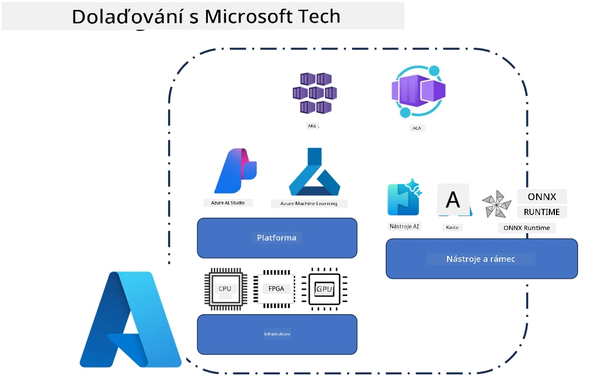
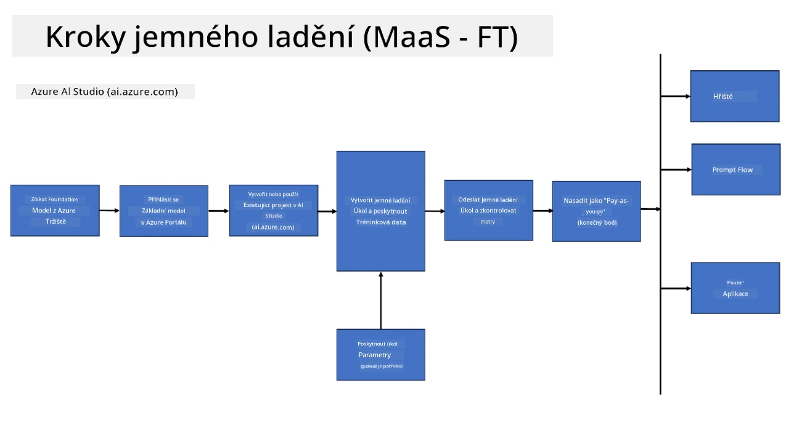
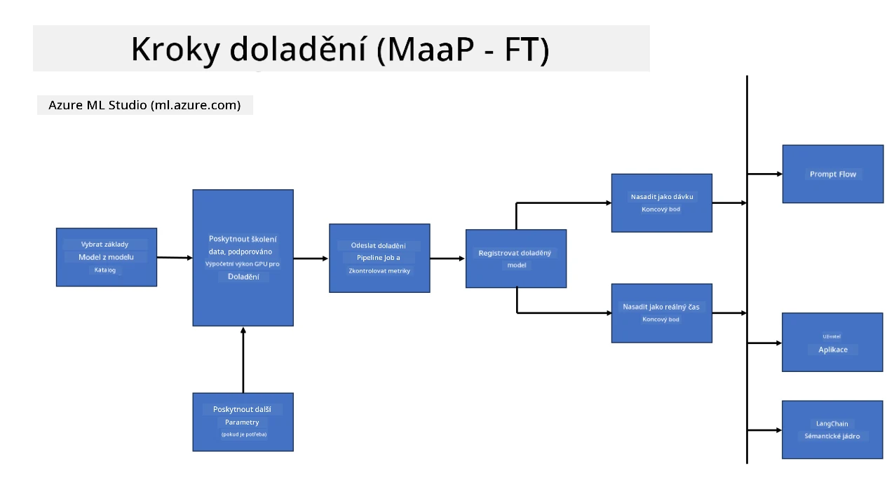

<!--
CO_OP_TRANSLATOR_METADATA:
{
  "original_hash": "cb5648935f63edc17e95ce38f23adc32",
  "translation_date": "2025-07-17T08:29:54+00:00",
  "source_file": "md/03.FineTuning/FineTuning_Scenarios.md",
  "language_code": "cs"
}
-->
## Scénáře doladění

**Platforma** Zahrnuje různé technologie jako Azure AI Foundry, Azure Machine Learning, AI Tools, Kaito a ONNX Runtime.

**Infrastruktura** Zahrnuje CPU a FPGA, které jsou nezbytné pro proces doladění. Ukážu vám ikony pro každou z těchto technologií.

**Nástroje a frameworky** Zahrnuje ONNX Runtime a ONNX Runtime. Ukážu vám ikony pro každou z těchto technologií.  
[Vložte ikony pro ONNX Runtime a ONNX Runtime]

Proces doladění s technologiemi Microsoftu zahrnuje různé komponenty a nástroje. Díky pochopení a využití těchto technologií můžeme efektivně doladit naše aplikace a vytvářet lepší řešení.

## Model jako služba

Doladění modelu pomocí hostovaného doladění, bez nutnosti vytvářet a spravovat výpočetní prostředky.

Serverless doladění je dostupné pro modely Phi-3-mini a Phi-3-medium, což umožňuje vývojářům rychle a snadno přizpůsobit modely pro cloudové a edge scénáře bez nutnosti zajišťovat výpočetní kapacity. Také jsme oznámili, že Phi-3-small je nyní dostupný prostřednictvím naší nabídky Models-as-a-Service, takže vývojáři mohou rychle a jednoduše začít s vývojem AI bez nutnosti spravovat podkladovou infrastrukturu.

## Model jako platforma

Uživatelé spravují vlastní výpočetní prostředky, aby mohli doladit své modely.

[Ukázka doladění](https://github.com/Azure/azureml-examples/blob/main/sdk/python/foundation-models/system/finetune/chat-completion/chat-completion.ipynb)

## Scénáře doladění

| | | | | | | |
|-|-|-|-|-|-|-|
|Scénář|LoRA|QLoRA|PEFT|DeepSpeed|ZeRO|DORA|
|Přizpůsobení předtrénovaných LLM konkrétním úkolům nebo doménám|Ano|Ano|Ano|Ano|Ano|Ano|
|Doladění pro NLP úkoly jako klasifikace textu, rozpoznávání pojmenovaných entit a strojový překlad|Ano|Ano|Ano|Ano|Ano|Ano|
|Doladění pro úkoly QA|Ano|Ano|Ano|Ano|Ano|Ano|
|Doladění pro generování lidsky znějících odpovědí v chatbotech|Ano|Ano|Ano|Ano|Ano|Ano|
|Doladění pro generování hudby, umění nebo jiných forem kreativity|Ano|Ano|Ano|Ano|Ano|Ano|
|Snížení výpočetních a finančních nákladů|Ano|Ano|Ne|Ano|Ano|Ne|
|Snížení využití paměti|Ne|Ano|Ne|Ano|Ano|Ano|
|Použití méně parametrů pro efektivní doladění|Ne|Ano|Ano|Ne|Ne|Ano|
|Paměťově efektivní forma datové paralelnosti, která umožňuje přístup k agregované GPU paměti všech dostupných GPU zařízení|Ne|Ne|Ne|Ano|Ano|Ano|

## Příklady výkonu doladění

**Prohlášení o vyloučení odpovědnosti**:  
Tento dokument byl přeložen pomocí AI překladatelské služby [Co-op Translator](https://github.com/Azure/co-op-translator). I když usilujeme o přesnost, mějte prosím na paměti, že automatizované překlady mohou obsahovat chyby nebo nepřesnosti. Původní dokument v jeho mateřském jazyce by měl být považován za závazný zdroj. Pro důležité informace se doporučuje profesionální lidský překlad. Nejsme odpovědní za jakékoliv nedorozumění nebo nesprávné výklady vyplývající z použití tohoto překladu.