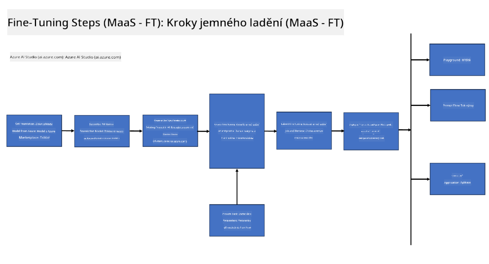
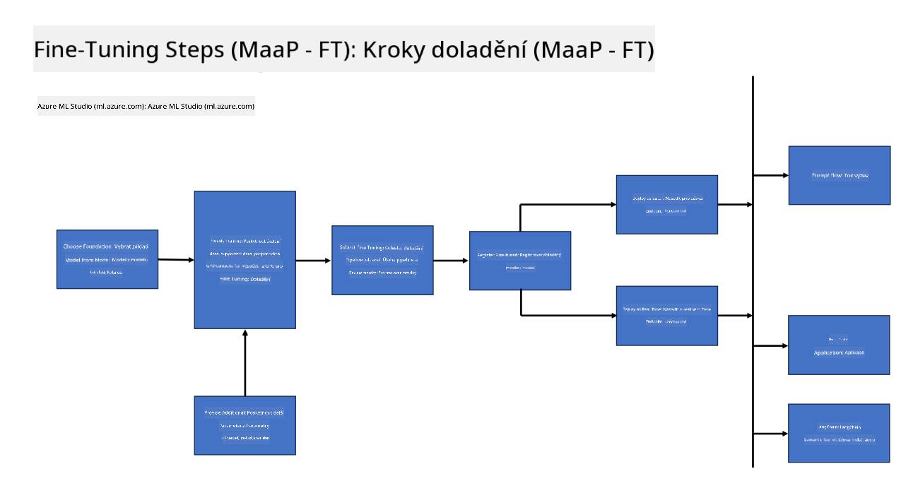
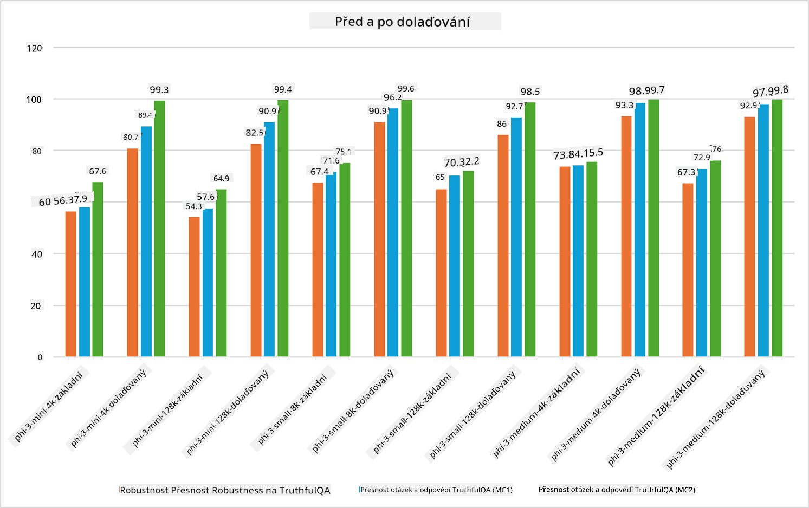

<!--
CO_OP_TRANSLATOR_METADATA:
{
  "original_hash": "cb5648935f63edc17e95ce38f23adc32",
  "translation_date": "2025-05-09T21:57:32+00:00",
  "source_file": "md/03.FineTuning/FineTuning_Scenarios.md",
  "language_code": "cs"
}
-->
## Fine Tuning Scenarios

**Platforma** Obuhvata razne tehnologije kao što su Azure AI Foundry, Azure Machine Learning, AI alati, Kaito i ONNX Runtime.

**Infrastruktura** Obuhvata CPU i FPGA, koji su ključni za proces fino podešavanja. Pogledajmo ikone za svaku od ovih tehnologija.

**Alati i Okviri** Obuhvataju ONNX Runtime i ONNX Runtime. Pogledajmo ikone za svaku od ovih tehnologija.  
[Insert icons for ONNX Runtime and ONNX Runtime]

Proces fino podešavanja sa Microsoft tehnologijama uključuje različite komponente i alate. Razumevanjem i korišćenjem ovih tehnologija, možemo efikasno fino podesiti naše aplikacije i kreirati bolje rešenja.

## Model as Service

Fino podesite model koristeći hostovano fino podešavanje, bez potrebe za kreiranjem i upravljanjem računarstvom.

Serverless fino podešavanje je dostupno za Phi-3-mini i Phi-3-medium modele, omogućavajući programerima da brzo i lako prilagode modele za cloud i edge scenarije, bez potrebe za organizovanjem računarstva. Takođe smo najavili da je Phi-3-small sada dostupan kroz naš Models-as-a-Service servis, tako da programeri mogu brzo i lako započeti sa AI razvojem bez upravljanja osnovnom infrastrukturom.

## Model as a Platform

Korisnici sami upravljaju svojim računarstvom kako bi fino podesili svoje modele.

[Fine Tuning Sample](https://github.com/Azure/azureml-examples/blob/main/sdk/python/foundation-models/system/finetune/chat-completion/chat-completion.ipynb)

## Fine Tuning Scenarios

| | | | | | | |
|-|-|-|-|-|-|-|
|Scenario|LoRA|QLoRA|PEFT|DeepSpeed|ZeRO|DORA|
|Prilagođavanje prethodno obučenih LLM modela specifičnim zadacima ili domenima|Yes|Yes|Yes|Yes|Yes|Yes|
|Fino podešavanje za NLP zadatke kao što su klasifikacija teksta, prepoznavanje imenovanih entiteta i mašinski prevod|Yes|Yes|Yes|Yes|Yes|Yes|
|Fino podešavanje za QA zadatke|Yes|Yes|Yes|Yes|Yes|Yes|
|Fino podešavanje za generisanje odgovora sličnih ljudskim u chatbotovima|Yes|Yes|Yes|Yes|Yes|Yes|
|Fino podešavanje za generisanje muzike, umetnosti ili drugih oblika kreativnosti|Yes|Yes|Yes|Yes|Yes|Yes|
|Smanjenje računarskih i finansijskih troškova|Yes|Yes|No|Yes|Yes|No|
|Smanjenje potrošnje memorije|No|Yes|No|Yes|Yes|Yes|
|Korišćenje manjeg broja parametara za efikasno fino podešavanje|No|Yes|Yes|No|No|Yes|
|Memorijski efikasna forma paralelizma podataka koja omogućava pristup zbirnoj GPU memoriji svih dostupnih GPU uređaja|No|No|No|Yes|Yes|Yes|

## Fine Tuning Performance Examples

**Prohlášení o vyloučení odpovědnosti**:  
Tento dokument byl přeložen pomocí AI překladatelské služby [Co-op Translator](https://github.com/Azure/co-op-translator). Přestože usilujeme o přesnost, mějte prosím na paměti, že automatické překlady mohou obsahovat chyby nebo nepřesnosti. Původní dokument v jeho mateřském jazyce by měl být považován za autoritativní zdroj. Pro důležité informace se doporučuje profesionální lidský překlad. Nejsme odpovědní za jakékoli nedorozumění nebo nesprávné výklady vyplývající z použití tohoto překladu.