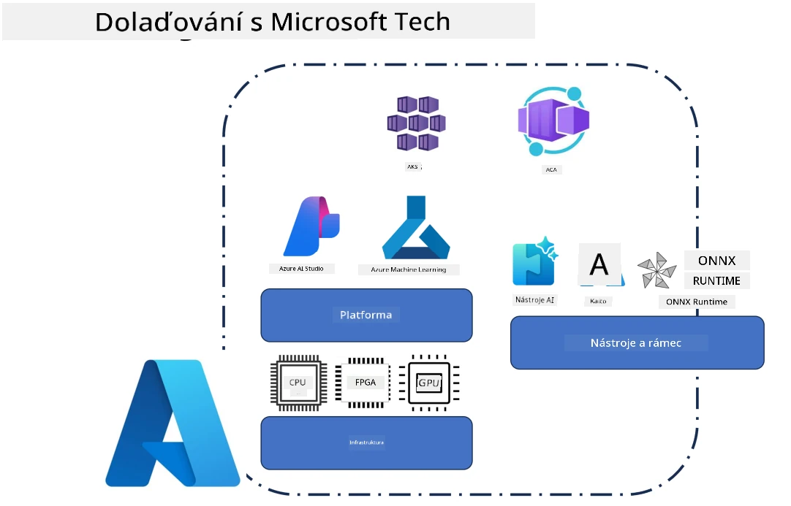
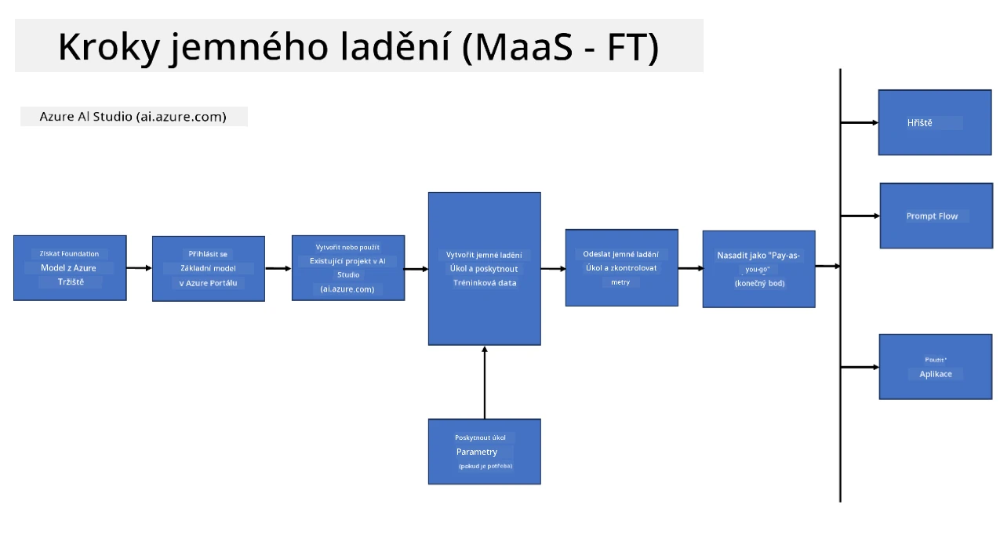
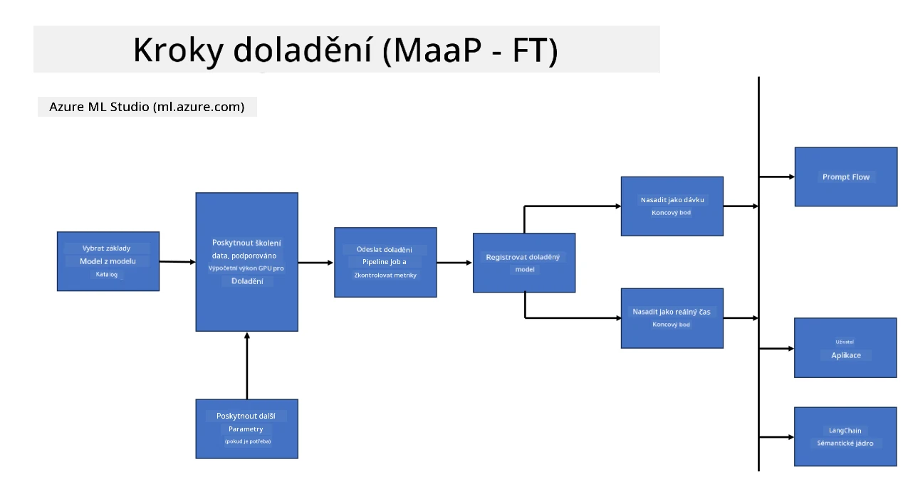
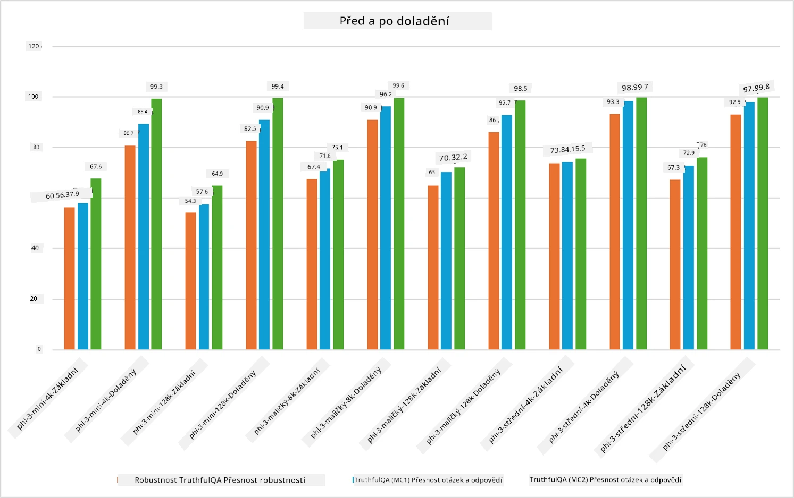

## Scénáře jemného doladění

Tato sekce poskytuje přehled scénářů jemného doladění v prostředích Microsoft Foundry a Azure, včetně modelů nasazení, vrstev infrastruktury a běžně používaných optimalizačních technik.

**Platforma**  
To zahrnuje spravované služby, jako je Microsoft Foundry (dříve Azure AI Foundry) a Azure Machine Learning, které poskytují správu modelů, orchestraci, sledování experimentů a workflow nasazení.

**Infrastruktura**  
Jemné doladění vyžaduje škálovatelné výpočetní zdroje. V prostředích Azure to obvykle zahrnuje virtuální stroje založené na GPU a CPU zdroje pro lehké pracovní zátěže, spolu se škálovatelným úložištěm pro datové sady a kontrolní body.

**Nástroje a frameworky**  
Pracovní postupy jemného doladění běžně spoléhají na frameworky a optimalizační knihovny, jako jsou Hugging Face Transformers, DeepSpeed a PEFT (Parameter-Efficient Fine-Tuning).

Proces jemného doladění s technologiemi Microsoftu pokrývá služby platformy, výpočetní infrastrukturu a tréninkové frameworky. Pochopením toho, jak tyto komponenty spolupracují, mohou vývojáři efektivně přizpůsobit základní modely konkrétním úlohám a produkčním scénářům.

## Model jako služba

Doladíte model pomocí hostovaného jemného doladění, bez potřeby vytvářet a spravovat výpočetní prostředky.

Serverless jemné doladění je nyní dostupné pro rodiny modelů Phi-3, Phi-3.5 a Phi-4, což vývojářům umožňuje rychle a snadno přizpůsobit modely pro cloudové a edge scénáře, aniž by museli zajišťovat výpočetní zdroje.

## Model jako platforma 

Uživatelé spravují svůj vlastní výpočetní výkon, aby mohli doladit své modely.

[Ukázka jemného doladění](https://github.com/Azure/azureml-examples/blob/main/sdk/python/foundation-models/system/finetune/chat-completion/chat-completion.ipynb)

## Porovnání technik jemného doladění

|Scénář|LoRA|QLoRA|PEFT|DeepSpeed|ZeRO|DoRA|
|---|---|---|---|---|---|---|
|Přizpůsobení předtrénovaných LLM modelů konkrétním úlohám nebo doménám|Ano|Ano|Ano|Ano|Ano|Ano|
|Jemné doladění pro úlohy zpracování přirozeného jazyka, jako je klasifikace textu, rozpoznávání pojmenovaných entit a strojový překlad|Ano|Ano|Ano|Ano|Ano|Ano|
|Jemné doladění pro úlohy otázky a odpovědi (QA)|Ano|Ano|Ano|Ano|Ano|Ano|
|Jemné doladění pro generování lidsky podobných odpovědí v chatbotech|Ano|Ano|Ano|Ano|Ano|Ano|
|Jemné doladění pro generování hudby, umění nebo jiných forem kreativity|Ano|Ano|Ano|Ano|Ano|Ano|
|Snižování výpočetních a finančních nákladů|Ano|Ano|Ano|Ano|Ano|Ano|
|Snižování využití paměti|Ano|Ano|Ano|Ano|Ano|Ano|
|Použití menšího počtu parametrů pro efektivní jemné doladění|Ano|Ano|Ano|Ne|Ne|Ano|
|Paměťově efektivní forma datové paralelizace, která umožňuje přístup k souhrnné GPU paměti všech dostupných GPU zařízení|Ne|Ne|Ne|Ano|Ano|Ne|

> [!NOTE]
> LoRA, QLoRA, PEFT a DoRA jsou metody parametricky efektivního jemného doladění, zatímco DeepSpeed a ZeRO se zaměřují na distribuovaný výcvik a optimalizaci paměti.

## Příklady výkonu jemného doladění

---

<!-- CO-OP TRANSLATOR DISCLAIMER START -->
Prohlášení o vyloučení odpovědnosti:
Tento dokument byl přeložen pomocí služby strojového překladu založené na umělé inteligenci [Co-op Translator](https://github.com/Azure/co-op-translator). I když usilujeme o přesnost, mějte prosím na paměti, že automatické překlady mohou obsahovat chyby nebo nepřesnosti. Původní dokument v jeho originálním jazyce by měl být považován za závazný. Pro kritické informace se doporučuje využít profesionální lidský překlad. Nejsme odpovědní za žádná nedorozumění nebo chybné výklady vyplývající z použití tohoto překladu.
<!-- CO-OP TRANSLATOR DISCLAIMER END -->