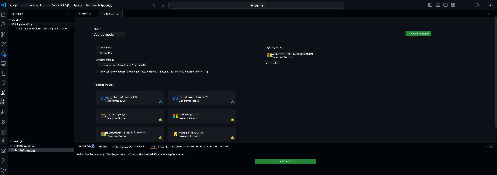

<!--
CO_OP_TRANSLATOR_METADATA:
{
  "original_hash": "c2bc0950f44919ac75a88c1a871680c2",
  "translation_date": "2025-07-17T09:19:54+00:00",
  "source_file": "md/03.FineTuning/Finetuning_VSCodeaitoolkit.md",
  "language_code": "cs"
}
-->
## Vítejte v AI Toolkit pro VS Code

[AI Toolkit pro VS Code](https://github.com/microsoft/vscode-ai-toolkit/tree/main) spojuje různé modely z Azure AI Studio Catalog a dalších katalogů, jako je Hugging Face. Tento toolkit usnadňuje běžné vývojové úkoly při tvorbě AI aplikací s generativními AI nástroji a modely prostřednictvím:
- Začínáme s objevováním modelů a playgroundem.
- Doladění modelu a inferenční výpočty pomocí lokálních výpočetních zdrojů.
- Vzdálené doladění a inferenční výpočty pomocí Azure zdrojů.

[Nainstalujte AI Toolkit pro VSCode](https://marketplace.visualstudio.com/items?itemName=ms-windows-ai-studio.windows-ai-studio)




**[Private Preview]** Jedním kliknutím vytvořte Azure Container Apps pro spuštění doladění modelu a inferenčních výpočtů v cloudu.

Pojďme se nyní pustit do vývoje vaší AI aplikace:

- [Vítejte v AI Toolkit pro VS Code](../../../../md/03.FineTuning)
- [Lokální vývoj](../../../../md/03.FineTuning)
  - [Přípravy](../../../../md/03.FineTuning)
  - [Aktivace Conda](../../../../md/03.FineTuning)
  - [Pouze doladění základního modelu](../../../../md/03.FineTuning)
  - [Doladění modelu a inferenční výpočty](../../../../md/03.FineTuning)
  - [Doladění modelu](../../../../md/03.FineTuning)
  - [Microsoft Olive](../../../../md/03.FineTuning)
  - [Ukázky a zdroje pro doladění](../../../../md/03.FineTuning)
- [**\[Private Preview\]** Vzdálený vývoj](../../../../md/03.FineTuning)
  - [Požadavky](../../../../md/03.FineTuning)
  - [Nastavení vzdáleného vývojového projektu](../../../../md/03.FineTuning)
  - [Zajištění Azure zdrojů](../../../../md/03.FineTuning)
  - [\[Volitelné\] Přidání Huggingface tokenu do tajemství Azure Container App](../../../../md/03.FineTuning)
  - [Spuštění doladění](../../../../md/03.FineTuning)
  - [Zajištění inferenčního endpointu](../../../../md/03.FineTuning)
  - [Nasazení inferenčního endpointu](../../../../md/03.FineTuning)
  - [Pokročilé použití](../../../../md/03.FineTuning)

## Lokální vývoj
### Přípravy

1. Ujistěte se, že je na hostitelském počítači nainstalován ovladač NVIDIA.
2. Spusťte `huggingface-cli login`, pokud používáte HF pro práci s datasetem.
3. Vysvětlení nastavení klíče `Olive` pro cokoli, co ovlivňuje využití paměti.

### Aktivace Conda
Protože používáme prostředí WSL, které je sdílené, je potřeba ručně aktivovat conda prostředí. Po tomto kroku můžete spustit doladění nebo inferenční výpočty.

```bash
conda activate [conda-env-name] 
```

### Pouze doladění základního modelu
Pokud chcete jen vyzkoušet základní model bez doladění, spusťte tento příkaz po aktivaci conda.

```bash
cd inference

# Web browser interface allows to adjust a few parameters like max new token length, temperature and so on.
# User has to manually open the link (e.g. http://0.0.0.0:7860) in a browser after gradio initiates the connections.
python gradio_chat.py --baseonly
```

### Doladění modelu a inferenční výpočty

Jakmile je pracovní prostor otevřen v dev kontejneru, otevřete terminál (výchozí cesta je kořen projektu) a spusťte níže uvedený příkaz pro doladění LLM na vybraném datasetu.

```bash
python finetuning/invoke_olive.py 
```

Kontrolní body a finální model budou uloženy ve složce `models`.

Následně spusťte inferenční výpočty s doladěným modelem přes chaty v `konzoli`, `webovém prohlížeči` nebo `prompt flow`.

```bash
cd inference

# Console interface.
python console_chat.py

# Web browser interface allows to adjust a few parameters like max new token length, temperature and so on.
# User has to manually open the link (e.g. http://127.0.0.1:7860) in a browser after gradio initiates the connections.
python gradio_chat.py
```

Pro použití `prompt flow` ve VS Code se podívejte na tento [Rychlý start](https://microsoft.github.io/promptflow/how-to-guides/quick-start.html).

### Doladění modelu

Dále stáhněte následující model podle dostupnosti GPU na vašem zařízení.

Pro zahájení lokálního doladění pomocí QLoRA vyberte model, který chcete doladit, z našeho katalogu.
| Platforma | GPU dostupné | Název modelu | Velikost (GB) |
|---------|---------|--------|--------|
| Windows | Ano | Phi-3-mini-4k-**directml**-int4-awq-block-128-onnx | 2.13GB |
| Linux | Ano | Phi-3-mini-4k-**cuda**-int4-onnx | 2.30GB |
| Windows<br>Linux | Ne | Phi-3-mini-4k-**cpu**-int4-rtn-block-32-acc-level-4-onnx | 2.72GB |

**_Poznámka_** Pro stažení modelů nepotřebujete Azure účet.

Model Phi3-mini (int4) má velikost přibližně 2GB-3GB. V závislosti na rychlosti vašeho připojení může stažení trvat několik minut.

Začněte výběrem názvu projektu a umístění.
Poté vyberte model z katalogu modelů. Budete vyzváni ke stažení šablony projektu. Následně klikněte na „Konfigurovat projekt“ pro úpravu různých nastavení.

### Microsoft Olive

Používáme [Olive](https://microsoft.github.io/Olive/why-olive.html) pro spuštění QLoRA doladění na PyTorch modelu z našeho katalogu. Všechna nastavení jsou přednastavena na výchozí hodnoty pro optimalizaci lokálního doladění s efektivním využitím paměti, ale lze je upravit podle vašich potřeb.

### Ukázky a zdroje pro doladění

- [Průvodce začátkem doladění](https://learn.microsoft.com/windows/ai/toolkit/toolkit-fine-tune)
- [Doladění s HuggingFace datasetem](https://github.com/microsoft/vscode-ai-toolkit/blob/main/archive/walkthrough-hf-dataset.md)
- [Doladění s jednoduchým datasetem](https://github.com/microsoft/vscode-ai-toolkit/blob/main/archive/walkthrough-simple-dataset.md)

## **[Private Preview]** Vzdálený vývoj

### Požadavky

1. Pro spuštění doladění modelu ve vašem vzdáleném Azure Container App prostředí se ujistěte, že vaše předplatné má dostatečnou kapacitu GPU. Podání [žádosti o podporu](https://azure.microsoft.com/support/create-ticket/) pro požadovanou kapacitu pro vaši aplikaci. [Více informací o kapacitě GPU](https://learn.microsoft.com/azure/container-apps/workload-profiles-overview)
2. Pokud používáte soukromý dataset na HuggingFace, ujistěte se, že máte [HuggingFace účet](https://huggingface.co/?WT.mc_id=aiml-137032-kinfeylo) a [vygenerovaný přístupový token](https://huggingface.co/docs/hub/security-tokens?WT.mc_id=aiml-137032-kinfeylo)
3. Povolení funkce vzdáleného doladění a inferenčních výpočtů v AI Toolkit pro VS Code
   1. Otevřete nastavení VS Code výběrem *Soubor -> Předvolby -> Nastavení*.
   2. Přejděte na *Rozšíření* a vyberte *AI Toolkit*.
   3. Zaškrtněte možnost *"Enable Remote Fine-tuning And Inference"*.
   4. Pro efektivní změny restartujte VS Code.

- [Vzdálené doladění](https://github.com/microsoft/vscode-ai-toolkit/blob/main/archive/remote-finetuning.md)

### Nastavení vzdáleného vývojového projektu
1. Spusťte příkazovou paletu `AI Toolkit: Focus on Resource View`.
2. Přejděte na *Model Fine-tuning* pro přístup do katalogu modelů. Přiřaďte projektu název a vyberte jeho umístění na vašem zařízení. Poté klikněte na tlačítko *"Configure Project"*.
3. Konfigurace projektu
    1. Nepovolujte volbu *"Fine-tune locally"*.
    2. Zobrazí se nastavení konfigurace Olive s přednastavenými výchozími hodnotami. Upravte a vyplňte tato nastavení podle potřeby.
    3. Pokračujte kliknutím na *Generate Project*. Tento krok využívá WSL a zahrnuje vytvoření nového Conda prostředí, připravujícího půdu pro budoucí aktualizace včetně Dev kontejnerů.
4. Klikněte na *"Relaunch Window In Workspace"* pro otevření vašeho vzdáleného vývojového projektu.

> **Poznámka:** Projekt aktuálně funguje buď lokálně, nebo vzdáleně v rámci AI Toolkit pro VS Code. Pokud při vytváření projektu zvolíte *"Fine-tune locally"*, bude fungovat pouze v WSL bez možnosti vzdáleného vývoje. Pokud tuto volbu nezvolíte, projekt bude omezen na vzdálené prostředí Azure Container App.

### Zajištění Azure zdrojů
Pro začátek je potřeba zajistit Azure zdroje pro vzdálené doladění. Udělejte to spuštěním příkazu `AI Toolkit: Provision Azure Container Apps job for fine-tuning` z příkazové palety.

Sledujte průběh zajištění přes odkaz zobrazený v kanálu výstupu.

### [Volitelné] Přidání Huggingface tokenu do tajemství Azure Container App
Pokud používáte soukromý dataset HuggingFace, nastavte svůj HuggingFace token jako proměnnou prostředí, abyste se vyhnuli nutnosti manuálního přihlašování na Hugging Face Hub.
Můžete to udělat pomocí příkazu `AI Toolkit: Add Azure Container Apps Job secret for fine-tuning`. Tento příkaz umožňuje nastavit název tajemství jako [`HF_TOKEN`](https://huggingface.co/docs/huggingface_hub/package_reference/environment_variables#hftoken) a použít váš Hugging Face token jako hodnotu tajemství.

### Spuštění doladění
Pro spuštění vzdálené úlohy doladění použijte příkaz `AI Toolkit: Run fine-tuning`.

Pro zobrazení systémových a konzolových logů můžete navštívit Azure portál přes odkaz v panelu výstupu (další kroky na [Zobrazení a dotazování logů na Azure](https://aka.ms/ai-toolkit/remote-provision#view-and-query-logs-on-azure)). Nebo můžete zobrazit konzolové logy přímo ve VSCode v panelu výstupu spuštěním příkazu `AI Toolkit: Show the running fine-tuning job streaming logs`.
> **Poznámka:** Úloha může být ve frontě kvůli nedostatku zdrojů. Pokud se log nezobrazí, spusťte příkaz `AI Toolkit: Show the running fine-tuning job streaming logs`, chvíli počkejte a pak příkaz spusťte znovu pro opětovné připojení ke streamu logů.

Během tohoto procesu bude použita metoda QLoRA pro doladění a vytvoří LoRA adaptéry pro model, které se použijí při inferenci.
Výsledky doladění budou uloženy v Azure Files.

### Zajištění inferenčního endpointu
Po natrénování adaptérů ve vzdáleném prostředí použijte jednoduchou Gradio aplikaci pro interakci s modelem.
Podobně jako u doladění je potřeba nastavit Azure zdroje pro vzdálenou inferenci spuštěním příkazu `AI Toolkit: Provision Azure Container Apps for inference` z příkazové palety.

Výchozí předplatné a skupina zdrojů pro inferenci by měly odpovídat těm, které byly použity pro doladění. Inferenční výpočty budou využívat stejné Azure Container App prostředí a přistupovat k modelu a adaptéru uloženým v Azure Files, které byly vytvořeny během doladění.

### Nasazení inferenčního endpointu
Pokud chcete upravit inferenční kód nebo znovu načíst inferenční model, spusťte příkaz `AI Toolkit: Deploy for inference`. Tím se synchronizuje váš nejnovější kód s Azure Container App a restartuje se replika.

Po úspěšném nasazení můžete přistupovat k inferenčnímu API kliknutím na tlačítko „Go to Inference Endpoint“ zobrazené v notifikaci VSCode. Nebo najdete webový API endpoint pod `ACA_APP_ENDPOINT` v souboru `./infra/inference.config.json` a v panelu výstupu. Nyní jste připraveni model vyhodnotit pomocí tohoto endpointu.

### Pokročilé použití
Pro více informací o vzdáleném vývoji s AI Toolkit se podívejte na dokumentaci [Doladění modelů na dálku](https://aka.ms/ai-toolkit/remote-provision) a [Inferenční výpočty s doladěným modelem](https://aka.ms/ai-toolkit/remote-inference).

**Prohlášení o vyloučení odpovědnosti**:  
Tento dokument byl přeložen pomocí AI překladatelské služby [Co-op Translator](https://github.com/Azure/co-op-translator). I když usilujeme o přesnost, mějte prosím na paměti, že automatické překlady mohou obsahovat chyby nebo nepřesnosti. Původní dokument v jeho mateřském jazyce by měl být považován za závazný zdroj. Pro důležité informace se doporučuje profesionální lidský překlad. Nejsme odpovědní za jakékoliv nedorozumění nebo nesprávné výklady vyplývající z použití tohoto překladu.