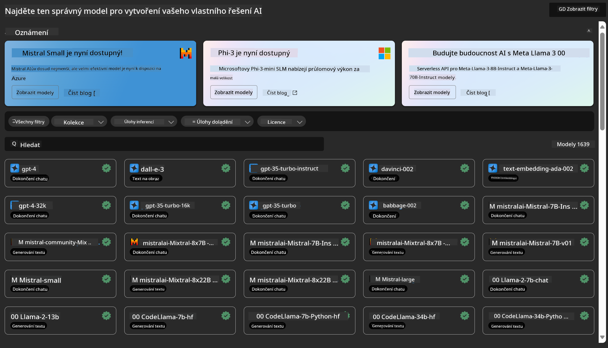
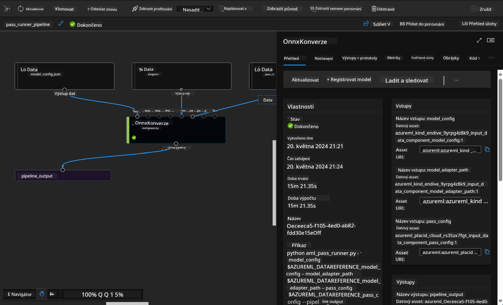

<!--
CO_OP_TRANSLATOR_METADATA:
{
  "original_hash": "7fe541373802e33568e94e13226d463c",
  "translation_date": "2025-05-09T22:23:25+00:00",
  "source_file": "md/03.FineTuning/Introduce_AzureML.md",
  "language_code": "cs"
}
-->
# **Представление сервиса Azure Machine Learning**

[Azure Machine Learning](https://ml.azure.com?WT.mc_id=aiml-138114-kinfeylo) — это облачный сервис для ускорения и управления жизненным циклом проектов машинного обучения (ML).

Профессионалы в области ML, дата-сайентисты и инженеры могут использовать его в своей повседневной работе для:

- Обучения и развертывания моделей.
- Управления операциями машинного обучения (MLOps).
- Вы можете создать модель в Azure Machine Learning или использовать модель, построенную на базе открытых платформ, таких как PyTorch, TensorFlow или scikit-learn.
- Инструменты MLOps помогают отслеживать, дообучать и повторно развертывать модели.

## Для кого предназначен Azure Machine Learning?

**Дата-сайентисты и ML-инженеры**

Они могут использовать инструменты для ускорения и автоматизации своих повседневных задач.
Azure ML предоставляет функции для обеспечения справедливости, объяснимости, отслеживания и аудита.

**Разработчики приложений**

Они могут легко интегрировать модели в приложения или сервисы.

**Платформенные разработчики**

Имеют доступ к мощному набору инструментов, поддерживаемых надежными API Azure Resource Manager.
Эти инструменты позволяют создавать продвинутые ML-инструменты.

**Корпоративные пользователи**

Работая в облаке Microsoft Azure, предприятия получают преимущества знакомой безопасности и контроля доступа на основе ролей.
Можно настроить проекты для контроля доступа к защищённым данным и отдельным операциям.

## Повышение продуктивности для всей команды
Проекты ML часто требуют команду с разнообразными навыками для создания и поддержки решений.

Azure ML предоставляет инструменты, которые позволяют:
- Сотрудничать с командой через совместные блокноты, вычислительные ресурсы, бессерверные вычисления, данные и среды.
- Разрабатывать модели с учётом справедливости, объяснимости, отслеживания и аудита для выполнения требований по происхождению данных и соответствию.
- Быстро и легко развёртывать ML-модели в масштабе, а также эффективно управлять ими с помощью MLOps.
- Запускать ML-задачи в любом месте с встроенными функциями управления, безопасности и соответствия.

## Кроссплатформенные инструменты

Любой участник команды ML может использовать предпочитаемые инструменты для выполнения задач.
Будь то быстрые эксперименты, подбор гиперпараметров, создание пайплайнов или управление выводами, доступны привычные интерфейсы:
- Azure Machine Learning Studio
- Python SDK (v2)
- Azure CLI (v2)
- Azure Resource Manager REST APIs

По мере совершенствования моделей и совместной работы на протяжении всего цикла разработки, вы можете обмениваться и находить активы, ресурсы и метрики через UI Azure Machine Learning Studio.

## **LLM/SLM в Azure ML**

Azure ML добавил множество функций, связанных с LLM/SLM, объединяя LLMOps и SLMOps для создания корпоративной платформы генеративного искусственного интеллекта.

### **Каталог моделей**

Корпоративные пользователи могут развертывать разные модели под различные бизнес-сценарии через Каталог моделей и предоставлять сервисы как Model as Service для разработчиков и пользователей.

Каталог моделей в Azure Machine Learning Studio — это центр для поиска и использования широкого спектра моделей, которые позволяют создавать приложения на основе генеративного ИИ. Каталог включает сотни моделей от таких провайдеров, как Azure OpenAI service, Mistral, Meta, Cohere, Nvidia, Hugging Face, включая модели, обученные Microsoft. Модели от провайдеров, отличных от Microsoft, считаются Non-Microsoft Products согласно условиям Microsoft и подчиняются условиям использования, предоставленным с моделью.

### **Пайплайн заданий**

Основная идея пайплайна машинного обучения — разбить задачу на несколько шагов, каждый из которых является управляемым компонентом, который можно разрабатывать, оптимизировать, настраивать и автоматизировать отдельно. Шаги связаны через четко определённые интерфейсы. Сервис пайплайнов Azure Machine Learning автоматически управляет всеми зависимостями между шагами.

При тонкой настройке SLM / LLM мы можем управлять данными, обучением и процессами генерации через Pipeline.

### **Prompt flow**

Преимущества использования Azure Machine Learning prompt flow  
Azure Machine Learning prompt flow предлагает ряд преимуществ, которые помогают пользователям перейти от идеи к экспериментам и, в конечном итоге, к готовым к производству приложениям на основе LLM:

**Гибкость prompt engineering**

Интерактивный опыт создания: prompt flow предоставляет визуальное представление структуры потока, позволяя легко понять и навигировать проектами. Также доступен опыт работы, похожий на блокнот, для эффективной разработки и отладки потоков.  
Варианты настройки prompt: пользователи могут создавать и сравнивать несколько вариантов prompt, что способствует итеративному улучшению.

Оценка: встроенные потоки оценки позволяют пользователям оценивать качество и эффективность своих prompt и потоков.

Обширные ресурсы: prompt flow включает библиотеку встроенных инструментов, примеров и шаблонов, которые служат отправной точкой для разработки, вдохновляя и ускоряя процесс.

**Готовность корпоративного уровня для приложений на основе LLM**

Сотрудничество: prompt flow поддерживает командную работу, позволяя нескольким пользователям совместно работать над проектами prompt engineering, обмениваться знаниями и вести контроль версий.

Единая платформа: prompt flow упрощает весь процесс prompt engineering — от разработки и оценки до развертывания и мониторинга. Пользователи могут без труда развертывать потоки как конечные точки Azure Machine Learning и отслеживать их производительность в реальном времени, обеспечивая оптимальную работу и постоянное улучшение.

Решения Azure Machine Learning для корпоративной готовности: prompt flow использует надежные корпоративные решения Azure Machine Learning, обеспечивая безопасную, масштабируемую и надежную основу для разработки, экспериментов и развертывания потоков.

С помощью Azure Machine Learning prompt flow пользователи могут раскрыть гибкость prompt engineering, эффективно сотрудничать и использовать корпоративные решения для успешной разработки и развертывания приложений на базе LLM.

Объединяя вычислительные мощности, данные и различные компоненты Azure ML, корпоративные разработчики могут легко создавать собственные приложения искусственного интеллекта.

**Prohlášení o vyloučení odpovědnosti**:  
Tento dokument byl přeložen pomocí AI překladatelské služby [Co-op Translator](https://github.com/Azure/co-op-translator). Přestože usilujeme o přesnost, mějte prosím na paměti, že automatizované překlady mohou obsahovat chyby nebo nepřesnosti. Původní dokument v jeho rodném jazyce by měl být považován za autoritativní zdroj. Pro kritické informace se doporučuje profesionální lidský překlad. Nejsme odpovědní za jakékoli nedorozumění nebo nesprávné výklady vyplývající z použití tohoto překladu.