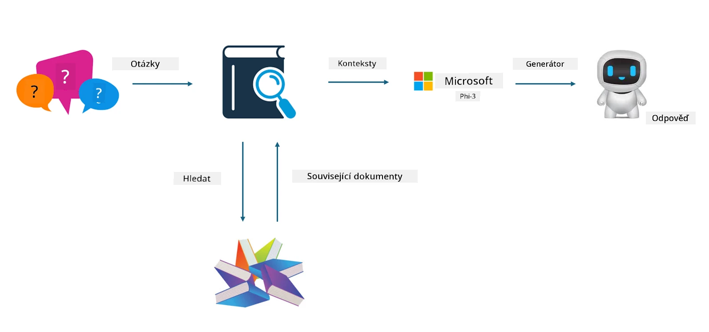
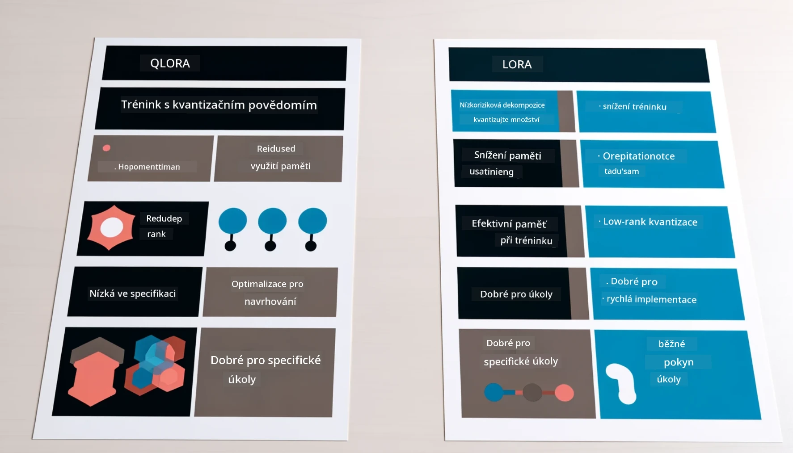

# **Nechte Phi-3 stát se odborníkem v oboru**

Chcete-li model Phi-3 nasadit v konkrétním odvětví, je potřeba do modelu Phi-3 přidat data z daného oboru. Máme dvě možnosti: první je RAG (Retrieval Augmented Generation) a druhá je Fine Tuning.

## **RAG vs Fine-Tuning**

### **Retrieval Augmented Generation**

RAG je kombinace vyhledávání dat a generování textu. Strukturovaná i nestrukturovaná data firmy jsou uložena ve vektorové databázi. Při hledání relevantního obsahu se najde souhrn a obsah, které tvoří kontext, a schopnost doplňování textu modelu LLM/SLM se využije k vytvoření výsledného textu.

### **Fine-tuning**

Fine-tuning znamená doladění konkrétního modelu. Není potřeba začínat od algoritmu modelu, ale je nutné průběžně sbírat data. Pokud chcete v oborových aplikacích přesnější terminologii a jazykové vyjádření, fine-tuning je lepší volba. Pokud se však data často mění, může být fine-tuning komplikovaný.

### **Jak vybrat**

1. Pokud naše odpověď vyžaduje zapojení externích dat, RAG je nejlepší volba.

2. Pokud potřebujete stabilní a přesné znalosti z oboru, fine-tuning bude vhodnější. RAG upřednostňuje vytažení relevantního obsahu, ale nemusí vždy přesně zachytit specializované nuance.

3. Fine-tuning vyžaduje kvalitní datovou sadu, a pokud je dat málo, nebude mít velký efekt. RAG je flexibilnější.

4. Fine-tuning je černá skříňka, něco jako metafyzika, a je těžké pochopit jeho vnitřní mechanismus. RAG naopak usnadňuje dohledání zdroje dat, což pomáhá efektivně řešit halucinace nebo chyby v obsahu a zvyšuje transparentnost.

### **Scénáře**

1. Vertikální odvětví vyžadují specifickou odbornou terminologii a výrazy, ***Fine-tuning*** je nejlepší volba.

2. QA systém, který kombinuje různé znalostní body, ***RAG*** je nejlepší volba.

3. Kombinace automatizovaného obchodního procesu ***RAG + Fine-tuning*** je nejlepší volba.

## **Jak používat RAG**

Vektorová databáze je sbírka dat uložených v matematické podobě. Vektorové databáze usnadňují modelům strojového učení zapamatovat si předchozí vstupy, což umožňuje využití strojového učení pro případy jako vyhledávání, doporučení a generování textu. Data lze identifikovat na základě metrik podobnosti, nikoli přesných shod, což umožňuje modelům lépe chápat kontext dat.

Vektorová databáze je klíčem k realizaci RAG. Data můžeme převést do vektorového úložiště pomocí vektorových modelů jako text-embedding-3, jina-ai-embedding a dalších.

Více o tvorbě RAG aplikace najdete na [https://github.com/microsoft/Phi-3CookBook](https://github.com/microsoft/Phi-3CookBook?WT.mc_id=aiml-138114-kinfeylo)

## **Jak používat Fine-tuning**

Nejčastěji používané algoritmy ve Fine-tuningu jsou Lora a QLora. Jak vybrat?
- [Více informací v tomto ukázkovém notebooku](../../../../code/04.Finetuning/Phi_3_Inference_Finetuning.ipynb)
- [Příklad Python FineTuning skriptu](../../../../code/04.Finetuning/FineTrainingScript.py)

### **Lora a QLora**

LoRA (Low-Rank Adaptation) a QLoRA (Quantized Low-Rank Adaptation) jsou techniky používané k doladění velkých jazykových modelů (LLM) pomocí Parameter Efficient Fine Tuning (PEFT). PEFT techniky jsou navrženy tak, aby trénovaly modely efektivněji než tradiční metody.

LoRA je samostatná metoda doladění, která snižuje nároky na paměť tím, že aplikuje nízkorozměrnou aproximaci na matici aktualizace vah. Nabízí rychlý trénink a udržuje výkon blízký tradičnímu fine-tuningu.

QLoRA je rozšířená verze LoRA, která využívá kvantizační techniky ke snížení paměťových nároků. QLoRA kvantizuje přesnost váhových parametrů předtrénovaného LLM na 4bitovou přesnost, což je paměťově efektivnější než LoRA. Trénink QLoRA je však asi o 30 % pomalejší než u LoRA kvůli dodatečným krokům kvantizace a dekvantizace.

QLoRA používá LoRA jako doplněk k opravě chyb vzniklých kvantizací. QLoRA umožňuje doladění obrovských modelů s miliardami parametrů na relativně malých a dostupných GPU. Například QLoRA dokáže doladit model s 70 miliardami parametrů, který by jinak vyžadoval 36 GPU, pouze s 2...

**Prohlášení o vyloučení odpovědnosti**:  
Tento dokument byl přeložen pomocí AI překladatelské služby [Co-op Translator](https://github.com/Azure/co-op-translator). I když usilujeme o přesnost, mějte prosím na paměti, že automatizované překlady mohou obsahovat chyby nebo nepřesnosti. Původní dokument v jeho mateřském jazyce by měl být považován za závazný zdroj. Pro důležité informace se doporučuje profesionální lidský překlad. Nejsme odpovědní za jakékoliv nedorozumění nebo nesprávné výklady vyplývající z použití tohoto překladu.