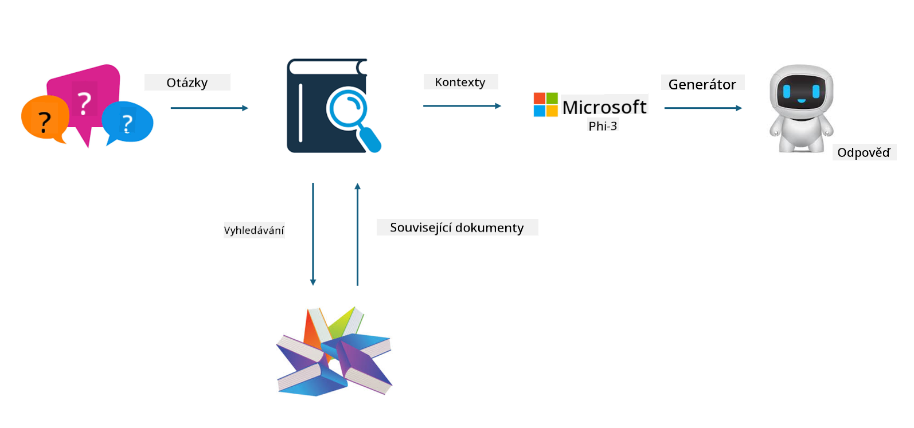

<!--
CO_OP_TRANSLATOR_METADATA:
{
  "original_hash": "743d7e9cb9c4e8ea642d77bee657a7fa",
  "translation_date": "2025-05-09T22:29:21+00:00",
  "source_file": "md/03.FineTuning/LetPhi3gotoIndustriy.md",
  "language_code": "cs"
}
-->
# **让 Phi-3 成为行业专家**

要将 Phi-3 模型应用到某个行业，需要向 Phi-3 模型中添加行业业务数据。我们有两种不同的选择，第一种是 RAG（检索增强生成），第二种是微调。

## **RAG 与微调对比**

### **检索增强生成**

RAG 是数据检索加文本生成。企业的结构化数据和非结构化数据被存储在向量数据库中。在搜索相关内容时，会找到相关的摘要和内容形成上下文，并结合 LLM/SLM 的文本补全能力生成内容。

### **微调**

微调是在某个模型基础上的改进。它不需要从模型算法开始，但需要不断积累数据。如果你想在行业应用中获得更精准的术语和语言表达，微调是更好的选择。但如果你的数据经常变化，微调会变得复杂。

### **如何选择**

1. 如果我们的答案需要引入外部数据，RAG 是最佳选择

2. 如果需要输出稳定且精准的行业知识，微调是不错的选择。RAG 优先拉取相关内容，但可能无法完全把握专业细节。

3. 微调需要高质量的数据集，且数据范围较小时效果不明显。RAG 更灵活。

4. 微调是一个黑盒，较难理解内部机制。而 RAG 可以更容易追溯数据来源，从而有效调整幻觉或内容错误，提供更好的透明度。

### **应用场景**

1. 垂直行业需要特定专业词汇和表达，***微调*** 是最佳选择

2. QA 系统，涉及不同知识点的综合，***RAG*** 是最佳选择

3. 自动化业务流程结合 ***RAG + 微调*** 是最佳选择

## **如何使用 RAG**

向量数据库是以数学形式存储数据的集合。向量数据库使机器学习模型更容易记住之前的输入，从而支持搜索、推荐和文本生成等应用场景。数据可基于相似度度量而非精确匹配被识别，使计算机模型能够理解数据的上下文。

向量数据库是实现 RAG 的关键。我们可以通过 text-embedding-3、jina-ai-embedding 等向量模型将数据转换为向量存储。

了解更多关于创建 RAG 应用的信息 [https://github.com/microsoft/Phi-3CookBook](https://github.com/microsoft/Phi-3CookBook?WT.mc_id=aiml-138114-kinfeylo)

## **如何使用微调**

微调中常用的算法有 Lora 和 QLora。如何选择？
- [通过此示例笔记本了解更多](../../../../code/04.Finetuning/Phi_3_Inference_Finetuning.ipynb)
- [Python 微调示例代码](../../../../code/04.Finetuning/FineTrainingScript.py)

### **Lora 和 QLora**

LoRA（低秩适配）和 QLoRA（量化低秩适配）都是用于使用参数高效微调（PEFT）技术对大型语言模型（LLM）进行微调的方法。PEFT 技术旨在比传统方法更高效地训练模型。

LoRA 是一种独立的微调技术，通过对权重更新矩阵应用低秩近似来减少内存占用。它训练速度快，性能接近传统微调方法。

QLoRA 是 LoRA 的扩展版本，结合了量化技术以进一步减少内存使用。QLoRA 将预训练 LLM 中权重参数的精度量化到 4 位精度，比 LoRA 更节省内存。但由于额外的量化和反量化步骤，QLoRA 训练速度比 LoRA 慢约 30%。

QLoRA 使用 LoRA 作为辅助，修正量化过程中引入的误差。QLoRA 使得在相对较小且普遍可用的 GPU 上微调拥有数十亿参数的大型模型成为可能。例如，QLoRA 可以微调一个 70B 参数的模型，而传统方法可能需要 36 块 GPU，仅需 2 块 GPU 即可完成。

**Prohlášení o vyloučení odpovědnosti**:  
Tento dokument byl přeložen pomocí AI překladatelské služby [Co-op Translator](https://github.com/Azure/co-op-translator). Přestože usilujeme o přesnost, mějte prosím na paměti, že automatizované překlady mohou obsahovat chyby nebo nepřesnosti. Originální dokument v jeho původním jazyce by měl být považován za autoritativní zdroj. Pro důležité informace se doporučuje profesionální lidský překlad. Nejsme odpovědní za jakékoliv nedorozumění nebo nesprávné výklady vyplývající z použití tohoto překladu.