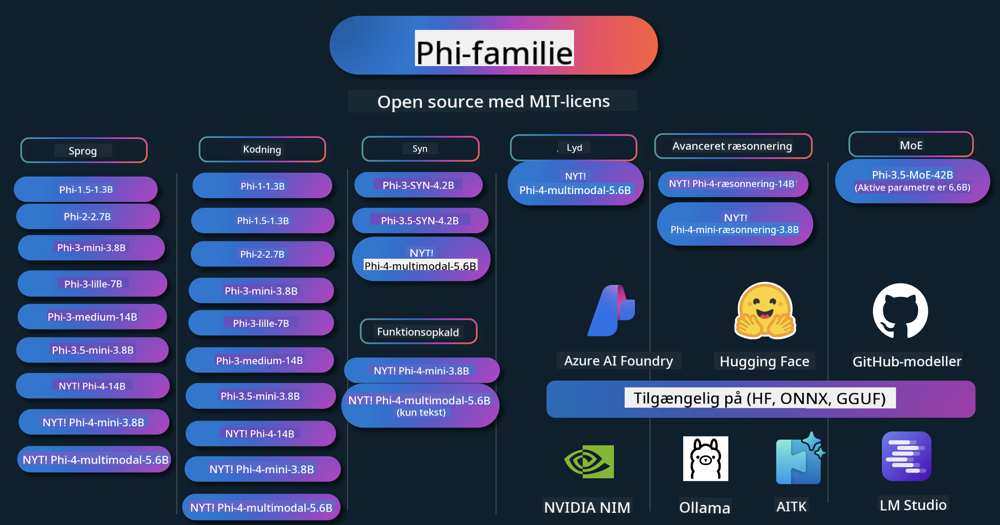

<!--
CO_OP_TRANSLATOR_METADATA:
{
  "original_hash": "1cab9282e04f2e1c388a38dca7763c16",
  "translation_date": "2025-05-09T03:58:44+00:00",
  "source_file": "README.md",
  "language_code": "da"
}
-->
# Phi Cookbook: Praktiske Eksempler med Microsofts Phi Modeller

Phi er en serie af open source AI-modeller udviklet af Microsoft.

Phi er i øjeblikket den mest kraftfulde og omkostningseffektive lille sprogmodel (SLM) med meget gode benchmarks inden for flersprog, ræsonnering, tekst-/chatgenerering, kodning, billeder, lyd og andre scenarier.

Du kan implementere Phi i skyen eller på edge-enheder, og du kan nemt bygge generative AI-applikationer med begrænset computerkraft.

Følg disse trin for at komme i gang med at bruge disse ressourcer:
1. **Fork Repositoryet**: Klik på 
2. **Klon Repositoryet**: `git clone https://github.com/microsoft/PhiCookBook.git`
3. [**Deltag i Microsoft AI Discord Community og mød eksperter og andre udviklere**](https://discord.com/invite/ByRwuEEgH4?WT.mc_id=aiml-137032-kinfeylo)

## 🌐 Flersproget Support

### Understøttet via GitHub Action (Automatiseret & Altid Opdateret)

[Fransk](../fr/README.md) | [Spansk](../es/README.md) | [Tysk](../de/README.md) | [Russisk](../ru/README.md) | [Arabisk](../ar/README.md) | [Persisk (Farsi)](../fa/README.md) | [Urdu](../ur/README.md) | [Kinesisk (Forenklet)](../zh/README.md) | [Kinesisk (Traditionelt, Macau)](../mo/README.md) | [Kinesisk (Traditionelt, Hong Kong)](../hk/README.md) | [Kinesisk (Traditionelt, Taiwan)](../tw/README.md) | [Japansk](../ja/README.md) | [Koreansk](../ko/README.md) | [Hindi](../hi/README.md)

### Understøttet via CLI
[Bengali](../bn/README.md) | [Marathi](../mr/README.md) | [Nepali](../ne/README.md) | [Punjabi (Gurmukhi)](../pa/README.md) | [Portuguese (Portugal)](../pt/README.md) | [Portuguese (Brazil)](../br/README.md) | [Italian](../it/README.md) | [Polish](../pl/README.md) | [Turkish](../tr/README.md) | [Greek](../el/README.md) | [Thai](../th/README.md) | [Swedish](../sv/README.md) | [Danish](./README.md) | [Norwegian](../no/README.md) | [Finnish](../fi/README.md) | [Dutch](../nl/README.md) | [Hebrew](../he/README.md) | [Vietnamese](../vi/README.md) | [Indonesian](../id/README.md) | [Malay](../ms/README.md) | [Tagalog (Filipino)](../tl/README.md) | [Swahili](../sw/README.md) | [Hungarian](../hu/README.md) | [Czech](../cs/README.md) | [Slovak](../sk/README.md) | [Romanian](../ro/README.md) | [Bulgarian](../bg/README.md) | [Serbian (Cyrillic)](../sr/README.md) | [Croatian](../hr/README.md) | [Slovenian](../sl/README.md)

## Indholdsfortegnelse

- Introduktion
- [Velkommen til Phi-familien](./md/01.Introduction/01/01.PhiFamily.md)
  - [Opsætning af dit miljø](./md/01.Introduction/01/01.EnvironmentSetup.md)
  - [Forståelse af nøgle teknologier](./md/01.Introduction/01/01.Understandingtech.md)
  - [AI-sikkerhed for Phi-modeller](./md/01.Introduction/01/01.AISafety.md)
  - [Phi hardwareunderstøttelse](./md/01.Introduction/01/01.Hardwaresupport.md)
  - [Phi-modeller & tilgængelighed på tværs af platforme](./md/01.Introduction/01/01.Edgeandcloud.md)
  - [Brug af Guidance-ai og Phi](./md/01.Introduction/01/01.Guidance.md)
  - [GitHub Marketplace Models](https://github.com/marketplace/models)
  - [Azure AI Model Catalog](https://ai.azure.com)

- Inference Phi i forskellige miljøer
    -  [Hugging face](./md/01.Introduction/02/01.HF.md)
    -  [GitHub Models](./md/01.Introduction/02/02.GitHubModel.md)
    -  [Azure AI Foundry Model Catalog](./md/01.Introduction/02/03.AzureAIFoundry.md)
    -  [Ollama](./md/01.Introduction/02/04.Ollama.md)
    -  [AI Toolkit VSCode (AITK)](./md/01.Introduction/02/05.AITK.md)
    -  [NVIDIA NIM](./md/01.Introduction/02/06.NVIDIA.md)

- Inference Phi-familien
    - [Inference Phi på iOS](./md/01.Introduction/03/iOS_Inference.md)
    - [Inference Phi på Android](./md/01.Introduction/03/Android_Inference.md)
    - [Inference Phi på Jetson](./md/01.Introduction/03/Jetson_Inference.md)
    - [Inference Phi på AI PC](./md/01.Introduction/03/AIPC_Inference.md)
    - [Inference Phi med Apple MLX Framework](./md/01.Introduction/03/MLX_Inference.md)
    - [Inference Phi på lokal server](./md/01.Introduction/03/Local_Server_Inference.md)
    - [Inference Phi på fjernserver med AI Toolkit](./md/01.Introduction/03/Remote_Interence.md)
    - [Inference Phi med Rust](./md/01.Introduction/03/Rust_Inference.md)
    - [Inference Phi--Vision lokalt](./md/01.Introduction/03/Vision_Inference.md)
    - [Inference Phi med Kaito AKS, Azure Containers (officiel support)](./md/01.Introduction/03/Kaito_Inference.md)
-  [Kvantisering af Phi-familien](./md/01.Introduction/04/QuantifyingPhi.md)
    - [Kvantisering af Phi-3.5 / 4 med llama.cpp](./md/01.Introduction/04/UsingLlamacppQuantifyingPhi.md)
    - [Kvantisering af Phi-3.5 / 4 med Generative AI-udvidelser til onnxruntime](./md/01.Introduction/04/UsingORTGenAIQuantifyingPhi.md)
    - [Kvantisering af Phi-3.5 / 4 med Intel OpenVINO](./md/01.Introduction/04/UsingIntelOpenVINOQuantifyingPhi.md)
    - [Kvantisering af Phi-3.5 / 4 med Apple MLX Framework](./md/01.Introduction/04/UsingAppleMLXQuantifyingPhi.md)

-  Evaluering af Phi
- [Response AI](./md/01.Introduction/05/ResponsibleAI.md)
    - [Azure AI Foundry til evaluering](./md/01.Introduction/05/AIFoundry.md)
    - [Brug af Promptflow til evaluering](./md/01.Introduction/05/Promptflow.md)
 
- RAG med Azure AI Search
    - [Sådan bruger du Phi-4-mini og Phi-4-multimodal(RAG) med Azure AI Search](https://github.com/microsoft/PhiCookBook/blob/main/code/06.E2E/E2E_Phi-4-RAG-Azure-AI-Search.ipynb)

- Phi applikationsudviklings-eksempler
  - Tekst- & chat-applikationer
    - Phi-4 eksempler 🆕
      - [📓] [Chat med Phi-4-mini ONNX Model](./md/02.Application/01.TextAndChat/Phi4/ChatWithPhi4ONNX/README.md)
      - [Chat med Phi-4 lokal ONNX Model .NET](../../md/04.HOL/dotnet/src/LabsPhi4-Chat-01OnnxRuntime)
      - [Chat .NET Console App med Phi-4 ONNX ved brug af Semantic Kernel](../../md/04.HOL/dotnet/src/LabsPhi4-Chat-02SK)
    - Phi-3 / 3.5 eksempler
      - [Lokal chatbot i browseren med Phi3, ONNX Runtime Web og WebGPU](https://github.com/microsoft/onnxruntime-inference-examples/tree/main/js/chat)
      - [OpenVino Chat](./md/02.Application/01.TextAndChat/Phi3/E2E_OpenVino_Chat.md)
      - [Multi Model - Interaktiv Phi-3-mini og OpenAI Whisper](./md/02.Application/01.TextAndChat/Phi3/E2E_Phi-3-mini_with_whisper.md)
      - [MLFlow - Byg en wrapper og brug Phi-3 med MLFlow](./md//02.Application/01.TextAndChat/Phi3/E2E_Phi-3-MLflow.md)
      - [Modeloptimering - Sådan optimerer du Phi-3-mini model til ONNX Runtime Web med Olive](https://github.com/microsoft/Olive/tree/main/examples/phi3)
      - [WinUI3 App med Phi-3 mini-4k-instruct-onnx](https://github.com/microsoft/Phi3-Chat-WinUI3-Sample/)
      - [WinUI3 Multi Model AI-drevet notes-app eksempel](https://github.com/microsoft/ai-powered-notes-winui3-sample)
      - [Finjuster og integrer tilpassede Phi-3 modeller med Prompt flow](./md/02.Application/01.TextAndChat/Phi3/E2E_Phi-3-FineTuning_PromptFlow_Integration.md)
      - [Finjuster og integrer tilpassede Phi-3 modeller med Prompt flow i Azure AI Foundry](./md/02.Application/01.TextAndChat/Phi3/E2E_Phi-3-FineTuning_PromptFlow_Integration_AIFoundry.md)
      - [Evaluer den finjusterede Phi-3 / Phi-3.5 model i Azure AI Foundry med fokus på Microsofts Responsible AI principper](./md/02.Application/01.TextAndChat/Phi3/E2E_Phi-3-Evaluation_AIFoundry.md)
      - [📓] [Phi-3.5-mini-instruct sprogforudsigelseseksempel (kinesisk/engelsk)](../../md/02.Application/01.TextAndChat/Phi3/phi3-instruct-demo.ipynb)
      - [Phi-3.5-Instruct WebGPU RAG Chatbot](./md/02.Application/01.TextAndChat/Phi3/WebGPUWithPhi35Readme.md)
      - [Brug Windows GPU til at skabe Prompt flow løsning med Phi-3.5-Instruct ONNX](./md/02.Application/01.TextAndChat/Phi3/UsingPromptFlowWithONNX.md)
      - [Brug Microsoft Phi-3.5 tflite til at lave Android app](./md/02.Application/01.TextAndChat/Phi3/UsingPhi35TFLiteCreateAndroidApp.md)
      - [Q&A .NET eksempel med lokal ONNX Phi-3 model ved brug af Microsoft.ML.OnnxRuntime](../../md/04.HOL/dotnet/src/LabsPhi301)
      - [Console chat .NET app med Semantic Kernel og Phi-3](../../md/04.HOL/dotnet/src/LabsPhi302)

  - Azure AI Inference SDK kodebaserede eksempler 
    - Phi-4 eksempler 🆕
      - [📓] [Generer projektkode med Phi-4-multimodal](./md/02.Application/02.Code/Phi4/GenProjectCode/README.md)
    - Phi-3 / 3.5 eksempler
      - [Byg din egen Visual Studio Code GitHub Copilot Chat med Microsoft Phi-3 Family](./md/02.Application/02.Code/Phi3/VSCodeExt/README.md)
      - [Lav din egen Visual Studio Code Chat Copilot Agent med Phi-3.5 via GitHub modeller](/md/02.Application/02.Code/Phi3/CreateVSCodeChatAgentWithGitHubModels.md)

  - Avancerede ræsonnementseksempler
    - Phi-4 eksempler 🆕
      - [📓] [Phi-4-mini-ræsonnement eller Phi-4-ræsonnement eksempler](./md/02.Application/03.AdvancedReasoning/Phi4/AdvancedResoningPhi4mini/README.md)
      - [📓] [Finjustering af Phi-4-mini-ræsonnement med Microsoft Olive](../../md/02.Application/03.AdvancedReasoning/Phi4/AdvancedResoningPhi4mini/olive_ft_phi_4_reasoning_with_medicaldata.ipynb)
      - [📓] [Finjustering af Phi-4-mini-ræsonnement med Apple MLX](../../md/02.Application/03.AdvancedReasoning/Phi4/AdvancedResoningPhi4mini/mlx_ft_phi_4_reasoning_with_medicaldata.ipynb)
      - [📓] [Phi-4-mini-ræsonnement med GitHub modeller](../../md/02.Application/02.Code/Phi4r/github_models_inference.ipynb)
- [📓] [Phi-4-mini-argumentation med Azure AI Foundry-modeller](../../md/02.Application/02.Code/Phi4r/azure_models_inference.ipynb)
  - Demoer
      - [Phi-4-mini demoer hostet på Hugging Face Spaces](https://huggingface.co/spaces/microsoft/phi-4-mini?WT.mc_id=aiml-137032-kinfeylo)
      - [Phi-4-multimodale demoer hostet på Hugginge Face Spaces](https://huggingface.co/spaces/microsoft/phi-4-multimodal?WT.mc_id=aiml-137032-kinfeylo)
  - Visionseksempler
    - Phi-4 Eksempler 🆕
      - [📓] [Brug Phi-4-multimodal til at læse billeder og generere kode](./md/02.Application/04.Vision/Phi4/CreateFrontend/README.md) 
    - Phi-3 / 3.5 Eksempler
      -  [📓][Phi-3-vision-Billedtekst til tekst](../../md/02.Application/04.Vision/Phi3/E2E_Phi-3-vision-image-text-to-text-online-endpoint.ipynb)
      - [Phi-3-vision-ONNX](https://onnxruntime.ai/docs/genai/tutorials/phi3-v.html)
      - [📓][Phi-3-vision CLIP Embedding](../../md/02.Application/04.Vision/Phi3/E2E_Phi-3-vision-image-text-to-text-online-endpoint.ipynb)
      - [DEMO: Phi-3 Genbrug](https://github.com/jennifermarsman/PhiRecycling/)
      - [Phi-3-vision - Visuel sprogassistent - med Phi3-Vision og OpenVINO](https://docs.openvino.ai/nightly/notebooks/phi-3-vision-with-output.html)
      - [Phi-3 Vision Nvidia NIM](./md/02.Application/04.Vision/Phi3/E2E_Nvidia_NIM_Vision.md)
      - [Phi-3 Vision OpenVino](./md/02.Application/04.Vision/Phi3/E2E_OpenVino_Phi3Vision.md)
      - [📓][Phi-3.5 Vision multi-frame eller multi-billed eksempel](../../md/02.Application/04.Vision/Phi3/phi3-vision-demo.ipynb)
      - [Phi-3 Vision Lokal ONNX Model med Microsoft.ML.OnnxRuntime .NET](../../md/04.HOL/dotnet/src/LabsPhi303)
      - [Menu-baseret Phi-3 Vision Lokal ONNX Model med Microsoft.ML.OnnxRuntime .NET](../../md/04.HOL/dotnet/src/LabsPhi304)

  - Lyd Eksempler
    - Phi-4 Eksempler 🆕
      - [📓] [Udtrækning af lydtransskriptioner med Phi-4-multimodal](./md/02.Application/05.Audio/Phi4/Transciption/README.md)
      - [📓] [Phi-4-multimodal lydeksempel](../../md/02.Application/05.Audio/Phi4/Siri/demo.ipynb)
      - [📓] [Phi-4-multimodal taleoversættelse eksempel](../../md/02.Application/05.Audio/Phi4/Translate/demo.ipynb)
      - [.NET konsolapplikation der bruger Phi-4-multimodal lyd til at analysere en lydfil og generere transskription](../../md/04.HOL/dotnet/src/LabsPhi4-MultiModal-02Audio)

  - MOE Eksempler
    - Phi-3 / 3.5 Eksempler
      - [📓] [Phi-3.5 Mixture of Experts Models (MoEs) Social Media Eksempel](../../md/02.Application/06.MoE/Phi3/phi3_moe_demo.ipynb)
      - [📓] [Bygning af en Retrieval-Augmented Generation (RAG) Pipeline med NVIDIA NIM Phi-3 MOE, Azure AI Search og LlamaIndex](../../md/02.Application/06.MoE/Phi3/azure-ai-search-nvidia-rag.ipynb)
  - Funktionkald Eksempler
    - Phi-4 Eksempler 🆕
      -  [📓] [Brug af Function Calling med Phi-4-mini](./md/02.Application/07.FunctionCalling/Phi4/FunctionCallingBasic/README.md)
      -  [📓] [Brug af Function Calling til at skabe multi-agenter med Phi-4-mini](../../md/02.Application/07.FunctionCalling/Phi4/Multiagents/Phi_4_mini_multiagent.ipynb)
      -  [📓] [Brug af Function Calling med Ollama](../../md/02.Application/07.FunctionCalling/Phi4/Ollama/ollama_functioncalling.ipynb)
  - Multimodal Mix Eksempler
    - Phi-4 Eksempler 🆕
      -  [📓] [Brug af Phi-4-multimodal som teknologijournalist](../../md/02.Application/08.Multimodel/Phi4/TechJournalist/phi_4_mm_audio_text_publish_news.ipynb)
      - [.NET konsolapplikation der bruger Phi-4-multimodal til at analysere billeder](../../md/04.HOL/dotnet/src/LabsPhi4-MultiModal-01Images)

- Finjustering af Phi Eksempler
  - [Finjusteringsscenarier](./md/03.FineTuning/FineTuning_Scenarios.md)
  - [Finjustering vs RAG](./md/03.FineTuning/FineTuning_vs_RAG.md)
  - [Finjustering Lad Phi-3 blive en brancheekspert](./md/03.FineTuning/LetPhi3gotoIndustriy.md)
  - [Finjustering af Phi-3 med AI Toolkit til VS Code](./md/03.FineTuning/Finetuning_VSCodeaitoolkit.md)
  - [Finjustering af Phi-3 med Azure Machine Learning Service](./md/03.FineTuning/Introduce_AzureML.md)
- [Finjustering af Phi-3 med Lora](./md/03.FineTuning/FineTuning_Lora.md)
  - [Finjustering af Phi-3 med QLora](./md/03.FineTuning/FineTuning_Qlora.md)
  - [Finjustering af Phi-3 med Azure AI Foundry](./md/03.FineTuning/FineTuning_AIFoundry.md)
  - [Finjustering af Phi-3 med Azure ML CLI/SDK](./md/03.FineTuning/FineTuning_MLSDK.md)
  - [Finjustering med Microsoft Olive](./md/03.FineTuning/FineTuning_MicrosoftOlive.md)
  - [Finjustering med Microsoft Olive Hands-On Lab](./md/03.FineTuning/olive-lab/readme.md)
  - [Finjustering af Phi-3-vision med Weights and Bias](./md/03.FineTuning/FineTuning_Phi-3-visionWandB.md)
  - [Finjustering af Phi-3 med Apple MLX Framework](./md/03.FineTuning/FineTuning_MLX.md)
  - [Finjustering af Phi-3-vision (officiel support)](./md/03.FineTuning/FineTuning_Vision.md)
  - [Finjustering af Phi-3 med Kaito AKS, Azure Containers (officiel support)](./md/03.FineTuning/FineTuning_Kaito.md)
  - [Finjustering af Phi-3 og 3.5 Vision](https://github.com/2U1/Phi3-Vision-Finetune)

- Hands on Lab
  - [Udforskning af banebrydende modeller: LLMs, SLMs, lokal udvikling og mere](https://github.com/microsoft/aitour-exploring-cutting-edge-models)
  - [Udnyt NLP potentiale: Finjustering med Microsoft Olive](https://github.com/azure/Ignite_FineTuning_workshop)

- Akademiske forskningsartikler og publikationer
  - [Textbooks Are All You Need II: phi-1.5 teknisk rapport](https://arxiv.org/abs/2309.05463)
  - [Phi-3 teknisk rapport: En meget kapabel sprogmodel lokalt på din telefon](https://arxiv.org/abs/2404.14219)
  - [Phi-4 teknisk rapport](https://arxiv.org/abs/2412.08905)
  - [Phi-4-Mini teknisk rapport: Kompakte men kraftfulde multimodale sprogmodeller via Mixture-of-LoRAs](https://arxiv.org/abs/2503.01743)
  - [Optimering af små sprogmodeller til funktion-opkald i køretøjer](https://arxiv.org/abs/2501.02342)
  - [(WhyPHI) Finjustering af PHI-3 til multiple-choice spørgsmål: Metodologi, resultater og udfordringer](https://arxiv.org/abs/2501.01588)
  - [Phi-4-reasoning teknisk rapport](https://www.microsoft.com/en-us/research/wp-content/uploads/2025/04/phi_4_reasoning.pdf)
  - [Phi-4-mini-reasoning teknisk rapport](https://huggingface.co/microsoft/Phi-4-mini-reasoning/blob/main/Phi-4-Mini-Reasoning.pdf)

## Brug af Phi modeller

### Phi på Azure AI Foundry

Du kan lære, hvordan du bruger Microsoft Phi, og hvordan du bygger E2E-løsninger på dine forskellige hardwareenheder. For at opleve Phi selv, kan du starte med at lege med modellerne og tilpasse Phi til dine scenarier ved hjælp af [Azure AI Foundry Azure AI Model Catalog](https://aka.ms/phi3-azure-ai). Du kan lære mere i Kom godt i gang med [Azure AI Foundry](/md/02.QuickStart/AzureAIFoundry_QuickStart.md).

**Playground**  
Hver model har en dedikeret playground til at teste modellen [Azure AI Playground](https://aka.ms/try-phi3).

### Phi på GitHub modeller

Du kan lære, hvordan du bruger Microsoft Phi, og hvordan du bygger E2E-løsninger på dine forskellige hardwareenheder. For at opleve Phi selv, kan du starte med at lege med modellen og tilpasse Phi til dine scenarier ved hjælp af [GitHub Model Catalog](https://github.com/marketplace/models?WT.mc_id=aiml-137032-kinfeylo). Du kan lære mere i Kom godt i gang med [GitHub Model Catalog](/md/02.QuickStart/GitHubModel_QuickStart.md).

**Playground**  
Hver model har en dedikeret [playground til at teste modellen](/md/02.QuickStart/GitHubModel_QuickStart.md).

### Phi på Hugging Face

Du kan også finde modellen på [Hugging Face](https://huggingface.co/microsoft).

**Playground**  
[Hugging Chat playground](https://huggingface.co/chat/models/microsoft/Phi-3-mini-4k-instruct)

## Ansvarlig AI

Microsoft er engageret i at hjælpe vores kunder med at bruge vores AI-produkter ansvarligt, dele vores erfaringer og opbygge tillidsbaserede partnerskaber gennem værktøjer som Transparency Notes og Impact Assessments. Mange af disse ressourcer kan findes på [https://aka.ms/RAI](https://aka.ms/RAI).  
Microsofts tilgang til ansvarlig AI er baseret på vores AI-principper om retfærdighed, pålidelighed og sikkerhed, privatliv og sikkerhed, inklusivitet, gennemsigtighed og ansvarlighed.
Store skala naturlige sprog-, billede- og tale-modeller – som dem, der bruges i dette eksempel – kan potentielt opføre sig på måder, der er uretfærdige, upålidelige eller stødende, hvilket kan forårsage skade. Se venligst [Azure OpenAI service Transparency note](https://learn.microsoft.com/legal/cognitive-services/openai/transparency-note?tabs=text) for at blive informeret om risici og begrænsninger.

Den anbefalede tilgang til at mindske disse risici er at inkludere et sikkerhedssystem i din arkitektur, som kan opdage og forhindre skadelig adfærd. [Azure AI Content Safety](https://learn.microsoft.com/azure/ai-services/content-safety/overview) tilbyder et uafhængigt beskyttelseslag, der kan opdage skadeligt bruger- og AI-genereret indhold i applikationer og tjenester. Azure AI Content Safety indeholder tekst- og billed-API’er, som gør det muligt at opdage skadeligt materiale. Inden for Azure AI Foundry giver Content Safety-tjenesten dig mulighed for at se, udforske og prøve eksempelkode til at opdage skadeligt indhold på tværs af forskellige modaliteter. Følgende [quickstart documentation](https://learn.microsoft.com/azure/ai-services/content-safety/quickstart-text?tabs=visual-studio%2Clinux&pivots=programming-language-rest) guider dig gennem, hvordan du laver forespørgsler til tjenesten.

Et andet aspekt, man skal tage højde for, er den samlede applikationsydelse. Ved multimodale og multimodel-applikationer betragter vi ydelse som, at systemet fungerer, som du og dine brugere forventer, herunder ikke at generere skadelige output. Det er vigtigt at vurdere ydelsen af din samlede applikation ved hjælp af [Performance and Quality and Risk and Safety evaluators](https://learn.microsoft.com/azure/ai-studio/concepts/evaluation-metrics-built-in). Du har også mulighed for at oprette og evaluere med [custom evaluators](https://learn.microsoft.com/azure/ai-studio/how-to/develop/evaluate-sdk#custom-evaluators).

Du kan evaluere din AI-applikation i dit udviklingsmiljø ved hjælp af [Azure AI Evaluation SDK](https://microsoft.github.io/promptflow/index.html). Givet enten et testdatasæt eller et mål, bliver dine generative AI-applikationsgenereringer kvantitativt målt med indbyggede evaluatorer eller brugerdefinerede evaluatorer efter eget valg. For at komme i gang med azure ai evaluation sdk til at evaluere dit system, kan du følge [quickstart guide](https://learn.microsoft.com/azure/ai-studio/how-to/develop/flow-evaluate-sdk). Når du har kørt en evaluering, kan du [visualisere resultaterne i Azure AI Foundry](https://learn.microsoft.com/azure/ai-studio/how-to/evaluate-flow-results).

## Trademarks

Dette projekt kan indeholde varemærker eller logoer for projekter, produkter eller tjenester. Autoriseret brug af Microsoft-varemærker eller logoer er underlagt og skal følge [Microsoft's Trademark & Brand Guidelines](https://www.microsoft.com/legal/intellectualproperty/trademarks/usage/general).  
Brug af Microsoft-varemærker eller logoer i modificerede versioner af dette projekt må ikke skabe forvirring eller antyde Microsoft-sponsorering. Enhver brug af tredjepartsvaremærker eller logoer er underlagt de pågældende tredjeparts politikker.

**Ansvarsfraskrivelse**:  
Dette dokument er oversat ved hjælp af AI-oversættelsestjenesten [Co-op Translator](https://github.com/Azure/co-op-translator). Selvom vi bestræber os på nøjagtighed, bedes du være opmærksom på, at automatiserede oversættelser kan indeholde fejl eller unøjagtigheder. Det oprindelige dokument på dets oprindelige sprog bør betragtes som den autoritative kilde. For kritisk information anbefales professionel menneskelig oversættelse. Vi påtager os intet ansvar for misforståelser eller fejltolkninger, der måtte opstå som følge af brugen af denne oversættelse.