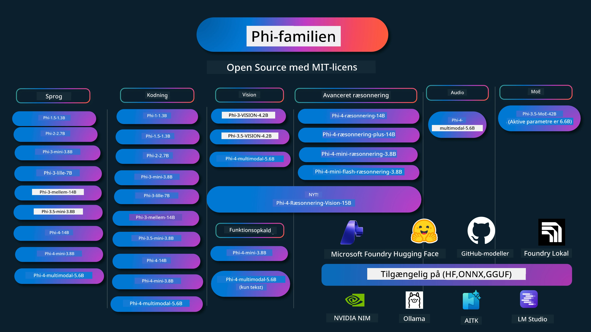

# Phi Cookbook: Praktiske eksempler med Microsofts Phi-modeller

[](https://codespaces.new/microsoft/phicookbook)
[](https://vscode.dev/redirect?url=vscode://ms-vscode-remote.remote-containers/cloneInVolume?url=https://github.com/microsoft/phicookbook)

[](https://GitHub.com/microsoft/phicookbook/graphs/contributors/?WT.mc_id=aiml-137032-kinfeylo)
[](https://GitHub.com/microsoft/phicookbook/issues/?WT.mc_id=aiml-137032-kinfeylo)
[](https://GitHub.com/microsoft/phicookbook/pulls/?WT.mc_id=aiml-137032-kinfeylo)
[](http://makeapullrequest.com?WT.mc_id=aiml-137032-kinfeylo)

[](https://GitHub.com/microsoft/phicookbook/watchers/?WT.mc_id=aiml-137032-kinfeylo)
[](https://GitHub.com/microsoft/phicookbook/network/?WT.mc_id=aiml-137032-kinfeylo)
[](https://GitHub.com/microsoft/phicookbook/stargazers/?WT.mc_id=aiml-137032-kinfeylo)

[](https://discord.com/invite/ByRwuEEgH4)

Phi er en række open source AI-modeller udviklet af Microsoft.

Phi er i øjeblikket den mest kraftfulde og omkostningseffektive lille sprogmodel (SLM), med meget gode benchmarks inden for flersprog, ræsonnering, tekst/chat-generering, kodning, billeder, lyd og andre scenarier.

Du kan implementere Phi i skyen eller på edge-enheder, og du kan nemt opbygge generative AI-applikationer med begrænset computerkraft.

Følg disse trin for at komme i gang med at bruge disse ressourcer:
1. **Fork repository'et**: Klik [](https://GitHub.com/microsoft/phicookbook/network/?WT.mc_id=aiml-137032-kinfeylo)
2. **Klon repository'et**:   `git clone https://github.com/microsoft/PhiCookBook.git`
3. [**Deltag i Microsoft AI Discord Community og mød eksperter og andre udviklere**](https://discord.com/invite/ByRwuEEgH4?WT.mc_id=aiml-137032-kinfeylo)



### 🌐 Flersproget Support

#### Understøttet via GitHub Action (Automatiseret & Altid Opdateret)

<!-- CO-OP TRANSLATOR LANGUAGES TABLE START -->
[Arabisk](../ar/README.md) | [Bengali](../bn/README.md) | [Bulgarsk](../bg/README.md) | [Burmese (Myanmar)](../my/README.md) | [Kinesisk (forenklet)](../zh-CN/README.md) | [Kinesisk (traditionelt, Hong Kong)](../zh-HK/README.md) | [Kinesisk (traditionelt, Macau)](../zh-MO/README.md) | [Kinesisk (traditionelt, Taiwan)](../zh-TW/README.md) | [Kroatisk](../hr/README.md) | [Tjekkisk](../cs/README.md) | [Dansk](./README.md) | [Hollandsk](../nl/README.md) | [Estisk](../et/README.md) | [Finsk](../fi/README.md) | [Fransk](../fr/README.md) | [Tysk](../de/README.md) | [Græsk](../el/README.md) | [Hebraisk](../he/README.md) | [Hindi](../hi/README.md) | [Ungarsk](../hu/README.md) | [Indonesisk](../id/README.md) | [Italiensk](../it/README.md) | [Japansk](../ja/README.md) | [Kannada](../kn/README.md) | [Koreansk](../ko/README.md) | [Litauisk](../lt/README.md) | [Malaysisk](../ms/README.md) | [Malayalam](../ml/README.md) | [Marathi](../mr/README.md) | [Nepalsk](../ne/README.md) | [Nigeriansk Pidgin](../pcm/README.md) | [Norsk](../no/README.md) | [Persisk (Farsi)](../fa/README.md) | [Polsk](../pl/README.md) | [Portugisisk (Brasilien)](../pt-BR/README.md) | [Portugisisk (Portugal)](../pt-PT/README.md) | [Punjabi (Gurmukhi)](../pa/README.md) | [Rumænsk](../ro/README.md) | [Russisk](../ru/README.md) | [Serbisk (kyrillisk)](../sr/README.md) | [Slovakisk](../sk/README.md) | [Slovensk](../sl/README.md) | [Spansk](../es/README.md) | [Swahili](../sw/README.md) | [Svensk](../sv/README.md) | [Tagalog (Filippinsk)](../tl/README.md) | [Tamil](../ta/README.md) | [Telugu](../te/README.md) | [Thai](../th/README.md) | [Tyrkisk](../tr/README.md) | [Ukrainsk](../uk/README.md) | [Urdu](../ur/README.md) | [Vietnamesisk](../vi/README.md)

> **Foretrækker du at klone lokalt?**
>
> Dette repository inkluderer 50+ sprogoversættelser, som betydeligt øger downloadstørrelsen. For at klone uden oversættelser, brug sparse checkout:
>
> **Bash / macOS / Linux:**
> ```bash
> git clone --filter=blob:none --sparse https://github.com/microsoft/PhiCookBook.git
> cd PhiCookBook
> git sparse-checkout set --no-cone '/*' '!translations' '!translated_images'
> ```
>
> **CMD (Windows):**
> ```cmd
> git clone --filter=blob:none --sparse https://github.com/microsoft/PhiCookBook.git
> cd PhiCookBook
> git sparse-checkout set --no-cone "/*" "!translations" "!translated_images"
> ```
>
> Dette giver dig alt hvad du har brug for for at gennemføre kurset med en meget hurtigere download.
<!-- CO-OP TRANSLATOR LANGUAGES TABLE END -->

## Indholdsfortegnelse

- Introduktion
  - [Velkommen til Phi-familien](./md/01.Introduction/01/01.PhiFamily.md)
  - [Opsætning af dit miljø](./md/01.Introduction/01/01.EnvironmentSetup.md)
  - [Forståelse af nøgle teknologier](./md/01.Introduction/01/01.Understandingtech.md)
  - [AI-sikkerhed for Phi-modeller](./md/01.Introduction/01/01.AISafety.md)
  - [Phi hardware-understøttelse](./md/01.Introduction/01/01.Hardwaresupport.md)
  - [Phi modeller & tilgængelighed på tværs af platforme](./md/01.Introduction/01/01.Edgeandcloud.md)
  - [Brug af Guidance-ai og Phi](./md/01.Introduction/01/01.Guidance.md)
  - [GitHub Marketplace modeller](https://github.com/marketplace/models)
  - [Azure AI Model katalog](https://ai.azure.com)

- Kørsel af Phi i forskellige miljøer
    -  [Hugging face](./md/01.Introduction/02/01.HF.md)
    -  [GitHub Modeller](./md/01.Introduction/02/02.GitHubModel.md)
    -  [Azure AI Foundry Model katalog](./md/01.Introduction/02/03.AzureAIFoundry.md)
    -  [Ollama](./md/01.Introduction/02/04.Ollama.md)
    -  [AI Toolkit VSCode (AITK)](./md/01.Introduction/02/05.AITK.md)
    -  [NVIDIA NIM](./md/01.Introduction/02/06.NVIDIA.md)
    -  [Foundry Local](./md/01.Introduction/02/07.FoundryLocal.md)

- Kørsel af Phi-familien
    - [Kørsel af Phi i iOS](./md/01.Introduction/03/iOS_Inference.md)
    - [Kørsel af Phi i Android](./md/01.Introduction/03/Android_Inference.md)
    - [Kørsel af Phi i Jetson](./md/01.Introduction/03/Jetson_Inference.md)
    - [Kørsel af Phi i AI PC](./md/01.Introduction/03/AIPC_Inference.md)
    - [Kørsel af Phi med Apple MLX Framework](./md/01.Introduction/03/MLX_Inference.md)
    - [Kørsel af Phi på lokal server](./md/01.Introduction/03/Local_Server_Inference.md)
    - [Kørsel af Phi på fjernserver med AI Toolkit](./md/01.Introduction/03/Remote_Interence.md)
    - [Kørsel af Phi med Rust](./md/01.Introduction/03/Rust_Inference.md)
    - [Kørsel af Phi--Vision lokalt](./md/01.Introduction/03/Vision_Inference.md)
    - [Kørsel af Phi med Kaito AKS, Azure Containers (officiel support)](./md/01.Introduction/03/Kaito_Inference.md)
-  [Kvantisering af Phi-familien](./md/01.Introduction/04/QuantifyingPhi.md)
    - [Kvantisering af Phi-3.5 / 4 med llama.cpp](./md/01.Introduction/04/UsingLlamacppQuantifyingPhi.md)
    - [Kvantisering af Phi-3.5 / 4 med Generative AI extensions til onnxruntime](./md/01.Introduction/04/UsingORTGenAIQuantifyingPhi.md)
    - [Kvantisering af Phi-3.5 / 4 med Intel OpenVINO](./md/01.Introduction/04/UsingIntelOpenVINOQuantifyingPhi.md)
    - [Kvantisering af Phi-3.5 / 4 med Apple MLX Framework](./md/01.Introduction/04/UsingAppleMLXQuantifyingPhi.md)

-  Evaluering af Phi
    - [Ansvarlig AI](./md/01.Introduction/05/ResponsibleAI.md)
    - [Azure AI Foundry til evaluering](./md/01.Introduction/05/AIFoundry.md)
    - [Brug af Promptflow til evaluering](./md/01.Introduction/05/Promptflow.md)
 
- RAG med Azure AI Search
    - [Sådan bruger du Phi-4-mini og Phi-4-multimodal (RAG) med Azure AI Search](https://github.com/microsoft/PhiCookBook/blob/main/code/06.E2E/E2E_Phi-4-RAG-Azure-AI-Search.ipynb)

- Phi applikationsudviklings-eksempler
  - Tekst- & Chat-applikationer
    - Phi-4 eksempler 🆕
      - [📓] [Chat med Phi-4-mini ONNX-model](./md/02.Application/01.TextAndChat/Phi4/ChatWithPhi4ONNX/README.md)
      - [Chat med Phi-4 lokal ONNX-model .NET](../../md/04.HOL/dotnet/src/LabsPhi4-Chat-01OnnxRuntime)
      - [Chat .NET konsol-app med Phi-4 ONNX ved brug af Semantic Kernel](../../md/04.HOL/dotnet/src/LabsPhi4-Chat-02SK)
    - Phi-3 / 3.5 eksempler
      - [Lokal chatbot i browseren med Phi3, ONNX Runtime Web og WebGPU](https://github.com/microsoft/onnxruntime-inference-examples/tree/main/js/chat)
      - [OpenVino Chat](./md/02.Application/01.TextAndChat/Phi3/E2E_OpenVino_Chat.md)
      - [Multi Model - Interaktiv Phi-3-mini og OpenAI Whisper](./md/02.Application/01.TextAndChat/Phi3/E2E_Phi-3-mini_with_whisper.md)
      - [MLFlow - Oprettelse af en wrapper og brug af Phi-3 med MLFlow](./md//02.Application/01.TextAndChat/Phi3/E2E_Phi-3-MLflow.md)
      - [Modeloptimering - Sådan optimeres Phi-3-minimodellen til ONNX Runtime Web med Olive](https://github.com/microsoft/Olive/tree/main/examples/phi3)
      - [WinUI3-app med Phi-3 mini-4k-instruct-onnx](https://github.com/microsoft/Phi3-Chat-WinUI3-Sample/)
      -[WinUI3 Multi Model AI-drevet Notes App Eksempel](https://github.com/microsoft/ai-powered-notes-winui3-sample)
      - [Finjustering og integration af brugerdefinerede Phi-3-modeller med Prompt flow](./md/02.Application/01.TextAndChat/Phi3/E2E_Phi-3-FineTuning_PromptFlow_Integration.md)
      - [Finjustering og integration af brugerdefinerede Phi-3-modeller med Prompt flow i Azure AI Foundry](./md/02.Application/01.TextAndChat/Phi3/E2E_Phi-3-FineTuning_PromptFlow_Integration_AIFoundry.md)
      - [Evaluering af den finjusterede Phi-3 / Phi-3.5-model i Azure AI Foundry med fokus på Microsofts ansvarlige AI-principper](./md/02.Application/01.TextAndChat/Phi3/E2E_Phi-3-Evaluation_AIFoundry.md)
      - [📓] [Phi-3.5-mini-instruct sprogforudsigelseseksempel (kinesisk/engelsk)](./md/02.Application/01.TextAndChat/Phi3/phi3-instruct-demo.ipynb)
      - [Phi-3.5-Instruct WebGPU RAG Chatbot](./md/02.Application/01.TextAndChat/Phi3/WebGPUWithPhi35Readme.md)
      - [Brug af Windows GPU til at oprette Prompt flow-løsning med Phi-3.5-Instruct ONNX](./md/02.Application/01.TextAndChat/Phi3/UsingPromptFlowWithONNX.md)
      - [Brug af Microsoft Phi-3.5 tflite til at oprette Android-app](./md/02.Application/01.TextAndChat/Phi3/UsingPhi35TFLiteCreateAndroidApp.md)
      - [Q&A .NET-eksempel ved brug af lokal ONNX Phi-3-model med Microsoft.ML.OnnxRuntime](../../md/04.HOL/dotnet/src/LabsPhi301)
      - [Konsol-chat .NET-app med Semantic Kernel og Phi-3](../../md/04.HOL/dotnet/src/LabsPhi302)

  - Azure AI Inference SDK-kodebaserede eksempler 
    - Phi-4-eksempler 🆕
      - [📓] [Generér projektkode ved hjælp af Phi-4-multimodal](./md/02.Application/02.Code/Phi4/GenProjectCode/README.md)
    - Phi-3 / 3.5-eksempler
      - [Byg din egen Visual Studio Code GitHub Copilot Chat med Microsoft Phi-3-familien](./md/02.Application/02.Code/Phi3/VSCodeExt/README.md)
      - [Opret din egen Visual Studio Code Chat Copilot-agent med Phi-3.5 ved hjælp af GitHub-modeller](/md/02.Application/02.Code/Phi3/CreateVSCodeChatAgentWithGitHubModels.md)

  - Avancerede ræsonnementseksempler
    - Phi-4-eksempler 🆕
      - [📓] [Phi-4-mini-reasoning eller Phi-4-reasoning eksempler](./md/02.Application/03.AdvancedReasoning/Phi4/AdvancedResoningPhi4mini/README.md)
      - [📓] [Finjustering af Phi-4-mini-reasoning med Microsoft Olive](./md/02.Application/03.AdvancedReasoning/Phi4/AdvancedResoningPhi4mini/olive_ft_phi_4_reasoning_with_medicaldata.ipynb)
      - [📓] [Finjustering af Phi-4-mini-reasoning med Apple MLX](./md/02.Application/03.AdvancedReasoning/Phi4/AdvancedResoningPhi4mini/mlx_ft_phi_4_reasoning_with_medicaldata.ipynb)
      - [📓] [Phi-4-mini-reasoning med GitHub-modeller](./md/02.Application/02.Code/Phi4r/github_models_inference.ipynb)
      - [📓] [Phi-4-mini-reasoning med Azure AI Foundry-modeller](./md/02.Application/02.Code/Phi4r/azure_models_inference.ipynb)
  - Demos
      - [Phi-4-mini-demos hostet på Hugging Face Spaces](https://huggingface.co/spaces/microsoft/phi-4-mini?WT.mc_id=aiml-137032-kinfeylo)
      - [Phi-4-multimodal dmeos hostet på Hugginge Face Spaces](https://huggingface.co/spaces/microsoft/phi-4-multimodal?WT.mc_id=aiml-137032-kinfeylo)
  - Vision-eksempler
    - Phi-4-eksempler 🆕
      - [📓] [Brug Phi-4-multimodal til at læse billeder og generere kode](./md/02.Application/04.Vision/Phi4/CreateFrontend/README.md) 
    - Phi-3 / 3.5-eksempler
      -  [📓][Phi-3-vision-Billede tekst til tekst](./md/02.Application/04.Vision/Phi3/E2E_Phi-3-vision-image-text-to-text-online-endpoint.ipynb)
      - [Phi-3-vision-ONNX](https://onnxruntime.ai/docs/genai/tutorials/phi3-v.html)
      - [📓][Phi-3-vision CLIP-embedding](./md/02.Application/04.Vision/Phi3/E2E_Phi-3-vision-image-text-to-text-online-endpoint.ipynb)
      - [DEMO: Phi-3 Recycling](https://github.com/jennifermarsman/PhiRecycling/)
      - [Phi-3-vision - Visuel sprogassistent - med Phi3-Vision og OpenVINO](https://docs.openvino.ai/nightly/notebooks/phi-3-vision-with-output.html)
      - [Phi-3 Vision Nvidia NIM](./md/02.Application/04.Vision/Phi3/E2E_Nvidia_NIM_Vision.md)
      - [Phi-3 Vision OpenVino](./md/02.Application/04.Vision/Phi3/E2E_OpenVino_Phi3Vision.md)
      - [📓][Phi-3.5 Vision multi-frame eller multi-billede eksempel](./md/02.Application/04.Vision/Phi3/phi3-vision-demo.ipynb)
      - [Phi-3 Vision Lokalt ONNX Model ved hjælp af Microsoft.ML.OnnxRuntime .NET](../../md/04.HOL/dotnet/src/LabsPhi303)
      - [Menu-baseret Phi-3 Vision Lokalt ONNX Model ved hjælp af Microsoft.ML.OnnxRuntime .NET](../../md/04.HOL/dotnet/src/LabsPhi304)

  - Matematik-eksempler
    -  Phi-4-Mini-Flash-Reasoning-Instruct Eksempler 🆕 [Matematik-demo med Phi-4-Mini-Flash-Reasoning-Instruct](./md/02.Application/09.Math/MathDemo.ipynb)

  - Audio-eksempler
    - Phi-4-eksempler 🆕
      - [📓] [Udtrækning af lydtranskriptioner ved hjælp af Phi-4-multimodal](./md/02.Application/05.Audio/Phi4/Transciption/README.md)
      - [📓] [Phi-4-multimodal lydeksempel](./md/02.Application/05.Audio/Phi4/Siri/demo.ipynb)
      - [📓] [Phi-4-multimodal taleoversættelsesseksempel](./md/02.Application/05.Audio/Phi4/Translate/demo.ipynb)
      - [.NET konsolapplikation ved brug af Phi-4-multimodal audio til analyse af en lydfil og generering af transskription](../../md/04.HOL/dotnet/src/LabsPhi4-MultiModal-02Audio)

  - MOE-eksempler
    - Phi-3 / 3.5-eksempler
      - [📓] [Phi-3.5 Mixture of Experts Models (MoEs) sociale medieeksempel](./md/02.Application/06.MoE/Phi3/phi3_moe_demo.ipynb)
      - [📓] [Oprettelse af en Retrieval-Augmented Generation (RAG) pipeline med NVIDIA NIM Phi-3 MOE, Azure AI Search og LlamaIndex](./md/02.Application/06.MoE/Phi3/azure-ai-search-nvidia-rag.ipynb)
      - 
  - Function Calling Eksempler
    - Phi-4-eksempler 🆕
      -  [📓] [Brug af Function Calling med Phi-4-mini](./md/02.Application/07.FunctionCalling/Phi4/FunctionCallingBasic/README.md)
      -  [📓] [Brug af Function Calling til at oprette multi-agenter med Phi-4-mini](./md/02.Application/07.FunctionCalling/Phi4/Multiagents/Phi_4_mini_multiagent.ipynb)
      -  [📓] [Brug af Function Calling med Ollama](./md/02.Application/07.FunctionCalling/Phi4/Ollama/ollama_functioncalling.ipynb)
      -  [📓] [Brug af Function Calling med ONNX](./md/02.Application/07.FunctionCalling/Phi4/ONNX/onnx_parallel_functioncalling.ipynb)
  - Multimodal Mixing Eksempler
    - Phi-4-eksempler 🆕
      -  [📓] [Brug af Phi-4-multimodal som teknologijournalist](./md/02.Application/08.Multimodel/Phi4/TechJournalist/phi_4_mm_audio_text_publish_news.ipynb)
      - [.NET konsolapplikation ved brug af Phi-4-multimodal til at analysere billeder](../../md/04.HOL/dotnet/src/LabsPhi4-MultiModal-01Images)

- Finjustering Phi Eksempler
  - [Finjusteringsscenarier](./md/03.FineTuning/FineTuning_Scenarios.md)
  - [Finjustering vs RAG](./md/03.FineTuning/FineTuning_vs_RAG.md)
  - [Finjustering Lad Phi-3 blive en brancheekspert](./md/03.FineTuning/LetPhi3gotoIndustriy.md)
  - [Finjustering af Phi-3 med AI Toolkit for VS Code](./md/03.FineTuning/Finetuning_VSCodeaitoolkit.md)
  - [Finjustering af Phi-3 med Azure Machine Learning Service](./md/03.FineTuning/Introduce_AzureML.md)
  - [Finjustering af Phi-3 med Lora](./md/03.FineTuning/FineTuning_Lora.md)
  - [Finjustering af Phi-3 med QLora](./md/03.FineTuning/FineTuning_Qlora.md)
  - [Finjustering af Phi-3 med Azure AI Foundry](./md/03.FineTuning/FineTuning_AIFoundry.md)
  - [Finjustering af Phi-3 med Azure ML CLI/SDK](./md/03.FineTuning/FineTuning_MLSDK.md)
  - [Finjustering med Microsoft Olive](./md/03.FineTuning/FineTuning_MicrosoftOlive.md)
  - [Finjustering med Microsoft Olive Hands-On Lab](./md/03.FineTuning/olive-lab/readme.md)
  - [Finjustering af Phi-3-vision med Weights and Bias](./md/03.FineTuning/FineTuning_Phi-3-visionWandB.md)
  - [Finjustering af Phi-3 med Apple MLX Framework](./md/03.FineTuning/FineTuning_MLX.md)
  - [Finjustering af Phi-3-vision (officiel support)](./md/03.FineTuning/FineTuning_Vision.md)
  - [Finjustering af Phi-3 med Kaito AKS , Azure Containers (officiel support)](./md/03.FineTuning/FineTuning_Kaito.md)
  - [Finjustering af Phi-3 og 3.5 Vision](https://github.com/2U1/Phi3-Vision-Finetune)

- Hands on Lab
  - [Udforskning af banebrydende modeller: LLMs, SLMs, lokal udvikling og mere](https://github.com/microsoft/aitour-exploring-cutting-edge-models)
  - [Åbning af NLP-potentiale: Finjustering med Microsoft Olive](https://github.com/azure/Ignite_FineTuning_workshop)
- Akademiske forskningspapirer og publikationer
  - [Textbooks Are All You Need II: phi-1.5 teknisk rapport](https://arxiv.org/abs/2309.05463)
  - [Phi-3 teknisk rapport: En højt kapabel sprogmodel lokalt på din telefon](https://arxiv.org/abs/2404.14219)
  - [Phi-4 teknisk rapport](https://arxiv.org/abs/2412.08905)
  - [Phi-4-Mini teknisk rapport: Kompakte men kraftfulde multimodale sprogmodeller via Mixture-of-LoRAs](https://arxiv.org/abs/2503.01743)
  - [Optimering af små sprogmodeller til funktionkald i køretøjer](https://arxiv.org/abs/2501.02342)
  - [(WhyPHI) Finjustering af PHI-3 til multiple-choice spørgsmålssvar: Metodologi, resultater og udfordringer](https://arxiv.org/abs/2501.01588)
  - [Phi-4-reasoning teknisk rapport](https://www.microsoft.com/en-us/research/wp-content/uploads/2025/04/phi_4_reasoning.pdf)
  - [Phi-4-mini-reasoning teknisk rapport](https://huggingface.co/microsoft/Phi-4-mini-reasoning/blob/main/Phi-4-Mini-Reasoning.pdf)

## Brug af Phi Modeller

### Phi på Azure AI Foundry

Du kan lære, hvordan du bruger Microsoft Phi, og hvordan du bygger E2E-løsninger på dine forskellige hardwareenheder. For at opleve Phi selv, så start med at lege med modellerne og tilpasse Phi til dine scenarier ved hjælp af [Azure AI Foundry Azure AI Model Catalog](https://aka.ms/phi3-azure-ai). Du kan lære mere i Kom godt i gang med [Azure AI Foundry](/md/02.QuickStart/AzureAIFoundry_QuickStart.md)

**Playground**  
Hver model har en dedikeret playground til at teste modellen [Azure AI Playground](https://aka.ms/try-phi3).

### Phi på GitHub Modeller

Du kan lære, hvordan du bruger Microsoft Phi, og hvordan du bygger E2E-løsninger på dine forskellige hardwareenheder. For at opleve Phi selv, så start med at lege med modellen og tilpasse Phi til dine scenarier ved hjælp af [GitHub Model Catalog](https://github.com/marketplace/models?WT.mc_id=aiml-137032-kinfeylo). Du kan lære mere i Kom godt i gang med [GitHub Model Catalog](/md/02.QuickStart/GitHubModel_QuickStart.md)

**Playground**  
Hver model har en dedikeret [playground til at teste modellen](/md/02.QuickStart/GitHubModel_QuickStart.md).

### Phi på Hugging Face

Du kan også finde modellen på [Hugging Face](https://huggingface.co/microsoft)

**Playground**  
[Hugging Chat playground](https://huggingface.co/chat/models/microsoft/Phi-3-mini-4k-instruct)

## 🎒 Andre Kurser

Vores team producerer andre kurser! Tag et kig på:

<!-- CO-OP TRANSLATOR OTHER COURSES START -->
### LangChain  
[](https://aka.ms/langchain4j-for-beginners)  
[](https://aka.ms/langchainjs-for-beginners?WT.mc_id=m365-94501-dwahlin)  
[](https://github.com/microsoft/langchain-for-beginners?WT.mc_id=m365-94501-dwahlin)  
---

### Azure / Edge / MCP / Agenter  
[](https://github.com/microsoft/AZD-for-beginners?WT.mc_id=academic-105485-koreyst)  
[](https://github.com/microsoft/edgeai-for-beginners?WT.mc_id=academic-105485-koreyst)  
[](https://github.com/microsoft/mcp-for-beginners?WT.mc_id=academic-105485-koreyst)  
[](https://github.com/microsoft/ai-agents-for-beginners?WT.mc_id=academic-105485-koreyst)  

---

### Generativ AI Serie  
[](https://github.com/microsoft/generative-ai-for-beginners?WT.mc_id=academic-105485-koreyst)  
[-9333EA?style=for-the-badge&labelColor=E5E7EB&color=9333EA)](https://github.com/microsoft/Generative-AI-for-beginners-dotnet?WT.mc_id=academic-105485-koreyst)  
[-C084FC?style=for-the-badge&labelColor=E5E7EB&color=C084FC)](https://github.com/microsoft/generative-ai-for-beginners-java?WT.mc_id=academic-105485-koreyst)  
[-E879F9?style=for-the-badge&labelColor=E5E7EB&color=E879F9)](https://github.com/microsoft/generative-ai-with-javascript?WT.mc_id=academic-105485-koreyst)  

---

### Kernelæring  
[](https://aka.ms/ml-beginners?WT.mc_id=academic-105485-koreyst)  
[](https://aka.ms/datascience-beginners?WT.mc_id=academic-105485-koreyst)  
[](https://aka.ms/ai-beginners?WT.mc_id=academic-105485-koreyst)  
[](https://github.com/microsoft/Security-101?WT.mc_id=academic-96948-sayoung)  
[](https://aka.ms/webdev-beginners?WT.mc_id=academic-105485-koreyst)  
[](https://aka.ms/iot-beginners?WT.mc_id=academic-105485-koreyst)  
[](https://github.com/microsoft/xr-development-for-beginners?WT.mc_id=academic-105485-koreyst)  

---

### Copilot Serie  
[](https://aka.ms/GitHubCopilotAI?WT.mc_id=academic-105485-koreyst)  
[](https://github.com/microsoft/mastering-github-copilot-for-dotnet-csharp-developers?WT.mc_id=academic-105485-koreyst)  
[](https://github.com/microsoft/CopilotAdventures?WT.mc_id=academic-105485-koreyst)  
<!-- CO-OP TRANSLATOR OTHER COURSES END -->

## Ansvarlig AI

Microsoft er forpligtet til at hjælpe vores kunder med at bruge vores AI-produkter ansvarligt, dele vores erfaringer og opbygge tillidsbaserede partnerskaber gennem værktøjer som Transparency Notes og Impact Assessments. Mange af disse ressourcer findes på [https://aka.ms/RAI](https://aka.ms/RAI).  
Microsofts tilgang til ansvarlig AI er baseret på vores AI-principper om retfærdighed, pålidelighed og sikkerhed, privatliv og sikkerhed, inklusivitet, gennemsigtighed og ansvarlighed.

Store skala naturlige sprog-, billed- og tale-modeller - som dem brugt i dette eksempel - kan potentielt opføre sig på måder, der er uretfærdige, upålidelige eller krænkende, hvilket kan forårsage skade. Konsulter venligst [Azure OpenAI service Transparency note](https://learn.microsoft.com/legal/cognitive-services/openai/transparency-note?tabs=text) for at blive informeret om risici og begrænsninger.

Den anbefalede tilgang til at mindske disse risici er at inkludere et sikkerhedssystem i din arkitektur, som kan opdage og forhindre skadelig adfærd. [Azure AI Content Safety](https://learn.microsoft.com/azure/ai-services/content-safety/overview) leverer et uafhængigt beskyttelseslag, der kan opdage skadeligt bruger- og AI-genereret indhold i applikationer og tjenester. Azure AI Content Safety inkluderer tekst- og billed-API’er, der gør det muligt at opdage skadeligt materiale. Inden for Azure AI Foundry giver Content Safety-tjenesten dig mulighed for at se, udforske og prøve kodeeksempler til at opdage skadeligt indhold på tværs af forskellige modaliteter. Den følgende [quickstart dokumentation](https://learn.microsoft.com/azure/ai-services/content-safety/quickstart-text?tabs=visual-studio%2Clinux&pivots=programming-language-rest) guider dig gennem at lave forespørgsler til tjenesten.
Et andet aspekt at tage højde for er den samlede applikations ydeevne. Med multimodale og multimodel-applikationer betragter vi ydeevne som, at systemet fungerer, som du og dine brugere forventer, inklusive ikke at generere skadelige output. Det er vigtigt at vurdere din samlede applikations ydeevne ved hjælp af [Performance and Quality and Risk and Safety evaluators](https://learn.microsoft.com/azure/ai-studio/concepts/evaluation-metrics-built-in). Du har også mulighed for at oprette og evaluere med [custom evaluators](https://learn.microsoft.com/azure/ai-studio/how-to/develop/evaluate-sdk#custom-evaluators).

Du kan evaluere din AI-applikation i dit udviklingsmiljø ved hjælp af [Azure AI Evaluation SDK](https://microsoft.github.io/promptflow/index.html). Givet enten et testdatasæt eller et mål, bliver dine generative AI-applikationsgenereringer kvantitativt målt med indbyggede evaluatorer eller tilpassede evaluatorer efter eget valg. For at komme i gang med azure ai evaluation sdk for at evaluere dit system, kan du følge [quickstart guiden](https://learn.microsoft.com/azure/ai-studio/how-to/develop/flow-evaluate-sdk). Når du har udført en evalueringskørsel, kan du [visualisere resultaterne i Azure AI Foundry](https://learn.microsoft.com/azure/ai-studio/how-to/evaluate-flow-results). 

## Varemærker

Dette projekt kan indeholde varemærker eller logoer for projekter, produkter eller tjenester. Autoriseret brug af Microsofts varemærker eller logoer er underlagt og skal følge [Microsofts retningslinjer for varemærker og brand](https://www.microsoft.com/legal/intellectualproperty/trademarks/usage/general).
Brug af Microsofts varemærker eller logoer i ændrede versioner af dette projekt må ikke skabe forvirring eller antyde Microsoft-sponsorering. Enhver brug af tredjeparts varemærker eller logoer er underlagt disse tredjeparts politikker.

## Få hjælp

Hvis du sidder fast eller har spørgsmål om at bygge AI-apps, deltag i:

[](https://aka.ms/foundry/discord)

Hvis du har produktfeedback eller fejl under udviklingen, besøg:

[](https://aka.ms/foundry/forum)

---

<!-- CO-OP TRANSLATOR DISCLAIMER START -->
**Ansvarsfraskrivelse**:  
Dette dokument er blevet oversat ved hjælp af AI-oversættelsestjenesten [Co-op Translator](https://github.com/Azure/co-op-translator). Selvom vi bestræber os på nøjagtighed, skal du være opmærksom på, at automatiserede oversættelser kan indeholde fejl eller unøjagtigheder. Det oprindelige dokument på dets modersmål bør betragtes som den autoritative kilde. For vigtig information anbefales professionel menneskelig oversættelse. Vi er ikke ansvarlige for eventuelle misforståelser eller fejltolkninger, der opstår som følge af brugen af denne oversættelse.
<!-- CO-OP TRANSLATOR DISCLAIMER END -->