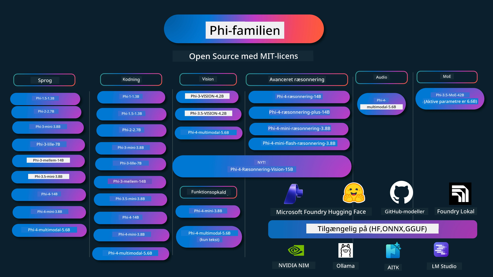

# Phi Cookbook: Praktiske Eksempler med Microsofts Phi Modeller

[](https://codespaces.new/microsoft/phicookbook)
[](https://vscode.dev/redirect?url=vscode://ms-vscode-remote.remote-containers/cloneInVolume?url=https://github.com/microsoft/phicookbook)

[](https://GitHub.com/microsoft/phicookbook/graphs/contributors/?WT.mc_id=aiml-137032-kinfeylo)
[](https://GitHub.com/microsoft/phicookbook/issues/?WT.mc_id=aiml-137032-kinfeylo)
[](https://GitHub.com/microsoft/phicookbook/pulls/?WT.mc_id=aiml-137032-kinfeylo)
[](http://makeapullrequest.com?WT.mc_id=aiml-137032-kinfeylo)

[](https://GitHub.com/microsoft/phicookbook/watchers/?WT.mc_id=aiml-137032-kinfeylo)
[](https://GitHub.com/microsoft/phicookbook/network/?WT.mc_id=aiml-137032-kinfeylo)
[](https://GitHub.com/microsoft/phicookbook/stargazers/?WT.mc_id=aiml-137032-kinfeylo)

[](https://discord.com/invite/ByRwuEEgH4)

Phi er en serie af open source AI-modeller udviklet af Microsoft.

Phi er i øjeblikket den mest kraftfulde og omkostningseffektive lille sprogmodel (SLM), med meget gode benchmarks inden for flersprogethed, ræsonnering, tekst-/chatgenerering, kodning, billeder, lyd og andre scenarier.

Du kan implementere Phi i skyen eller på edge-enheder, og du kan nemt bygge generative AI-applikationer med begrænset computerkraft.

Følg disse trin for at komme i gang med at bruge disse ressourcer:
1. **Fork Repositoriet**: Klik [](https://GitHub.com/microsoft/phicookbook/network/?WT.mc_id=aiml-137032-kinfeylo)
2. **Klon Repositoriet**:   `git clone https://github.com/microsoft/PhiCookBook.git`
3. [**Deltag i Microsoft AI Discord Community og mød eksperter og medudviklere**](https://discord.com/invite/ByRwuEEgH4?WT.mc_id=aiml-137032-kinfeylo)



### 🌐 Flersproget Support

#### Understøttet via GitHub Action (Automatiseret & Altid Opdateret)

<!-- CO-OP TRANSLATOR LANGUAGES TABLE START -->
[Arabic](../ar/README.md) | [Bengali](../bn/README.md) | [Bulgarian](../bg/README.md) | [Burmese (Myanmar)](../my/README.md) | [Chinese (Simplified)](../zh-CN/README.md) | [Chinese (Traditional, Hong Kong)](../zh-HK/README.md) | [Chinese (Traditional, Macau)](../zh-MO/README.md) | [Chinese (Traditional, Taiwan)](../zh-TW/README.md) | [Croatian](../hr/README.md) | [Czech](../cs/README.md) | [Danish](./README.md) | [Dutch](../nl/README.md) | [Estonian](../et/README.md) | [Finnish](../fi/README.md) | [French](../fr/README.md) | [German](../de/README.md) | [Greek](../el/README.md) | [Hebrew](../he/README.md) | [Hindi](../hi/README.md) | [Hungarian](../hu/README.md) | [Indonesian](../id/README.md) | [Italian](../it/README.md) | [Japanese](../ja/README.md) | [Kannada](../kn/README.md) | [Korean](../ko/README.md) | [Lithuanian](../lt/README.md) | [Malay](../ms/README.md) | [Malayalam](../ml/README.md) | [Marathi](../mr/README.md) | [Nepali](../ne/README.md) | [Nigerian Pidgin](../pcm/README.md) | [Norwegian](../no/README.md) | [Persian (Farsi)](../fa/README.md) | [Polish](../pl/README.md) | [Portuguese (Brazil)](../pt-BR/README.md) | [Portuguese (Portugal)](../pt-PT/README.md) | [Punjabi (Gurmukhi)](../pa/README.md) | [Romanian](../ro/README.md) | [Russian](../ru/README.md) | [Serbian (Cyrillic)](../sr/README.md) | [Slovak](../sk/README.md) | [Slovenian](../sl/README.md) | [Spanish](../es/README.md) | [Swahili](../sw/README.md) | [Swedish](../sv/README.md) | [Tagalog (Filipino)](../tl/README.md) | [Tamil](../ta/README.md) | [Telugu](../te/README.md) | [Thai](../th/README.md) | [Turkish](../tr/README.md) | [Ukrainian](../uk/README.md) | [Urdu](../ur/README.md) | [Vietnamese](../vi/README.md)

> **Foretrækker du at Klone Lokalt?**
>
> Dette repository inkluderer 50+ sprogoversættelser, hvilket øger downloadstørrelsen betydeligt. For at klone uden oversættelser, brug sparse checkout:
>
> **Bash / macOS / Linux:**
> ```bash
> git clone --filter=blob:none --sparse https://github.com/microsoft/PhiCookBook.git
> cd PhiCookBook
> git sparse-checkout set --no-cone '/*' '!translations' '!translated_images'
> ```
>
> **CMD (Windows):**
> ```cmd
> git clone --filter=blob:none --sparse https://github.com/microsoft/PhiCookBook.git
> cd PhiCookBook
> git sparse-checkout set --no-cone "/*" "!translations" "!translated_images"
> ```
>
> Dette giver dig alt, hvad du behøver for at gennemføre kurset med en meget hurtigere download.
<!-- CO-OP TRANSLATOR LANGUAGES TABLE END -->

## Indholdsfortegnelse
- Introduktion - [Velkommen til Phi-familien](./md/01.Introduction/01/01.PhiFamily.md) - [Opsætning af dit miljø](./md/01.Introduction/01/01.EnvironmentSetup.md) - [Forståelse af nøgle teknologier](./md/01.Introduction/01/01.Understandingtech.md) - [AI-sikkerhed for Phi-modeller](./md/01.Introduction/01/01.AISafety.md) - [Phi hardwareunderstøttelse](./md/01.Introduction/01/01.Hardwaresupport.md) - [Phi modeller & tilgængelighed på tværs af platforme](./md/01.Introduction/01/01.Edgeandcloud.md) - [Brug af Guidance-ai og Phi](./md/01.Introduction/01/01.Guidance.md) - [GitHub Marketplace modeller](https://github.com/marketplace/models) - [Azure AI Model Katalog](https://ai.azure.com) - Inference Phi i forskellige miljøer - [Hugging face](./md/01.Introduction/02/01.HF.md) - [GitHub modeller](./md/01.Introduction/02/02.GitHubModel.md) - [Microsoft Foundry modelkatalog](./md/01.Introduction/02/03.AzureAIFoundry.md) - [Ollama](./md/01.Introduction/02/04.Ollama.md) - [AI Toolkit VSCode (AITK)](./md/01.Introduction/02/05.AITK.md) - [NVIDIA NIM](./md/01.Introduction/02/06.NVIDIA.md) - [Foundry Local](./md/01.Introduction/02/07.FoundryLocal.md) - Inference Phi-familien - [Inference Phi i iOS](./md/01.Introduction/03/iOS_Inference.md) - [Inference Phi i Android](./md/01.Introduction/03/Android_Inference.md) - [Inference Phi i Jetson](./md/01.Introduction/03/Jetson_Inference.md) - [Inference Phi i AI PC](./md/01.Introduction/03/AIPC_Inference.md) - [Inference Phi med Apple MLX Framework](./md/01.Introduction/03/MLX_Inference.md) - [Inference Phi i lokal server](./md/01.Introduction/03/Local_Server_Inference.md) - [Inference Phi i fjernserver ved hjælp af AI Toolkit](./md/01.Introduction/03/Remote_Interence.md) - [Inference Phi med Rust](./md/01.Introduction/03/Rust_Inference.md) - [Inference Phi - Vision lokalt](./md/01.Introduction/03/Vision_Inference.md) - [Inference Phi med Kaito AKS, Azure Containers (officiel support)](./md/01.Introduction/03/Kaito_Inference.md) - [Kvantisering af Phi-familien](./md/01.Introduction/04/QuantifyingPhi.md) - [Kvantisering af Phi-3.5 / 4 ved brug af llama.cpp](./md/01.Introduction/04/UsingLlamacppQuantifyingPhi.md) - [Kvantisering af Phi-3.5 / 4 ved brug af Generative AI-udvidelser til onnxruntime](./md/01.Introduction/04/UsingORTGenAIQuantifyingPhi.md) - [Kvantisering af Phi-3.5 / 4 ved brug af Intel OpenVINO](./md/01.Introduction/04/UsingIntelOpenVINOQuantifyingPhi.md) - [Kvantisering af Phi-3.5 / 4 ved brug af Apple MLX Framework](./md/01.Introduction/04/UsingAppleMLXQuantifyingPhi.md) - Evaluering af Phi - [Ansvarlig AI](./md/01.Introduction/05/ResponsibleAI.md) - [Microsoft Foundry til evaluering](./md/01.Introduction/05/AIFoundry.md) - [Brug af Promptflow til evaluering](./md/01.Introduction/05/Promptflow.md) - RAG med Azure AI Search - [Sådan bruger du Phi-4-mini og Phi-4-multimodal (RAG) med Azure AI Search](https://github.com/microsoft/PhiCookBook/blob/main/code/06.E2E/E2E_Phi-4-RAG-Azure-AI-Search.ipynb) - Phi applikationsudviklings eksempler - Tekst- & chatapplikationer - Phi-4 eksempler - [📓] [Chat med Phi-4-mini ONNX-model](./md/02.Application/01.TextAndChat/Phi4/ChatWithPhi4ONNX/README.md) - [Chat med Phi-4 lokal ONNX-model .NET](../../md/04.HOL/dotnet/src/LabsPhi4-Chat-01OnnxRuntime) - [Chat .NET konsolapp med Phi-4 ONNX ved brug af Semantic Kernel](../../md/04.HOL/dotnet/src/LabsPhi4-Chat-02SK) - Phi-3 / 3.5 eksempler - [Lokal chatbot i browseren ved brug af Phi3, ONNX Runtime Web og WebGPU](https://github.com/microsoft/onnxruntime-inference-examples/tree/main/js/chat) - [OpenVino Chat](./md/02.Application/01.TextAndChat/Phi3/E2E_OpenVino_Chat.md) - [Multi Model - Interaktiv Phi-3-mini og OpenAI Whisper](./md/02.Application/01.TextAndChat/Phi3/E2E_Phi-3-mini_with_whisper.md) - [MLFlow - Byg en wrapper og brug Phi-3 med MLFlow](./md//02.Application/01.TextAndChat/Phi3/E2E_Phi-3-MLflow.md) - [Modeloptimering - Sådan optimerer du Phi-3-min-modellen til ONNX Runtime Web med Olive](https://github.com/microsoft/Olive/tree/main/examples/phi3) - [WinUI3 app med Phi-3 mini-4k-instruct-onnx](https://github.com/microsoft/Phi3-Chat-WinUI3-Sample/) -[WinUI3 Multi Model AI-drevet Notes App Eksempel](https://github.com/microsoft/ai-powered-notes-winui3-sample) - [Finjuster og integrer brugerdefinerede Phi-3 modeller med Prompt flow](./md/02.Application/01.TextAndChat/Phi3/E2E_Phi-3-FineTuning_PromptFlow_Integration.md) - [Finjuster og integrer brugerdefinerede Phi-3 modeller med Prompt flow i Microsoft Foundry](./md/02.Application/01.TextAndChat/Phi3/E2E_Phi-3-FineTuning_PromptFlow_Integration_AIFoundry.md) - [Evaluer den finjusterede Phi-3 / Phi-3.5 model i Microsoft Foundry med fokus på Microsofts principper for ansvarlig AI](./md/02.Application/01.TextAndChat/Phi3/E2E_Phi-3-Evaluation_AIFoundry.md) - [📓] [Phi-3.5-mini-instruct sprogforudsigelseseksempel (kinesisk/engelsk)](./md/02.Application/01.TextAndChat/Phi3/phi3-instruct-demo.ipynb) - [Phi-3.5-Instruct WebGPU RAG Chatbot](./md/02.Application/01.TextAndChat/Phi3/WebGPUWithPhi35Readme.md) - [Brug Windows GPU til at oprette Prompt flow-løsning med Phi-3.5-Instruct ONNX](./md/02.Application/01.TextAndChat/Phi3/UsingPromptFlowWithONNX.md) - [Brug Microsoft Phi-3.5 tflite til at skabe Android app](./md/02.Application/01.TextAndChat/Phi3/UsingPhi35TFLiteCreateAndroidApp.md) - [Q&A .NET eksempel ved brug af lokal ONNX Phi-3 model med Microsoft.ML.OnnxRuntime](../../md/04.HOL/dotnet/src/LabsPhi301) - [Konsol chat .NET app med Semantic Kernel og Phi-3](../../md/04.HOL/dotnet/src/LabsPhi302) - Azure AI Inference SDK kodebaserede eksempler - Phi-4 eksempler - [📓] [Generer projektkode med Phi-4-multimodal](./md/02.Application/02.Code/Phi4/GenProjectCode/README.md) - Phi-3 / 3.5 eksempler - [Byg din egen Visual Studio Code GitHub Copilot Chat med Microsoft Phi-3 familien](./md/02.Application/02.Code/Phi3/VSCodeExt/README.md) - [Opret din egen Visual Studio Code Chat Copilot Agent med Phi-3.5 ved GitHub modeller](./md/02.Application/02.Code/Phi3/CreateVSCodeChatAgentWithGitHubModels.md) - Avancerede ræsonnementseksempler - Phi-4 eksempler - [📓] [Phi-4-mini-ræsonnement eller Phi-4-ræsonnement eksempler](./md/02.Application/03.AdvancedReasoning/Phi4/AdvancedResoningPhi4mini/README.md) - [📓] [Finjustering af Phi-4-mini-ræsonnement med Microsoft Olive](./md/02.Application/03.AdvancedReasoning/Phi4/AdvancedResoningPhi4mini/olive_ft_phi_4_reasoning_with_medicaldata.ipynb) - [📓] [Finjustering af Phi-4-mini-ræsonnement med Apple MLX](./md/02.Application/03.AdvancedReasoning/Phi4/AdvancedResoningPhi4mini/mlx_ft_phi_4_reasoning_with_medicaldata.ipynb) - [📓] [Phi-4-mini-ræsonnement med GitHub modeller](./md/02.Application/02.Code/Phi4r/github_models_inference.ipynb) - [📓] [Phi-4-mini-ræsonnement med Microsoft Foundry modeller](./md/02.Application/02.Code/Phi4r/azure_models_inference.ipynb) -
Demos - [Phi-4-mini demos hostet på Hugging Face Spaces](https://huggingface.co/spaces/microsoft/phi-4-mini?WT.mc_id=aiml-137032-kinfeylo) - [Phi-4-multimodal demos hostet på Hugginge Face Spaces](https://huggingface.co/spaces/microsoft/phi-4-multimodal?WT.mc_id=aiml-137032-kinfeylo) - Vision Eksempler - Phi-4 Eksempler - [📓] [Brug Phi-4-multimodal til at læse billeder og generere kode](./md/02.Application/04.Vision/Phi4/CreateFrontend/README.md) - Phi-3 / 3.5 Eksempler - [📓][Phi-3-vision-Billedtekst til tekst](./md/02.Application/04.Vision/Phi3/E2E_Phi-3-vision-image-text-to-text-online-endpoint.ipynb) - [Phi-3-vision-ONNX](https://onnxruntime.ai/docs/genai/tutorials/phi3-v.html) - [📓][Phi-3-vision CLIP Embedding](./md/02.Application/04.Vision/Phi3/E2E_Phi-3-vision-image-text-to-text-online-endpoint.ipynb) - [DEMO: Phi-3 Genbrug](https://github.com/jennifermarsman/PhiRecycling/) - [Phi-3-vision - Visuel sprogassistent - med Phi3-Vision og OpenVINO](https://docs.openvino.ai/nightly/notebooks/phi-3-vision-with-output.html) - [Phi-3 Vision Nvidia NIM](./md/02.Application/04.Vision/Phi3/E2E_Nvidia_NIM_Vision.md) - [Phi-3 Vision OpenVino](./md/02.Application/04.Vision/Phi3/E2E_OpenVino_Phi3Vision.md) - [📓][Phi-3.5 Vision multi-frame eller multi-billede eksempel](./md/02.Application/04.Vision/Phi3/phi3-vision-demo.ipynb) - [Phi-3 Vision Lokal ONNX Model med Microsoft.ML.OnnxRuntime .NET](../../md/04.HOL/dotnet/src/LabsPhi303) - [Menu-baseret Phi-3 Vision Lokal ONNX Model med Microsoft.ML.OnnxRuntime .NET](../../md/04.HOL/dotnet/src/LabsPhi304) - Reasoning-Vision Eksempler - Phi-4-Reasoning-Vision-15B - [📓] [Brug af Phi-4-Reasoning-Vision-15B til at opdage krydsning](./md/02.Application/10.ReasoningVision/Phi_4_reasoning_vision_15b_Jaywalking.ipynb) - [📓] [Brug af Phi-4-Reasoning-Vision-15B til matematik](./md/02.Application/10.ReasoningVision/Phi_4_reasoning_vision_15b_Math.ipynb) - [📓] [Brug af Phi-4-Reasoning-Vision-15B til at opdage UI](./md/02.Application/10.ReasoningVision/Phi_4_reasoning_vision_15b_ui.ipynb) - Matematik Eksempler - Phi-4-Mini-Flash-Reasoning-Instruct Eksempler [Matematik Demo med Phi-4-Mini-Flash-Reasoning-Instruct](./md/02.Application/09.Math/MathDemo.ipynb) - Audio Eksempler - Phi-4 Eksempler - [📓] [Udtrækning af lydtransskriptioner ved hjælp af Phi-4-multimodal](./md/02.Application/05.Audio/Phi4/Transciption/README.md) - [📓] [Phi-4-multimodal Audio Eksempel](./md/02.Application/05.Audio/Phi4/Siri/demo.ipynb) - [📓] [Phi-4-multimodal Taletranslation Eksempel](./md/02.Application/05.Audio/Phi4/Translate/demo.ipynb) - [.NET konsolapplikation der bruger Phi-4-multimodal Audio til at analysere en lydfil og generere transskription](../../md/04.HOL/dotnet/src/LabsPhi4-MultiModal-02Audio) - MOE Eksempler - Phi-3 / 3.5 Eksempler - [📓] [Phi-3.5 Mixture of Experts Models (MoEs) Sociale Medier Eksempel](./md/02.Application/06.MoE/Phi3/phi3_moe_demo.ipynb) - [📓] [Opbygning af en Retrieval-Augmented Generation (RAG) Pipeline med NVIDIA NIM Phi-3 MOE, Azure AI Search og LlamaIndex](./md/02.Application/06.MoE/Phi3/azure-ai-search-nvidia-rag.ipynb) - - Funktionsopkald Eksempler - Phi-4 Eksempler 🆕 - [📓] [Brug af Funktionsopkald med Phi-4-mini](./md/02.Application/07.FunctionCalling/Phi4/FunctionCallingBasic/README.md) - [📓] [Brug af Funktionsopkald til at skabe multi-agenter med Phi-4-mini](./md/02.Application/07.FunctionCalling/Phi4/Multiagents/Phi_4_mini_multiagent.ipynb) - [📓] [Brug af Funktionsopkald med Ollama](./md/02.Application/07.FunctionCalling/Phi4/Ollama/ollama_functioncalling.ipynb) - [📓] [Brug af Funktionsopkald med ONNX](./md/02.Application/07.FunctionCalling/Phi4/ONNX/onnx_parallel_functioncalling.ipynb) - Multimodal Blandings Eksempler - Phi-4 Eksempler 🆕 - [📓] [Brug af Phi-4-multimodal som Teknologijournalist](./md/02.Application/08.Multimodel/Phi4/TechJournalist/phi_4_mm_audio_text_publish_news.ipynb) - [.NET konsolapplikation der bruger Phi-4-multimodal til at analysere billeder](../../md/04.HOL/dotnet/src/LabsPhi4-MultiModal-01Images) - Finjustering Phi Eksempler - [Finjustering Scenarier](./md/03.FineTuning/FineTuning_Scenarios.md) - [Finjustering vs RAG](./md/03.FineTuning/FineTuning_vs_RAG.md) - [Finjustering Lad Phi-3 blive en brancheekspert](./md/03.FineTuning/LetPhi3gotoIndustriy.md) - [Finjustering Phi-3 med AI Toolkit for VS Code](./md/03.FineTuning/Finetuning_VSCodeaitoolkit.md) - [Finjustering Phi-3 med Azure Machine Learning Service](./md/03.FineTuning/Introduce_AzureML.md) - [Finjustering Phi-3 med Lora](./md/03.FineTuning/FineTuning_Lora.md) - [Finjustering Phi-3 med QLora](./md/03.FineTuning/FineTuning_Qlora.md) - [Finjustering Phi-3 med Microsoft Foundry](./md/03.FineTuning/FineTuning_AIFoundry.md) - [Finjustering Phi-3 med Azure ML CLI/SDK](./md/03.FineTuning/FineTuning_MLSDK.md) - [Finjustering med Microsoft Olive](./md/03.FineTuning/FineTuning_MicrosoftOlive.md) - [Finjustering med Microsoft Olive Hands-On Lab](./md/03.FineTuning/olive-lab/readme.md) - [Finjustering Phi-3-vision med Weights and Bias](./md/03.FineTuning/FineTuning_Phi-3-visionWandB.md) - [Finjustering Phi-3 med Apple MLX Framework](./md/03.FineTuning/FineTuning_MLX.md) - [Finjustering Phi-3-vision (officiel support)](./md/03.FineTuning/FineTuning_Vision.md) - [Finjustering Phi-3 med Kaito AKS, Azure Containers (officiel Support)](./md/03.FineTuning/FineTuning_Kaito.md) - [Finjustering Phi-3 og 3.5 Vision](https://github.com/2U1/Phi3-Vision-Finetune) - Hands on Lab - [Udforskning af banebrydende modeller: LLMs, SLMs, lokal udvikling og mere](https://github.com/microsoft/aitour-exploring-cutting-edge-models) - [Frigørelse af NLP potentiale: Finjustering med Microsoft Olive](https://github.com/azure/Ignite_FineTuning_workshop) - Akademiske forskningspapirer og publikationer - [Textbooks Are All You Need II: phi-1.5 teknisk rapport](https://arxiv.org/abs/2309.05463) - [Phi-3 Teknisk Rapport: En højtydende sproglmodel lokalt på din telefon](https://arxiv.org/abs/2404.14219) - [Phi-4 Teknisk Rapport](https://arxiv.org/abs/2412.08905) - [Phi-4-Mini Teknisk Rapport: Kompakte men kraftfulde multimodale sproglmodeller via Mixture-of-LoRAs](https://arxiv.org/abs/2503.01743) - [Optimering af små sproglmodeller til funktion-opkald i køretøj](https://arxiv.org/abs/2501.02342) - [(WhyPHI) Finjustering PHI-3 til multiple-choice spørgsmål og svar: Metodologi, resultater og udfordringer](https://arxiv.org/abs/2501.01588) - [Phi-4-reasoning Teknisk Rapport](https://www.microsoft.com/en-us/research/wp-content/uploads/2025/04/phi_4_reasoning.pdf)
- [Phi-4-mini-resonerings Teknisk Rapport](https://huggingface.co/microsoft/Phi-4-mini-reasoning/blob/main/Phi-4-Mini-Reasoning.pdf)
# Phi Cookbook: Praktiske Eksempler med Microsofts Phi Modeller

[](https://codespaces.new/microsoft/phicookbook)
[](https://vscode.dev/redirect?url=vscode://ms-vscode-remote.remote-containers/cloneInVolume?url=https://github.com/microsoft/phicookbook)

[](https://GitHub.com/microsoft/phicookbook/graphs/contributors/?WT.mc_id=aiml-137032-kinfeylo)
[](https://GitHub.com/microsoft/phicookbook/issues/?WT.mc_id=aiml-137032-kinfeylo)
[](https://GitHub.com/microsoft/phicookbook/pulls/?WT.mc_id=aiml-137032-kinfeylo)
[](http://makeapullrequest.com?WT.mc_id=aiml-137032-kinfeylo)

[](https://GitHub.com/microsoft/phicookbook/watchers/?WT.mc_id=aiml-137032-kinfeylo)
[](https://GitHub.com/microsoft/phicookbook/network/?WT.mc_id=aiml-137032-kinfeylo)
[](https://GitHub.com/microsoft/phicookbook/stargazers/?WT.mc_id=aiml-137032-kinfeylo)

[](https://discord.com/invite/ByRwuEEgH4)

Phi er en serie af open source AI-modeller udviklet af Microsoft.

Phi er i øjeblikket den mest kraftfulde og omkostningseffektive lille sprogmodel (SLM) med meget gode benchmarks inden for flersprogede, ræsonnering, tekst/chat generering, kodning, billeder, lyd og andre scenarier.

Du kan implementere Phi i skyen eller på edge-enheder, og du kan nemt bygge generative AI-applikationer med begrænset regnekraft.

Følg disse trin for at komme i gang med at bruge disse ressourcer:
1. **Fork Repositoryet**: Klik [](https://GitHub.com/microsoft/phicookbook/network/?WT.mc_id=aiml-137032-kinfeylo)
2. **Klon Repositoryet**: `git clone https://github.com/microsoft/PhiCookBook.git`
3. [**Deltag i Microsoft AI Discord Fællesskabet og mød eksperter og medudviklere**](https://discord.com/invite/ByRwuEEgH4?WT.mc_id=aiml-137032-kinfeylo)


### 🌐 Flersproget Support

#### Understøttet via GitHub Action (Automatiseret & Altid Opdateret)

<!-- CO-OP TRANSLATOR LANGUAGES TABLE START -->
[Arabisk](../ar/README.md) | [Bengali](../bn/README.md) | [Bulgarsk](../bg/README.md) | [Burmesisk (Myanmar)](../my/README.md) | [Kinesisk (Forenklet)](../zh-CN/README.md) | [Kinesisk (Traditionel, Hong Kong)](../zh-HK/README.md) | [Kinesisk (Traditionel, Macau)](../zh-MO/README.md) | [Kinesisk (Traditionel, Taiwan)](../zh-TW/README.md) | [Kroatisk](../hr/README.md) | [Tjekkisk](../cs/README.md) | [Dansk](./README.md) | [Hollandsk](../nl/README.md) | [Estisk](../et/README.md) | [Finsk](../fi/README.md) | [Fransk](../fr/README.md) | [Tysk](../de/README.md) | [Græsk](../el/README.md) | [Hebraisk](../he/README.md) | [Hindi](../hi/README.md) | [Ungarsk](../hu/README.md) | [Indonesisk](../id/README.md) | [Italiensk](../it/README.md) | [Japansk](../ja/README.md) | [Kannada](../kn/README.md) | [Koreansk](../ko/README.md) | [Litauisk](../lt/README.md) | [Malaysisk](../ms/README.md) | [Malayalam](../ml/README.md) | [Marathi](../mr/README.md) | [Nepalesisk](../ne/README.md) | [Nigeriansk Pidgin](../pcm/README.md) | [Norsk](../no/README.md) | [Persisk (Farsi)](../fa/README.md) | [Polsk](../pl/README.md) | [Portugisisk (Brasilien)](../pt-BR/README.md) | [Portugisisk (Portugal)](../pt-PT/README.md) | [Punjabi (Gurmukhi)](../pa/README.md) | [Rumænsk](../ro/README.md) | [Russisk](../ru/README.md) | [Serbisk (Kyrillisk)](../sr/README.md) | [Slovakisk](../sk/README.md) | [Slovensk](../sl/README.md) | [Spansk](../es/README.md) | [Swahili](../sw/README.md) | [Svensk](../sv/README.md) | [Tagalog (Filippinsk)](../tl/README.md) | [Tamil](../ta/README.md) | [Telugu](../te/README.md) | [Thai](../th/README.md) | [Tyrkisk](../tr/README.md) | [Ukrainsk](../uk/README.md) | [Urdu](../ur/README.md) | [Vietnamesisk](../vi/README.md)

> **Foretrækker du at klone lokalt?**
>
> Dette repository indeholder 50+ sprogoversættelser, hvilket øger downloadstørrelsen betydeligt. For at klone uden oversættelser, brug sparse checkout:
>
> **Bash / macOS / Linux:**
> ```bash
> git clone --filter=blob:none --sparse https://github.com/microsoft/PhiCookBook.git
> cd PhiCookBook
> git sparse-checkout set --no-cone '/*' '!translations' '!translated_images'
> ```
>
> **CMD (Windows):**
> ```cmd
> git clone --filter=blob:none --sparse https://github.com/microsoft/PhiCookBook.git
> cd PhiCookBook
> git sparse-checkout set --no-cone "/*" "!translations" "!translated_images"
> ```
>
> Dette giver dig alt hvad du har brug for til at fuldføre kurset med en meget hurtigere download.
<!-- CO-OP TRANSLATOR LANGUAGES TABLE END -->

## Indholdsfortegnelse

## Brug af Phi Modeller

### Phi på Microsoft Foundry

Du kan lære, hvordan du bruger Microsoft Phi, og hvordan du bygger E2E-løsninger på dine forskellige hardwareenheder. For at opleve Phi selv, start med at lege med modellerne og tilpasse Phi til dine scenarier ved hjælp af [Microsoft Foundry Azure AI Model Catalog](https://aka.ms/phi3-azure-ai). Du kan lære mere i Kom godt i gang med [Microsoft Foundry](/md/02.QuickStart/AzureAIFoundry_QuickStart.md)

**Playground**
Hver model har en dedikeret playground til at teste modellen [Azure AI Playground](https://aka.ms/try-phi3).

### Phi på GitHub Modeller

Du kan lære, hvordan du bruger Microsoft Phi, og hvordan du bygger E2E-løsninger på dine forskellige hardwareenheder. For at opleve Phi selv, start med at lege med modellen og tilpasse Phi til dine scenarier ved hjælp af [GitHub Model Catalog](https://github.com/marketplace/models?WT.mc_id=aiml-137032-kinfeylo). Du kan lære mere i Kom godt i gang med [GitHub Model Catalog](/md/02.QuickStart/GitHubModel_QuickStart.md)

**Playground**
Hver model har en dedikeret [playground til at teste modellen](/md/02.QuickStart/GitHubModel_QuickStart.md).

### Phi på Hugging Face

Du kan også finde modellen på [Hugging Face](https://huggingface.co/microsoft)

**Playground**
[Hugging Chat playground](https://huggingface.co/chat/models/microsoft/Phi-3-mini-4k-instruct)

## 🎒 Andre Kurser

Vores team producerer andre kurser! Se dem her:

<!-- CO-OP TRANSLATOR OTHER COURSES START -->
### LangChain
[](https://aka.ms/langchain4j-for-beginners)
[](https://aka.ms/langchainjs-for-beginners?WT.mc_id=m365-94501-dwahlin)
[](https://github.com/microsoft/langchain-for-beginners?WT.mc_id=m365-94501-dwahlin)
---

### Azure / Edge / MCP / Agenter
[](https://github.com/microsoft/AZD-for-beginners?WT.mc_id=academic-105485-koreyst)
[](https://github.com/microsoft/edgeai-for-beginners?WT.mc_id=academic-105485-koreyst)
[](https://github.com/microsoft/mcp-for-beginners?WT.mc_id=academic-105485-koreyst)
[](https://github.com/microsoft/ai-agents-for-beginners?WT.mc_id=academic-105485-koreyst)

---
 
### Generativ AI Serie
[](https://github.com/microsoft/generative-ai-for-beginners?WT.mc_id=academic-105485-koreyst)
[-9333EA?style=for-the-badge&labelColor=E5E7EB&color=9333EA)](https://github.com/microsoft/Generative-AI-for-beginners-dotnet?WT.mc_id=academic-105485-koreyst)
[-C084FC?style=for-the-badge&labelColor=E5E7EB&color=C084FC)](https://github.com/microsoft/generative-ai-for-beginners-java?WT.mc_id=academic-105485-koreyst)
[-E879F9?style=for-the-badge&labelColor=E5E7EB&color=E879F9)](https://github.com/microsoft/generative-ai-with-javascript?WT.mc_id=academic-105485-koreyst)

---
 
### Kerne Læring
[](https://aka.ms/ml-beginners?WT.mc_id=academic-105485-koreyst)
[](https://aka.ms/datascience-beginners?WT.mc_id=academic-105485-koreyst)
[](https://aka.ms/ai-beginners?WT.mc_id=academic-105485-koreyst)
[](https://github.com/microsoft/Security-101?WT.mc_id=academic-96948-sayoung)
[](https://aka.ms/webdev-beginners?WT.mc_id=academic-105485-koreyst)
[](https://aka.ms/iot-beginners?WT.mc_id=academic-105485-koreyst)
[](https://github.com/microsoft/xr-development-for-beginners?WT.mc_id=academic-105485-koreyst)

---
 
### Copilot Serie
[](https://aka.ms/GitHubCopilotAI?WT.mc_id=academic-105485-koreyst)
[](https://github.com/microsoft/mastering-github-copilot-for-dotnet-csharp-developers?WT.mc_id=academic-105485-koreyst)
[](https://github.com/microsoft/CopilotAdventures?WT.mc_id=academic-105485-koreyst)
<!-- CO-OP TRANSLATOR OTHER COURSES END -->

## Ansvarlig AI

Microsoft er engageret i at hjælpe vores kunder med at bruge vores AI-produkter ansvarligt, dele vores erfaringer og opbygge tillidsbaserede partnerskaber gennem værktøjer som Transparency Notes og Impact Assessments. Mange af disse ressourcer kan findes på [https://aka.ms/RAI](https://aka.ms/RAI).
Microsofts tilgang til ansvarlig AI er baseret på vores AI-principper om retfærdighed, pålidelighed og sikkerhed, privatliv og sikkerhed, inklusivitet, gennemsigtighed og ansvarlighed.

Storskala naturlige sprog-, billede- og talemodeller - som dem der bruges i dette eksempel - kan potentielt opføre sig på måder, der er uretfærdige, upålidelige eller stødende, hvilket kan forårsage skade. Se venligst [Azure OpenAI service Transparency note](https://learn.microsoft.com/legal/cognitive-services/openai/transparency-note?tabs=text) for at blive informeret om risici og begrænsninger.

Den anbefalede tilgang til at afbøde disse risici er at inkludere et sikkerhedssystem i din arkitektur, der kan opdage og forhindre skadelig adfærd. [Azure AI Content Safety](https://learn.microsoft.com/azure/ai-services/content-safety/overview) leverer et uafhængigt beskyttelseslag, der kan opdage skadeligt bruger- og AI-genereret indhold i applikationer og tjenester. Azure AI Content Safety inkluderer tekst- og billed-API'er, der giver dig mulighed for at opdage materiale, der er skadeligt. Inden for Microsoft Foundry giver Content Safety-tjenesten dig mulighed for at se, udforske og prøve eksempel kode til at opdage skadeligt indhold på tværs af forskellige modaliteter. Følgende [quickstart-dokumentation](https://learn.microsoft.com/azure/ai-services/content-safety/quickstart-text?tabs=visual-studio%2Clinux&pivots=programming-language-rest) guider dig gennem at lave forespørgsler til tjenesten.

Et andet aspekt at tage i betragtning er den samlede applikationsydelse. Ved multimodale og multimodel-applikationer anser vi ydelse som, at systemet fungerer som du og dine brugere forventer, herunder at der ikke genereres skadelige output. Det er vigtigt at vurdere ydelsen af din samlede applikation ved hjælp af [Performance and Quality and Risk and Safety evaluators](https://learn.microsoft.com/azure/ai-studio/concepts/evaluation-metrics-built-in). Du har også mulighed for at oprette og evaluere med [tilpassede evaluatorer](https://learn.microsoft.com/azure/ai-studio/how-to/develop/evaluate-sdk#custom-evaluators).

Du kan evaluere din AI-applikation i dit udviklingsmiljø ved hjælp af [Azure AI Evaluation SDK](https://microsoft.github.io/promptflow/index.html). Givet enten et testdatasæt eller et mål, bliver dine generative AI-applikationsgenereringer kvantitativt målt med indbyggede evaluatorer eller tilpassede evaluatorer efter eget valg. For at komme i gang med Azure AI Evaluation SDK til at evaluere dit system, kan du følge [quickstart-guiden](https://learn.microsoft.com/azure/ai-studio/how-to/develop/flow-evaluate-sdk). Når du har gennemført en evalueringskørsel, kan du [visualisere resultaterne i Microsoft Foundry](https://learn.microsoft.com/azure/ai-studio/how-to/evaluate-flow-results).

## Varemærker

Dette projekt kan indeholde varemærker eller logoer for projekter, produkter eller tjenester. Autoriseret brug af Microsoft varemærker eller logoer er underlagt og skal følge [Microsofts Varemærke- og Brandretningslinjer](https://www.microsoft.com/legal/intellectualproperty/trademarks/usage/general).
Brug af Microsoft varemærker eller logoer i modificerede versioner af dette projekt må ikke forårsage forvirring eller antyde Microsoft-sponsorship. Enhver brug af tredjeparts varemærker eller logoer er underlagt de pågældende tredjeparts politikker.

## Få Hjælp

Hvis du sidder fast eller har spørgsmål om at bygge AI-apps, deltag i:

[](https://aka.ms/foundry/discord)

Hvis du har produktfeedback eller oplever fejl under udvikling, besøg:

[](https://aka.ms/foundry/forum)

---

<!-- CO-OP TRANSLATOR DISCLAIMER START -->
**Ansvarsfraskrivelse**:  
Dette dokument er oversat ved hjælp af AI-oversættelsestjenesten [Co-op Translator](https://github.com/Azure/co-op-translator). Selvom vi bestræber os på nøjagtighed, bedes du være opmærksom på, at automatiserede oversættelser kan indeholde fejl eller unøjagtigheder. Det oprindelige dokument på dets modersmål bør betragtes som den autoritative kilde. For kritisk information anbefales professionel menneskelig oversættelse. Vi påtager os intet ansvar for misforståelser eller fejltolkninger, der opstår som følge af brugen af denne oversættelse.
<!-- CO-OP TRANSLATOR DISCLAIMER END -->