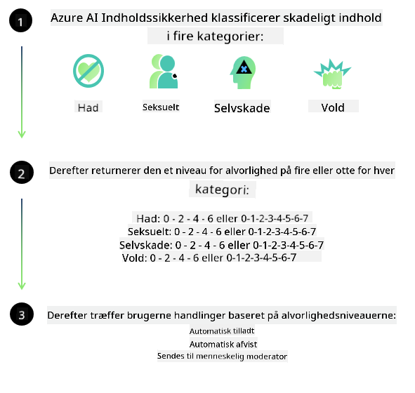
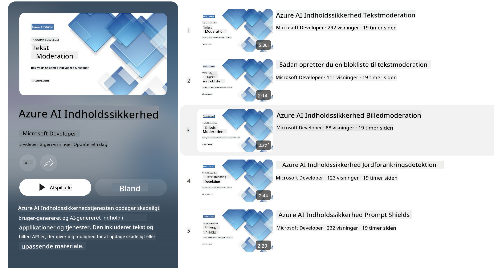

<!--
CO_OP_TRANSLATOR_METADATA:
{
  "original_hash": "c8273672cc57df2be675407a1383aaf0",
  "translation_date": "2025-05-09T06:03:20+00:00",
  "source_file": "md/01.Introduction/01/01.AISafety.md",
  "language_code": "da"
}
-->
# AI-sikkerhed for Phi-modeller  
Phi-familien af modeller blev udviklet i overensstemmelse med [Microsoft Responsible AI Standard](https://query.prod.cms.rt.microsoft.com/cms/api/am/binary/RE5cmFl), som er et virksomheds-dækkende sæt krav baseret på følgende seks principper: ansvarlighed, gennemsigtighed, retfærdighed, pålidelighed og sikkerhed, privatliv og sikkerhed samt inklusivitet, der tilsammen udgør [Microsofts Responsible AI-principper](https://www.microsoft.com/ai/responsible-ai).  

Ligesom de tidligere Phi-modeller blev der anvendt en flerstrenget sikkerhedsvurdering og sikkerheds-efteruddannelsesmetode, med yderligere tiltag for at tage højde for denne udgivelses flersprogede kapaciteter. Vores tilgang til sikkerhedstræning og evalueringer, herunder test på tværs af flere sprog og risikokategorier, er beskrevet i [Phi Safety Post-Training Paper](https://arxiv.org/abs/2407.13833). Selvom Phi-modellerne drager fordel af denne tilgang, bør udviklere anvende ansvarlige AI-best practices, herunder kortlægning, måling og afbødning af risici forbundet med deres specifikke brugsscenarie samt kulturel og sproglig kontekst.  

## Best Practices  

Ligesom andre modeller kan Phi-familien potentielt opføre sig på måder, der er uretfærdige, upålidelige eller stødende.  

Nogle af de begrænsende adfærdsmønstre for SLM og LLM, du bør være opmærksom på, inkluderer:  

- **Kvalitet af tjenesten:** Phi-modellerne er primært trænet på engelsk tekst. Andre sprog end engelsk vil opleve dårligere ydeevne. Engelske varianter med mindre repræsentation i træningsdataene kan opleve dårligere ydeevne end standard amerikansk engelsk.  
- **Repræsentation af skader og opretholdelse af stereotyper:** Disse modeller kan over- eller underrepræsentere grupper af mennesker, slette repræsentationen af visse grupper eller forstærke nedværdigende eller negative stereotyper. På trods af sikkerheds-efteruddannelse kan disse begrænsninger stadig være til stede på grund af forskellige niveauer af repræsentation af forskellige grupper eller udbredelsen af eksempler på negative stereotyper i træningsdata, som afspejler virkelige mønstre og samfundsmæssige fordomme.  
- **Upassende eller stødende indhold:** Disse modeller kan producere andre typer upassende eller stødende indhold, hvilket kan gøre det uhensigtsmæssigt at anvende dem i følsomme sammenhænge uden yderligere afbødninger, der er specifikke for brugsscenariet.  
- **Informationspålidelighed:** Sprogmodeller kan generere meningsløst indhold eller fabrikeret indhold, som kan lyde rimeligt, men som er unøjagtigt eller forældet.  
- **Begrænset omfang for kode:** Størstedelen af Phi-3 træningsdata er baseret på Python og anvender almindelige pakker som "typing, math, random, collections, datetime, itertools". Hvis modellen genererer Python-scripts, der bruger andre pakker eller scripts på andre sprog, anbefaler vi kraftigt, at brugere manuelt verificerer alle API-brug.  

Udviklere bør anvende ansvarlige AI-best practices og er ansvarlige for at sikre, at et specifikt brugsscenarie overholder gældende love og regler (f.eks. privatliv, handel osv.).  

## Ansvarlige AI-overvejelser  

Ligesom andre sprogmodeller kan Phi-serien potentielt opføre sig på måder, der er uretfærdige, upålidelige eller stødende. Nogle af de begrænsende adfærdsmønstre, man skal være opmærksom på, inkluderer:  

**Kvalitet af tjenesten:** Phi-modellerne er primært trænet på engelsk tekst. Andre sprog end engelsk vil opleve dårligere ydeevne. Engelske varianter med mindre repræsentation i træningsdataene kan opleve dårligere ydeevne end standard amerikansk engelsk.  

**Repræsentation af skader og opretholdelse af stereotyper:** Disse modeller kan over- eller underrepræsentere grupper af mennesker, slette repræsentationen af visse grupper eller forstærke nedværdigende eller negative stereotyper. På trods af sikkerheds-efteruddannelse kan disse begrænsninger stadig være til stede på grund af forskellige niveauer af repræsentation af forskellige grupper eller udbredelsen af eksempler på negative stereotyper i træningsdata, som afspejler virkelige mønstre og samfundsmæssige fordomme.  

**Upassende eller stødende indhold:** Disse modeller kan producere andre typer upassende eller stødende indhold, hvilket kan gøre det uhensigtsmæssigt at anvende dem i følsomme sammenhænge uden yderligere afbødninger, der er specifikke for brugsscenariet.  
Informationspålidelighed: Sprogmodeller kan generere meningsløst indhold eller fabrikeret indhold, som kan lyde rimeligt, men som er unøjagtigt eller forældet.  

**Begrænset omfang for kode:** Størstedelen af Phi-3 træningsdata er baseret på Python og bruger almindelige pakker som "typing, math, random, collections, datetime, itertools". Hvis modellen genererer Python-scripts, der bruger andre pakker eller scripts på andre sprog, anbefaler vi kraftigt, at brugere manuelt verificerer alle API-brug.  

Udviklere bør anvende ansvarlige AI-best practices og er ansvarlige for at sikre, at et specifikt brugsscenarie overholder gældende love og regler (f.eks. privatliv, handel osv.). Vigtige områder til overvejelse inkluderer:  

**Allokering:** Modellerne kan være uegnede til scenarier, der kan have væsentlig indvirkning på juridisk status eller fordeling af ressourcer eller livsmuligheder (f.eks. bolig, beskæftigelse, kredit osv.) uden yderligere vurderinger og ekstra metoder til fjernelse af bias.  

**Højt-risiko scenarier:** Udviklere bør vurdere egnetheden af at bruge modeller i højt-risiko scenarier, hvor uretfærdige, upålidelige eller stødende output kan være ekstremt omkostningsfulde eller føre til skade. Dette inkluderer rådgivning i følsomme eller ekspertområder, hvor nøjagtighed og pålidelighed er afgørende (f.eks. juridisk eller sundhedsfaglig rådgivning). Yderligere sikkerhedsforanstaltninger bør implementeres på applikationsniveau i henhold til implementeringskonteksten.  

**Fejlinformation:** Modeller kan producere unøjagtige oplysninger. Udviklere bør følge gennemsigtigheds-best practices og informere slutbrugere om, at de interagerer med et AI-system. På applikationsniveau kan udviklere bygge feedback-mekanismer og pipelines for at forankre svar i brugsscenarie-specifik, kontekstuel information, en teknik kendt som Retrieval Augmented Generation (RAG).  

**Generering af skadeligt indhold:** Udviklere bør vurdere output i forhold til deres kontekst og bruge tilgængelige sikkerhedsklassifikatorer eller skræddersyede løsninger, der passer til deres brugsscenarie.  

**Misbrug:** Andre former for misbrug som svindel, spam eller produktion af malware kan være mulige, og udviklere bør sikre, at deres applikationer ikke overtræder gældende love og regler.  

### Finetuning og AI-indholdssikkerhed  

Efter finetuning af en model anbefaler vi stærkt at benytte [Azure AI Content Safety](https://learn.microsoft.com/azure/ai-services/content-safety/overview) til at overvåge det indhold, modellerne genererer, identificere og blokere potentielle risici, trusler og kvalitetsproblemer.  

  

[Azure AI Content Safety](https://learn.microsoft.com/azure/ai-services/content-safety/overview) understøtter både tekst- og billedindhold. Det kan implementeres i skyen, i frakoblede containere og på edge/embedded enheder.  

## Oversigt over Azure AI Content Safety  

Azure AI Content Safety er ikke en universalløsning; den kan tilpasses for at matche virksomheders specifikke politikker. Derudover gør dens flersprogede modeller det muligt at forstå flere sprog samtidigt.  

  

- **Azure AI Content Safety**  
- **Microsoft Developer**  
- **5 videoer**  

Azure AI Content Safety-tjenesten opdager skadeligt bruger-genereret og AI-genereret indhold i applikationer og tjenester. Den inkluderer tekst- og billed-API’er, som gør det muligt at opdage skadeligt eller upassende materiale.  

[AI Content Safety Playlist](https://www.youtube.com/playlist?list=PLlrxD0HtieHjaQ9bJjyp1T7FeCbmVcPkQ)

**Ansvarsfraskrivelse**:  
Dette dokument er blevet oversat ved hjælp af AI-oversættelsestjenesten [Co-op Translator](https://github.com/Azure/co-op-translator). Selvom vi bestræber os på nøjagtighed, skal du være opmærksom på, at automatiserede oversættelser kan indeholde fejl eller unøjagtigheder. Det oprindelige dokument på dets modersmål bør betragtes som den autoritative kilde. For kritisk information anbefales professionel menneskelig oversættelse. Vi påtager os intet ansvar for eventuelle misforståelser eller fejltolkninger, der opstår som følge af brugen af denne oversættelse.