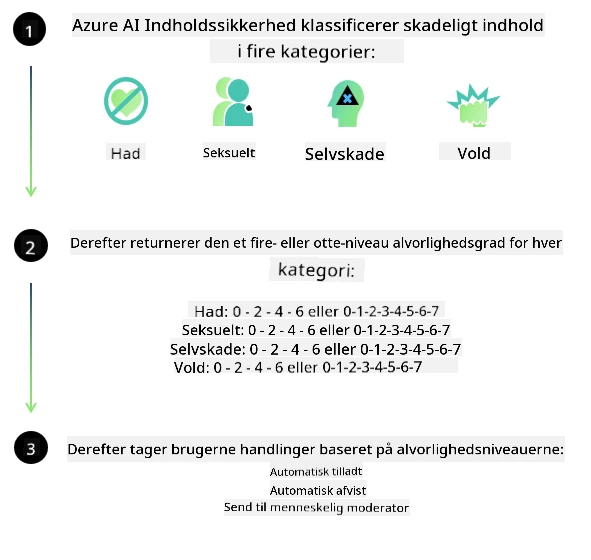

<!--
CO_OP_TRANSLATOR_METADATA:
{
  "original_hash": "839ccc4b3886ef10cfd4e64977f5792d",
  "translation_date": "2026-01-05T12:30:06+00:00",
  "source_file": "md/01.Introduction/01/01.AISafety.md",
  "language_code": "da"
}
-->
# AI-sikkerhed for Phi-modeller  
Phi-familien af modeller blev udviklet i overensstemmelse med [Microsoft Responsible AI Standard](https://www.microsoft.com/ai/principles-and-approach#responsible-ai-standard), som er et virksomhedsdækkende sæt krav baseret på følgende seks principper: ansvarlighed, gennemsigtighed, retfærdighed, pålidelighed og sikkerhed, privatliv og sikkerhed samt inklusivitet, som udgør [Microsofts Responsible AI-principper](https://www.microsoft.com/ai/responsible-ai).  

Ligesom de tidligere Phi-modeller blev en mangesidet sikkerhedsvurdering og efteruddannelsestilgang anvendt, med yderligere foranstaltninger taget i betragtning for denne udgivelses flersprogede kapaciteter. Vores tilgang til sikkerhedstræning og evalueringer inklusive test på tværs af flere sprog og risikokategorier er beskrevet i [Phi Safety Post-Training Paper](https://arxiv.org/abs/2407.13833). Mens Phi-modellerne drager fordel af denne tilgang, bør udviklere anvende ansvarlige AI bedste praksisser, herunder kortlægning, måling og afbødning af risici forbundet med deres specifikke brugsscenarie samt kulturelle og sproglige kontekst.  

## Bedste praksis  

Ligesom andre modeller kan Phi-familien potentielt opføre sig på måder, der er uretfærdige, upålidelige eller stødende.  

Nogle af de begrænsende adfærd ved SLM og LLM, som du bør være opmærksom på, omfatter:  

- **Servicekvalitet:** Phi-modellerne er primært trænet på engelsk tekst. Sprog andre end engelsk vil opleve dårligere ydeevne. Engelske sprogvareieter med mindre repræsentation i træningsdataene kan opleve dårligere ydeevne end standardamerikansk engelsk.  
- **Repræsentation af skader og fastholdelse af stereotyper:** Disse modeller kan over- eller underrepræsentere grupper af mennesker, udslette repræsentationen af nogle grupper eller forstærke nedværdigende eller negative stereotyper. På trods af efteruddannelse for sikkerhed kan disse begrænsninger stadig være til stede på grund af forskelle i repræsentation af forskellige grupper eller forekomsten af eksempler på negative stereotyper i træningsdata, som afspejler virkelige mønstre og samfundsmæssige bias.  
- **Upassende eller stødende indhold:** Disse modeller kan producere andre typer af upassende eller stødende indhold, hvilket kan gøre det upassende at implementere i følsomme sammenhænge uden yderligere afbødende foranstaltninger, som er specifikke for brugssituationen.  
- **Informationens pålidelighed:** Sproglige modeller kan generere meningsløst indhold eller fabrikeret indhold, der kan lyde rimeligt, men som er unøjagtigt eller forældet.  
- **Begrænset kodeomfang:** Størstedelen af Phi-3 træningsdata er baseret på Python og bruger almindelige pakker som "typing, math, random, collections, datetime, itertools". Hvis modellen genererer Python-scripts, der anvender andre pakker eller scripts på andre sprog, anbefaler vi kraftigt, at brugere manuelt verificerer alle API-anvendelser.  

Udviklere bør anvende ansvarlige AI bedste praksisser og er ansvarlige for at sikre, at en specifik brugssag overholder gældende love og regler (fx privatliv, handel osv.).  

## Overvejelser om ansvarlig AI  

Ligesom andre sprogmodeller kan Phi-seriens modeller potentielt opføre sig på måder, der er uretfærdige, upålidelige eller stødende. Nogle af de begrænsende adfærd, man skal være opmærksom på, inkluderer:  

**Servicekvalitet:** Phi-modellerne er primært trænet på engelsk tekst. Sprog andre end engelsk vil opleve dårligere ydeevne. Engelske sprogvareieter med mindre repræsentation i træningsdataene kan opleve dårligere ydeevne end standardamerikansk engelsk.  

**Repræsentation af skader og fastholdelse af stereotyper:** Disse modeller kan over- eller underrepræsentere grupper af mennesker, udslette repræsentationen af nogle grupper eller forstærke nedværdigende eller negative stereotyper. På trods af efteruddannelse for sikkerhed kan disse begrænsninger stadig være til stede på grund af forskelle i repræsentationen af forskellige grupper eller forekomsten af eksempler på negative stereotyper i træningsdata, som afspejler virkelige mønstre og samfundsmæssige bias.  

**Upassende eller stødende indhold:** Disse modeller kan producere andre typer af upassende eller stødende indhold, hvilket kan gøre det upassende at implementere i følsomme sammenhænge uden yderligere afbødende foranstaltninger, som er specifikke for brugssituationen.  
Informationens pålidelighed: Sproglige modeller kan generere meningsløst indhold eller fabrikeret indhold, der kan lyde rimeligt, men som er unøjagtigt eller forældet.  

**Begrænset kodeomfang:** Størstedelen af Phi-3 træningsdata er baseret på Python og bruger almindelige pakker som "typing, math, random, collections, datetime, itertools". Hvis modellen genererer Python-scripts, der anvender andre pakker eller scripts på andre sprog, anbefaler vi kraftigt, at brugere manuelt verificerer alle API-anvendelser.  

Udviklere bør anvende ansvarlige AI bedste praksisser og er ansvarlige for at sikre, at en specifik brugssag overholder gældende love og regler (fx privatliv, handel osv.). Vigtige områder til overvejelse inkluderer:  

**Fordeling:** Modeller er muligvis ikke egnede til scenarier, der kan have væsentlig indflydelse på juridisk status eller fordeling af ressourcer eller livschancer (fx bolig, beskæftigelse, kredit osv.) uden yderligere vurderinger og yderligere debiasing-teknikker.  

**Højrisikoscenarier:** Udviklere bør vurdere egnetheden af at bruge modeller i højrisiko-scenarier, hvor uretfærdige, upålidelige eller stødende output kan være ekstremt kostbare eller føre til skade. Dette inkluderer at give rådgivning inden for følsomme eller ekspertområder, hvor nøjagtighed og pålidelighed er kritisk (fx juridisk eller sundhedsmæssig rådgivning). Yderligere sikkerhedsforanstaltninger bør implementeres på applikationsniveau i henhold til implementeringskonteksten.  

**Fejlinformation:** Modeller kan producere unøjagtige oplysninger. Udviklere bør følge gennemsigtigheds bedste praksis og informere slutbrugere om, at de interagerer med et AI-system. På applikationsniveau kan udviklere opbygge feedbackmekanismer og pipelines for at forankre svar i brugssags-specifik, kontekstuel information, en teknik kendt som Retrieval Augmented Generation (RAG).  

**Generering af skadeligt indhold:** Udviklere bør vurdere output i deres kontekst og bruge tilgængelige sikkerhedsklassificeringer eller brugerdefinerede løsninger, der er passende for deres brugssag.  

**Misbrug:** Andre former for misbrug som bedrageri, spam eller produktion af malware kan være mulige, og udviklere bør sikre, at deres applikationer ikke overtræder gældende love og regler.  

### Finetuning og AI-indholdssikkerhed  

Efter finetuning af en model anbefaler vi stærkt at udnytte [Azure AI Content Safety](https://learn.microsoft.com/azure/ai-services/content-safety/overview) foranstaltninger til at overvåge det indhold, der genereres af modellerne, identificere og blokere potentielle risici, trusler og kvalitetsproblemer.  

  

[Azure AI Content Safety](https://learn.microsoft.com/azure/ai-services/content-safety/overview) understøtter både tekst- og billedindhold. Det kan implementeres i skyen, i frakoblede containere og på edge/indlejrede enheder.  

## Oversigt over Azure AI Content Safety  

Azure AI Content Safety er ikke en one-size-fits-all-løsning; den kan tilpasses til at være i overensstemmelse med virksomheders specifikke politikker. Derudover gør dens flersprogede modeller det muligt samtidigt at forstå flere sprog.  

  

- **Azure AI Content Safety**  
- **Microsoft Developer**  
- **5 videoer**  

Azure AI Content Safety-tjenesten opdager skadeligt bruger- og AI-genereret indhold i applikationer og tjenester. Den omfatter tekst- og billede-API’er, der giver dig mulighed for at opdage skadeligt eller upassende materiale.  

[AI Content Safety Playlist](https://www.youtube.com/playlist?list=PLlrxD0HtieHjaQ9bJjyp1T7FeCbmVcPkQ)

---

<!-- CO-OP TRANSLATOR DISCLAIMER START -->
**Ansvarsfraskrivelse**:
Dette dokument er blevet oversat ved hjælp af AI-oversættelsestjenesten [Co-op Translator](https://github.com/Azure/co-op-translator). Selvom vi bestræber os på nøjagtighed, bedes du være opmærksom på, at automatiserede oversættelser kan indeholde fejl eller unøjagtigheder. Det oprindelige dokument på dets modersmål bør betragtes som den autoritative kilde. For kritiske oplysninger anbefales professionel menneskelig oversættelse. Vi påtager os intet ansvar for misforståelser eller fejltolkninger, der opstår som følge af brugen af denne oversættelse.
<!-- CO-OP TRANSLATOR DISCLAIMER END -->