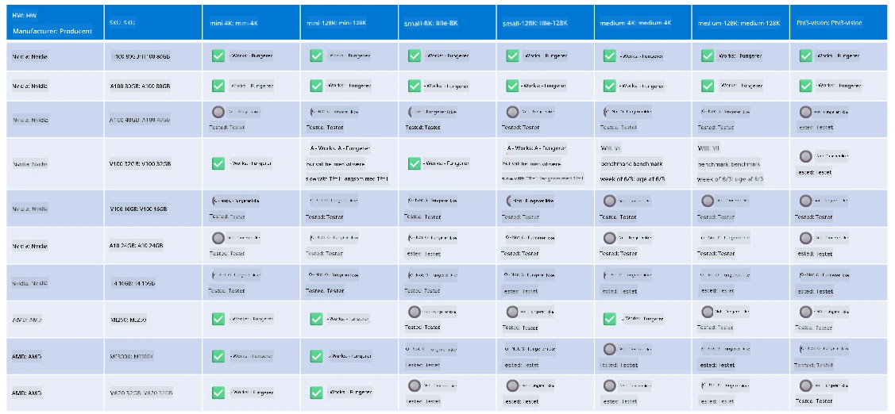

# Phi Hardware Support

Microsoft Phi er optimeret til ONNX Runtime og understøtter Windows DirectML. Det fungerer godt på tværs af forskellige hardwaretyper, herunder GPU'er, CPU'er og endda mobile enheder.

## Enhedshardware  
Specifikt omfatter den understøttede hardware:

- GPU SKU: RTX 4090 (DirectML)
- GPU SKU: 1 A100 80GB (CUDA)
- CPU SKU: Standard F64s v2 (64 vCPUs, 128 GiB hukommelse)

## Mobil SKU

- Android - Samsung Galaxy S21
- Apple iPhone 14 eller nyere A16/A17-processor

## Phi Hardware Specifikation

- Minimumskonfiguration krævet.
- Windows: DirectX 12-kompatibel GPU og mindst 4 GB kombineret RAM

CUDA: NVIDIA GPU med Compute Capability >= 7.02



## Kørsel af onnxruntime på flere GPU'er

De nuværende tilgængelige Phi ONNX-modeller er kun til 1 GPU. Det er muligt at understøtte multi-GPU for Phi-modeller, men ORT med 2 GPU'er garanterer ikke, at det vil give mere gennemløb sammenlignet med 2 instanser af ORT. Se venligst [ONNX Runtime](https://onnxruntime.ai/) for de seneste opdateringer.

På [Build 2024 annoncerede GenAI ONNX Teamet](https://youtu.be/WLW4SE8M9i8?si=EtG04UwDvcjunyfC), at de havde aktiveret multi-instans i stedet for multi-GPU for Phi-modeller.

I øjeblikket giver dette dig mulighed for at køre en onnnxruntime eller onnxruntime-genai instans med CUDA_VISIBLE_DEVICES miljøvariablen som dette.

```Python
CUDA_VISIBLE_DEVICES=0 python infer.py
CUDA_VISIBLE_DEVICES=1 python infer.py
```

Du er velkommen til at udforske Phi yderligere i [Microsoft Foundry](https://ai.azure.com)

---

<!-- CO-OP TRANSLATOR DISCLAIMER START -->
**Ansvarsfraskrivelse**:
Dette dokument er oversat ved hjælp af AI-oversættelsestjenesten [Co-op Translator](https://github.com/Azure/co-op-translator). Selvom vi bestræber os på nøjagtighed, bedes du være opmærksom på, at automatiserede oversættelser kan indeholde fejl eller unøjagtigheder. Det oprindelige dokument på dets modersmål bør betragtes som den autoritative kilde. For kritisk information anbefales professionel menneskelig oversættelse. Vi påtager os intet ansvar for misforståelser eller fejltolkninger, der opstår som følge af brugen af denne oversættelse.
<!-- CO-OP TRANSLATOR DISCLAIMER END -->