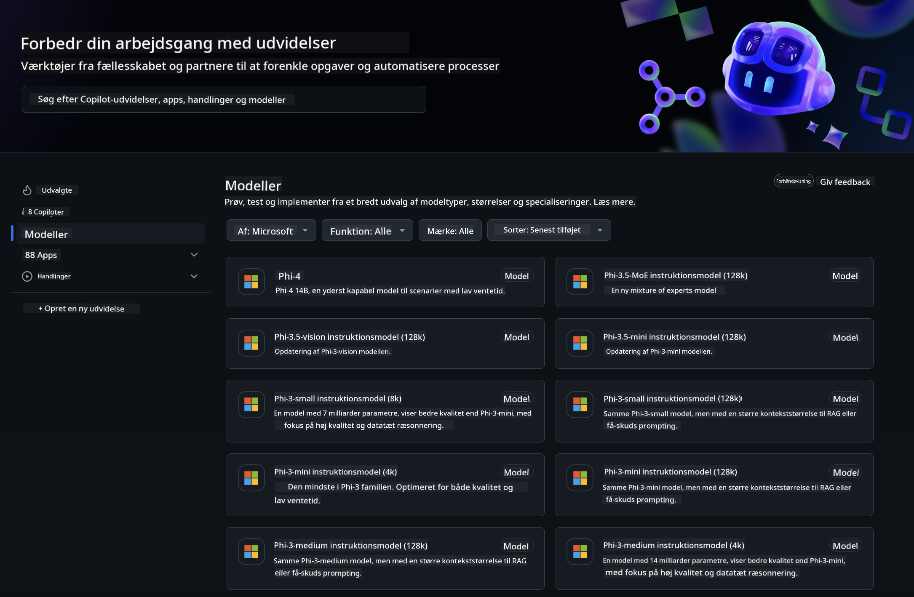
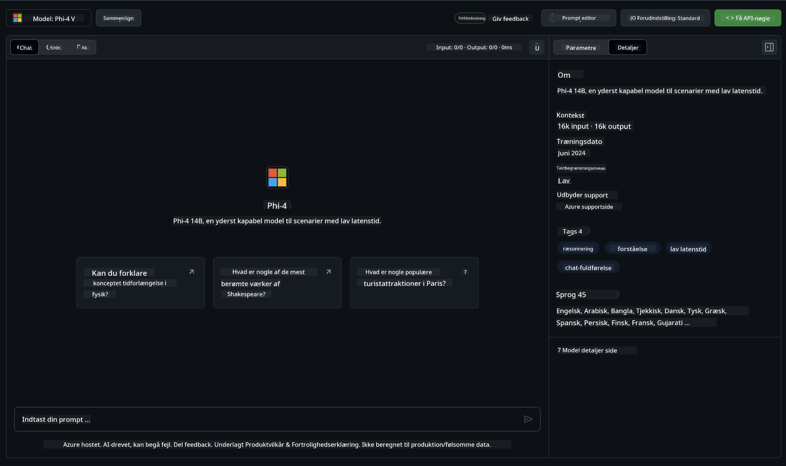
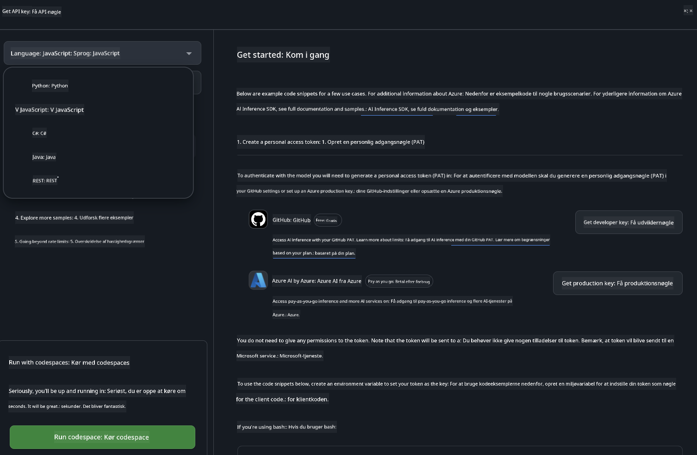
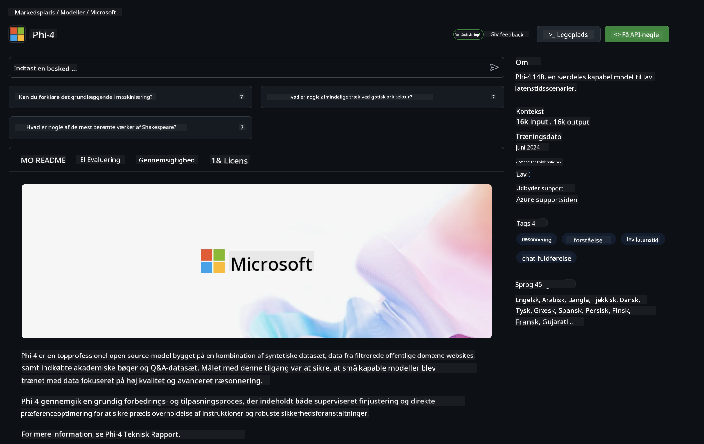

<!--
CO_OP_TRANSLATOR_METADATA:
{
  "original_hash": "fb67a08b9fc911a10ed58081fadef416",
  "translation_date": "2025-05-09T08:51:54+00:00",
  "source_file": "md/01.Introduction/02/02.GitHubModel.md",
  "language_code": "da"
}
-->
## Phi-familien i GitHub Models

Velkommen til [GitHub Models](https://github.com/marketplace/models)! Vi har alt klar til, at du kan udforske AI-modeller hostet på Azure AI.



For mere information om de modeller, der er tilgængelige på GitHub Models, se [GitHub Model Marketplace](https://github.com/marketplace/models)

## Tilgængelige modeller

Hver model har en dedikeret playground og eksempelkode



### Phi-familien i GitHub Model Catalog

- [Phi-4](https://github.com/marketplace/models/azureml/Phi-4)

- [Phi-3.5-MoE instruct (128k)](https://github.com/marketplace/models/azureml/Phi-3-5-MoE-instruct)

- [Phi-3.5-vision instruct (128k)](https://github.com/marketplace/models/azureml/Phi-3-5-vision-instruct)

- [Phi-3.5-mini instruct (128k)](https://github.com/marketplace/models/azureml/Phi-3-5-mini-instruct)

- [Phi-3-Medium-128k-Instruct](https://github.com/marketplace/models/azureml/Phi-3-medium-128k-instruct)

- [Phi-3-medium-4k-instruct](https://github.com/marketplace/models/azureml/Phi-3-medium-4k-instruct)

- [Phi-3-mini-128k-instruct](https://github.com/marketplace/models/azureml/Phi-3-mini-128k-instruct)

- [Phi-3-mini-4k-instruct](https://github.com/marketplace/models/azureml/Phi-3-mini-4k-instruct)

- [Phi-3-small-128k-instruct](https://github.com/marketplace/models/azureml/Phi-3-small-128k-instruct)

- [Phi-3-small-8k-instruct](https://github.com/marketplace/models/azureml/Phi-3-small-8k-instruct)

## Kom godt i gang

Der er nogle grundlæggende eksempler klar til, at du kan køre dem. Du kan finde dem i samples-mappen. Hvis du vil springe direkte til dit foretrukne sprog, kan du finde eksemplerne i følgende sprog:

- Python
- JavaScript
- C#
- Java
- cURL

Der er også et dedikeret Codespaces-miljø til at køre samples og modeller.



## Eksempelkode

Nedenfor er eksempelkodesnippets til nogle få brugstilfælde. For yderligere information om Azure AI Inference SDK, se fuld dokumentation og eksempler.

## Opsætning

1. Opret et personligt adgangstoken  
Du behøver ikke give nogen tilladelser til tokenet. Bemærk, at tokenet vil blive sendt til en Microsoft-tjeneste.

For at bruge kodesnippets nedenfor, opret en miljøvariabel for at sætte dit token som nøgle til klientkoden.

Hvis du bruger bash:  
```
export GITHUB_TOKEN="<your-github-token-goes-here>"
```  
Hvis du bruger powershell:  

```
$Env:GITHUB_TOKEN="<your-github-token-goes-here>"
```  

Hvis du bruger Windows kommandoprompt:  

```
set GITHUB_TOKEN=<your-github-token-goes-here>
```  

## Python-eksempel

### Installer afhængigheder  
Installer Azure AI Inference SDK med pip (kræver: Python >=3.8):

```
pip install azure-ai-inference
```  
### Kør et grundlæggende kodeeksempel

Dette eksempel viser et grundlæggende kald til chat completion API'en. Det bruger GitHub AI model inference endpoint og dit GitHub-token. Kaldet er synkront.

```python
import os
from azure.ai.inference import ChatCompletionsClient
from azure.ai.inference.models import SystemMessage, UserMessage
from azure.core.credentials import AzureKeyCredential

endpoint = "https://models.inference.ai.azure.com"
model_name = "Phi-4"
token = os.environ["GITHUB_TOKEN"]

client = ChatCompletionsClient(
    endpoint=endpoint,
    credential=AzureKeyCredential(token),
)

response = client.complete(
    messages=[
        UserMessage(content="I have $20,000 in my savings account, where I receive a 4% profit per year and payments twice a year. Can you please tell me how long it will take for me to become a millionaire? Also, can you please explain the math step by step as if you were explaining it to an uneducated person?"),
    ],
    temperature=0.4,
    top_p=1.0,
    max_tokens=2048,
    model=model_name
)

print(response.choices[0].message.content)
```

### Kør en samtale med flere runder

Dette eksempel viser en samtale med flere runder med chat completion API'en. Når du bruger modellen til en chatapplikation, skal du håndtere samtalens historik og sende de seneste beskeder til modellen.

```
import os
from azure.ai.inference import ChatCompletionsClient
from azure.ai.inference.models import AssistantMessage, SystemMessage, UserMessage
from azure.core.credentials import AzureKeyCredential

token = os.environ["GITHUB_TOKEN"]
endpoint = "https://models.inference.ai.azure.com"
# Replace Model_Name
model_name = "Phi-4"

client = ChatCompletionsClient(
    endpoint=endpoint,
    credential=AzureKeyCredential(token),
)

messages = [
    SystemMessage(content="You are a helpful assistant."),
    UserMessage(content="What is the capital of France?"),
    AssistantMessage(content="The capital of France is Paris."),
    UserMessage(content="What about Spain?"),
]

response = client.complete(messages=messages, model=model_name)

print(response.choices[0].message.content)
```

### Stream outputtet

For en bedre brugeroplevelse vil du gerne streame modellens svar, så det første token vises hurtigt, og du undgår at vente på lange svar.

```
import os
from azure.ai.inference import ChatCompletionsClient
from azure.ai.inference.models import SystemMessage, UserMessage
from azure.core.credentials import AzureKeyCredential

token = os.environ["GITHUB_TOKEN"]
endpoint = "https://models.inference.ai.azure.com"
# Replace Model_Name
model_name = "Phi-4"

client = ChatCompletionsClient(
    endpoint=endpoint,
    credential=AzureKeyCredential(token),
)

response = client.complete(
    stream=True,
    messages=[
        SystemMessage(content="You are a helpful assistant."),
        UserMessage(content="Give me 5 good reasons why I should exercise every day."),
    ],
    model=model_name,
)

for update in response:
    if update.choices:
        print(update.choices[0].delta.content or "", end="")

client.close()
```

## GRATIS brug og ratebegrænsninger for GitHub Models



[Ratebegrænsningerne for playground og gratis API-brug](https://docs.github.com/en/github-models/prototyping-with-ai-models#rate-limits) er til for at hjælpe dig med at eksperimentere med modeller og prototype din AI-applikation. For brug ud over disse grænser, og for at skalere din applikation, skal du oprette ressourcer via en Azure-konto og autentificere derfra i stedet for med dit personlige GitHub-adgangstoken. Du behøver ikke ændre noget andet i din kode. Brug dette link for at finde ud af, hvordan du går ud over gratisgrænserne i Azure AI.

### Ansvarsfraskrivelser

Husk, at når du interagerer med en model, eksperimenterer du med AI, så fejl i indhold kan forekomme.

Funktionen er underlagt forskellige begrænsninger (herunder anmodninger per minut, anmodninger per dag, tokens per anmodning og samtidige anmodninger) og er ikke designet til produktionsbrug.

GitHub Models bruger Azure AI Content Safety. Disse filtre kan ikke slås fra som en del af GitHub Models-oplevelsen. Hvis du vælger at bruge modeller gennem en betalt tjeneste, skal du konfigurere dine indholdsfiltre, så de opfylder dine krav.

Denne tjeneste er underlagt GitHubs Pre-release Terms.

**Ansvarsfraskrivelse**:  
Dette dokument er oversat ved hjælp af AI-oversættelsestjenesten [Co-op Translator](https://github.com/Azure/co-op-translator). Selvom vi bestræber os på nøjagtighed, skal du være opmærksom på, at automatiserede oversættelser kan indeholde fejl eller unøjagtigheder. Det oprindelige dokument på dets oprindelige sprog bør betragtes som den autoritative kilde. For kritisk information anbefales professionel menneskelig oversættelse. Vi påtager os intet ansvar for misforståelser eller fejltolkninger, der opstår som følge af brugen af denne oversættelse.