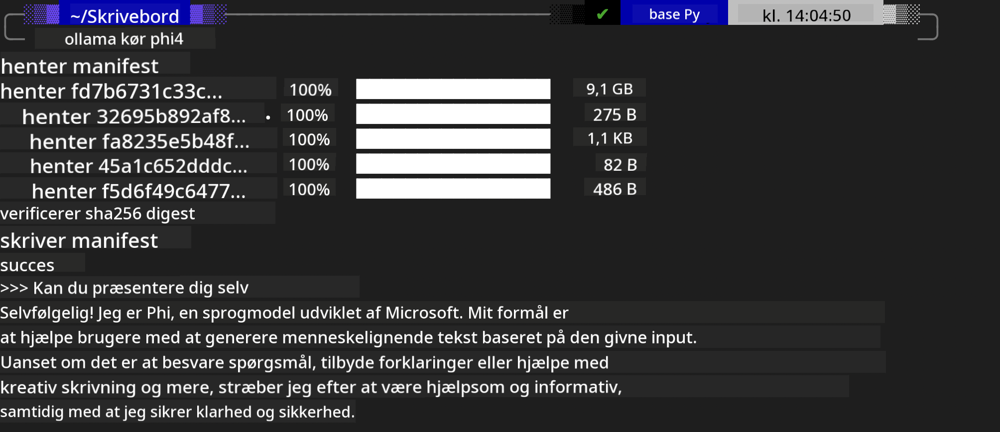
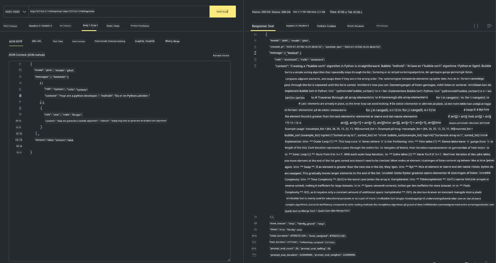

<!--
CO_OP_TRANSLATOR_METADATA:
{
  "original_hash": "0b38834693bb497f96bf53f0d941f9a1",
  "translation_date": "2025-07-16T19:16:41+00:00",
  "source_file": "md/01.Introduction/02/04.Ollama.md",
  "language_code": "da"
}
-->
## Phi-familien i Ollama


[Ollama](https://ollama.com) gør det muligt for flere at implementere open source LLM eller SLM direkte via simple scripts, og kan også oprette API'er til at understøtte lokale Copilot-applikationsscenarier.

## **1. Installation**

Ollama understøtter kørsel på Windows, macOS og Linux. Du kan installere Ollama via dette link ([https://ollama.com/download](https://ollama.com/download)). Efter en vellykket installation kan du direkte bruge Ollama-scriptet til at kalde Phi-3 gennem et terminalvindue. Du kan se alle de [tilgængelige biblioteker i Ollama](https://ollama.com/library). Hvis du åbner dette repository i en Codespace, vil Ollama allerede være installeret.

```bash

ollama run phi4

```

> [!NOTE]
> Modellen vil blive downloadet første gang, du kører den. Du kan selvfølgelig også direkte angive den downloadede Phi-4-model. Vi tager WSL som eksempel til at køre kommandoen. Når modellen er downloadet, kan du interagere direkte i terminalen.



## **2. Kald phi-4 API'et fra Ollama**

Hvis du vil kalde Phi-4 API'et genereret af Ollama, kan du bruge denne kommando i terminalen for at starte Ollama-serveren.

```bash

ollama serve

```

> [!NOTE]
> Hvis du kører MacOS eller Linux, skal du være opmærksom på, at du kan støde på følgende fejl **"Error: listen tcp 127.0.0.1:11434: bind: address already in use"**. Du kan få denne fejl, når du kører kommandoen. Du kan enten ignorere fejlen, da den typisk betyder, at serveren allerede kører, eller du kan stoppe og genstarte Ollama:

**macOS**

```bash

brew services restart ollama

```

**Linux**

```bash

sudo systemctl stop ollama

```

Ollama understøtter to API'er: generate og chat. Du kan kalde den model-API, som Ollama tilbyder, efter behov ved at sende forespørgsler til den lokale service, der kører på port 11434.

**Chat**

```bash

curl http://127.0.0.1:11434/api/chat -d '{
  "model": "phi3",
  "messages": [
    {
      "role": "system",
      "content": "Your are a python developer."
    },
    {
      "role": "user",
      "content": "Help me generate a bubble algorithm"
    }
  ],
  "stream": false
  
}'

This is the result in Postman



## Additional Resources

Check the list of available models in Ollama in [their library](https://ollama.com/library).

Pull your model from the Ollama server using this command

```bash
ollama pull phi4
```

Run the model using this command

```bash
ollama run phi4
```

***Note:*** Visit this link [https://github.com/ollama/ollama/blob/main/docs/api.md](https://github.com/ollama/ollama/blob/main/docs/api.md) to learn more

## Calling Ollama from Python

You can use `requests` or `urllib3` to make requests to the local server endpoints used above. However, a popular way to use Ollama in Python is via the [openai](https://pypi.org/project/openai/) SDK, since Ollama provides OpenAI-compatible server endpoints as well.

Here is an example for phi3-mini:

```python
import openai

client = openai.OpenAI(
    base_url="http://localhost:11434/v1",
    api_key="nokeyneeded",
)

response = client.chat.completions.create(
    model="phi4",
    temperature=0.7,
    n=1,
    messages=[
        {"role": "system", "content": "You are a helpful assistant."},
        {"role": "user", "content": "Write a haiku about a hungry cat"},
    ],
)

print("Response:")
print(response.choices[0].message.content)
```

## Calling Ollama from JavaScript 

```javascript
// Eksempel på at opsummere en fil med Phi-4
script({
    model: "ollama:phi4",
    title: "Opsummer med Phi-4",
    system: ["system"],
})

// Eksempel på opsummering
const file = def("FILE", env.files)
$`Opsummer ${file} i et enkelt afsnit.`
```

## Calling Ollama from C#

Create a new C# Console application and add the following NuGet package:

```bash
dotnet add package Microsoft.SemanticKernel --version 1.34.0
```

Then replace this code in the `Program.cs` file

```csharp
using Microsoft.SemanticKernel;
using Microsoft.SemanticKernel.ChatCompletion;

// tilføj chat completion service ved brug af den lokale ollama server endpoint
#pragma warning disable SKEXP0001, SKEXP0003, SKEXP0010, SKEXP0011, SKEXP0050, SKEXP0052
builder.AddOpenAIChatCompletion(
    modelId: "phi4",
    endpoint: new Uri("http://localhost:11434/"),
    apiKey: "non required");

// kald en simpel prompt til chat servicen
string prompt = "Write a joke about kittens";
var response = await kernel.InvokePromptAsync(prompt);
Console.WriteLine(response.GetValue<string>());
```

Run the app with the command:

```bash
dotnet run


**Ansvarsfraskrivelse**:  
Dette dokument er blevet oversat ved hjælp af AI-oversættelsestjenesten [Co-op Translator](https://github.com/Azure/co-op-translator). Selvom vi bestræber os på nøjagtighed, bedes du være opmærksom på, at automatiserede oversættelser kan indeholde fejl eller unøjagtigheder. Det oprindelige dokument på dets oprindelige sprog bør betragtes som den autoritative kilde. For kritisk information anbefales professionel menneskelig oversættelse. Vi påtager os intet ansvar for misforståelser eller fejltolkninger, der opstår som følge af brugen af denne oversættelse.