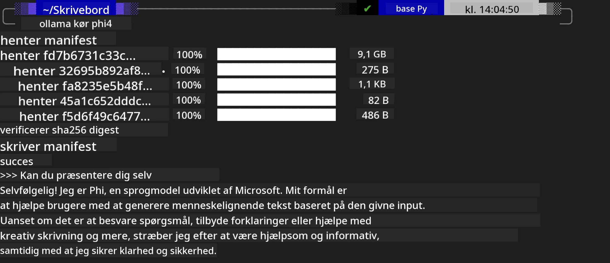
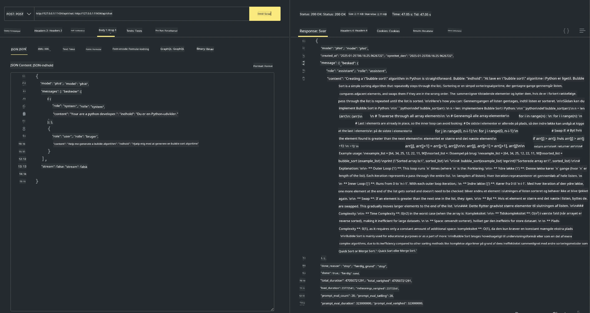

## Phi-familien i Ollama


[Ollama](https://ollama.com) gør det muligt for flere at direkte udrulle open source LLM eller SLM gennem enkle scripts, og kan også oprette API'er til at hjælpe lokale Copilot-applikationsscenarier.

## **1. Installation**

Ollama understøtter kørsel på Windows, macOS og Linux. Du kan installere Ollama gennem dette link ([https://ollama.com/download](https://ollama.com/download)). Efter en vellykket installation kan du direkte bruge Ollama-scriptet til at kalde Phi-3 gennem et terminalvindue. Du kan se alle de [tilgængelige biblioteker i Ollama](https://ollama.com/library). Hvis du åbner dette repository i en Codespace, vil det allerede have Ollama installeret.

```bash

ollama run phi4

```

> [!NOTE]
> Modellen vil blive downloadet først, når du kører den for første gang. Selvfølgelig kan du også direkte angive den downloadede Phi-4-model. Vi tager WSL som eksempel for at køre kommandoen. Når modellen er blevet downloadet med succes, kan du interagere direkte i terminalen.



## **2. Kald phi-4 API'en fra Ollama**

Hvis du vil kalde Phi-4 API'et genereret af ollama, kan du bruge denne kommando i terminalen for at starte Ollama-serveren.

```bash

ollama serve

```

> [!NOTE]
> Hvis du kører MacOS eller Linux, skal du være opmærksom på, at du kan støde på følgende fejl **"Error: listen tcp 127.0.0.1:11434: bind: address already in use"**. Du kan få denne fejl, når du kører kommandoen. Du kan enten ignorere fejlen, da den typisk indikerer, at serveren allerede kører, eller du kan stoppe og genstarte Ollama:

**macOS**

```bash

brew services restart ollama

```

**Linux**

```bash

sudo systemctl stop ollama

```

Ollama understøtter to API'er: generate og chat. Du kan kalde model-API'et, som Ollama leverer, efter behov ved at sende forespørgsler til den lokale tjeneste, der kører på port 11434.

**Chat**

```bash

curl http://127.0.0.1:11434/api/chat -d '{
  "model": "phi3",
  "messages": [
    {
      "role": "system",
      "content": "Your are a python developer."
    },
    {
      "role": "user",
      "content": "Help me generate a bubble algorithm"
    }
  ],
  "stream": false
  
}'
```

Dette er resultatet i Postman



## Additional Resources

Tjek listen over tilgængelige modeller i Ollama i [deres library](https://ollama.com/library).

Hent din model fra Ollama-serveren med denne kommando

```bash
ollama pull phi4
```

Kør modellen med denne kommando

```bash
ollama run phi4
```

***Bemærk:*** Besøg dette link [https://github.com/ollama/ollama/blob/main/docs/api.md](https://github.com/ollama/ollama/blob/main/docs/api.md) for at få mere at vide

## Kald Ollama fra Python

Du kan bruge `requests` eller `urllib3` til at lave forespørgsler til de lokale serverendepunkter, som blev brugt ovenfor. En populær måde at bruge Ollama i Python på er dog via [openai](https://pypi.org/project/openai/) SDK'en, da Ollama også tilbyder OpenAI-kompatible serverendepunkter.

Her er et eksempel for phi3-mini:

```python
import openai

client = openai.OpenAI(
    base_url="http://localhost:11434/v1",
    api_key="nokeyneeded",
)

response = client.chat.completions.create(
    model="phi4",
    temperature=0.7,
    n=1,
    messages=[
        {"role": "system", "content": "You are a helpful assistant."},
        {"role": "user", "content": "Write a haiku about a hungry cat"},
    ],
)

print("Response:")
print(response.choices[0].message.content)
```

## Kald Ollama fra JavaScript 

```javascript
// Eksempel på at opsummere en fil med Phi-4
script({
    model: "ollama:phi4",
    title: "Summarize with Phi-4",
    system: ["system"],
})

// Eksempel på opsummering
const file = def("FILE", env.files)
$`Summarize ${file} in a single paragraph.`
```

## Kald Ollama fra C#

Opret en ny C# Console-applikation og tilføj følgende NuGet-pakke:

```bash
dotnet add package Microsoft.SemanticKernel --version 1.34.0
```

Erstat derefter denne kode i filen `Program.cs`

```csharp
using Microsoft.SemanticKernel;
using Microsoft.SemanticKernel.ChatCompletion;

// add chat completion service using the local ollama server endpoint
#pragma warning disable SKEXP0001, SKEXP0003, SKEXP0010, SKEXP0011, SKEXP0050, SKEXP0052
builder.AddOpenAIChatCompletion(
    modelId: "phi4",
    endpoint: new Uri("http://localhost:11434/"),
    apiKey: "non required");

// invoke a simple prompt to the chat service
string prompt = "Write a joke about kittens";
var response = await kernel.InvokePromptAsync(prompt);
Console.WriteLine(response.GetValue<string>());
```

Kør appen med kommandoen:

```bash
dotnet run
```

---

<!-- CO-OP TRANSLATOR DISCLAIMER START -->
Ansvarsfraskrivelse:
Dette dokument er blevet oversat ved hjælp af AI-oversættelsestjenesten [Co-op Translator](https://github.com/Azure/co-op-translator). Selvom vi bestræber os på nøjagtighed, bedes du være opmærksom på, at automatiske oversættelser kan indeholde fejl eller unøjagtigheder. Det oprindelige dokument på dets originalsprog bør betragtes som den autoritative kilde. For kritisk information anbefales en professionel menneskelig oversættelse. Vi er ikke ansvarlige for eventuelle misforståelser eller fejltolkninger, der opstår som følge af brugen af denne oversættelse.
<!-- CO-OP TRANSLATOR DISCLAIMER END -->