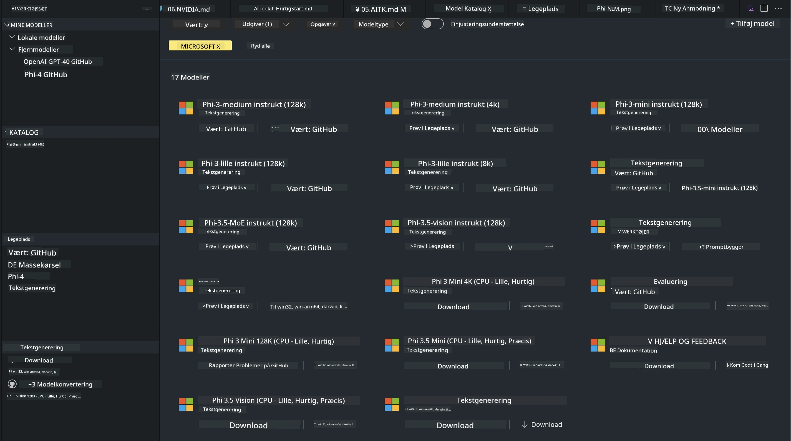
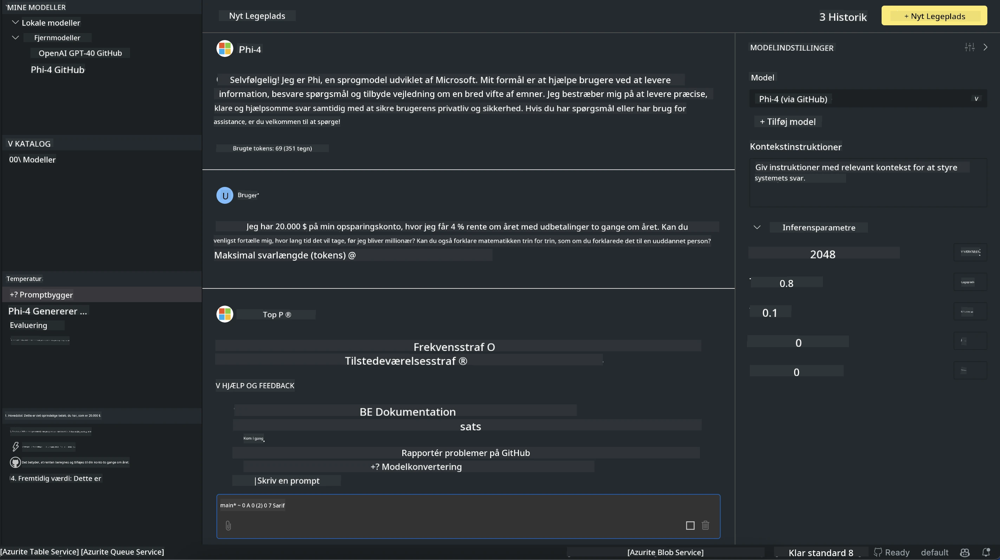

<!--
CO_OP_TRANSLATOR_METADATA:
{
  "original_hash": "4951d458c0b60c02cd1e751b40903877",
  "translation_date": "2025-07-16T19:27:00+00:00",
  "source_file": "md/01.Introduction/02/05.AITK.md",
  "language_code": "da"
}
-->
# Phi Family i AITK

[AI Toolkit for VS Code](https://marketplace.visualstudio.com/items?itemName=ms-windows-ai-studio.windows-ai-studio) gør udvikling af generative AI-apps nemmere ved at samle avancerede AI-udviklingsværktøjer og modeller fra Azure AI Foundry Catalog og andre kataloger som Hugging Face. Du kan browse AI-modellernes katalog drevet af GitHub Models og Azure AI Foundry Model Catalogs, downloade dem lokalt eller eksternt, finjustere, teste og bruge dem i din applikation.

AI Toolkit Preview kører lokalt. Lokal inferens eller finjustering afhænger af den valgte model, og du kan have brug for en GPU som NVIDIA CUDA GPU. Du kan også køre GitHub Models direkte med AITK.

## Kom godt i gang

[Lær mere om, hvordan du installerer Windows Subsystem for Linux](https://learn.microsoft.com/windows/wsl/install?WT.mc_id=aiml-137032-kinfeylo)

og [ændring af standarddistribution](https://learn.microsoft.com/windows/wsl/install#change-the-default-linux-distribution-installed).

[AI Toolkit GitHub Repo](https://github.com/microsoft/vscode-ai-toolkit/)

- Windows, Linux, macOS
  
- Til finjustering på både Windows og Linux skal du have et Nvidia GPU. Derudover kræver **Windows** subsystem for Linux med Ubuntu-distribution 18.4 eller nyere. [Lær mere om, hvordan du installerer Windows Subsystem for Linux](https://learn.microsoft.com/windows/wsl/install) og [ændring af standarddistribution](https://learn.microsoft.com/windows/wsl/install#change-the-default-linux-distribution-installed).

### Installer AI Toolkit

AI Toolkit leveres som en [Visual Studio Code Extension](https://code.visualstudio.com/docs/setup/additional-components#_vs-code-extensions), så du skal først installere [VS Code](https://code.visualstudio.com/docs/setup/windows?WT.mc_id=aiml-137032-kinfeylo) og derefter downloade AI Toolkit fra [VS Marketplace](https://marketplace.visualstudio.com/items?itemName=ms-windows-ai-studio.windows-ai-studio).  
[AI Toolkit er tilgængelig i Visual Studio Marketplace](https://marketplace.visualstudio.com/items?itemName=ms-windows-ai-studio.windows-ai-studio) og kan installeres som enhver anden VS Code-udvidelse.

Hvis du ikke er vant til at installere VS Code-udvidelser, følg disse trin:

### Log ind

1. Vælg **Extensions** i Activity Bar i VS Code  
1. Skriv "AI Toolkit" i søgefeltet for udvidelser  
1. Vælg "AI Toolkit for Visual Studio code"  
1. Vælg **Install**

Nu er du klar til at bruge udvidelsen!

Du vil blive bedt om at logge ind på GitHub, så klik venligst på "Allow" for at fortsætte. Du bliver omdirigeret til GitHub login-siden.

Log ind og følg trinene. Når det er gennemført, bliver du sendt tilbage til VS Code.

Når udvidelsen er installeret, vil du se AI Toolkit-ikonet i din Activity Bar.

Lad os udforske de tilgængelige funktioner!

### Tilgængelige funktioner

AI Toolkits primære sidebjælke er organiseret i  

- **Models**  
- **Resources**  
- **Playground**  
- **Fine-tuning**  
- **Evaluation**

Disse findes i Resources-sektionen. For at komme i gang vælg **Model Catalog**.

### Download en model fra kataloget

Når du åbner AI Toolkit fra VS Code sidebjælke, kan du vælge mellem følgende muligheder:



- Find en understøttet model i **Model Catalog** og download den lokalt  
- Test modelinferens i **Model Playground**  
- Finjuster modellen lokalt eller eksternt i **Model Fine-tuning**  
- Udrul finjusterede modeller til skyen via kommandopaletten for AI Toolkit  
- Evaluer modeller

> [!NOTE]
>
> **GPU vs CPU**
>
> Du vil bemærke, at modelkortene viser modelstørrelse, platform og accelerator-type (CPU, GPU). For optimal ydeevne på **Windows-enheder med mindst én GPU**, vælg modelversioner, der kun er målrettet Windows.
>
> Dette sikrer, at du har en model optimeret til DirectML-acceleratoren.
>
> Modelnavnene følger formatet
>
> - `{model_name}-{accelerator}-{quantization}-{format}`.
>
>For at tjekke om du har en GPU på din Windows-enhed, åbn **Task Manager** og vælg fanen **Performance**. Hvis du har GPU(er), vil de være listet under navne som "GPU 0" eller "GPU 1".

### Kør modellen i playground

Når alle parametre er sat, klik på **Generate Project**.

Når din model er downloadet, vælg **Load in Playground** på modelkortet i kataloget:

- Start modeldownload  
- Installer alle forudsætninger og afhængigheder  
- Opret VS Code workspace



### Brug REST API i din applikation

AI Toolkit leveres med en lokal REST API-webserver **på port 5272**, som bruger [OpenAI chat completions format](https://platform.openai.com/docs/api-reference/chat/create).

Dette gør det muligt at teste din applikation lokalt uden at skulle være afhængig af en cloud AI-modelservice. For eksempel viser følgende JSON-fil, hvordan du konfigurerer anmodningens body:

```json
{
    "model": "Phi-4",
    "messages": [
        {
            "role": "user",
            "content": "what is the golden ratio?"
        }
    ],
    "temperature": 0.7,
    "top_p": 1,
    "top_k": 10,
    "max_tokens": 100,
    "stream": true
}
```

Du kan teste REST API’en med (for eksempel) [Postman](https://www.postman.com/) eller CURL (Client URL) værktøjet:

```bash
curl -vX POST http://127.0.0.1:5272/v1/chat/completions -H 'Content-Type: application/json' -d @body.json
```

### Brug af OpenAI klientbiblioteket til Python

```python
from openai import OpenAI

client = OpenAI(
    base_url="http://127.0.0.1:5272/v1/", 
    api_key="x" # required for the API but not used
)

chat_completion = client.chat.completions.create(
    messages=[
        {
            "role": "user",
            "content": "what is the golden ratio?",
        }
    ],
    model="Phi-4",
)

print(chat_completion.choices[0].message.content)
```

### Brug af Azure OpenAI klientbiblioteket til .NET

Tilføj [Azure OpenAI klientbiblioteket til .NET](https://www.nuget.org/packages/Azure.AI.OpenAI/) til dit projekt via NuGet:

```bash
dotnet add {project_name} package Azure.AI.OpenAI --version 1.0.0-beta.17
```

Tilføj en C#-fil kaldet **OverridePolicy.cs** til dit projekt og indsæt følgende kode:

```csharp
// OverridePolicy.cs
using Azure.Core.Pipeline;
using Azure.Core;

internal partial class OverrideRequestUriPolicy(Uri overrideUri)
    : HttpPipelineSynchronousPolicy
{
    private readonly Uri _overrideUri = overrideUri;

    public override void OnSendingRequest(HttpMessage message)
    {
        message.Request.Uri.Reset(_overrideUri);
    }
}
```

Dernæst indsæt følgende kode i din **Program.cs** fil:

```csharp
// Program.cs
using Azure.AI.OpenAI;

Uri localhostUri = new("http://localhost:5272/v1/chat/completions");

OpenAIClientOptions clientOptions = new();
clientOptions.AddPolicy(
    new OverrideRequestUriPolicy(localhostUri),
    Azure.Core.HttpPipelinePosition.BeforeTransport);
OpenAIClient client = new(openAIApiKey: "unused", clientOptions);

ChatCompletionsOptions options = new()
{
    DeploymentName = "Phi-4",
    Messages =
    {
        new ChatRequestSystemMessage("You are a helpful assistant. Be brief and succinct."),
        new ChatRequestUserMessage("What is the golden ratio?"),
    }
};

StreamingResponse<StreamingChatCompletionsUpdate> streamingChatResponse
    = await client.GetChatCompletionsStreamingAsync(options);

await foreach (StreamingChatCompletionsUpdate chatChunk in streamingChatResponse)
{
    Console.Write(chatChunk.ContentUpdate);
}
```


## Finjustering med AI Toolkit

- Kom i gang med modelopdagelse og playground.  
- Model finjustering og inferens ved brug af lokale ressourcer.  
- Fjernfinjustering og inferens ved brug af Azure-ressourcer.

[Finjustering med AI Toolkit](../../03.FineTuning/Finetuning_VSCodeaitoolkit.md)

## AI Toolkit Q&A Ressourcer

Se venligst vores [Q&A-side](https://github.com/microsoft/vscode-ai-toolkit/blob/main/archive/QA.md) for de mest almindelige problemer og løsninger.

**Ansvarsfraskrivelse**:  
Dette dokument er blevet oversat ved hjælp af AI-oversættelsestjenesten [Co-op Translator](https://github.com/Azure/co-op-translator). Selvom vi bestræber os på nøjagtighed, bedes du være opmærksom på, at automatiserede oversættelser kan indeholde fejl eller unøjagtigheder. Det oprindelige dokument på dets oprindelige sprog bør betragtes som den autoritative kilde. For kritisk information anbefales professionel menneskelig oversættelse. Vi påtager os intet ansvar for misforståelser eller fejltolkninger, der opstår som følge af brugen af denne oversættelse.