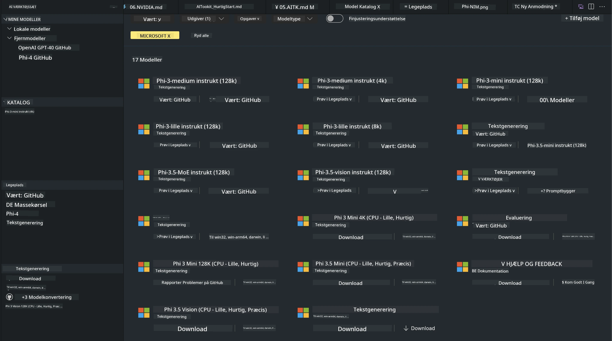
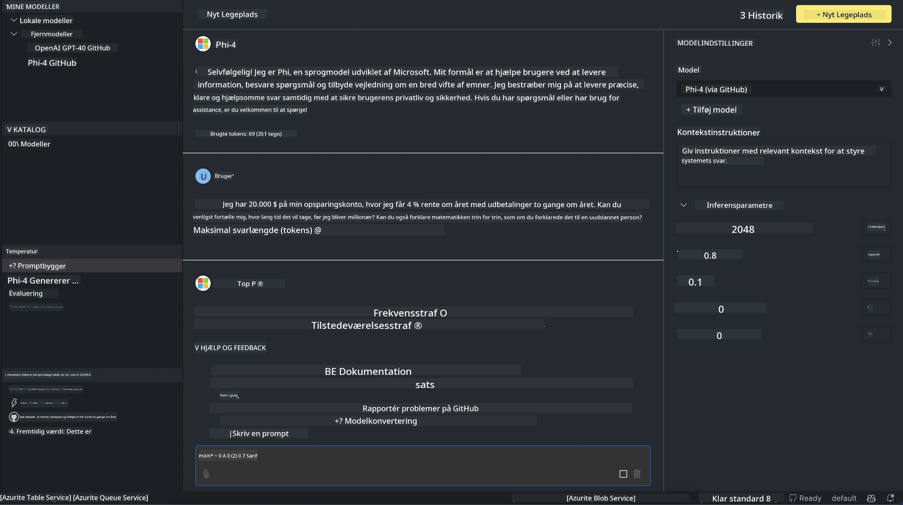

# Phi-familien i AITK

[AI Toolkit for VS Code](https://marketplace.visualstudio.com/items?itemName=ms-windows-ai-studio.windows-ai-studio) forenkler udvikling af generative AI-apps ved at samle banebrydende AI-udviklingsværktøjer og modeller fra Microsoft Foundry Catalog og andre kataloger som Hugging Face. Du vil kunne browse AI-modellernes katalog drevet af GitHub Models og Microsoft Foundry Model Catalogs, downloade dem lokalt eller eksternt, finjustere, teste og bruge dem i din applikation.

AI Toolkit Preview kører lokalt. Lokal inferens eller finjustering afhænger af den valgte model; du kan have brug for en GPU som NVIDIA CUDA GPU. Du kan også køre GitHub Models direkte med AITK.

## Kom godt i gang

[Lær mere om hvordan du installerer Windows subsystem for Linux](https://learn.microsoft.com/windows/wsl/install?WT.mc_id=aiml-137032-kinfeylo)

og [ændring af standarddistribution](https://learn.microsoft.com/windows/wsl/install#change-the-default-linux-distribution-installed).

[AI Toolkit GitHub Repo](https://github.com/microsoft/vscode-ai-toolkit/)

- Windows, Linux, macOS
  
- Til finjustering på både Windows og Linux kræves en Nvidia GPU. Derudover kræver **Windows** subsystem for Linux med Ubuntu distro 18.4 eller nyere. [Lær mere om hvordan du installerer Windows subsystem for Linux](https://learn.microsoft.com/windows/wsl/install) og [ændring af standarddistribution](https://learn.microsoft.com/windows/wsl/install#change-the-default-linux-distribution-installed).

### Installer AI Toolkit

AI Toolkit leveres som en [Visual Studio Code Extension](https://code.visualstudio.com/docs/setup/additional-components#_vs-code-extensions), så du skal først installere [VS Code](https://code.visualstudio.com/docs/setup/windows?WT.mc_id=aiml-137032-kinfeylo) og downloade AI Toolkit fra [VS Marketplace](https://marketplace.visualstudio.com/items?itemName=ms-windows-ai-studio.windows-ai-studio).  
[AI Toolkit er tilgængelig i Visual Studio Marketplace](https://marketplace.visualstudio.com/items?itemName=ms-windows-ai-studio.windows-ai-studio) og kan installeres som enhver anden VS Code-udvidelse.

Hvis du ikke er fortrolig med installation af VS Code-udvidelser, skal du følge disse trin:

### Log ind

1. Vælg **Extensions** i Activity Bar i VS Code  
1. Skriv "AI Toolkit" i Extensions Search bar  
1. Vælg "AI Toolkit for Visual Studio code"  
1. Vælg **Install**

Nu er du klar til at bruge udvidelsen!

Du vil blive bedt om at logge ind på GitHub, så klik venligst "Allow" for at fortsætte. Du bliver omdirigeret til GitHub login-siden.

Log ind og følg trinene i processen. Efter vellykket gennemførelse bliver du sendt tilbage til VS Code.

Når udvidelsen er installeret, vil du se AI Toolkit-ikonet i din Activity Bar.

Lad os udforske de tilgængelige handlinger!

### Tilgængelige handlinger

Primærsiden i AI Toolkit er organiseret i  

- **Models**
- **Resources**
- **Playground**  
- **Fine-tuning**
- **Evaluation**

er tilgængelige i Resources-sektionen. For at komme i gang vælg **Model Catalog**.

### Download en model fra kataloget

Når AI Toolkit startes fra VS Code sidebjælke, kan du vælge mellem følgende muligheder:



- Find en understøttet model i **Model Catalog** og download lokalt
- Test modelinferens i **Model Playground**
- Finjuster model lokalt eller eksternt i **Model Fine-tuning**
- Deploy finjusterede modeller til skyen via kommando-palette til AI Toolkit
- Evaluer modeller

> [!NOTE]
>
> **GPU vs CPU**
>
> Du vil bemærke, at modelkortene viser modelstørrelse, platform og accelerator-type (CPU, GPU). For optimeret ydeevne på **Windows-enheder med mindst én GPU**, vælg modelversioner, der kun er målrettet Windows.
>
> Dette sikrer, at du har en model optimeret til DirectML-acceleratoren.
>
> Modellernes navne er i formatet
>
> - `{model_name}-{accelerator}-{quantization}-{format}`.
>
>For at tjekke om du har en GPU på din Windows-enhed, åbn **Task Manager** og vælg fanen **Performance**. Hvis du har en GPU(er), vil de være opført med navne som "GPU 0" eller "GPU 1".

### Kør modellen i playground

Når alle parametre er sat, klik på **Generate Project**.

Når din model er downloadet, vælg **Load in Playground** på modelkortet i kataloget:

- Start modeldownload
- Installer alle forudsætninger og afhængigheder
- Opret VS Code workspace



### Brug REST API i din applikation

AI Toolkit leveres med en lokal REST API-webserver **på port 5272**, som bruger [OpenAI chat completions formatet](https://platform.openai.com/docs/api-reference/chat/create).

Dette gør det muligt at teste din applikation lokalt uden at skulle stole på en AI-modelservice i skyen. For eksempel viser følgende JSON-fil hvordan du konfigurerer kroppen af forespørgslen:

```json
{
    "model": "Phi-4",
    "messages": [
        {
            "role": "user",
            "content": "what is the golden ratio?"
        }
    ],
    "temperature": 0.7,
    "top_p": 1,
    "top_k": 10,
    "max_tokens": 100,
    "stream": true
}
```
  
Du kan teste REST API'en ved brug af (for eksempel) [Postman](https://www.postman.com/) eller CURL-kommandoen (Client URL):

```bash
curl -vX POST http://127.0.0.1:5272/v1/chat/completions -H 'Content-Type: application/json' -d @body.json
```
  
### Brug af OpenAI-klientbiblioteket til Python

```python
from openai import OpenAI

client = OpenAI(
    base_url="http://127.0.0.1:5272/v1/", 
    api_key="x" # påkrævet for API'en men ikke brugt
)

chat_completion = client.chat.completions.create(
    messages=[
        {
            "role": "user",
            "content": "what is the golden ratio?",
        }
    ],
    model="Phi-4",
)

print(chat_completion.choices[0].message.content)
```
  
### Brug af Azure OpenAI-klientbiblioteket til .NET

Tilføj [Azure OpenAI klientbiblioteket til .NET](https://www.nuget.org/packages/Azure.AI.OpenAI/) til dit projekt via NuGet:

```bash
dotnet add {project_name} package Azure.AI.OpenAI --version 1.0.0-beta.17
```
  
Tilføj en C# fil kaldet **OverridePolicy.cs** til dit projekt og indsæt følgende kode:

```csharp
// OverridePolicy.cs
using Azure.Core.Pipeline;
using Azure.Core;

internal partial class OverrideRequestUriPolicy(Uri overrideUri)
    : HttpPipelineSynchronousPolicy
{
    private readonly Uri _overrideUri = overrideUri;

    public override void OnSendingRequest(HttpMessage message)
    {
        message.Request.Uri.Reset(_overrideUri);
    }
}
```
  
Indsæt derefter følgende kode i din **Program.cs** fil:

```csharp
// Program.cs
using Azure.AI.OpenAI;

Uri localhostUri = new("http://localhost:5272/v1/chat/completions");

OpenAIClientOptions clientOptions = new();
clientOptions.AddPolicy(
    new OverrideRequestUriPolicy(localhostUri),
    Azure.Core.HttpPipelinePosition.BeforeTransport);
OpenAIClient client = new(openAIApiKey: "unused", clientOptions);

ChatCompletionsOptions options = new()
{
    DeploymentName = "Phi-4",
    Messages =
    {
        new ChatRequestSystemMessage("You are a helpful assistant. Be brief and succinct."),
        new ChatRequestUserMessage("What is the golden ratio?"),
    }
};

StreamingResponse<StreamingChatCompletionsUpdate> streamingChatResponse
    = await client.GetChatCompletionsStreamingAsync(options);

await foreach (StreamingChatCompletionsUpdate chatChunk in streamingChatResponse)
{
    Console.Write(chatChunk.ContentUpdate);
}
```


## Finjustering med AI Toolkit

- Kom i gang med modelopdagelse og playground.
- Model-finjustering og inferens ved brug af lokale computerressourcer.
- Fjernfinjustering og inferens ved brug af Azure-ressourcer

[Finjustering med AI Toolkit](../../03.FineTuning/Finetuning_VSCodeaitoolkit.md)

## AI Toolkit Q&A Ressourcer

Se venligst vores [Q&A-side](https://github.com/microsoft/vscode-ai-toolkit/blob/main/archive/QA.md) for de mest almindelige problemer og løsninger.

---

<!-- CO-OP TRANSLATOR DISCLAIMER START -->
**Ansvarsfraskrivelse**:
Dette dokument er blevet oversat ved hjælp af AI-oversættelsestjenesten [Co-op Translator](https://github.com/Azure/co-op-translator). Selvom vi bestræber os på nøjagtighed, bedes du være opmærksom på, at automatiske oversættelser kan indeholde fejl eller unøjagtigheder. Det oprindelige dokument på dets modersmål bør betragtes som den autoritative kilde. For kritisk information anbefales professionel menneskelig oversættelse. Vi påtager os intet ansvar for misforståelser eller fejltolkninger, der måtte opstå som følge af brugen af denne oversættelse.
<!-- CO-OP TRANSLATOR DISCLAIMER END -->