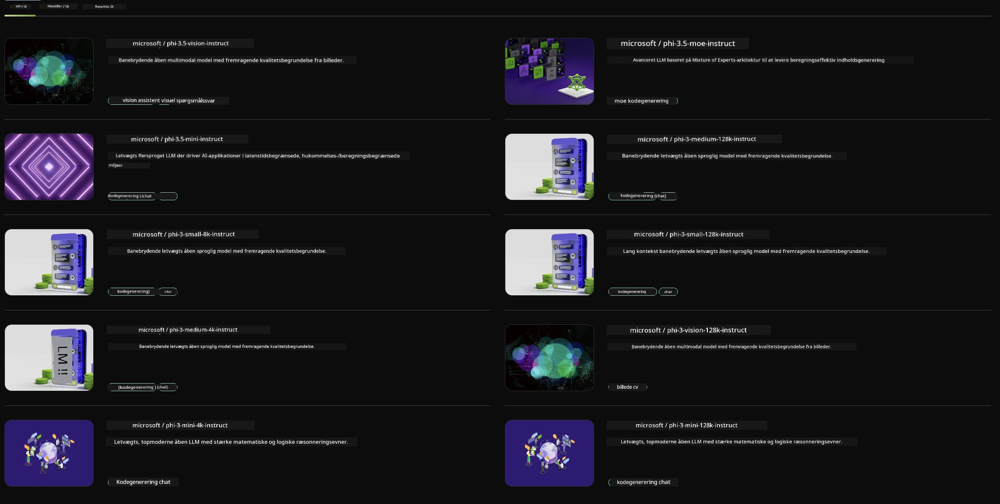

<!--
CO_OP_TRANSLATOR_METADATA:
{
  "original_hash": "7b08e277df2a9307f861ae54bc30c772",
  "translation_date": "2025-07-16T19:37:21+00:00",
  "source_file": "md/01.Introduction/02/06.NVIDIA.md",
  "language_code": "da"
}
-->
## Phi-familien i NVIDIA NIM

NVIDIA NIM er et sæt brugervenlige mikrotjenester designet til at accelerere implementeringen af generative AI-modeller på tværs af cloud, datacentre og arbejdsstationer. NIM’er kategoriseres efter modelfamilie og på modelbasis. For eksempel bringer NVIDIA NIM for store sprogmodeller (LLMs) kraften fra state-of-the-art LLM’er til virksomhedsapplikationer og leverer uovertrufne evner inden for naturlig sprogbehandling og forståelse.

NIM gør det nemt for IT- og DevOps-teams at selvhoste store sprogmodeller (LLMs) i deres egne styrede miljøer, samtidig med at udviklere får adgang til branchestandard-API’er, som gør det muligt at bygge kraftfulde copiloter, chatbots og AI-assistenter, der kan transformere deres forretning. Ved at udnytte NVIDIAs banebrydende GPU-acceleration og skalerbar implementering tilbyder NIM den hurtigste vej til inferens med enestående ydeevne.

Du kan bruge NVIDIA NIM til at inferere Phi Family Models



### **Eksempler - Phi-3-Vision i NVIDIA NIM**

Forestil dig, at du har et billede (`demo.png`), og du ønsker at generere Python-kode, der behandler dette billede og gemmer en ny version af det (`phi-3-vision.jpg`).

Koden ovenfor automatiserer denne proces ved at:

1. Sætte miljøet op og nødvendige konfigurationer.
2. Oprette en prompt, der instruerer modellen til at generere den nødvendige Python-kode.
3. Sende prompten til modellen og indsamle den genererede kode.
4. Ekstrahere og køre den genererede kode.
5. Vise det originale og det behandlede billede.

Denne tilgang udnytter AI’s kraft til at automatisere billedbehandlingsopgaver, hvilket gør det nemmere og hurtigere at nå dine mål.

[Sample Code Solution](../../../../../code/06.E2E/E2E_Nvidia_NIM_Phi3_Vision.ipynb)

Lad os gennemgå, hvad hele koden gør trin for trin:

1. **Installer nødvendigt pakke**:
    ```python
    !pip install langchain_nvidia_ai_endpoints -U
    ```
    Denne kommando installerer `langchain_nvidia_ai_endpoints`-pakken og sikrer, at det er den nyeste version.

2. **Importer nødvendige moduler**:
    ```python
    from langchain_nvidia_ai_endpoints import ChatNVIDIA
    import getpass
    import os
    import base64
    ```
    Disse imports henter de nødvendige moduler til at interagere med NVIDIA AI-endpoints, håndtere adgangskoder sikkert, interagere med operativsystemet og kode/dekode data i base64-format.

3. **Opsæt API-nøgle**:
    ```python
    if not os.getenv("NVIDIA_API_KEY"):
        os.environ["NVIDIA_API_KEY"] = getpass.getpass("Enter your NVIDIA API key: ")
    ```
    Denne kode tjekker, om miljøvariablen `NVIDIA_API_KEY` er sat. Hvis ikke, beder den brugeren om at indtaste deres API-nøgle sikkert.

4. **Definer model og sti til billede**:
    ```python
    model = 'microsoft/phi-3-vision-128k-instruct'
    chat = ChatNVIDIA(model=model)
    img_path = './imgs/demo.png'
    ```
    Dette sætter den model, der skal bruges, opretter en instans af `ChatNVIDIA` med den angivne model og definerer stien til billedfilen.

5. **Opret tekstprompt**:
    ```python
    text = "Please create Python code for image, and use plt to save the new picture under imgs/ and name it phi-3-vision.jpg."
    ```
    Dette definerer en tekstprompt, der instruerer modellen til at generere Python-kode til billedbehandling.

6. **Kod billedet i base64**:
    ```python
    with open(img_path, "rb") as f:
        image_b64 = base64.b64encode(f.read()).decode()
    image = f''
    ```
    Denne kode læser billedfilen, koder den i base64 og opretter et HTML-billedtag med de kodede data.

7. **Kombiner tekst og billede i prompt**:
    ```python
    prompt = f"{text} {image}"
    ```
    Dette kombinerer tekstprompten og HTML-billedtaget til en enkelt streng.

8. **Generer kode med ChatNVIDIA**:
    ```python
    code = ""
    for chunk in chat.stream(prompt):
        print(chunk.content, end="")
        code += chunk.content
    ```
    Denne kode sender prompten til `ChatNVIDIA`-modellen og indsamler den genererede kode i bidder, printer og tilføjer hver bid til `code`-strengen.

9. **Ekstraher Python-kode fra genereret indhold**:
    ```python
    begin = code.index('```python') + 9
    code = code[begin:]
    end = code.index('```')
    code = code[:end]
    ```
    Dette ekstraherer den faktiske Python-kode fra det genererede indhold ved at fjerne markdown-formateringen.

10. **Kør den genererede kode**:
    ```python
    import subprocess
    result = subprocess.run(["python", "-c", code], capture_output=True)
    ```
    Dette kører den ekstraherede Python-kode som en subprocess og fanger dens output.

11. **Vis billeder**:
    ```python
    from IPython.display import Image, display
    display(Image(filename='./imgs/phi-3-vision.jpg'))
    display(Image(filename='./imgs/demo.png'))
    ```
    Disse linjer viser billederne ved hjælp af `IPython.display`-modulet.

**Ansvarsfraskrivelse**:  
Dette dokument er blevet oversat ved hjælp af AI-oversættelsestjenesten [Co-op Translator](https://github.com/Azure/co-op-translator). Selvom vi bestræber os på nøjagtighed, bedes du være opmærksom på, at automatiserede oversættelser kan indeholde fejl eller unøjagtigheder. Det oprindelige dokument på dets oprindelige sprog bør betragtes som den autoritative kilde. For kritisk information anbefales professionel menneskelig oversættelse. Vi påtager os intet ansvar for misforståelser eller fejltolkninger, der opstår som følge af brugen af denne oversættelse.