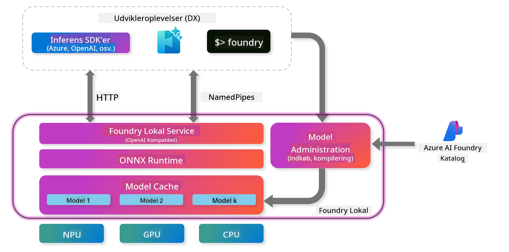
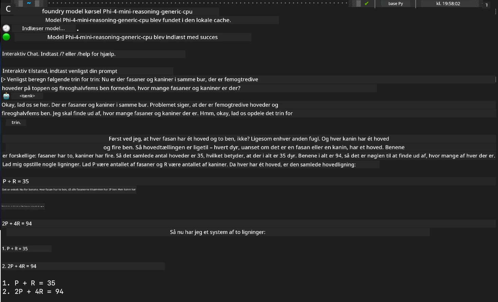

<!--
CO_OP_TRANSLATOR_METADATA:
{
  "original_hash": "52973a5680a65a810aa80b7036afd31f",
  "translation_date": "2025-07-16T19:47:40+00:00",
  "source_file": "md/01.Introduction/02/07.FoundryLocal.md",
  "language_code": "da"
}
-->
## Kom godt i gang med Phi-Family modeller i Foundry Local

### Introduktion til Foundry Local

Foundry Local er en kraftfuld AI-inferenceløsning, der kører direkte på din enhed og bringer AI i virksomhedsklasse til dit lokale hardware. Denne vejledning guider dig gennem opsætning og brug af Phi-Family modeller med Foundry Local, så du får fuld kontrol over dine AI-arbejdsbelastninger samtidig med, at du bevarer privatliv og reducerer omkostninger.

Foundry Local leverer ydeevne, privatliv, tilpasning og omkostningsfordele ved at køre AI-modeller lokalt på din enhed. Det integreres problemfrit i dine eksisterende arbejdsgange og applikationer via en intuitiv CLI, SDK og REST API.




### Hvorfor vælge Foundry Local?

At forstå fordelene ved Foundry Local hjælper dig med at træffe velinformerede beslutninger om din AI-implementeringsstrategi:

- **On-Device Inference:** Kør modeller lokalt på dit eget hardware, hvilket reducerer dine omkostninger og samtidig holder alle dine data på din enhed.

- **Modeltilpasning:** Vælg mellem forudindstillede modeller eller brug dine egne for at opfylde specifikke krav og anvendelsestilfælde.

- **Omkostningseffektivitet:** Fjern tilbagevendende omkostninger til cloud-tjenester ved at bruge dit eksisterende hardware, hvilket gør AI mere tilgængeligt.

- **Sømløs integration:** Forbind med dine applikationer via SDK, API-endpoints eller CLI, med nem skalering til Azure AI Foundry, efterhånden som dine behov vokser.

> **Getting Started Note:** Denne vejledning fokuserer på brug af Foundry Local gennem CLI og SDK interfaces. Du lærer begge metoder, så du kan vælge den bedste til dit brugstilfælde.

## Del 1: Opsætning af Foundry Local CLI

### Trin 1: Installation

Foundry Local CLI er din adgang til at administrere og køre AI-modeller lokalt. Lad os starte med at installere det på dit system.

**Understøttede platforme:** Windows og macOS

For detaljerede installationsinstruktioner, se venligst den [officielle Foundry Local dokumentation](https://github.com/microsoft/Foundry-Local/blob/main/README.md).

### Trin 2: Udforskning af tilgængelige modeller

Når du har installeret Foundry Local CLI, kan du finde ud af, hvilke modeller der er tilgængelige til dit brugstilfælde. Denne kommando viser alle understøttede modeller:


```bash
foundry model list
```

### Trin 3: Forståelse af Phi Family modeller

Phi Family tilbyder en række modeller optimeret til forskellige brugstilfælde og hardwarekonfigurationer. Her er de Phi-modeller, der er tilgængelige i Foundry Local:

**Tilgængelige Phi modeller:** 

- **phi-3.5-mini** - Kompakt model til grundlæggende opgaver
- **phi-3-mini-128k** - Udvidet kontekstversion til længere samtaler
- **phi-3-mini-4k** - Standard kontekstmodel til generel brug
- **phi-4** - Avanceret model med forbedrede evner
- **phi-4-mini** - Letvægtsversion af Phi-4
- **phi-4-mini-reasoning** - Specialiseret til komplekse ræsonnementopgaver

> **Hardwarekompatibilitet:** Hver model kan konfigureres til forskellige hardwareaccelerationer (CPU, GPU) afhængigt af dine systemmuligheder.

### Trin 4: Kør din første Phi-model

Lad os starte med et praktisk eksempel. Vi kører `phi-4-mini-reasoning` modellen, som er god til at løse komplekse problemer trin for trin.


**Kommando til at køre modellen:**

```bash
foundry model run Phi-4-mini-reasoning-generic-cpu
```

> **Første gang opsætning:** Når du kører en model for første gang, downloader Foundry Local den automatisk til din lokale enhed. Downloadtiden varierer afhængigt af din netværkshastighed, så vær tålmodig under den indledende opsætning.

### Trin 5: Test modellen med et reelt problem

Lad os nu teste vores model med et klassisk logikproblem for at se, hvordan den håndterer trinvis ræsonnering:

**Eksempelproblem:**

```txt
Please calculate the following step by step: Now there are pheasants and rabbits in the same cage, there are thirty-five heads on top and ninety-four legs on the bottom, how many pheasants and rabbits are there?
```

**Forventet adfærd:** Modellen bør opdele problemet i logiske trin og bruge det faktum, at fasaner har 2 ben og kaniner har 4 ben, til at løse ligningssystemet.

**Resultater:**



## Del 2: Byg applikationer med Foundry Local SDK

### Hvorfor bruge SDK?

Mens CLI er perfekt til test og hurtige interaktioner, giver SDK dig mulighed for at integrere Foundry Local i dine applikationer programmatisk. Det åbner op for muligheder som:

- At bygge brugerdefinerede AI-drevne applikationer
- Oprette automatiserede arbejdsgange
- Integrere AI-funktioner i eksisterende systemer
- Udvikle chatbots og interaktive værktøjer

### Understøttede programmeringssprog

Foundry Local tilbyder SDK-understøttelse for flere programmeringssprog, så det passer til dine udviklingspræferencer:

**📦 Tilgængelige SDK’er:**

- **C# (.NET):** [SDK Dokumentation & Eksempler](https://github.com/microsoft/Foundry-Local/tree/main/sdk/cs)
- **Python:** [SDK Dokumentation & Eksempler](https://github.com/microsoft/Foundry-Local/tree/main/sdk/python)
- **JavaScript:** [SDK Dokumentation & Eksempler](https://github.com/microsoft/Foundry-Local/tree/main/sdk/js)
- **Rust:** [SDK Dokumentation & Eksempler](https://github.com/microsoft/Foundry-Local/tree/main/sdk/rust)

### Næste skridt

1. **Vælg dit foretrukne SDK** baseret på dit udviklingsmiljø  
2. **Følg SDK-specifik dokumentation** for detaljerede implementeringsvejledninger  
3. **Start med simple eksempler** før du bygger komplekse applikationer  
4. **Udforsk eksempelkoden** i hvert SDK-repositorium  

## Konklusion

Du har nu lært hvordan du:  
- ✅ Installerer og opsætter Foundry Local CLI  
- ✅ Finder og kører Phi Family modeller  
- ✅ Tester modeller med virkelige problemer  
- ✅ Forstår SDK-muligheder til applikationsudvikling  

Foundry Local giver et stærkt fundament for at bringe AI-funktioner direkte til dit lokale miljø, så du får kontrol over ydeevne, privatliv og omkostninger, samtidig med at du bevarer fleksibiliteten til at skalere til cloud-løsninger, når det er nødvendigt.

**Ansvarsfraskrivelse**:  
Dette dokument er blevet oversat ved hjælp af AI-oversættelsestjenesten [Co-op Translator](https://github.com/Azure/co-op-translator). Selvom vi bestræber os på nøjagtighed, bedes du være opmærksom på, at automatiserede oversættelser kan indeholde fejl eller unøjagtigheder. Det oprindelige dokument på dets oprindelige sprog bør betragtes som den autoritative kilde. For kritisk information anbefales professionel menneskelig oversættelse. Vi påtager os intet ansvar for misforståelser eller fejltolkninger, der opstår som følge af brugen af denne oversættelse.