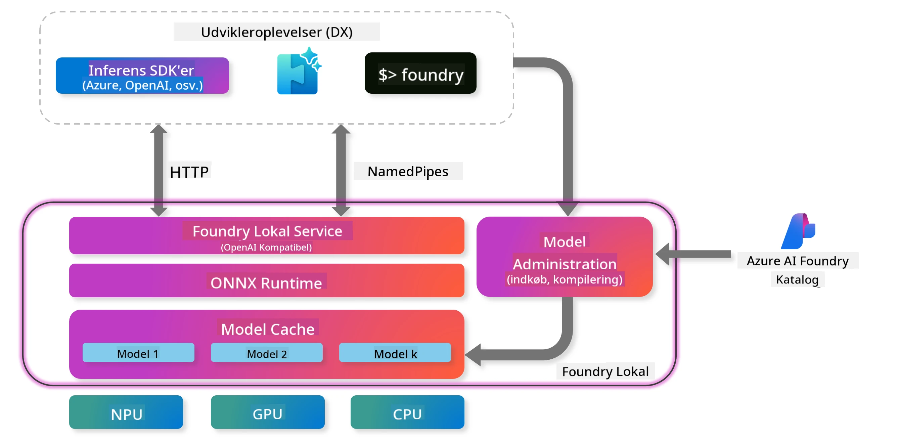
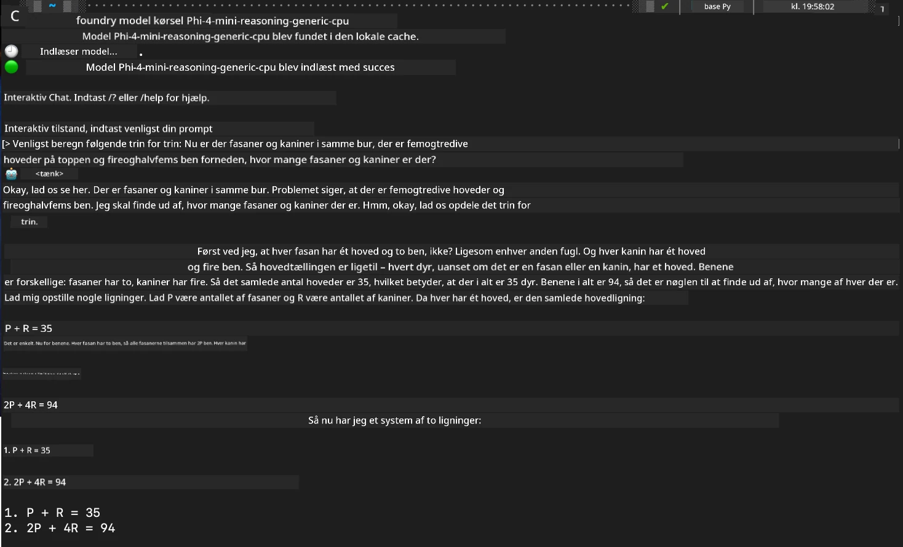

## Kom godt i gang med Phi-Family modeller i Foundry Local

### Introduktion til Foundry Local

Foundry Local er en kraftfuld AI-inferenz-løsning på enheden, der bringer AI-kapaciteter i virksomhedsformat direkte til dit lokale hardware. Denne vejledning vil guide dig gennem opsætning og brug af Phi-Family modeller med Foundry Local, hvilket giver dig fuld kontrol over dine AI-arbejdsbelastninger samtidig med at du opretholder privatliv og reducerer omkostninger.

Foundry Local tilbyder ydelse, privatliv, tilpasning og omkostningsfordele ved at køre AI-modeller lokalt på din enhed. Det integreres sømløst i dine eksisterende arbejdsprocesser og applikationer gennem en intuitiv CLI, SDK og REST API.




### Hvorfor vælge Foundry Local?

At forstå fordelene ved Foundry Local vil hjælpe dig med at træffe informerede beslutninger om din AI-implementeringsstrategi:

- **Inference på enheden:** Kør modeller lokalt på dit eget hardware, hvilket reducerer dine omkostninger samtidig med at alle dine data forbliver på din enhed.

- **Modeltilpasning:** Vælg mellem forudindstillede modeller eller brug dine egne for at opfylde specifikke krav og brugssager.

- **Omkostningseffektivitet:** Eliminér tilbagevendende omkostninger til cloud-tjenester ved at bruge dit eksisterende hardware, hvilket gør AI mere tilgængeligt.

- **Sømløs integration:** Forbind med dine applikationer gennem en SDK, API-endpoints eller CLI, med nem skalering til Microsoft Foundry, efterhånden som dine behov vokser.

> **Kom godt i gang note:** Denne vejledning fokuserer på at bruge Foundry Local gennem CLI- og SDK-grænseflader. Du vil lære begge tilgange for at hjælpe dig med at vælge den bedste metode til dit brug.

## Del 1: Opsætning af Foundry Local CLI

### Trin 1: Installation

Foundry Local CLI er din adgang til at administrere og køre AI-modeller lokalt. Lad os starte med at installere det på dit system.

**Understøttede platforme:** Windows og macOS

For detaljerede installationsinstruktioner, se venligst den [officielle Foundry Local dokumentation](https://github.com/microsoft/Foundry-Local/blob/main/README.md).

### Trin 2: Udforskning af tilgængelige modeller

Når du har installeret Foundry Local CLI, kan du opdage hvilke modeller der er tilgængelige til din brugssag. Denne kommando viser alle understøttede modeller:


```bash
foundry model list
```

### Trin 3: Forstå Phi Family modeller

Phi Family tilbyder en række modeller optimeret til forskellige brugssager og hardwarekonfigurationer. Her er Phi-modellerne tilgængelige i Foundry Local:

**Tilgængelige Phi modeller:** 

- **phi-3.5-mini** - Kompakt model til grundlæggende opgaver
- **phi-3-mini-128k** - Udvidet kontekstversion til længere samtaler
- **phi-3-mini-4k** - Standard kontekstmodel til generel brug
- **phi-4** - Avanceret model med forbedrede evner
- **phi-4-mini** - Letvægtsversion af Phi-4
- **phi-4-mini-reasoning** - Specialiseret til komplekse ræsonnementopgaver

> **Hardwarekompatibilitet:** Hver model kan konfigureres til forskellig hardwareacceleration (CPU, GPU) afhængigt af dine systemkapaciteter.

### Trin 4: Kør din første Phi model

Lad os starte med et praktisk eksempel. Vi vil køre `phi-4-mini-reasoning` modellen, som er god til at løse komplekse problemer trin for trin.


**Kommando til at køre modellen:**

```bash
foundry model run Phi-4-mini-reasoning-generic-cpu
```

> **Første gang opsætning:** Når du kører en model for første gang, vil Foundry Local automatisk downloade den til din lokale enhed. Download-tiden varierer afhængigt af din netværkshastighed, så vær tålmodig under den indledende opsætning.

### Trin 5: Test modellen med et rigtigt problem

Nu skal vi teste vores model med et klassisk logikproblem for at se, hvordan den klarer trinvis ræsonnering:

**Eksempelproblem:**

```txt
Please calculate the following step by step: Now there are pheasants and rabbits in the same cage, there are thirty-five heads on top and ninety-four legs on the bottom, how many pheasants and rabbits are there?
```

**Forventet adfærd:** Modellen bør opdele dette problem i logiske trin ved hjælp af det faktum, at fasaner har 2 ben og kaniner har 4 ben for at løse ligningssystemet.

**Resultater:**



## Del 2: Byg applikationer med Foundry Local SDK

### Hvorfor bruge SDK?

Mens CLI er perfekt til test og hurtige interaktioner, giver SDK dig mulighed for programmæssigt at integrere Foundry Local i dine applikationer. Dette åbner muligheder for:

- At bygge brugerdefinerede AI-drevne applikationer
- At skabe automatiserede arbejdsprocesser
- At integrere AI-funktioner i eksisterende systemer
- At udvikle chatbots og interaktive værktøjer

### Understøttede programmeringssprog

Foundry Local tilbyder SDK-tilgang for flere programmeringssprog, så det passer til dine udviklingspræferencer:

**📦 Tilgængelige SDK'er:**

- **C# (.NET):** [SDK Dokumentation & Eksempler](https://github.com/microsoft/Foundry-Local/tree/main/sdk/cs)
- **Python:** [SDK Dokumentation & Eksempler](https://github.com/microsoft/Foundry-Local/tree/main/sdk/python)
- **JavaScript:** [SDK Dokumentation & Eksempler](https://github.com/microsoft/Foundry-Local/tree/main/sdk/js)
- **Rust:** [SDK Dokumentation & Eksempler](https://github.com/microsoft/Foundry-Local/tree/main/sdk/rust)

### Næste skridt

1. **Vælg dit foretrukne SDK** baseret på dit udviklingsmiljø
2. **Følg SDK-specifik dokumentation** for detaljerede implementeringsvejledninger
3. **Start med simple eksempler** før du bygger komplekse applikationer
4. **Udforsk de eksempelkoder** der er tilgængelige i hvert SDK-lager

## Konklusion

Du har nu lært at:
- ✅ Installere og opsætte Foundry Local CLI
- ✅ Opdage og køre Phi Family modeller
- ✅ Teste modeller med virkelige problemer
- ✅ Forstå SDK-muligheder til applikationsudvikling

Foundry Local leverer et kraftfuldt fundament for at bringe AI-kapaciteter direkte til dit lokale miljø, hvilket giver dig kontrol over ydelse, privatliv og omkostninger samtidig med at fleksibiliteten til at skalere til cloud-løsninger bevares, når det er nødvendigt.

---

<!-- CO-OP TRANSLATOR DISCLAIMER START -->
**Ansvarsfraskrivelse**:
Dette dokument er blevet oversat ved hjælp af AI-oversættelsestjenesten [Co-op Translator](https://github.com/Azure/co-op-translator). Selvom vi bestræber os på nøjagtighed, skal du være opmærksom på, at automatiserede oversættelser kan indeholde fejl eller unøjagtigheder. Det oprindelige dokument på dets modersmål bør betragtes som den autoritative kilde. For kritisk information anbefales professionel menneskelig oversættelse. Vi påtager os intet ansvar for eventuelle misforståelser eller fejltolkninger, der opstår som følge af brugen af denne oversættelse.
<!-- CO-OP TRANSLATOR DISCLAIMER END -->