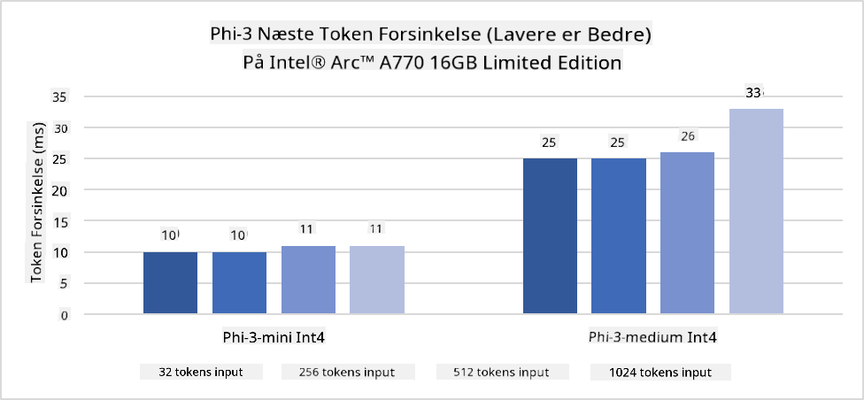

<!--
CO_OP_TRANSLATOR_METADATA:
{
  "original_hash": "e08ce816e23ad813244a09ca34ebb8ac",
  "translation_date": "2025-05-09T10:20:32+00:00",
  "source_file": "md/01.Introduction/03/AIPC_Inference.md",
  "language_code": "da"
}
-->
# **Inference Phi-3 på AI PC**

Med fremskridt inden for generativ AI og forbedringer i hardwarekapaciteter på edge-enheder kan flere og flere generative AI-modeller nu integreres i brugernes Bring Your Own Device (BYOD). AI PC'er er blandt disse modeller. Fra 2024 har Intel, AMD og Qualcomm samarbejdet med PC-producenter om at introducere AI PC'er, der muliggør implementering af lokaliserede generative AI-modeller gennem hardwareændringer. I denne diskussion vil vi fokusere på Intel AI PC'er og undersøge, hvordan man implementerer Phi-3 på en Intel AI PC.

### Hvad er en NPU

En NPU (Neural Processing Unit) er en dedikeret processor eller behandlingsenhed på en større SoC, der er designet specifikt til at accelerere neurale netværksoperationer og AI-opgaver. I modsætning til generelle CPU'er og GPU'er er NPUs optimeret til datadrevet parallelbehandling, hvilket gør dem meget effektive til at håndtere store mængder multimediedata som videoer og billeder samt data til neurale netværk. De er særligt dygtige til AI-relaterede opgaver som talegenkendelse, baggrundssløring i videoopkald og foto- eller videoredigering som objektgenkendelse.

## NPU vs GPU

Selvom mange AI- og maskinlæringsopgaver kører på GPU'er, er der en vigtig forskel mellem GPU'er og NPU'er.
GPU'er er kendt for deres parallelle beregningskapaciteter, men ikke alle GPU'er er lige effektive ud over grafikbehandling. NPUs er derimod specialbygget til komplekse beregninger i neurale netværksoperationer, hvilket gør dem meget effektive til AI-opgaver.

Sammenfattende er NPUs de matematiske mestre, der giver AI-beregninger et boost, og de spiller en central rolle i den nye æra af AI PC'er!

***Dette eksempel er baseret på Intels nyeste Intel Core Ultra Processor***

## **1. Brug NPU til at køre Phi-3 modellen**

Intel® NPU-enheden er en AI-inferensaccelerator integreret med Intel-klient-CPU'er, startende fra Intel® Core™ Ultra generationen (tidligere kendt som Meteor Lake). Den muliggør energieffektiv udførelse af opgaver med kunstige neurale netværk.




**Intel NPU Acceleration Library**

Intel NPU Acceleration Library [https://github.com/intel/intel-npu-acceleration-library](https://github.com/intel/intel-npu-acceleration-library) er et Python-bibliotek designet til at øge effektiviteten af dine applikationer ved at udnytte kraften i Intel Neural Processing Unit (NPU) til at udføre hurtige beregninger på kompatibel hardware.

Eksempel på Phi-3-mini på AI PC drevet af Intel® Core™ Ultra processorer.


Installer Python-biblioteket med pip

```bash

   pip install intel-npu-acceleration-library

```

***Note*** Projektet er stadig under udvikling, men referencemodellen er allerede meget komplet.

### **Kørsel af Phi-3 med Intel NPU Acceleration Library**

Ved brug af Intel NPU-acceleration påvirker dette bibliotek ikke den traditionelle kodningsproces. Du skal blot bruge biblioteket til at kvantisere den oprindelige Phi-3-model, fx FP16, INT8, INT4, som 

```python
from transformers import AutoTokenizer, pipeline,TextStreamer
from intel_npu_acceleration_library import NPUModelForCausalLM, int4
from intel_npu_acceleration_library.compiler import CompilerConfig
import warnings

model_id = "microsoft/Phi-3-mini-4k-instruct"

compiler_conf = CompilerConfig(dtype=int4)
model = NPUModelForCausalLM.from_pretrained(
    model_id, use_cache=True, config=compiler_conf, attn_implementation="sdpa"
).eval()

tokenizer = AutoTokenizer.from_pretrained(model_id)

text_streamer = TextStreamer(tokenizer, skip_prompt=True)
```

Efter kvantiseringen er gennemført, fortsæt med at kalde NPU til at køre Phi-3 modellen.

```python
generation_args = {
   "max_new_tokens": 1024,
   "return_full_text": False,
   "temperature": 0.3,
   "do_sample": False,
   "streamer": text_streamer,
}

pipe = pipeline(
   "text-generation",
   model=model,
   tokenizer=tokenizer,
)

query = "<|system|>You are a helpful AI assistant.<|end|><|user|>Can you introduce yourself?<|end|><|assistant|>"

with warnings.catch_warnings():
    warnings.simplefilter("ignore")
    pipe(query, **generation_args)
```

Når koden kører, kan vi følge NPU'ens status via Task Manager


***Samples*** : [AIPC_NPU_DEMO.ipynb](../../../../../code/03.Inference/AIPC/AIPC_NPU_DEMO.ipynb)

## **2. Brug DirectML + ONNX Runtime til at køre Phi-3 modellen**

### **Hvad er DirectML**

[DirectML](https://github.com/microsoft/DirectML) er et højtydende, hardwareaccelereret DirectX 12-bibliotek til maskinlæring. DirectML tilbyder GPU-acceleration for almindelige maskinlæringsopgaver på en bred vifte af understøttet hardware og drivere, herunder alle DirectX 12-kompatible GPU'er fra producenter som AMD, Intel, NVIDIA og Qualcomm.

Når det bruges alene, er DirectML API et lavniveau DirectX 12-bibliotek, der egner sig til højtydende, lav-latens applikationer som frameworks, spil og andre realtidsapplikationer. Den problemfri interoperabilitet mellem DirectML og Direct3D 12 samt det lave overhead og konformitet på tværs af hardware gør DirectML ideelt til at accelerere maskinlæring, når både høj ydeevne og pålidelighed på tværs af hardware er vigtig.

***Note*** : Den nyeste DirectML understøtter allerede NPU(https://devblogs.microsoft.com/directx/introducing-neural-processor-unit-npu-support-in-directml-developer-preview/)

### DirectML og CUDA i forhold til kapaciteter og ydeevne:

**DirectML** er et maskinlæringsbibliotek udviklet af Microsoft. Det er designet til at accelerere maskinlæringsopgaver på Windows-enheder, herunder desktops, laptops og edge-enheder.
- DX12-baseret: DirectML bygger på DirectX 12 (DX12), som giver bred hardwareunderstøttelse på tværs af GPU'er, inklusive både NVIDIA og AMD.
- Bredere understøttelse: Da det benytter DX12, kan DirectML arbejde med enhver GPU, der understøtter DX12, også integrerede GPU'er.
- Billedbehandling: DirectML behandler billeder og andre data ved hjælp af neurale netværk, hvilket gør det egnet til opgaver som billedgenkendelse, objektgenkendelse og mere.
- Nem opsætning: Opsætning af DirectML er enkel og kræver ikke specifikke SDK'er eller biblioteker fra GPU-producenter.
- Ydeevne: I nogle tilfælde præsterer DirectML godt og kan være hurtigere end CUDA, især for visse arbejdsbelastninger.
- Begrænsninger: Der er dog situationer, hvor DirectML kan være langsommere, især ved float16 store batch-størrelser.

**CUDA** er NVIDIAs parallelle beregningsplatform og programmeringsmodel. Den giver udviklere mulighed for at udnytte kraften i NVIDIA GPU'er til generel databehandling, inklusive maskinlæring og videnskabelige simuleringer.
- NVIDIA-specifik: CUDA er tæt integreret med NVIDIA GPU'er og er specifikt designet til dem.
- Højt optimeret: Den leverer fremragende ydeevne til GPU-accelererede opgaver, især med NVIDIA GPU'er.
- Udbredt brug: Mange maskinlæringsframeworks og biblioteker (som TensorFlow og PyTorch) understøtter CUDA.
- Tilpasning: Udviklere kan finjustere CUDA-indstillinger til specifikke opgaver, hvilket kan føre til optimal ydeevne.
- Begrænsninger: CUDA's afhængighed af NVIDIA-hardware kan være en begrænsning, hvis man ønsker bredere kompatibilitet på tværs af forskellige GPU'er.

### Valg mellem DirectML og CUDA

Valget mellem DirectML og CUDA afhænger af dit specifikke brugsscenarie, hardwaretilgængelighed og præferencer.
Hvis du ønsker bredere kompatibilitet og nem opsætning, kan DirectML være et godt valg. Har du derimod NVIDIA GPU'er og brug for højt optimeret ydeevne, er CUDA stadig en stærk kandidat. Samlet set har både DirectML og CUDA deres styrker og svagheder, så overvej dine krav og tilgængelig hardware, når du træffer beslutning.

### **Generativ AI med ONNX Runtime**

I AI-æraen er portabilitet af AI-modeller meget vigtigt. ONNX Runtime kan nemt implementere trænede modeller på forskellige enheder. Udviklere behøver ikke at bekymre sig om inferensrammen og kan bruge en ensartet API til at udføre modelinferens. I den generative AI-æra har ONNX Runtime også udført kodeoptimering (https://onnxruntime.ai/docs/genai/). Gennem den optimerede ONNX Runtime kan den kvantiserede generative AI-model infereres på forskellige terminaler. Med Generative AI med ONNX Runtime kan du inferere AI-model API via Python, C#, C/C++. Selvfølgelig kan implementering på iPhone drage fordel af C++’s Generative AI med ONNX Runtime API.

[Sample Code](https://github.com/Azure-Samples/Phi-3MiniSamples/tree/main/onnx)

***Kompiler generativ AI med ONNX Runtime bibliotek***

```bash

winget install --id=Kitware.CMake  -e

git clone https://github.com/microsoft/onnxruntime.git

cd .\onnxruntime\

./build.bat --build_shared_lib --skip_tests --parallel --use_dml --config Release

cd ../

git clone https://github.com/microsoft/onnxruntime-genai.git

cd .\onnxruntime-genai\

mkdir ort

cd ort

mkdir include

mkdir lib

copy ..\onnxruntime\include\onnxruntime\core\providers\dml\dml_provider_factory.h ort\include

copy ..\onnxruntime\include\onnxruntime\core\session\onnxruntime_c_api.h ort\include

copy ..\onnxruntime\build\Windows\Release\Release\*.dll ort\lib

copy ..\onnxruntime\build\Windows\Release\Release\onnxruntime.lib ort\lib

python build.py --use_dml


```

**Installer bibliotek**

```bash

pip install .\onnxruntime_genai_directml-0.3.0.dev0-cp310-cp310-win_amd64.whl

```

Dette er kørselresultatet


***Samples*** : [AIPC_DirectML_DEMO.ipynb](../../../../../code/03.Inference/AIPC/AIPC_DirectML_DEMO.ipynb)

## **3. Brug Intel OpenVino til at køre Phi-3 modellen**

### **Hvad er OpenVINO**

[OpenVINO](https://github.com/openvinotoolkit/openvino) er et open source-værktøjssæt til optimering og implementering af dyb læringsmodeller. Det giver forbedret ydelse for dyb læring inden for vision, lyd og sprogmodeller fra populære frameworks som TensorFlow, PyTorch og flere. Kom godt i gang med OpenVINO. OpenVINO kan også bruges i kombination med CPU og GPU til at køre Phi-3 modellen.

***Note***: OpenVINO understøtter ikke NPU på nuværende tidspunkt.

### **Installer OpenVINO bibliotek**

```bash

 pip install git+https://github.com/huggingface/optimum-intel.git

 pip install git+https://github.com/openvinotoolkit/nncf.git

 pip install openvino-nightly

```

### **Kørsel af Phi-3 med OpenVINO**

Ligesom NPU fuldfører OpenVINO kaldet af generative AI-modeller ved at køre kvantiserede modeller. Vi skal først kvantisere Phi-3 modellen og fuldføre modelkvantiseringen via kommandolinjen med optimum-cli

**INT4**

```bash

optimum-cli export openvino --model "microsoft/Phi-3-mini-4k-instruct" --task text-generation-with-past --weight-format int4 --group-size 128 --ratio 0.6  --sym  --trust-remote-code ./openvinomodel/phi3/int4

```

**FP16**

```bash

optimum-cli export openvino --model "microsoft/Phi-3-mini-4k-instruct" --task text-generation-with-past --weight-format fp16 --trust-remote-code ./openvinomodel/phi3/fp16

```

det konverterede format ser sådan ud


Indlæs modelstier (model_dir), relaterede konfigurationer (ov_config = {"PERFORMANCE_HINT": "LATENCY", "NUM_STREAMS": "1", "CACHE_DIR": ""}) og hardwareaccelererede enheder (GPU.0) gennem OVModelForCausalLM

```python

ov_model = OVModelForCausalLM.from_pretrained(
     model_dir,
     device='GPU.0',
     ov_config=ov_config,
     config=AutoConfig.from_pretrained(model_dir, trust_remote_code=True),
     trust_remote_code=True,
)

```

Når koden kører, kan vi følge GPU'ens status via Task Manager


***Samples*** : [AIPC_OpenVino_Demo.ipynb](../../../../../code/03.Inference/AIPC/AIPC_OpenVino_Demo.ipynb)

### ***Note*** : De tre ovenstående metoder har hver deres fordele, men det anbefales at bruge NPU-acceleration til AI PC-inferens.

**Ansvarsfraskrivelse**:  
Dette dokument er blevet oversat ved hjælp af AI-oversættelsestjenesten [Co-op Translator](https://github.com/Azure/co-op-translator). Selvom vi bestræber os på nøjagtighed, bedes du være opmærksom på, at automatiserede oversættelser kan indeholde fejl eller unøjagtigheder. Det originale dokument på dets oprindelige sprog bør betragtes som den autoritative kilde. For kritisk information anbefales professionel menneskelig oversættelse. Vi påtager os intet ansvar for misforståelser eller fejltolkninger, der opstår som følge af brugen af denne oversættelse.