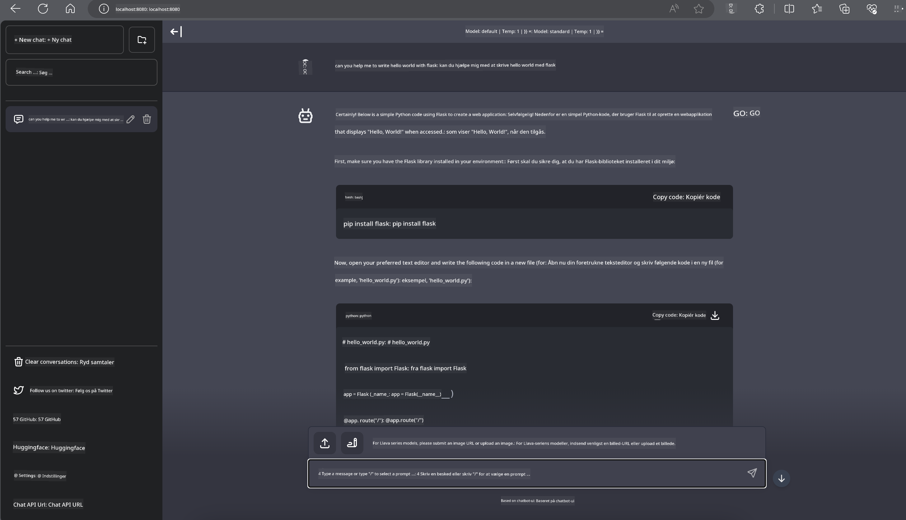

<!--
CO_OP_TRANSLATOR_METADATA:
{
  "original_hash": "be4101a30d98e95a71d42c276e8bcd37",
  "translation_date": "2025-07-16T20:43:02+00:00",
  "source_file": "md/01.Introduction/03/Jetson_Inference.md",
  "language_code": "da"
}
-->
# **Inference Phi-3 på Nvidia Jetson**

Nvidia Jetson er en serie af indlejrede computerenheder fra Nvidia. Jetson TK1, TX1 og TX2 modellerne har alle en Tegra-processor (eller SoC) fra Nvidia, som integrerer en ARM-arkitektur centralenhed (CPU). Jetson er et lavenergisytem designet til at accelerere maskinlæringsapplikationer. Nvidia Jetson bruges af professionelle udviklere til at skabe banebrydende AI-produkter på tværs af alle brancher, samt af studerende og entusiaster til praktisk AI-læring og til at lave imponerende projekter. SLM implementeres i edge-enheder som Jetson, hvilket muliggør bedre anvendelse af industrielle generative AI-scenarier.

## Deployment på NVIDIA Jetson:
Udviklere, der arbejder med autonome robotter og indlejrede enheder, kan drage fordel af Phi-3 Mini. Phi-3’s relativt lille størrelse gør den ideel til edge-udrulning. Parametrene er omhyggeligt finjusteret under træningen for at sikre høj nøjagtighed i svarene.

### TensorRT-LLM Optimering:
NVIDIAs [TensorRT-LLM bibliotek](https://github.com/NVIDIA/TensorRT-LLM?WT.mc_id=aiml-138114-kinfeylo) optimerer inferens af store sprogmodeller. Det understøtter Phi-3 Minis lange kontekstvindue og forbedrer både gennemløb og latenstid. Optimeringer inkluderer teknikker som LongRoPE, FP8 og inflight batching.

### Tilgængelighed og Deployment:
Udviklere kan udforske Phi-3 Mini med 128K kontekstvindue på [NVIDIA's AI](https://www.nvidia.com/en-us/ai-data-science/generative-ai/). Den leveres som en NVIDIA NIM, en mikrotjeneste med et standard API, der kan deployeres hvor som helst. Derudover findes [TensorRT-LLM implementeringerne på GitHub](https://github.com/NVIDIA/TensorRT-LLM).

## **1. Forberedelse**

a. Jetson Orin NX / Jetson NX

b. JetPack 5.1.2+

c. Cuda 11.8

d. Python 3.8+

## **2. Kørsel af Phi-3 på Jetson**

Vi kan vælge [Ollama](https://ollama.com) eller [LlamaEdge](https://llamaedge.com)

Hvis du ønsker at bruge gguf både i skyen og på edge-enheder samtidig, kan LlamaEdge forstås som WasmEdge (WasmEdge er en letvægts, højtydende og skalerbar WebAssembly runtime, der er velegnet til cloud native, edge og decentraliserede applikationer. Den understøtter serverløse applikationer, indlejrede funktioner, mikrotjenester, smart contracts og IoT-enheder). Du kan deployere gguf’s kvantitative model til edge-enheder og skyen via LlamaEdge.


Her er trinene til brug:

1. Installer og download relaterede biblioteker og filer

```bash

curl -sSf https://raw.githubusercontent.com/WasmEdge/WasmEdge/master/utils/install.sh | bash -s -- --plugin wasi_nn-ggml

curl -LO https://github.com/LlamaEdge/LlamaEdge/releases/latest/download/llama-api-server.wasm

curl -LO https://github.com/LlamaEdge/chatbot-ui/releases/latest/download/chatbot-ui.tar.gz

tar xzf chatbot-ui.tar.gz

```

**Note**: llama-api-server.wasm og chatbot-ui skal være i samme mappe

2. Kør scripts i terminalen

```bash

wasmedge --dir .:. --nn-preload default:GGML:AUTO:{Your gguf path} llama-api-server.wasm -p phi-3-chat

```

Her er resultatet af kørslen



***Eksempelkode*** [Phi-3 mini WASM Notebook Sample](https://github.com/Azure-Samples/Phi-3MiniSamples/tree/main/wasm)

Sammenfattende repræsenterer Phi-3 Mini et stort fremskridt inden for sprogmodellering, der kombinerer effektivitet, kontekstforståelse og NVIDIAs optimeringskompetencer. Uanset om du bygger robotter eller edge-applikationer, er Phi-3 Mini et stærkt værktøj at kende til.

**Ansvarsfraskrivelse**:  
Dette dokument er blevet oversat ved hjælp af AI-oversættelsestjenesten [Co-op Translator](https://github.com/Azure/co-op-translator). Selvom vi bestræber os på nøjagtighed, bedes du være opmærksom på, at automatiserede oversættelser kan indeholde fejl eller unøjagtigheder. Det oprindelige dokument på dets oprindelige sprog bør betragtes som den autoritative kilde. For kritisk information anbefales professionel menneskelig oversættelse. Vi påtager os intet ansvar for misforståelser eller fejltolkninger, der opstår som følge af brugen af denne oversættelse.