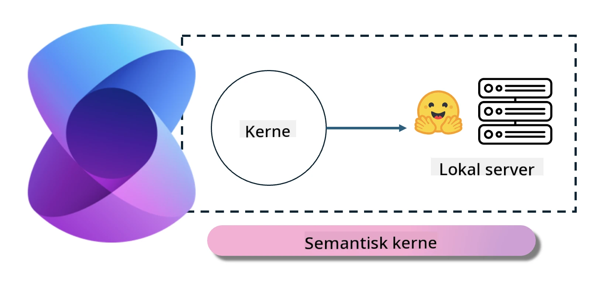
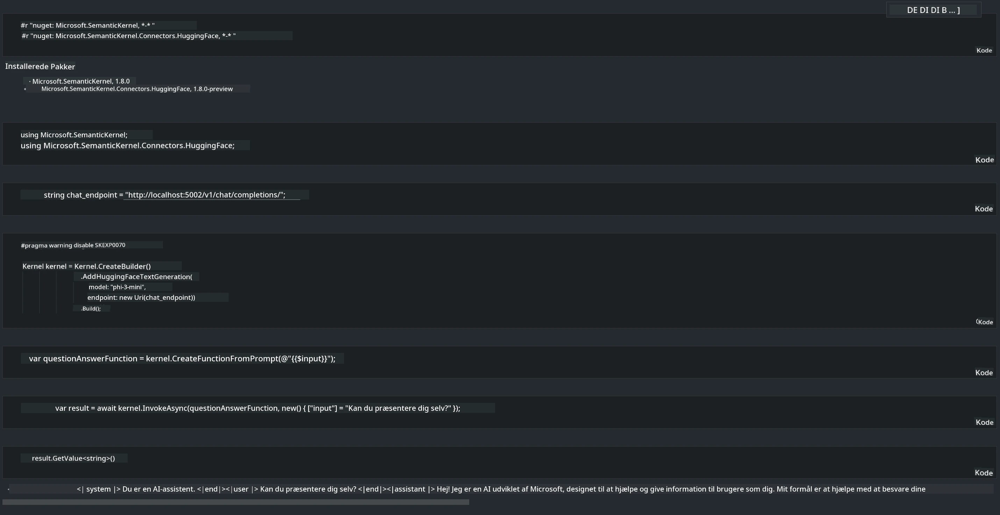

# **Inference Phi-3 på lokal server**

Vi kan implementere Phi-3 på en lokal server. Brugere kan vælge [Ollama](https://ollama.com) eller [LM Studio](https://llamaedge.com) løsninger, eller de kan skrive deres egen kode. Du kan forbinde Phi-3’s lokale tjenester gennem [Semantic Kernel](https://github.com/microsoft/semantic-kernel?WT.mc_id=aiml-138114-kinfeylo) eller [Langchain](https://www.langchain.com/) for at bygge Copilot-applikationer

## **Brug Semantic Kernel til at få adgang til Phi-3-mini**

I Copilot-applikationen opretter vi applikationer gennem Semantic Kernel / LangChain. Denne type applikationsramme er generelt kompatibel med Azure OpenAI Service / OpenAI-modeller, og kan også understøtte open source-modeller på Hugging Face samt lokale modeller. Hvad skal vi gøre, hvis vi vil bruge Semantic Kernel til at få adgang til Phi-3-mini? Med .NET som eksempel kan vi kombinere det med Hugging Face Connector i Semantic Kernel. Som standard kan det matche model-id’et på Hugging Face (første gang du bruger det, bliver modellen downloadet fra Hugging Face, hvilket tager lang tid). Du kan også forbinde til den selvbyggede lokale service. Sammenlignet med de to anbefaler vi at bruge den sidstnævnte, fordi den har en højere grad af selvstændighed, især i virksomhedsapplikationer.

Fra figuren kan adgang til lokale tjenester gennem Semantic Kernel nemt forbinde til den selvbyggede Phi-3-mini modelserver. Her er resultatet af kørslen

***Eksempelkode*** https://github.com/kinfey/Phi3MiniSamples/tree/main/semantickernel

**Ansvarsfraskrivelse**:  
Dette dokument er blevet oversat ved hjælp af AI-oversættelsestjenesten [Co-op Translator](https://github.com/Azure/co-op-translator). Selvom vi bestræber os på nøjagtighed, bedes du være opmærksom på, at automatiserede oversættelser kan indeholde fejl eller unøjagtigheder. Det oprindelige dokument på dets oprindelige sprog bør betragtes som den autoritative kilde. For kritisk information anbefales professionel menneskelig oversættelse. Vi påtager os intet ansvar for misforståelser eller fejltolkninger, der opstår som følge af brugen af denne oversættelse.