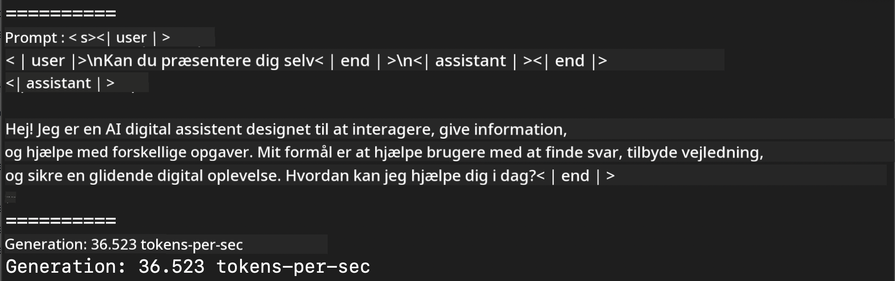
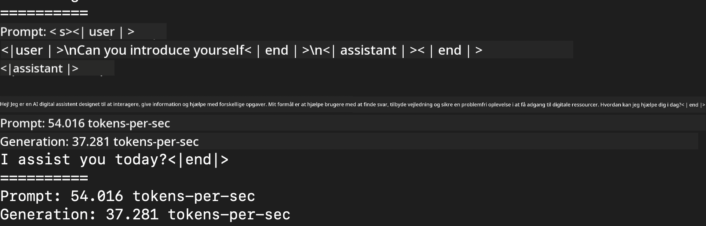
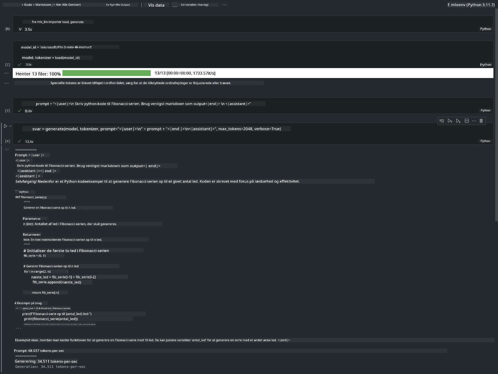

<!--
CO_OP_TRANSLATOR_METADATA:
{
  "original_hash": "dcb656f3d206fc4968e236deec5d4384",
  "translation_date": "2025-07-16T21:03:35+00:00",
  "source_file": "md/01.Introduction/03/MLX_Inference.md",
  "language_code": "da"
}
-->
# **Inference Phi-3 med Apple MLX Framework**

## **Hvad er MLX Framework**

MLX er et array-framework til maskinlæringsforskning på Apple silicon, udviklet af Apple maskinlæringsforskning.

MLX er designet af maskinlæringsforskere til maskinlæringsforskere. Frameworket er lavet til at være brugervenligt, men stadig effektivt til at træne og implementere modeller. Selve designet af frameworket er også konceptuelt enkelt. Vi ønsker at gøre det nemt for forskere at udvide og forbedre MLX med det formål hurtigt at kunne udforske nye idéer.

LLM’er kan accelereres på Apple Silicon-enheder via MLX, og modeller kan køres lokalt på en meget bekvem måde.

## **Brug af MLX til inference af Phi-3-mini**

### **1. Opsæt dit MLX miljø**

1. Python 3.11.x  
2. Installer MLX biblioteket


```bash

pip install mlx-lm

```

### **2. Kør Phi-3-mini i Terminal med MLX**


```bash

python -m mlx_lm.generate --model microsoft/Phi-3-mini-4k-instruct --max-token 2048 --prompt  "<|user|>\nCan you introduce yourself<|end|>\n<|assistant|>"

```

Resultatet (mit miljø er Apple M1 Max, 64GB) er



### **3. Kvantisering af Phi-3-mini med MLX i Terminal**


```bash

python -m mlx_lm.convert --hf-path microsoft/Phi-3-mini-4k-instruct

```

***Note:*** Modellen kan kvantiseres via mlx_lm.convert, og standard kvantisering er INT4. Dette eksempel kvantiserer Phi-3-mini til INT4.

Modellen kan kvantiseres via mlx_lm.convert, og standard kvantisering er INT4. Dette eksempel viser kvantisering af Phi-3-mini til INT4. Efter kvantisering gemmes den i standardmappen ./mlx_model

Vi kan teste den kvantiserede model med MLX fra terminalen


```bash

python -m mlx_lm.generate --model ./mlx_model/ --max-token 2048 --prompt  "<|user|>\nCan you introduce yourself<|end|>\n<|assistant|>"

```

Resultatet er




### **4. Kør Phi-3-mini med MLX i Jupyter Notebook**




***Note:*** Læs venligst dette eksempel [klik på dette link](../../../../../code/03.Inference/MLX/MLX_DEMO.ipynb)


## **Ressourcer**

1. Lær om Apple MLX Framework [https://ml-explore.github.io](https://ml-explore.github.io/mlx/build/html/index.html)

2. Apple MLX GitHub Repo [https://github.com/ml-explore](https://github.com/ml-explore)

**Ansvarsfraskrivelse**:  
Dette dokument er blevet oversat ved hjælp af AI-oversættelsestjenesten [Co-op Translator](https://github.com/Azure/co-op-translator). Selvom vi bestræber os på nøjagtighed, bedes du være opmærksom på, at automatiserede oversættelser kan indeholde fejl eller unøjagtigheder. Det oprindelige dokument på dets oprindelige sprog bør betragtes som den autoritative kilde. For kritisk information anbefales professionel menneskelig oversættelse. Vi påtager os intet ansvar for misforståelser eller fejltolkninger, der opstår som følge af brugen af denne oversættelse.