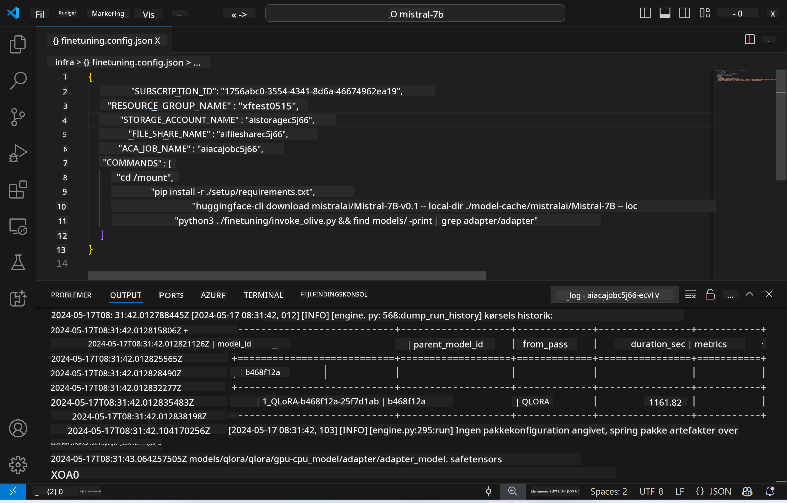
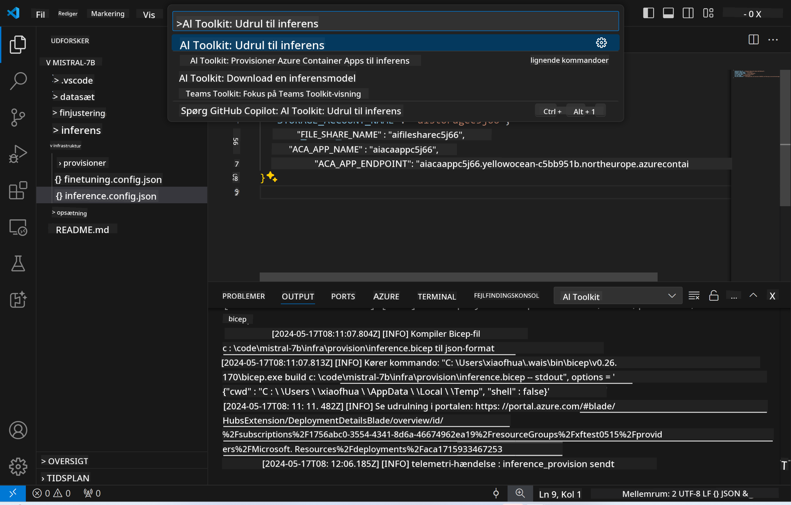

<!--
CO_OP_TRANSLATOR_METADATA:
{
  "original_hash": "a54cd3d65b6963e4e8ce21e143c3ab04",
  "translation_date": "2025-07-16T21:19:42+00:00",
  "source_file": "md/01.Introduction/03/Remote_Interence.md",
  "language_code": "da"
}
-->
# Fjerninferens med den finjusterede model

Efter adapterne er trænet i det eksterne miljø, kan du bruge en simpel Gradio-applikation til at interagere med modellen.



### Provisionering af Azure-ressourcer  
Du skal opsætte Azure-ressourcerne til fjerninferens ved at køre `AI Toolkit: Provision Azure Container Apps for inference` fra kommandopaletten. Under opsætningen bliver du bedt om at vælge dit Azure-abonnement og ressourcegruppe.  


Som standard bør abonnementet og ressourcegruppen til inferens være de samme som dem, der blev brugt til finjusteringen. Inferensen vil bruge det samme Azure Container App-miljø og få adgang til modellen og modeladapteren, som er gemt i Azure Files, og som blev genereret under finjusteringsprocessen.

## Brug af AI Toolkit

### Udrulning til inferens  
Hvis du ønsker at ændre inferenskoden eller genindlæse inferensmodellen, skal du køre kommandoen `AI Toolkit: Deploy for inference`. Dette vil synkronisere din seneste kode med ACA og genstarte replikaen.



Når udrulningen er gennemført, er modellen klar til evaluering via dette endpoint.

### Adgang til inferens-API'en

Du kan få adgang til inferens-API'en ved at klikke på knappen "*Go to Inference Endpoint*" i VSCode-notifikationen. Alternativt kan web-API-endpointet findes under `ACA_APP_ENDPOINT` i `./infra/inference.config.json` og i output-panelet.


> **Note:** Inferens-endpointet kan tage et par minutter, før det er fuldt operationelt.

## Inferenskomponenter inkluderet i skabelonen

| Mappe | Indhold |
| ------ |--------- |
| `infra` | Indeholder alle nødvendige konfigurationer til fjernoperationer. |
| `infra/provision/inference.parameters.json` | Indeholder parametre til bicep-skabelonerne, som bruges til provisionering af Azure-ressourcer til inferens. |
| `infra/provision/inference.bicep` | Indeholder skabeloner til provisionering af Azure-ressourcer til inferens. |
| `infra/inference.config.json` | Konfigurationsfilen, genereret af kommandoen `AI Toolkit: Provision Azure Container Apps for inference`. Den bruges som input til andre fjernkommandoer i paletten. |

### Brug af AI Toolkit til konfiguration af Azure Resource Provision  
Konfigurer [AI Toolkit](https://marketplace.visualstudio.com/items?itemName=ms-windows-ai-studio.windows-ai-studio)

Kør kommandoen `Provision Azure Container Apps for inference`.

Du kan finde konfigurationsparametre i filen `./infra/provision/inference.parameters.json`. Her er detaljerne:  
| Parameter | Beskrivelse |
| --------- |------------ |
| `defaultCommands` | Kommandoerne til at starte en web-API. |
| `maximumInstanceCount` | Denne parameter angiver den maksimale kapacitet af GPU-instanser. |
| `location` | Placeringen, hvor Azure-ressourcerne provisioneres. Standardværdien er den samme som den valgte ressourcegruppes placering. |
| `storageAccountName`, `fileShareName`, `acaEnvironmentName`, `acaEnvironmentStorageName`, `acaAppName`, `acaLogAnalyticsName` | Disse parametre bruges til at navngive Azure-ressourcerne til provisionering. Som standard vil de være de samme som navnet på finjusteringsressourcen. Du kan indtaste et nyt, ubrugt ressourcenavn for at oprette dine egne brugerdefinerede ressourcer, eller du kan indtaste navnet på en allerede eksisterende Azure-ressource, hvis du foretrækker at bruge den. Se afsnittet [Using existing Azure Resources](../../../../../md/01.Introduction/03) for detaljer. |

### Brug af eksisterende Azure-ressourcer

Som standard bruger provisioneringen til inferens det samme Azure Container App-miljø, Storage Account, Azure File Share og Azure Log Analytics, som blev brugt til finjusteringen. Der oprettes en separat Azure Container App udelukkende til inferens-API'en.

Hvis du har tilpasset Azure-ressourcerne under finjusteringen eller ønsker at bruge dine egne eksisterende Azure-ressourcer til inferens, skal du angive deres navne i filen `./infra/inference.parameters.json`. Kør derefter kommandoen `AI Toolkit: Provision Azure Container Apps for inference` fra kommandopaletten. Dette opdaterer eventuelle angivne ressourcer og opretter de manglende.

For eksempel, hvis du har et eksisterende Azure container-miljø, bør din `./infra/finetuning.parameters.json` se sådan ud:

```json
{
    "$schema": "https://schema.management.azure.com/schemas/2019-04-01/deploymentParameters.json#",
    "contentVersion": "1.0.0.0",
    "parameters": {
      ...
      "acaEnvironmentName": {
        "value": "<your-aca-env-name>"
      },
      "acaEnvironmentStorageName": {
        "value": null
      },
      ...
    }
  }
```

### Manuel provisionering  
Hvis du foretrækker at konfigurere Azure-ressourcerne manuelt, kan du bruge de medfølgende bicep-filer i mappen `./infra/provision`. Hvis du allerede har opsat og konfigureret alle Azure-ressourcer uden at bruge AI Toolkit-kommandopaletten, kan du blot indtaste ressourcenavnene i filen `inference.config.json`.

For eksempel:

```json
{
  "SUBSCRIPTION_ID": "<your-subscription-id>",
  "RESOURCE_GROUP_NAME": "<your-resource-group-name>",
  "STORAGE_ACCOUNT_NAME": "<your-storage-account-name>",
  "FILE_SHARE_NAME": "<your-file-share-name>",
  "ACA_APP_NAME": "<your-aca-name>",
  "ACA_APP_ENDPOINT": "<your-aca-endpoint>"
}
```

**Ansvarsfraskrivelse**:  
Dette dokument er blevet oversat ved hjælp af AI-oversættelsestjenesten [Co-op Translator](https://github.com/Azure/co-op-translator). Selvom vi bestræber os på nøjagtighed, bedes du være opmærksom på, at automatiserede oversættelser kan indeholde fejl eller unøjagtigheder. Det oprindelige dokument på dets oprindelige sprog bør betragtes som den autoritative kilde. For kritisk information anbefales professionel menneskelig oversættelse. Vi påtager os intet ansvar for misforståelser eller fejltolkninger, der opstår som følge af brugen af denne oversættelse.