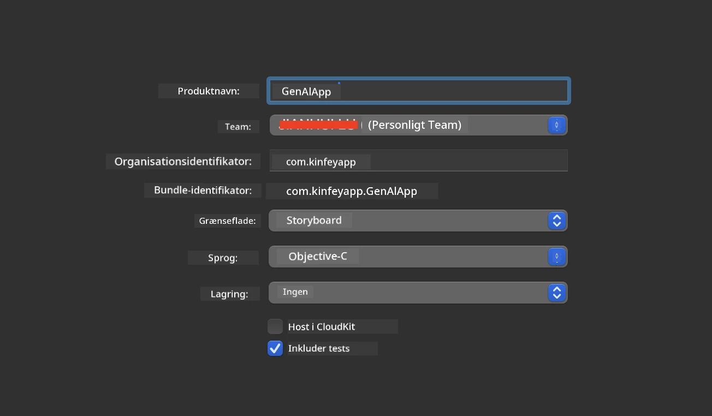
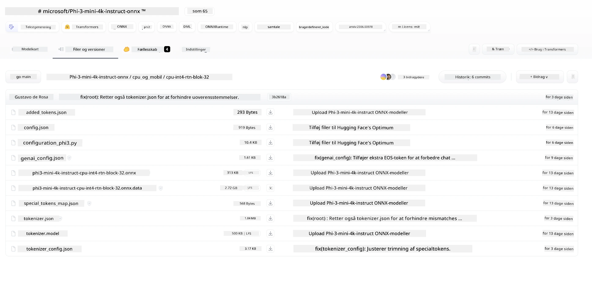
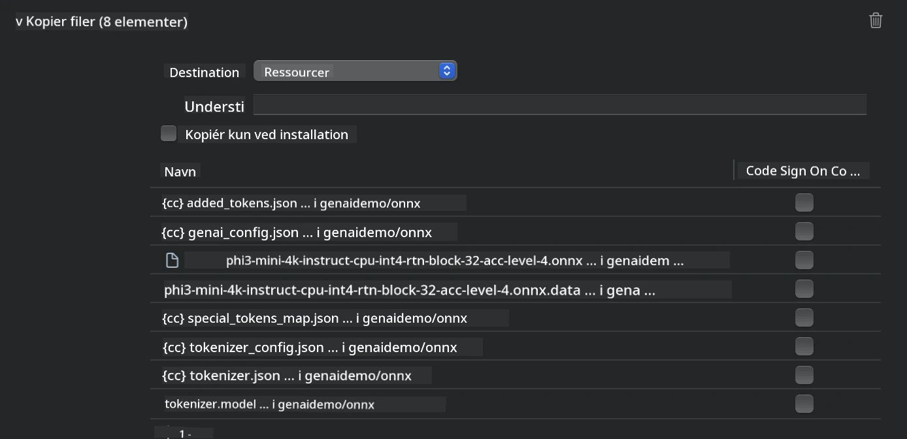
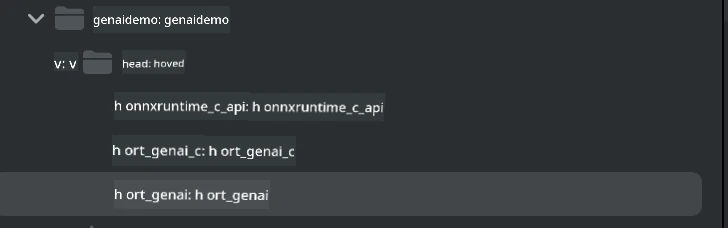
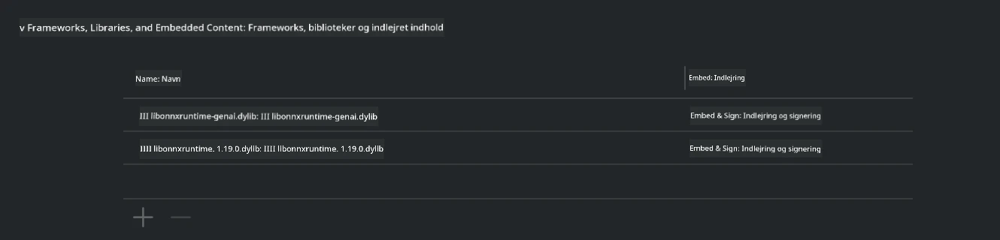
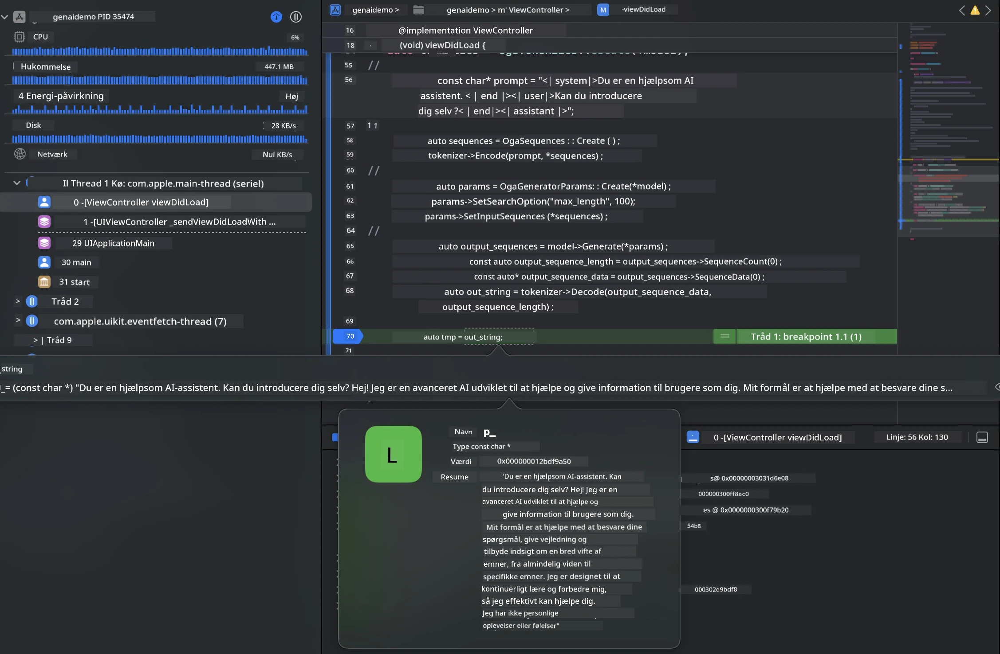

<!--
CO_OP_TRANSLATOR_METADATA:
{
  "original_hash": "82af197df38d25346a98f1f0e84d1698",
  "translation_date": "2025-07-16T20:22:09+00:00",
  "source_file": "md/01.Introduction/03/iOS_Inference.md",
  "language_code": "da"
}
-->
# **Inference Phi-3 på iOS**

Phi-3-mini er en ny serie modeller fra Microsoft, der muliggør implementering af Large Language Models (LLMs) på edge-enheder og IoT-enheder. Phi-3-mini er tilgængelig til iOS, Android og Edge Device-implementeringer, hvilket gør det muligt at deployere generativ AI i BYOD-miljøer. Følgende eksempel viser, hvordan man implementerer Phi-3-mini på iOS.

## **1. Forberedelse**

- **a.** macOS 14+
- **b.** Xcode 15+
- **c.** iOS SDK 17.x (iPhone 14 A16 eller nyere)
- **d.** Installer Python 3.10+ (Conda anbefales)
- **e.** Installer Python-biblioteket: `python-flatbuffers`
- **f.** Installer CMake

### Semantic Kernel og Inference

Semantic Kernel er et applikationsframework, der gør det muligt at skabe applikationer kompatible med Azure OpenAI Service, OpenAI-modeller og endda lokale modeller. Adgang til lokale services via Semantic Kernel gør det nemt at integrere med din selvhostede Phi-3-mini modelserver.

### Kald af kvantiserede modeller med Ollama eller LlamaEdge

Mange brugere foretrækker at bruge kvantiserede modeller for at køre modeller lokalt. [Ollama](https://ollama.com) og [LlamaEdge](https://llamaedge.com) giver brugere mulighed for at kalde forskellige kvantiserede modeller:

#### **Ollama**

Du kan køre `ollama run phi3` direkte eller konfigurere det offline. Opret en Modelfile med stien til din `gguf`-fil. Eksempelkode til at køre Phi-3-mini kvantiseret model:

```gguf
FROM {Add your gguf file path}
TEMPLATE \"\"\"<|user|> .Prompt<|end|> <|assistant|>\"\"\"
PARAMETER stop <|end|>
PARAMETER num_ctx 4096
```

#### **LlamaEdge**

Hvis du ønsker at bruge `gguf` både i skyen og på edge-enheder samtidig, er LlamaEdge et godt valg.

## **2. Kompilering af ONNX Runtime til iOS**

```bash

git clone https://github.com/microsoft/onnxruntime.git

cd onnxruntime

./build.sh --build_shared_lib --ios --skip_tests --parallel --build_dir ./build_ios --ios --apple_sysroot iphoneos --osx_arch arm64 --apple_deploy_target 17.5 --cmake_generator Xcode --config Release

cd ../

```

### **Bemærk**

- **a.** Før kompilering, sørg for at Xcode er korrekt konfigureret og sat som aktiv udviklerkatalog i terminalen:

    ```bash
    sudo xcode-select -switch /Applications/Xcode.app/Contents/Developer
    ```

- **b.** ONNX Runtime skal kompileres til forskellige platforme. For iOS kan du kompilere til `arm64` eller `x86_64`.

- **c.** Det anbefales at bruge den nyeste iOS SDK til kompilering. Du kan dog også bruge en ældre version, hvis du har brug for kompatibilitet med tidligere SDK’er.

## **3. Kompilering af Generative AI med ONNX Runtime til iOS**

> **Note:** Da Generative AI med ONNX Runtime stadig er i preview, skal du være opmærksom på mulige ændringer.

```bash

git clone https://github.com/microsoft/onnxruntime-genai
 
cd onnxruntime-genai
 
mkdir ort
 
cd ort
 
mkdir include
 
mkdir lib
 
cd ../
 
cp ../onnxruntime/include/onnxruntime/core/session/onnxruntime_c_api.h ort/include
 
cp ../onnxruntime/build_ios/Release/Release-iphoneos/libonnxruntime*.dylib* ort/lib
 
export OPENCV_SKIP_XCODEBUILD_FORCE_TRYCOMPILE_DEBUG=1
 
python3 build.py --parallel --build_dir ./build_ios --ios --ios_sysroot iphoneos --ios_arch arm64 --ios_deployment_target 17.5 --cmake_generator Xcode --cmake_extra_defines CMAKE_XCODE_ATTRIBUTE_CODE_SIGNING_ALLOWED=NO

```

## **4. Opret en App-applikation i Xcode**

Jeg valgte Objective-C som udviklingsmetode til appen, fordi brug af Generative AI med ONNX Runtime C++ API fungerer bedre med Objective-C. Selvfølgelig kan du også gennemføre de relevante kald via Swift bridging.



## **5. Kopiér den ONNX kvantiserede INT4-model til App-projektet**

Vi skal importere INT4 kvantiseringsmodellen i ONNX-format, som først skal downloades.



Efter download skal den tilføjes til projektets Resources-mappe i Xcode.



## **6. Tilføjelse af C++ API i ViewControllers**

> **Bemærk:**

- **a.** Tilføj de relevante C++ header-filer til projektet.

  

- **b.** Inkluder `onnxruntime-genai` dynamiske bibliotek i Xcode.

  

- **c.** Brug C Samples-koden til test. Du kan også tilføje ekstra funktioner som ChatUI for mere funktionalitet.

- **d.** Da du skal bruge C++ i dit projekt, skal du omdøbe `ViewController.m` til `ViewController.mm` for at aktivere Objective-C++ support.

```objc

    NSString *llmPath = [[NSBundle mainBundle] resourcePath];
    char const *modelPath = llmPath.cString;

    auto model =  OgaModel::Create(modelPath);

    auto tokenizer = OgaTokenizer::Create(*model);

    const char* prompt = "<|system|>You are a helpful AI assistant.<|end|><|user|>Can you introduce yourself?<|end|><|assistant|>";

    auto sequences = OgaSequences::Create();
    tokenizer->Encode(prompt, *sequences);

    auto params = OgaGeneratorParams::Create(*model);
    params->SetSearchOption("max_length", 100);
    params->SetInputSequences(*sequences);

    auto output_sequences = model->Generate(*params);
    const auto output_sequence_length = output_sequences->SequenceCount(0);
    const auto* output_sequence_data = output_sequences->SequenceData(0);
    auto out_string = tokenizer->Decode(output_sequence_data, output_sequence_length);
    
    auto tmp = out_string;

```

## **7. Kørsel af applikationen**

Når opsætningen er færdig, kan du køre applikationen for at se resultaterne af Phi-3-mini modelinference.



For flere eksempelkoder og detaljerede instruktioner, besøg [Phi-3 Mini Samples repository](https://github.com/Azure-Samples/Phi-3MiniSamples/tree/main/ios).

**Ansvarsfraskrivelse**:  
Dette dokument er blevet oversat ved hjælp af AI-oversættelsestjenesten [Co-op Translator](https://github.com/Azure/co-op-translator). Selvom vi bestræber os på nøjagtighed, bedes du være opmærksom på, at automatiserede oversættelser kan indeholde fejl eller unøjagtigheder. Det oprindelige dokument på dets modersmål bør betragtes som den autoritative kilde. For kritisk information anbefales professionel menneskelig oversættelse. Vi påtager os intet ansvar for misforståelser eller fejltolkninger, der opstår som følge af brugen af denne oversættelse.