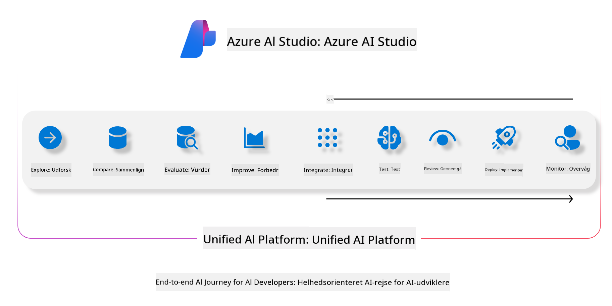
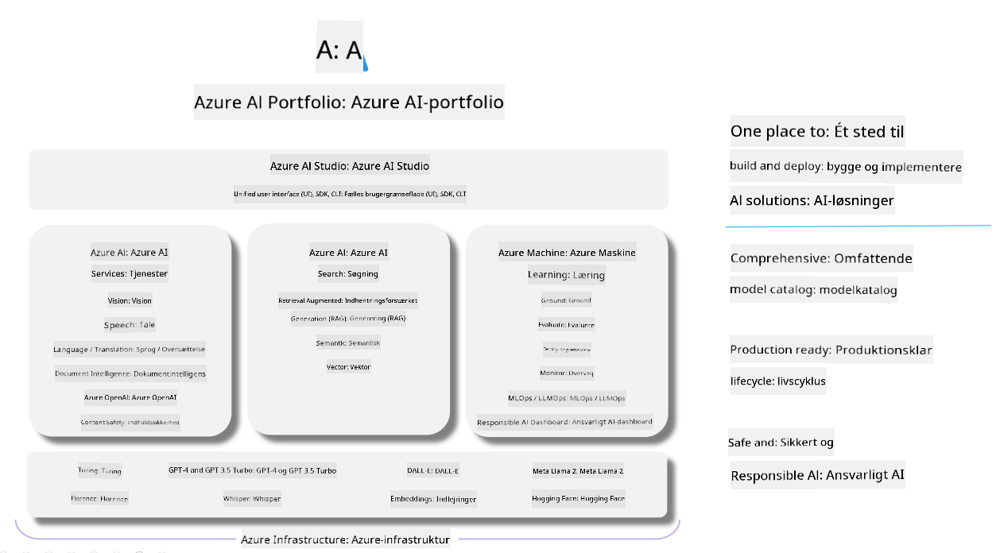

<!--
CO_OP_TRANSLATOR_METADATA:
{
  "original_hash": "7b4235159486df4000e16b7b46ddfec3",
  "translation_date": "2025-05-09T14:59:01+00:00",
  "source_file": "md/01.Introduction/05/AIFoundry.md",
  "language_code": "da"
}
-->
# **Brug af Azure AI Foundry til evaluering**

Sådan evaluerer du din generative AI-applikation ved hjælp af [Azure AI Foundry](https://ai.azure.com?WT.mc_id=aiml-138114-kinfeylo). Uanset om du vurderer enkelt-turn eller multi-turn samtaler, tilbyder Azure AI Foundry værktøjer til at evaluere modelens ydeevne og sikkerhed.

## Sådan evaluerer du generative AI-apps med Azure AI Foundry  
For mere detaljerede instruktioner, se [Azure AI Foundry Dokumentationen](https://learn.microsoft.com/azure/ai-studio/how-to/evaluate-generative-ai-app?WT.mc_id=aiml-138114-kinfeylo)

Her er trinnene til at komme i gang:

## Evaluering af generative AI-modeller i Azure AI Foundry

**Forudsætninger**

- Et testdatasæt i enten CSV- eller JSON-format.  
- En udrullet generativ AI-model (såsom Phi-3, GPT 3.5, GPT 4 eller Davinci-modeller).  
- En runtime med en compute instance til at køre evalueringen.

## Indbyggede evalueringsmetrikker

Azure AI Foundry giver dig mulighed for at evaluere både enkelt-turn og komplekse multi-turn samtaler.  
For Retrieval Augmented Generation (RAG) scenarier, hvor modellen er baseret på specifikke data, kan du vurdere ydeevnen ved hjælp af indbyggede evalueringsmetrikker.  
Derudover kan du evaluere generelle enkelt-turn spørgsmål og svar scenarier (ikke-RAG).

## Oprettelse af en evalueringskørsel

Fra Azure AI Foundry UI, naviger til enten Evaluate-siden eller Prompt Flow-siden.  
Følg evalueringsoprettelsesguiden for at sætte en evalueringskørsel op. Angiv et valgfrit navn til din evaluering.  
Vælg det scenarie, der matcher dit applikationsmål.  
Vælg en eller flere evalueringsmetrikker til at vurdere modellens output.

## Tilpasset evalueringsflow (valgfrit)

For større fleksibilitet kan du oprette et tilpasset evalueringsflow. Tilpas evalueringsprocessen efter dine specifikke behov.

## Visning af resultater

Efter evalueringen kan du logge, se og analysere detaljerede evalueringsmetrikker i Azure AI Foundry. Få indsigt i din applikations muligheder og begrænsninger.

**Note** Azure AI Foundry er i øjeblikket i offentlig preview, så brug det til eksperimenter og udvikling. Til produktionsarbejdsgange bør du overveje andre muligheder. Udforsk den officielle [AI Foundry dokumentation](https://learn.microsoft.com/azure/ai-studio/?WT.mc_id=aiml-138114-kinfeylo) for flere detaljer og trin-for-trin vejledninger.

**Ansvarsfraskrivelse**:  
Dette dokument er oversat ved hjælp af AI-oversættelsestjenesten [Co-op Translator](https://github.com/Azure/co-op-translator). Selvom vi bestræber os på nøjagtighed, skal du være opmærksom på, at automatiserede oversættelser kan indeholde fejl eller unøjagtigheder. Det oprindelige dokument på dets oprindelige sprog bør betragtes som den autoritative kilde. For kritisk information anbefales professionel menneskelig oversættelse. Vi påtager os intet ansvar for misforståelser eller fejltolkninger, der opstår som følge af brugen af denne oversættelse.