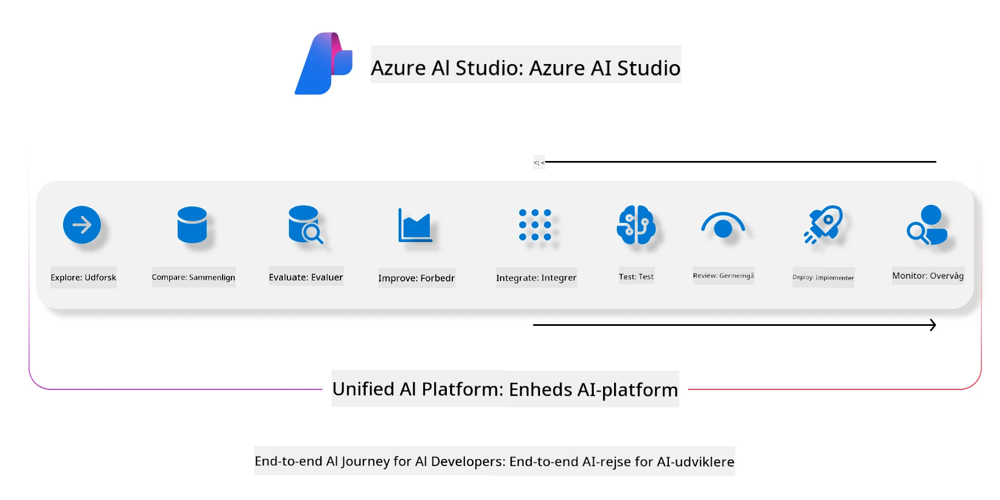
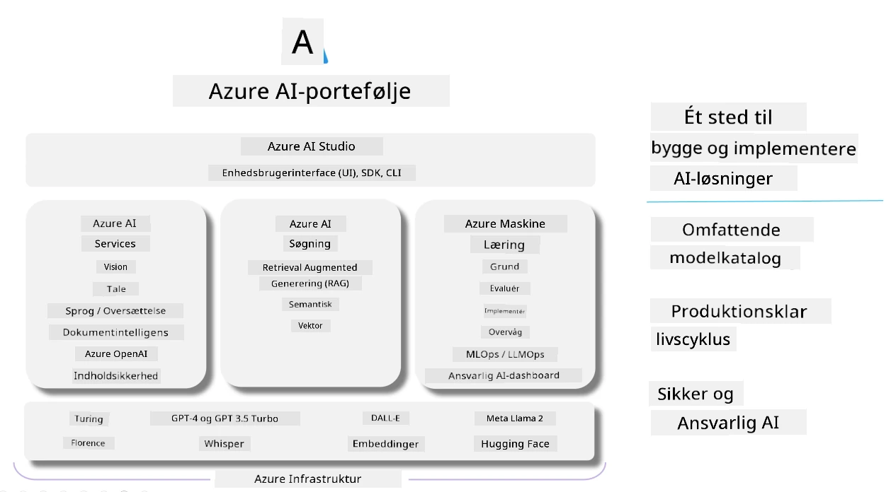

# **Brug af Microsoft Foundry til evaluering**

Hvordan du evaluerer din generative AI-applikation ved hjælp af [Microsoft Foundry](https://ai.azure.com?WT.mc_id=aiml-138114-kinfeylo). Uanset om du vurderer enkelt-sving eller multi-sving samtaler, tilbyder Microsoft Foundry værktøjer til evaluering af modelpræstation og sikkerhed. 

## Hvordan man evaluerer generative AI-apps med Microsoft Foundry
For mere detaljerede instruktioner se [Microsoft Foundry Dokumentationen](https://learn.microsoft.com/azure/ai-studio/how-to/evaluate-generative-ai-app?WT.mc_id=aiml-138114-kinfeylo)

Her er trinnene for at komme i gang:

## Evaluering af Generative AI-Modeler i Microsoft Foundry

**Forudsætninger**

- Et testdatasæt i enten CSV- eller JSON-format.
- En implementeret generativ AI-model (såsom Phi-3, GPT 3.5, GPT 4 eller Davinci-modeller).
- En runtime med en compute-instanse til at køre evalueringen.

## Indbyggede Evalueringsmetrikker

Microsoft Foundry giver dig mulighed for at evaluere både enkelt-sving og komplekse, multi-sving samtaler.
For Retrieval Augmented Generation (RAG) scenarier, hvor modellen er funderet i specifikke data, kan du vurdere præstationen ved hjælp af indbyggede evalueringsmetrikker.
Derudover kan du evaluere generelle enkelt-sving spørgsmål og svar scenarier (ikke-RAG).

## Oprettelse af en Evaluering Kørsel

Fra Microsoft Foundry UI, naviger til enten Evaluate-siden eller Prompt Flow-siden.
Følg evalueringsoprettelsesguiden for at opsætte en evalueringskørsel. Angiv et valgfrit navn til din evaluering.
Vælg det scenarie, der passer til din applikations mål.
Vælg en eller flere evalueringsmetrikker til at vurdere modellens output.

## Tilpasset Evalueringsflow (Valgfrit)

For større fleksibilitet kan du etablere et tilpasset evalueringsflow. Tilpas evalueringsprocessen baseret på dine specifikke krav.

## Visning af Resultater

Efter evalueringen er kørt, kan du logge, se og analysere detaljerede evalueringsmetrikker i Microsoft Foundry. Få indsigt i din applikations kapaciteter og begrænsninger.

**Note** Microsoft Foundry er i øjeblikket i offentlig preview, så brug det til eksperimentering og udviklingsformål. Til produktionsarbejdsbelastninger bør andre muligheder overvejes. Udforsk den officielle [AI Foundry dokumentation](https://learn.microsoft.com/azure/ai-studio/?WT.mc_id=aiml-138114-kinfeylo) for flere detaljer og trin-for-trin instruktioner.

---

<!-- CO-OP TRANSLATOR DISCLAIMER START -->
**Ansvarsfraskrivelse**:
Dette dokument er blevet oversat ved hjælp af AI-oversættelsestjenesten [Co-op Translator](https://github.com/Azure/co-op-translator). Selvom vi bestræber os på nøjagtighed, bedes du være opmærksom på, at automatiserede oversættelser kan indeholde fejl eller unøjagtigheder. Det oprindelige dokument på dets modersmål bør betragtes som den autoritative kilde. For kritisk information anbefales professionel menneskelig oversættelse. Vi påtager os intet ansvar for misforståelser eller fejltolkninger, der opstår ved brug af denne oversættelse.
<!-- CO-OP TRANSLATOR DISCLAIMER END -->