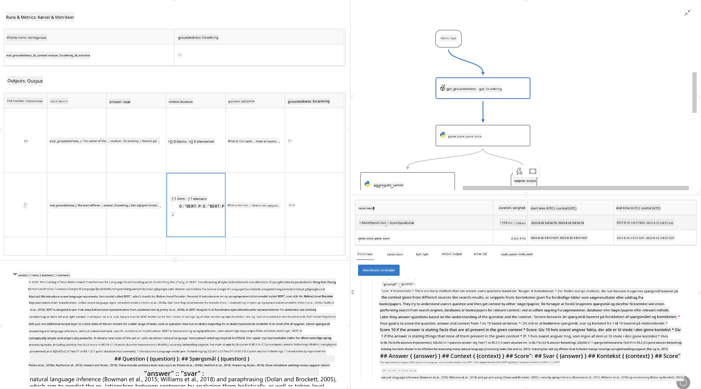

<!--
CO_OP_TRANSLATOR_METADATA:
{
  "original_hash": "3cbe7629d254f1043193b7fe22524d55",
  "translation_date": "2025-07-16T22:41:32+00:00",
  "source_file": "md/01.Introduction/05/Promptflow.md",
  "language_code": "da"
}
-->
# **Introduktion til Promptflow**

[Microsoft Prompt Flow](https://microsoft.github.io/promptflow/index.html?WT.mc_id=aiml-138114-kinfeylo) er et visuelt workflow-automatiseringsværktøj, der gør det muligt for brugere at skabe automatiserede workflows ved hjælp af forudbyggede skabeloner og brugerdefinerede connectors. Det er designet til at give udviklere og forretningsanalytikere mulighed for hurtigt at opbygge automatiserede processer til opgaver som datastyring, samarbejde og procesoptimering. Med Prompt Flow kan brugere nemt forbinde forskellige tjenester, applikationer og systemer og automatisere komplekse forretningsprocesser.

Microsoft Prompt Flow er skabt til at strømline hele udviklingscyklussen for AI-applikationer drevet af Large Language Models (LLMs). Uanset om du er i idéfasen, prototyping, test, evaluering eller implementering af LLM-baserede applikationer, forenkler Prompt Flow processen og gør det muligt at bygge LLM-apps med produktionskvalitet.

## Her er de vigtigste funktioner og fordele ved at bruge Microsoft Prompt Flow:

**Interaktiv forfatteroplevelse**

Prompt Flow giver en visuel fremstilling af strukturen i dit flow, hvilket gør det nemt at forstå og navigere i dine projekter.  
Det tilbyder en notesbogslignende kodningsoplevelse for effektiv flow-udvikling og fejlfinding.

**Prompt-varianter og tuning**

Opret og sammenlign flere prompt-varianter for at lette en iterativ forfiningsproces. Evaluer ydeevnen af forskellige prompts og vælg de mest effektive.

**Indbyggede evalueringsflows**  
Vurder kvaliteten og effektiviteten af dine prompts og flows ved hjælp af indbyggede evalueringsværktøjer.  
Få indsigt i, hvor godt dine LLM-baserede applikationer præsterer.

**Omfattende ressourcer**

Prompt Flow inkluderer et bibliotek med indbyggede værktøjer, eksempler og skabeloner. Disse ressourcer fungerer som et udgangspunkt for udvikling, inspirerer til kreativitet og fremskynder processen.

**Samarbejde og virksomhedsklarhed**

Understøt teamsamarbejde ved at lade flere brugere arbejde sammen på prompt engineering-projekter.  
Bevar versionskontrol og del viden effektivt. Strømlin hele prompt engineering-processen fra udvikling og evaluering til implementering og overvågning.

## Evaluering i Prompt Flow

I Microsoft Prompt Flow spiller evaluering en afgørende rolle i at vurdere, hvor godt dine AI-modeller præsterer. Lad os se på, hvordan du kan tilpasse evalueringsflows og metrikker i Prompt Flow:

**Forståelse af evaluering i Prompt Flow**

I Prompt Flow repræsenterer et flow en sekvens af noder, der behandler input og genererer output. Evalueringsflows er særlige typer af flows, der er designet til at vurdere ydeevnen af en kørsel baseret på specifikke kriterier og mål.

**Nøglefunktioner ved evalueringsflows**

De kører typisk efter det flow, der testes, og bruger dets output. De beregner scores eller metrikker for at måle ydeevnen af det testede flow. Metrikker kan inkludere nøjagtighed, relevansscores eller andre relevante målinger.

### Tilpasning af evalueringsflows

**Definering af input**

Evalueringsflows skal modtage output fra den kørsel, der testes. Definer input på samme måde som i standardflows.  
For eksempel, hvis du evaluerer et QnA-flow, kan et input hedde "answer". Hvis du evaluerer et klassifikationsflow, kan et input hedde "category". Ground truth-inputs (f.eks. faktiske labels) kan også være nødvendige.

**Output og metrikker**

Evalueringsflows producerer resultater, der måler det testede flows ydeevne. Metrikker kan beregnes ved hjælp af Python eller LLM (Large Language Models). Brug funktionen log_metric() til at logge relevante metrikker.

**Brug af tilpassede evalueringsflows**

Udvikl dit eget evalueringsflow, der er skræddersyet til dine specifikke opgaver og mål. Tilpas metrikker baseret på dine evalueringsmål.  
Anvend dette tilpassede evalueringsflow på batch-kørsler for storskala test.

## Indbyggede evalueringsmetoder

Prompt Flow tilbyder også indbyggede evalueringsmetoder.  
Du kan indsende batch-kørsler og bruge disse metoder til at evaluere, hvor godt dit flow præsterer med store datasæt.  
Se evalueringsresultater, sammenlign metrikker og iterer efter behov.  
Husk, at evaluering er afgørende for at sikre, at dine AI-modeller opfylder ønskede kriterier og mål. Udforsk den officielle dokumentation for detaljerede instruktioner om udvikling og brug af evalueringsflows i Microsoft Prompt Flow.

Sammenfattende giver Microsoft Prompt Flow udviklere mulighed for at skabe LLM-applikationer af høj kvalitet ved at forenkle prompt engineering og tilbyde et robust udviklingsmiljø. Hvis du arbejder med LLMs, er Prompt Flow et værdifuldt værktøj at udforske. Se [Prompt Flow Evaluation Documents](https://learn.microsoft.com/azure/machine-learning/prompt-flow/how-to-develop-an-evaluation-flow?view=azureml-api-2?WT.mc_id=aiml-138114-kinfeylo) for detaljerede instruktioner om udvikling og brug af evalueringsflows i Microsoft Prompt Flow.

**Ansvarsfraskrivelse**:  
Dette dokument er blevet oversat ved hjælp af AI-oversættelsestjenesten [Co-op Translator](https://github.com/Azure/co-op-translator). Selvom vi bestræber os på nøjagtighed, bedes du være opmærksom på, at automatiserede oversættelser kan indeholde fejl eller unøjagtigheder. Det oprindelige dokument på dets oprindelige sprog bør betragtes som den autoritative kilde. For kritisk information anbefales professionel menneskelig oversættelse. Vi påtager os intet ansvar for misforståelser eller fejltolkninger, der opstår som følge af brugen af denne oversættelse.