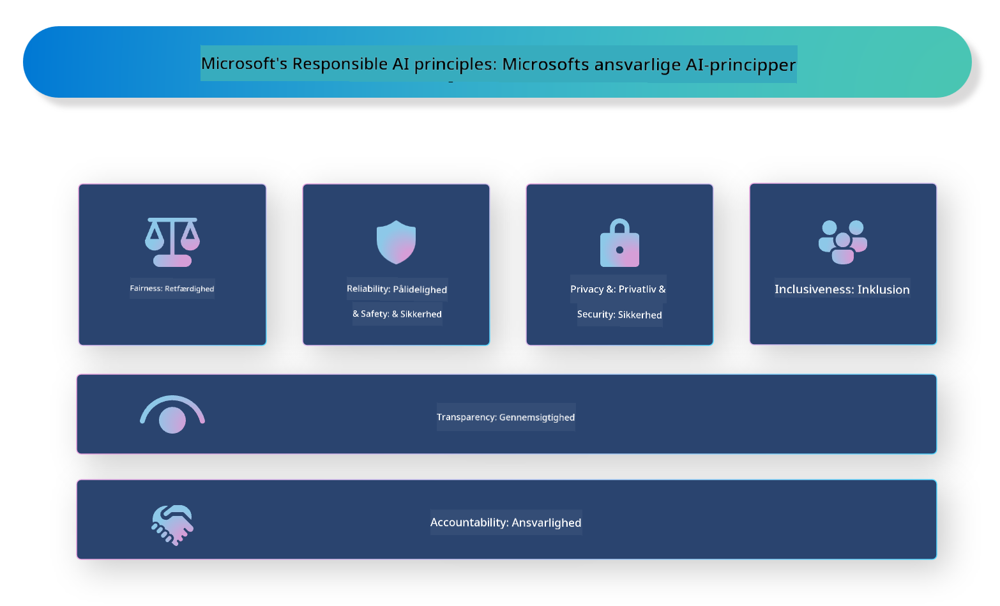

<!--
CO_OP_TRANSLATOR_METADATA:
{
  "original_hash": "805b96b20152936d8f4c587d90d6e06e",
  "translation_date": "2025-05-09T15:36:29+00:00",
  "source_file": "md/01.Introduction/05/ResponsibleAI.md",
  "language_code": "da"
}
-->
# **Introducer Ansvarlig AI**

[Microsoft Responsible AI](https://www.microsoft.com/ai/responsible-ai?WT.mc_id=aiml-138114-kinfeylo) er en initiativ, der har til formål at hjælpe udviklere og organisationer med at bygge AI-systemer, der er gennemsigtige, troværdige og ansvarlige. Initiativet tilbyder vejledning og ressourcer til at udvikle ansvarlige AI-løsninger, som følger etiske principper som privatliv, retfærdighed og gennemsigtighed. Vi vil også se nærmere på nogle af de udfordringer og bedste praksisser, der er forbundet med at bygge ansvarlige AI-systemer.

## Oversigt over Microsoft Responsible AI

**Etiske principper**

Microsoft Responsible AI styres af en række etiske principper som privatliv, retfærdighed, gennemsigtighed, ansvarlighed og sikkerhed. Disse principper er designet til at sikre, at AI-systemer udvikles på en etisk og ansvarlig måde.

**Gennemsigtig AI**

Microsoft Responsible AI understreger vigtigheden af gennemsigtighed i AI-systemer. Det indebærer at give klare forklaringer på, hvordan AI-modeller fungerer, samt at sikre, at datakilder og algoritmer er offentligt tilgængelige.

**Ansvarlig AI**

[Microsoft Responsible AI](https://www.microsoft.com/ai/responsible-ai?WT.mc_id=aiml-138114-kinfeylo) fremmer udviklingen af ansvarlige AI-systemer, som kan give indsigt i, hvordan AI-modeller træffer beslutninger. Det kan hjælpe brugere med at forstå og have tillid til AI-systemernes resultater.

**Inklusion**

AI-systemer bør designes til at gavne alle. Microsoft ønsker at skabe inkluderende AI, der tager hensyn til forskellige perspektiver og undgår bias eller diskrimination.

**Pålidelighed og sikkerhed**

Det er afgørende at sikre, at AI-systemer er pålidelige og sikre. Microsoft fokuserer på at bygge robuste modeller, der præsterer konsekvent og undgår skadelige resultater.

**Retfærdighed i AI**

Microsoft Responsible AI anerkender, at AI-systemer kan videreføre bias, hvis de trænes på partisk data eller algoritmer. Initiativet tilbyder vejledning til at udvikle retfærdige AI-systemer, som ikke diskriminerer på baggrund af faktorer som race, køn eller alder.

**Privatliv og sikkerhed**

Microsoft Responsible AI understreger vigtigheden af at beskytte brugerens privatliv og datasikkerhed i AI-systemer. Det inkluderer implementering af stærk datakryptering og adgangskontrol samt regelmæssige revisioner af AI-systemer for sårbarheder.

**Ansvar og ansvarlighed**

Microsoft Responsible AI fremmer ansvar og ansvarlighed i AI-udvikling og implementering. Det indebærer, at udviklere og organisationer er opmærksomme på de potentielle risici forbundet med AI-systemer og tager skridt til at mindske disse risici.

## Bedste praksisser for at bygge ansvarlige AI-systemer

**Udvikl AI-modeller med brug af varierede datasæt**

For at undgå bias i AI-systemer er det vigtigt at anvende varierede datasæt, der repræsenterer forskellige perspektiver og erfaringer.

**Brug forklarlige AI-teknikker**

Forklarlige AI-teknikker kan hjælpe brugere med at forstå, hvordan AI-modeller træffer beslutninger, hvilket kan øge tilliden til systemet.

**Revider AI-systemer regelmæssigt for sårbarheder**

Regelmæssige revisioner af AI-systemer kan hjælpe med at identificere potentielle risici og sårbarheder, der skal håndteres.

**Implementer stærk datakryptering og adgangskontrol**

Datakryptering og adgangskontrol kan hjælpe med at beskytte brugerens privatliv og sikkerhed i AI-systemer.

**Følg etiske principper i AI-udvikling**

At følge etiske principper som retfærdighed, gennemsigtighed og ansvarlighed kan bidrage til at opbygge tillid til AI-systemer og sikre, at de udvikles på en ansvarlig måde.

## Brug af AI Foundry til Ansvarlig AI

[Azure AI Foundry](https://ai.azure.com?WT.mc_id=aiml-138114-kinfeylo) er en kraftfuld platform, der gør det muligt for udviklere og organisationer hurtigt at skabe intelligente, banebrydende, markedsparate og ansvarlige applikationer. Her er nogle nøglefunktioner og kapaciteter i Azure AI Foundry:

**Færdige API’er og modeller**

Azure AI Foundry tilbyder forudbyggede og tilpasselige API’er og modeller. Disse dækker et bredt udvalg af AI-opgaver, herunder generativ AI, naturlig sprogbehandling til samtaler, søgning, overvågning, oversættelse, tale, vision og beslutningstagning.

**Prompt Flow**

Prompt flow i Azure AI Foundry giver dig mulighed for at skabe samtalebaserede AI-oplevelser. Det gør det muligt at designe og styre samtaleforløb, hvilket gør det nemmere at bygge chatbots, virtuelle assistenter og andre interaktive applikationer.

**Retrieval Augmented Generation (RAG)**

RAG er en teknik, der kombinerer retrieval-baserede og generative tilgange. Den forbedrer kvaliteten af genererede svar ved at udnytte både eksisterende viden (retrieval) og kreativ generering (generation).

**Evaluering og overvågningsmålinger for generativ AI**

Azure AI Foundry tilbyder værktøjer til evaluering og overvågning af generative AI-modeller. Du kan vurdere deres ydeevne, retfærdighed og andre vigtige målinger for at sikre ansvarlig implementering. Hvis du har oprettet et dashboard, kan du desuden bruge den no-code UI i Azure Machine Learning Studio til at tilpasse og generere et Responsible AI Dashboard og tilhørende scorecard baseret på [Responsible AI Toolbox](https://responsibleaitoolbox.ai/?WT.mc_id=aiml-138114-kinfeylo) Python-bibliotekerne. Dette scorecard hjælper dig med at dele vigtige indsigter om retfærdighed, funktionsvigtighed og andre ansvarlige implementeringsaspekter med både tekniske og ikke-tekniske interessenter.

For at bruge AI Foundry med ansvarlig AI kan du følge disse bedste praksisser:

**Definér problemet og målene for dit AI-system**

Før du starter udviklingsprocessen, er det vigtigt klart at definere det problem eller mål, som dit AI-system skal løse. Det vil hjælpe dig med at identificere de data, algoritmer og ressourcer, der er nødvendige for at bygge en effektiv model.

**Indsaml og forbehandl relevante data**

Kvaliteten og mængden af data, der bruges til at træne et AI-system, kan have stor betydning for dets ydeevne. Derfor er det vigtigt at indsamle relevante data, rense dem, forbehandle dem og sikre, at de er repræsentative for den befolkning eller det problem, du prøver at løse.

**Vælg passende evalueringsmetoder**

Der findes forskellige evalueringsalgoritmer. Det er vigtigt at vælge den mest passende algoritme baseret på dine data og dit problem.

**Evaluer og fortolk modellen**

Når du har bygget en AI-model, er det vigtigt at evaluere dens ydeevne ved hjælp af passende målinger og fortolke resultaterne på en gennemsigtig måde. Det hjælper dig med at identificere eventuelle bias eller begrænsninger i modellen og foretage forbedringer, hvor det er nødvendigt.

**Sikre gennemsigtighed og forklarlighed**

AI-systemer bør være gennemsigtige og forklarlige, så brugerne kan forstå, hvordan de fungerer, og hvordan beslutninger træffes. Det er især vigtigt for applikationer, der har stor indflydelse på menneskers liv, såsom sundhedsvæsen, finans og retssystemer.

**Overvåg og opdater modellen**

AI-systemer bør overvåges og opdateres løbende for at sikre, at de forbliver nøjagtige og effektive over tid. Det kræver vedvarende vedligeholdelse, test og gen-træning af modellen.

Afslutningsvis er Microsoft Responsible AI en initiativ, der har til formål at hjælpe udviklere og organisationer med at bygge AI-systemer, der er gennemsigtige, troværdige og ansvarlige. Husk, at ansvarlig AI-implementering er afgørende, og Azure AI Foundry sigter mod at gøre det praktisk for organisationer. Ved at følge etiske principper og bedste praksisser kan vi sikre, at AI-systemer udvikles og implementeres på en ansvarlig måde, som gavner samfundet som helhed.

**Ansvarsfraskrivelse**:  
Dette dokument er blevet oversat ved hjælp af AI-oversættelsestjenesten [Co-op Translator](https://github.com/Azure/co-op-translator). Selvom vi bestræber os på nøjagtighed, skal du være opmærksom på, at automatiserede oversættelser kan indeholde fejl eller unøjagtigheder. Det oprindelige dokument på dets oprindelige sprog bør betragtes som den autoritative kilde. For kritisk information anbefales professionel menneskelig oversættelse. Vi påtager os intet ansvar for misforståelser eller fejltolkninger, der opstår som følge af brugen af denne oversættelse.