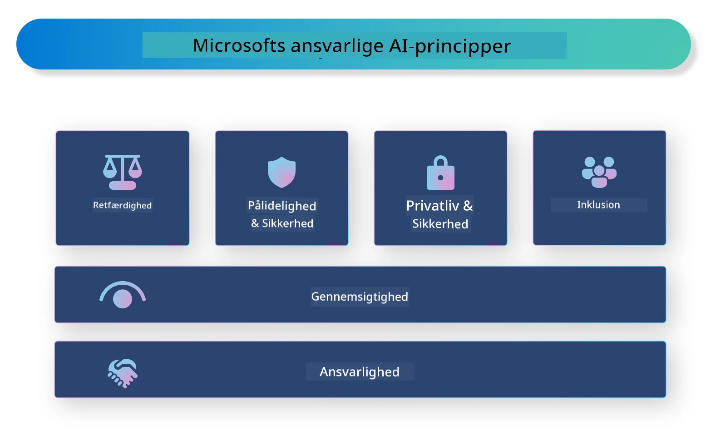

# **Introducer Ansvarlig AI**

[Microsoft Responsible AI](https://www.microsoft.com/ai/responsible-ai?WT.mc_id=aiml-138114-kinfeylo) er et initiativ, der har til formål at hjælpe udviklere og organisationer med at bygge AI-systemer, der er gennemsigtige, pålidelige og ansvarlige. Initiativet leverer vejledning og ressourcer til udvikling af ansvarlige AI-løsninger, der stemmer overens med etiske principper, såsom privatliv, retfærdighed og gennemsigtighed. Vi vil også udforske nogle af udfordringerne og bedste praksis forbundet med at bygge ansvarlige AI-systemer.

## Oversigt over Microsoft Responsible AI

**Etiske principper**

Microsoft Responsible AI styres af et sæt etiske principper, såsom privatliv, retfærdighed, gennemsigtighed, ansvarlighed og sikkerhed. Disse principper er designet til at sikre, at AI-systemer udvikles på en etisk og ansvarlig måde.

**Gennemsigtig AI**

Microsoft Responsible AI understreger vigtigheden af gennemsigtighed i AI-systemer. Dette inkluderer at give klare forklaringer på, hvordan AI-modeller fungerer, samt sørge for, at datakilder og algoritmer er offentligt tilgængelige.

**Ansvarlig AI**

[Microsoft Responsible AI](https://www.microsoft.com/ai/responsible-ai?WT.mc_id=aiml-138114-kinfeylo) fremmer udviklingen af ansvarlige AI-systemer, som kan give indsigt i, hvordan AI-modeller træffer beslutninger. Dette kan hjælpe brugerne med at forstå og stole på output fra AI-systemer.

**Inklusion**

AI-systemer bør designes til at gavne alle. Microsoft har som mål at skabe inkluderende AI, der tager højde for forskellige perspektiver og undgår bias eller diskrimination.

**Pålidelighed og sikkerhed**

Det er afgørende at sikre, at AI-systemer er pålidelige og sikre. Microsoft fokuserer på at bygge robuste modeller, der præsterer konsekvent og undgår skadelige resultater.

**Retfærdighed i AI**

Microsoft Responsible AI anerkender, at AI-systemer kan videreføre bias, hvis de trænes på biasede data eller algoritmer. Initiativet giver vejledning til at udvikle retfærdige AI-systemer, der ikke diskriminerer baseret på faktorer som race, køn eller alder.

**Privatliv og sikkerhed**

Microsoft Responsible AI understreger vigtigheden af at beskytte brugernes privatliv og datasikkerhed i AI-systemer. Dette inkluderer at implementere stærk data-kryptering og adgangskontrol samt regelmæssigt at revidere AI-systemer for sårbarheder.

**Ansvar og ansvarlighed**

Microsoft Responsible AI fremmer ansvarlighed og ansvar i AI-udvikling og -implementering. Dette indebærer at sikre, at udviklere og organisationer er opmærksomme på de potentielle risici forbundet med AI-systemer og tager skridt til at afbøde disse risici.

## Bedste praksis for at bygge ansvarlige AI-systemer

**Udvikl AI-modeller ved brug af forskellige datasæt**

For at undgå bias i AI-systemer er det vigtigt at bruge diverse datasæt, der repræsenterer en bred vifte af perspektiver og erfaringer.

**Brug forklarlige AI-teknikker**

Forklarlige AI-teknikker kan hjælpe brugere med at forstå, hvordan AI-modeller træffer beslutninger, hvilket kan øge tilliden til systemet.

**Lav regelmæssige revisioner af AI-systemer for sårbarheder**

Regelmæssige revisioner af AI-systemer kan hjælpe med at identificere potentielle risici og sårbarheder, der skal adresseres.

**Implementer stærk data-kryptering og adgangskontrol**

Data-kryptering og adgangskontrol kan hjælpe med at beskytte brugerens privatliv og sikkerhed i AI-systemer.

**Følg etiske principper i AI-udvikling**

At følge etiske principper, såsom retfærdighed, gennemsigtighed og ansvarlighed, kan hjælpe med at opbygge tillid til AI-systemer og sikre, at de udvikles på en ansvarlig måde.

## Brug af AI Foundry til Ansvarlig AI

[Microsoft Foundry](https://ai.azure.com?WT.mc_id=aiml-138114-kinfeylo) er en kraftfuld platform, som gør det muligt for udviklere og organisationer hurtigt at skabe intelligente, banebrydende, markedsparate og ansvarlige applikationer. Her er nogle nøglefunktioner og kapaciteter i Microsoft Foundry:

**Out-of-the-Box API’er og modeller**

Microsoft Foundry tilbyder forbyggede og tilpassede API’er og modeller. Disse dækker et bredt spektrum af AI-opgaver, inklusive generativ AI, naturlig sprogbehandling til samtaler, søgning, overvågning, oversættelse, tale, vision og beslutningstagning.

**Prompt Flow**

Prompt flow i Microsoft Foundry gør det muligt at skabe konverserende AI-oplevelser. Det giver dig mulighed for at designe og styre samtaleforløb, hvilket gør det lettere at bygge chatbots, virtuelle assistenter og andre interaktive applikationer.

**Retrieval Augmented Generation (RAG)**

RAG er en teknik, der kombinerer hentningsbaserede og generative tilgange. Det forbedrer kvaliteten af genererede svar ved at udnytte både eksisterende viden (hentning) og kreativ generering (generering).

**Evaluering og overvågningsmålinger for generativ AI**

Microsoft Foundry leverer værktøjer til evaluering og overvågning af generative AI-modeller. Du kan vurdere deres ydeevne, retfærdighed og andre vigtige målinger for at sikre ansvarlig implementering. Derudover, hvis du har oprettet et dashboard, kan du bruge den no-code UI i Azure Machine Learning Studio til at tilpasse og generere et Ansvarligt AI-dashboard og associeret scorecard baseret på [Responsible AI Toolbox](https://responsibleaitoolbox.ai/?WT.mc_id=aiml-138114-kinfeylo) Python-biblioteker. Dette scorecard hjælper dig med at dele nøgleindsigter relateret til retfærdighed, feature-vigtighed og andre ansvarlige implementeringshensyn med både tekniske og ikke-tekniske interessenter.

For at bruge AI Foundry med ansvarlig AI kan du følge disse bedste praksis:

**Definer problemet og målene for dit AI-system**

Inden du starter udviklingsprocessen, er det vigtigt klart at definere det problem eller mål, som dit AI-system sigter mod at løse. Dette vil hjælpe dig med at identificere de data, algoritmer og ressourcer, der er nødvendige for at bygge en effektiv model.

**Indsaml og forbehandl relevante data**

Kvaliteten og mængden af data, der bruges til træning af et AI-system, kan have en væsentlig indflydelse på dets ydeevne. Derfor er det vigtigt at indsamle relevante data, rense dem, forbehandle dem og sikre, at de er repræsentative for den population eller det problem, du forsøger at løse.

**Vælg passende evaluering**

Der findes forskellige evalueringsalgoritmer. Det er vigtigt at vælge den mest passende algoritme baseret på dine data og dit problem.

**Evaluer og fortolk modellen**

Når du har bygget en AI-model, er det vigtigt at evaluere dens ydeevne ved brug af passende målinger og fortolke resultaterne på en gennemsigtig måde. Dette vil hjælpe dig med at identificere eventuelle bias eller begrænsninger i modellen og foretage forbedringer, hvor det er nødvendigt.

**Sikre gennemsigtighed og forklarlighed**

AI-systemer bør være gennemsigtige og forklarlige, så brugerne kan forstå, hvordan de fungerer, og hvordan beslutninger træffes. Dette er især vigtigt for anvendelser, der har betydelig indvirkning på menneskeliv, såsom sundhedspleje, finans og retssystemer.

**Overvåg og opdater modellen**

AI-systemer bør løbende overvåges og opdateres for at sikre, at de forbliver nøjagtige og effektive over tid. Dette kræver vedvarende vedligeholdelse, test og gen-træning af modellen.

Afslutningsvis er Microsoft Responsible AI et initiativ, der sigter mod at hjælpe udviklere og organisationer med at bygge AI-systemer, der er gennemsigtige, pålidelige og ansvarlige. Husk, at ansvarlig AI-implementering er afgørende, og Microsoft Foundry sigter mod at gøre dette praktisk for organisationer. Ved at følge etiske principper og bedste praksis kan vi sikre, at AI-systemer udvikles og implementeres på en ansvarlig måde, der gavner samfundet som helhed.

---

<!-- CO-OP TRANSLATOR DISCLAIMER START -->
**Ansvarsfraskrivelse**:
Dette dokument er oversat ved hjælp af AI-oversættelsestjenesten [Co-op Translator](https://github.com/Azure/co-op-translator). Selvom vi bestræber os på nøjagtighed, bedes du være opmærksom på, at automatiserede oversættelser kan indeholde fejl eller unøjagtigheder. Det oprindelige dokument på dets oprindelige sprog bør betragtes som den autoritative kilde. For vigtig information anbefales professionel menneskelig oversættelse. Vi påtager os intet ansvar for misforståelser eller fejltolkninger, der opstår som følge af brugen af denne oversættelse.
<!-- CO-OP TRANSLATOR DISCLAIMER END -->