<!--
CO_OP_TRANSLATOR_METADATA:
{
  "original_hash": "80a853c08e4ee25ef9b4bfcedd8990da",
  "translation_date": "2025-07-16T23:41:24+00:00",
  "source_file": "md/02.Application/01.TextAndChat/Phi3/E2E_Phi-3-Evaluation_AIFoundry.md",
  "language_code": "da"
}
-->
# Evaluer den finjusterede Phi-3 / Phi-3.5 model i Azure AI Foundry med fokus på Microsofts Responsible AI-principper

Dette end-to-end (E2E) eksempel er baseret på guiden "[Evaluate Fine-tuned Phi-3 / 3.5 Models in Azure AI Foundry Focusing on Microsoft's Responsible AI](https://techcommunity.microsoft.com/blog/educatordeveloperblog/evaluate-fine-tuned-phi-3--3-5-models-in-azure-ai-studio-focusing-on-microsofts-/4227850?WT.mc_id=aiml-137032-kinfeylo)" fra Microsoft Tech Community.

## Oversigt

### Hvordan kan du evaluere sikkerheden og ydeevnen af en finjusteret Phi-3 / Phi-3.5 model i Azure AI Foundry?

Finjustering af en model kan nogle gange føre til utilsigtede eller uønskede svar. For at sikre, at modellen forbliver sikker og effektiv, er det vigtigt at evaluere modellens potentiale for at generere skadeligt indhold samt dens evne til at levere præcise, relevante og sammenhængende svar. I denne vejledning lærer du, hvordan du evaluerer sikkerheden og ydeevnen af en finjusteret Phi-3 / Phi-3.5 model integreret med Prompt flow i Azure AI Foundry.

Her er en evalueringsproces i Azure AI Foundry.


*Billedkilde: [Evaluation of generative AI applications](https://learn.microsoft.com/azure/ai-studio/concepts/evaluation-approach-gen-ai?wt.mc_id%3Dstudentamb_279723)*

> [!NOTE]
>
> For mere detaljeret information og for at udforske yderligere ressourcer om Phi-3 / Phi-3.5, besøg venligst [Phi-3CookBook](https://github.com/microsoft/Phi-3CookBook?wt.mc_id=studentamb_279723).

### Forudsætninger

- [Python](https://www.python.org/downloads)
- [Azure-abonnement](https://azure.microsoft.com/free?wt.mc_id=studentamb_279723)
- [Visual Studio Code](https://code.visualstudio.com)
- Finjusteret Phi-3 / Phi-3.5 model

### Indholdsfortegnelse

1. [**Scenario 1: Introduktion til Azure AI Foundrys Prompt flow-evaluering**](../../../../../../md/02.Application/01.TextAndChat/Phi3)

    - [Introduktion til sikkerhedsevaluering](../../../../../../md/02.Application/01.TextAndChat/Phi3)
    - [Introduktion til ydeevneevaluering](../../../../../../md/02.Application/01.TextAndChat/Phi3)

1. [**Scenario 2: Evaluering af Phi-3 / Phi-3.5 modellen i Azure AI Foundry**](../../../../../../md/02.Application/01.TextAndChat/Phi3)

    - [Før du går i gang](../../../../../../md/02.Application/01.TextAndChat/Phi3)
    - [Deploy Azure OpenAI til evaluering af Phi-3 / Phi-3.5 modellen](../../../../../../md/02.Application/01.TextAndChat/Phi3)
    - [Evaluer den finjusterede Phi-3 / Phi-3.5 model ved hjælp af Azure AI Foundrys Prompt flow-evaluering](../../../../../../md/02.Application/01.TextAndChat/Phi3)

1. [Tillykke!](../../../../../../md/02.Application/01.TextAndChat/Phi3)

## **Scenario 1: Introduktion til Azure AI Foundrys Prompt flow-evaluering**

### Introduktion til sikkerhedsevaluering

For at sikre, at din AI-model er etisk og sikker, er det afgørende at evaluere den i forhold til Microsofts Responsible AI-principper. I Azure AI Foundry giver sikkerhedsevalueringer dig mulighed for at vurdere din models sårbarhed over for jailbreak-angreb og dens potentiale for at generere skadeligt indhold, hvilket er direkte i tråd med disse principper.


*Billedkilde: [Evaluation of generative AI applications](https://learn.microsoft.com/azure/ai-studio/concepts/evaluation-approach-gen-ai?wt.mc_id%3Dstudentamb_279723)*

#### Microsofts Responsible AI-principper

Før du går i gang med de tekniske trin, er det vigtigt at forstå Microsofts Responsible AI-principper, som er en etisk ramme designet til at vejlede ansvarlig udvikling, implementering og drift af AI-systemer. Disse principper styrer ansvarlig design, udvikling og implementering af AI-systemer og sikrer, at AI-teknologier bygges på en måde, der er retfærdig, gennemsigtig og inkluderende. Disse principper udgør fundamentet for evaluering af AI-modellers sikkerhed.

Microsofts Responsible AI-principper inkluderer:

- **Retfærdighed og inklusivitet**: AI-systemer bør behandle alle retfærdigt og undgå at påvirke grupper af mennesker i lignende situationer forskelligt. For eksempel, når AI-systemer giver vejledning om medicinsk behandling, låneansøgninger eller ansættelse, bør de give de samme anbefalinger til alle med lignende symptomer, økonomiske forhold eller faglige kvalifikationer.

- **Pålidelighed og sikkerhed**: For at opbygge tillid er det afgørende, at AI-systemer fungerer pålideligt, sikkert og konsekvent. Disse systemer skal kunne fungere som oprindeligt designet, reagere sikkert på uforudsete forhold og modstå skadelig manipulation. Hvordan de opfører sig, og hvilke forskellige forhold de kan håndtere, afspejler de situationer og omstændigheder, som udviklerne forventede under design og test.

- **Gennemsigtighed**: Når AI-systemer hjælper med at træffe beslutninger, der har stor indflydelse på menneskers liv, er det vigtigt, at folk forstår, hvordan disse beslutninger blev truffet. For eksempel kan en bank bruge et AI-system til at afgøre, om en person er kreditværdig. En virksomhed kan bruge et AI-system til at finde de mest kvalificerede kandidater til ansættelse.

- **Privatliv og sikkerhed**: Efterhånden som AI bliver mere udbredt, bliver beskyttelse af privatliv og sikring af personlige og forretningsmæssige oplysninger mere vigtigt og komplekst. Med AI kræver privatliv og datasikkerhed særlig opmærksomhed, fordi adgang til data er afgørende for, at AI-systemer kan lave præcise og velinformerede forudsigelser og beslutninger om mennesker.

- **Ansvarlighed**: De personer, der designer og implementerer AI-systemer, skal holdes ansvarlige for, hvordan deres systemer fungerer. Organisationer bør trække på branchestandarder for at udvikle normer for ansvarlighed. Disse normer kan sikre, at AI-systemer ikke er den endelige myndighed i beslutninger, der påvirker menneskers liv. De kan også sikre, at mennesker bevarer meningsfuld kontrol over ellers meget autonome AI-systemer.


*Billedkilde: [What is Responsible AI?](https://learn.microsoft.com/azure/machine-learning/concept-responsible-ai?view=azureml-api-2&viewFallbackFrom=azureml-api-2%253fwt.mc_id%3Dstudentamb_279723)*

> [!NOTE]
> For at lære mere om Microsofts Responsible AI-principper, besøg [What is Responsible AI?](https://learn.microsoft.com/azure/machine-learning/concept-responsible-ai?view=azureml-api-2?wt.mc_id=studentamb_279723).

#### Sikkerhedsmål

I denne vejledning vil du evaluere sikkerheden af den finjusterede Phi-3 model ved hjælp af Azure AI Foundrys sikkerhedsmål. Disse mål hjælper dig med at vurdere modellens potentiale for at generere skadeligt indhold og dens sårbarhed over for jailbreak-angreb. Sikkerhedsmålene inkluderer:

- **Indhold relateret til selvskade**: Vurderer om modellen har en tendens til at producere indhold relateret til selvskade.
- **Hatefuldt og uretfærdigt indhold**: Vurderer om modellen har en tendens til at producere hadsk eller uretfærdigt indhold.
- **Voldeligt indhold**: Vurderer om modellen har en tendens til at producere voldeligt indhold.
- **Seksuelt indhold**: Vurderer om modellen har en tendens til at producere upassende seksuelt indhold.

Evaluering af disse aspekter sikrer, at AI-modellen ikke producerer skadeligt eller stødende indhold, hvilket bringer den i overensstemmelse med samfundsmæssige værdier og lovgivningsmæssige standarder.


### Introduktion til ydeevneevaluering

For at sikre, at din AI-model præsterer som forventet, er det vigtigt at evaluere dens ydeevne mod ydeevnemål. I Azure AI Foundry giver ydeevneevalueringer dig mulighed for at vurdere din models effektivitet i at generere præcise, relevante og sammenhængende svar.


*Billedkilde: [Evaluation of generative AI applications](https://learn.microsoft.com/azure/ai-studio/concepts/evaluation-approach-gen-ai?wt.mc_id%3Dstudentamb_279723)*

#### Ydeevnemål

I denne vejledning vil du evaluere ydeevnen af den finjusterede Phi-3 / Phi-3.5 model ved hjælp af Azure AI Foundrys ydeevnemål. Disse mål hjælper dig med at vurdere modellens effektivitet i at generere præcise, relevante og sammenhængende svar. Ydeevnemålene inkluderer:

- **Groundedness**: Vurderer hvor godt de genererede svar stemmer overens med informationen fra inputkilden.
- **Relevans**: Vurderer hvor relevante de genererede svar er i forhold til de stillede spørgsmål.
- **Sammenhæng**: Vurderer hvor flydende den genererede tekst er, om den læses naturligt og minder om menneskeligt sprog.
- **Flydende sprog**: Vurderer sprogfærdigheden i den genererede tekst.
- **GPT-lighed**: Sammenligner det genererede svar med sandheden for lighed.
- **F1-score**: Beregner forholdet af fælles ord mellem det genererede svar og kildedata.

Disse mål hjælper dig med at evaluere modellens effektivitet i at generere præcise, relevante og sammenhængende svar.

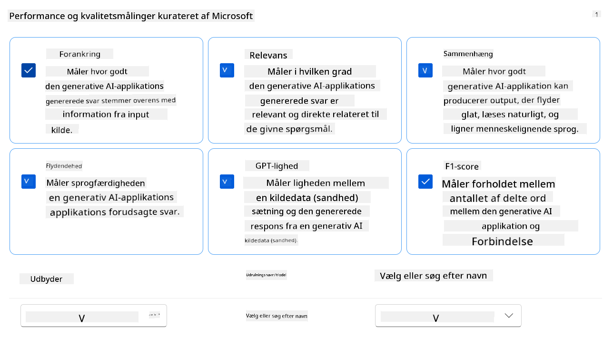

## **Scenario 2: Evaluering af Phi-3 / Phi-3.5 modellen i Azure AI Foundry**

### Før du går i gang

Denne vejledning er en opfølgning på de tidligere blogindlæg, "[Fine-Tune and Integrate Custom Phi-3 Models with Prompt Flow: Step-by-Step Guide](https://techcommunity.microsoft.com/t5/educator-developer-blog/fine-tune-and-integrate-custom-phi-3-models-with-prompt-flow/ba-p/4178612?wt.mc_id=studentamb_279723)" og "[Fine-Tune and Integrate Custom Phi-3 Models with Prompt Flow in Azure AI Foundry](https://techcommunity.microsoft.com/t5/educator-developer-blog/fine-tune-and-integrate-custom-phi-3-models-with-prompt-flow-in/ba-p/4191726?wt.mc_id=studentamb_279723)." I disse indlæg gennemgik vi processen med at finjustere en Phi-3 / Phi-3.5 model i Azure AI Foundry og integrere den med Prompt flow.

I denne vejledning vil du deployere en Azure OpenAI-model som evaluator i Azure AI Foundry og bruge den til at evaluere din finjusterede Phi-3 / Phi-3.5 model.

Før du går i gang med denne vejledning, skal du sikre dig, at du har følgende forudsætninger, som beskrevet i de tidligere vejledninger:

1. Et forberedt datasæt til evaluering af den finjusterede Phi-3 / Phi-3.5 model.
1. En Phi-3 / Phi-3.5 model, der er finjusteret og deployeret til Azure Machine Learning.
1. En Prompt flow integreret med din finjusterede Phi-3 / Phi-3.5 model i Azure AI Foundry.

> [!NOTE]
> Du vil bruge filen *test_data.jsonl*, som findes i data-mappen fra **ULTRACHAT_200k** datasættet, der blev downloadet i de tidligere blogindlæg, som datasæt til evaluering af den finjusterede Phi-3 / Phi-3.5 model.

#### Integrer den tilpassede Phi-3 / Phi-3.5 model med Prompt flow i Azure AI Foundry (Code first-tilgang)
> [!NOTE]  
> Hvis du fulgte low-code tilgangen beskrevet i "[Fine-Tune and Integrate Custom Phi-3 Models with Prompt Flow in Azure AI Foundry](https://techcommunity.microsoft.com/t5/educator-developer-blog/fine-tune-and-integrate-custom-phi-3-models-with-prompt-flow-in/ba-p/4191726?wt.mc_id=studentamb_279723)", kan du springe denne øvelse over og gå videre til den næste.  
> Men hvis du fulgte code-first tilgangen beskrevet i "[Fine-Tune and Integrate Custom Phi-3 Models with Prompt Flow: Step-by-Step Guide](https://techcommunity.microsoft.com/t5/educator-developer-blog/fine-tune-and-integrate-custom-phi-3-models-with-prompt-flow/ba-p/4178612?wt.mc_id=studentamb_279723)" for at finjustere og implementere dit Phi-3 / Phi-3.5 model, er processen med at forbinde din model til Prompt flow en smule anderledes. Du vil lære denne proces i denne øvelse.
For at fortsætte skal du integrere din finjusterede Phi-3 / Phi-3.5-model i Prompt flow i Azure AI Foundry.

#### Opret Azure AI Foundry Hub

Du skal oprette en Hub, før du opretter projektet. En Hub fungerer som en Resource Group, der giver dig mulighed for at organisere og administrere flere projekter inden for Azure AI Foundry.

1. Log ind på [Azure AI Foundry](https://ai.azure.com/?wt.mc_id=studentamb_279723).

1. Vælg **All hubs** i venstre sidepanel.

1. Vælg **+ New hub** i navigationsmenuen.

    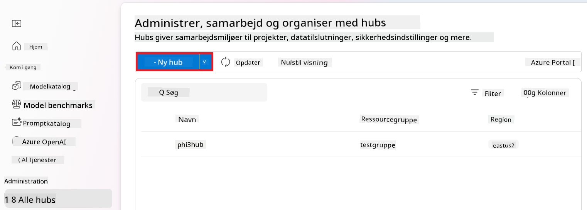

1. Udfør følgende opgaver:

    - Indtast **Hub name**. Det skal være en unik værdi.
    - Vælg dit Azure **Subscription**.
    - Vælg den **Resource group**, du vil bruge (opret en ny, hvis nødvendigt).
    - Vælg den **Location**, du ønsker at bruge.
    - Vælg **Connect Azure AI Services** til brug (opret en ny, hvis nødvendigt).
    - Vælg **Connect Azure AI Search** og vælg **Skip connecting**.

    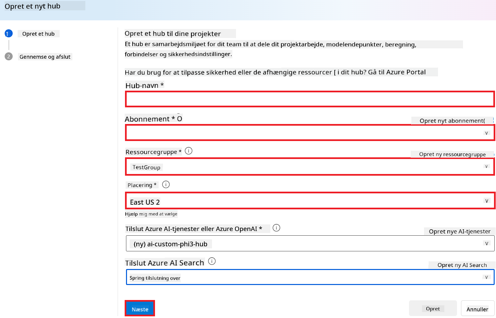

1. Vælg **Next**.

#### Opret Azure AI Foundry-projekt

1. I den Hub, du oprettede, vælg **All projects** i venstre sidepanel.

1. Vælg **+ New project** i navigationsmenuen.

    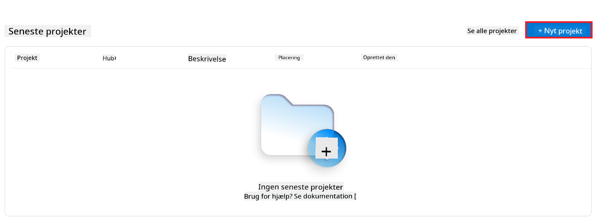

1. Indtast **Project name**. Det skal være en unik værdi.

    

1. Vælg **Create a project**.

#### Tilføj en brugerdefineret forbindelse til den finjusterede Phi-3 / Phi-3.5-model

For at integrere din brugerdefinerede Phi-3 / Phi-3.5-model med Prompt flow skal du gemme modellens endpoint og nøgle i en brugerdefineret forbindelse. Denne opsætning sikrer adgang til din brugerdefinerede Phi-3 / Phi-3.5-model i Prompt flow.

#### Indstil api-nøgle og endpoint-uri for den finjusterede Phi-3 / Phi-3.5-model

1. Besøg [Azure ML Studio](https://ml.azure.com/home?wt.mc_id=studentamb_279723).

1. Naviger til det Azure Machine learning workspace, du oprettede.

1. Vælg **Endpoints** i venstre sidepanel.

    

1. Vælg det endpoint, du oprettede.

    

1. Vælg **Consume** i navigationsmenuen.

1. Kopiér din **REST endpoint** og **Primary key**.

    

#### Tilføj den brugerdefinerede forbindelse

1. Besøg [Azure AI Foundry](https://ai.azure.com/?wt.mc_id=studentamb_279723).

1. Naviger til det Azure AI Foundry-projekt, du oprettede.

1. I det projekt, du oprettede, vælg **Settings** i venstre sidepanel.

1. Vælg **+ New connection**.

    

1. Vælg **Custom keys** i navigationsmenuen.

    

1. Udfør følgende opgaver:

    - Vælg **+ Add key value pairs**.
    - For nøglens navn, indtast **endpoint** og indsæt det endpoint, du kopierede fra Azure ML Studio, i værdifeltet.
    - Vælg **+ Add key value pairs** igen.
    - For nøglens navn, indtast **key** og indsæt den nøgle, du kopierede fra Azure ML Studio, i værdifeltet.
    - Efter tilføjelse af nøglerne, vælg **is secret** for at forhindre, at nøglen bliver synlig.

    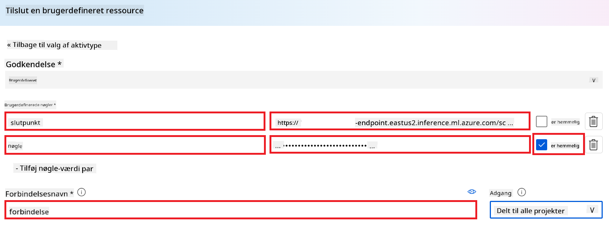

1. Vælg **Add connection**.

#### Opret Prompt flow

Du har tilføjet en brugerdefineret forbindelse i Azure AI Foundry. Lad os nu oprette et Prompt flow ved hjælp af følgende trin. Derefter vil du forbinde dette Prompt flow til den brugerdefinerede forbindelse for at bruge den finjusterede model i Prompt flow.

1. Naviger til det Azure AI Foundry-projekt, du oprettede.

1. Vælg **Prompt flow** i venstre sidepanel.

1. Vælg **+ Create** i navigationsmenuen.

    

1. Vælg **Chat flow** i navigationsmenuen.

    

1. Indtast **Folder name**, som du vil bruge.

    

1. Vælg **Create**.

#### Opsæt Prompt flow til at chatte med din brugerdefinerede Phi-3 / Phi-3.5-model

Du skal integrere den finjusterede Phi-3 / Phi-3.5-model i et Prompt flow. Den eksisterende Prompt flow, der leveres, er dog ikke designet til dette formål. Derfor skal du redesigne Prompt flow for at muliggøre integrationen af den brugerdefinerede model.

1. I Prompt flow, udfør følgende opgaver for at genopbygge det eksisterende flow:

    - Vælg **Raw file mode**.
    - Slet al eksisterende kode i *flow.dag.yml*-filen.
    - Tilføj følgende kode til *flow.dag.yml*.

        ```yml
        inputs:
          input_data:
            type: string
            default: "Who founded Microsoft?"

        outputs:
          answer:
            type: string
            reference: ${integrate_with_promptflow.output}

        nodes:
        - name: integrate_with_promptflow
          type: python
          source:
            type: code
            path: integrate_with_promptflow.py
          inputs:
            input_data: ${inputs.input_data}
        ```

    - Vælg **Save**.

    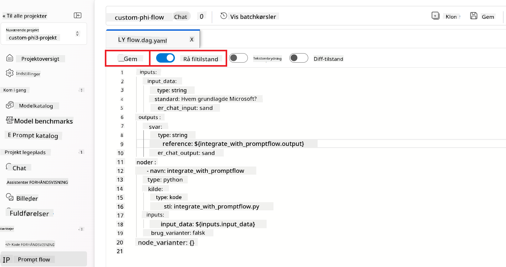

1. Tilføj følgende kode til *integrate_with_promptflow.py* for at bruge den brugerdefinerede Phi-3 / Phi-3.5-model i Prompt flow.

    ```python
    import logging
    import requests
    from promptflow import tool
    from promptflow.connections import CustomConnection

    # Logging setup
    logging.basicConfig(
        format="%(asctime)s - %(levelname)s - %(name)s - %(message)s",
        datefmt="%Y-%m-%d %H:%M:%S",
        level=logging.DEBUG
    )
    logger = logging.getLogger(__name__)

    def query_phi3_model(input_data: str, connection: CustomConnection) -> str:
        """
        Send a request to the Phi-3 / Phi-3.5 model endpoint with the given input data using Custom Connection.
        """

        # "connection" is the name of the Custom Connection, "endpoint", "key" are the keys in the Custom Connection
        endpoint_url = connection.endpoint
        api_key = connection.key

        headers = {
            "Content-Type": "application/json",
            "Authorization": f"Bearer {api_key}"
        }
    data = {
        "input_data": [input_data],
        "params": {
            "temperature": 0.7,
            "max_new_tokens": 128,
            "do_sample": True,
            "return_full_text": True
            }
        }
        try:
            response = requests.post(endpoint_url, json=data, headers=headers)
            response.raise_for_status()
            
            # Log the full JSON response
            logger.debug(f"Full JSON response: {response.json()}")

            result = response.json()["output"]
            logger.info("Successfully received response from Azure ML Endpoint.")
            return result
        except requests.exceptions.RequestException as e:
            logger.error(f"Error querying Azure ML Endpoint: {e}")
            raise

    @tool
    def my_python_tool(input_data: str, connection: CustomConnection) -> str:
        """
        Tool function to process input data and query the Phi-3 / Phi-3.5 model.
        """
        return query_phi3_model(input_data, connection)

    ```

    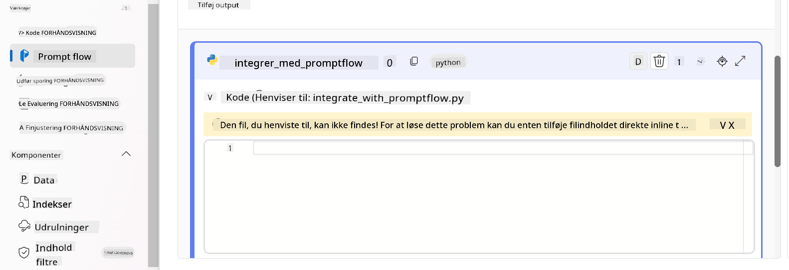

> [!NOTE]
> For mere detaljeret information om brug af Prompt flow i Azure AI Foundry, kan du se [Prompt flow in Azure AI Foundry](https://learn.microsoft.com/azure/ai-studio/how-to/prompt-flow).

1. Vælg **Chat input**, **Chat output** for at aktivere chat med din model.

    

1. Nu er du klar til at chatte med din brugerdefinerede Phi-3 / Phi-3.5-model. I den næste øvelse lærer du, hvordan du starter Prompt flow og bruger det til at chatte med din finjusterede Phi-3 / Phi-3.5-model.

> [!NOTE]
>
> Det genopbyggede flow skulle se ud som billedet nedenfor:
>
> 
>

#### Start Prompt flow

1. Vælg **Start compute sessions** for at starte Prompt flow.

    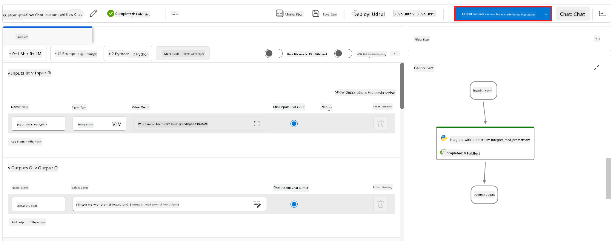

1. Vælg **Validate and parse input** for at opdatere parametrene.

    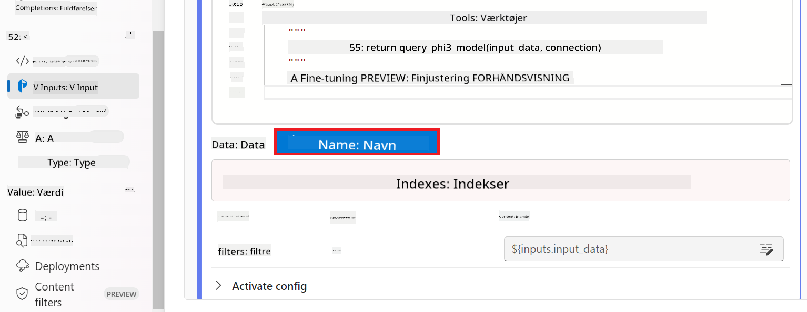

1. Vælg **Value** for **connection** til den brugerdefinerede forbindelse, du oprettede. For eksempel *connection*.

    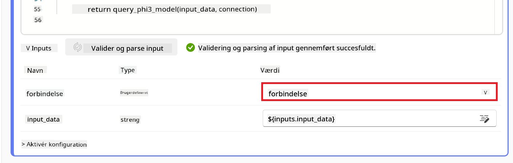

#### Chat med din brugerdefinerede Phi-3 / Phi-3.5-model

1. Vælg **Chat**.

    

1. Her er et eksempel på resultaterne: Nu kan du chatte med din brugerdefinerede Phi-3 / Phi-3.5-model. Det anbefales at stille spørgsmål baseret på de data, der blev brugt til finjusteringen.

    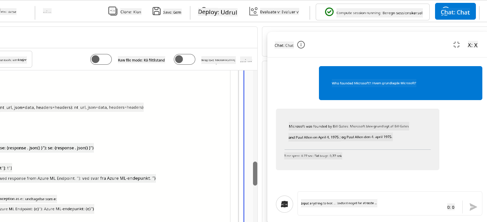

### Deploy Azure OpenAI for at evaluere Phi-3 / Phi-3.5-modellen

For at evaluere Phi-3 / Phi-3.5-modellen i Azure AI Foundry skal du implementere en Azure OpenAI-model. Denne model vil blive brugt til at vurdere Phi-3 / Phi-3.5-modellens ydeevne.

#### Deploy Azure OpenAI

1. Log ind på [Azure AI Foundry](https://ai.azure.com/?wt.mc_id=studentamb_279723).

1. Naviger til det Azure AI Foundry-projekt, du oprettede.

    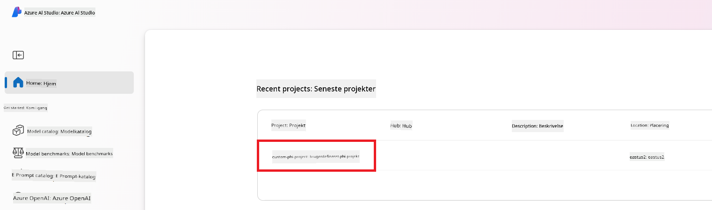

1. I det projekt, du oprettede, vælg **Deployments** i venstre sidepanel.

1. Vælg **+ Deploy model** i navigationsmenuen.

1. Vælg **Deploy base model**.

    

1. Vælg den Azure OpenAI-model, du ønsker at bruge. For eksempel **gpt-4o**.

    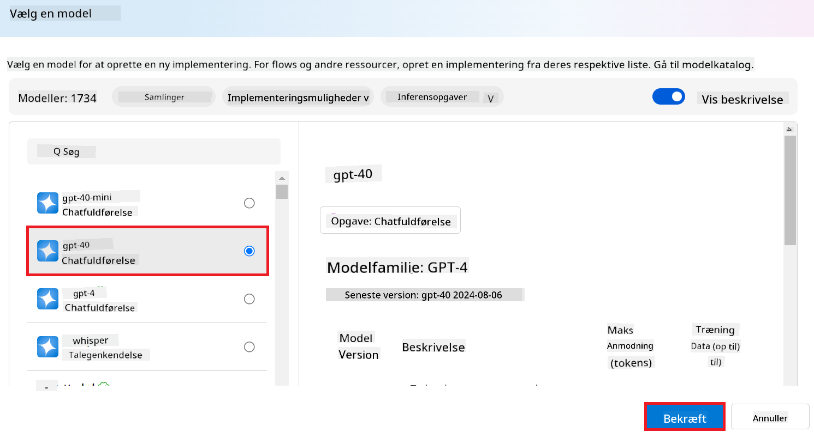

1. Vælg **Confirm**.

### Evaluer den finjusterede Phi-3 / Phi-3.5-model ved hjælp af Azure AI Foundrys Prompt flow-evaluering

### Start en ny evaluering

1. Besøg [Azure AI Foundry](https://ai.azure.com/?wt.mc_id=studentamb_279723).

1. Naviger til det Azure AI Foundry-projekt, du oprettede.

    

1. I det projekt, du oprettede, vælg **Evaluation** i venstre sidepanel.

1. Vælg **+ New evaluation** i navigationsmenuen.

    

1. Vælg **Prompt flow** evaluering.

    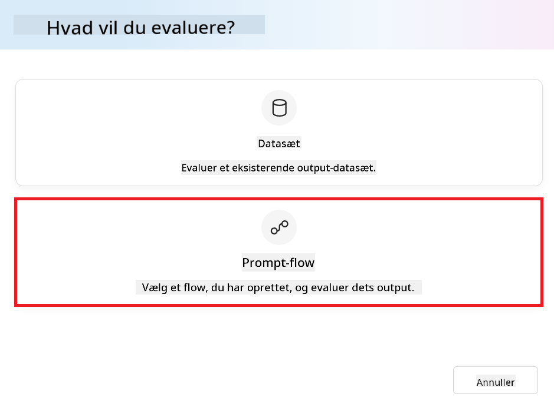

1. Udfør følgende opgaver:

    - Indtast evalueringsnavnet. Det skal være en unik værdi.
    - Vælg **Question and answer without context** som opgavetype. Fordi datasættet **ULTRACHAT_200k**, der bruges i denne vejledning, ikke indeholder kontekst.
    - Vælg det prompt flow, du ønsker at evaluere.

    

1. Vælg **Next**.

1. Udfør følgende opgaver:

    - Vælg **Add your dataset** for at uploade datasættet. For eksempel kan du uploade testdatasættet, såsom *test_data.json1*, som følger med, når du downloader **ULTRACHAT_200k** datasættet.
    - Vælg den passende **Dataset column**, der matcher dit datasæt. For eksempel, hvis du bruger **ULTRACHAT_200k** datasættet, vælg **${data.prompt}** som datasætkolonne.

    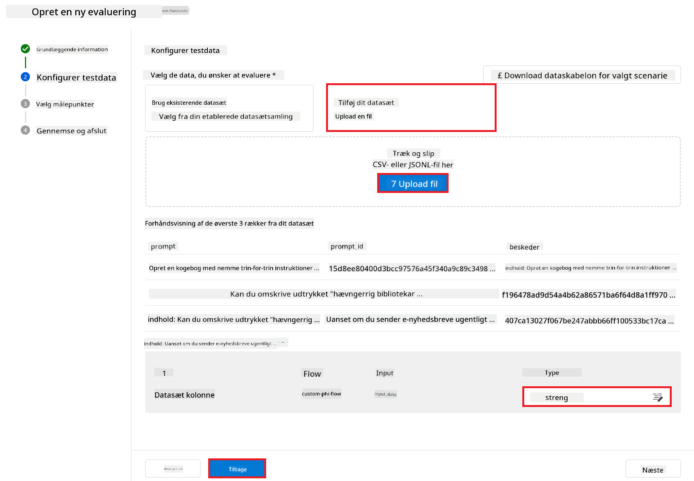

1. Vælg **Next**.

1. Udfør følgende opgaver for at konfigurere performance- og kvalitetsmålinger:

    - Vælg de performance- og kvalitetsmålinger, du ønsker at bruge.
    - Vælg den Azure OpenAI-model, du oprettede til evaluering. For eksempel vælg **gpt-4o**.

    

1. Udfør følgende opgaver for at konfigurere risikio- og sikkerhedsmålinger:

    - Vælg de risikio- og sikkerhedsmålinger, du ønsker at bruge.
    - Vælg tærsklen for at beregne fejlprocenten, du ønsker at bruge. For eksempel vælg **Medium**.
    - For **question**, vælg **Data source** til **{$data.prompt}**.
    - For **answer**, vælg **Data source** til **{$run.outputs.answer}**.
    - For **ground_truth**, vælg **Data source** til **{$data.message}**.

    

1. Vælg **Next**.

1. Vælg **Submit** for at starte evalueringen.

1. Evalueringen vil tage noget tid at gennemføre. Du kan følge fremskridtet i fanen **Evaluation**.

### Gennemgå evalueringsresultaterne
> [!NOTE]
> Resultaterne, der præsenteres nedenfor, har til formål at illustrere evalueringsprocessen. I denne vejledning har vi brugt en model, der er finjusteret på et relativt lille datasæt, hvilket kan føre til suboptimale resultater. De faktiske resultater kan variere betydeligt afhængigt af størrelsen, kvaliteten og mangfoldigheden af det anvendte datasæt samt den specifikke konfiguration af modellen.
Når evalueringen er færdig, kan du gennemgå resultaterne for både ydeevne- og sikkerhedsmålinger.

1. Ydeevne- og kvalitetsmålinger:

    - vurder modellens effektivitet i at generere sammenhængende, flydende og relevante svar.

    

1. Risiko- og sikkerhedsmålinger:

    - Sørg for, at modellens output er sikre og overholder Responsible AI Principles, og undgå skadeligt eller stødende indhold.

    

1. Du kan scrolle ned for at se **Detaljerede måleresultater**.

    

1. Ved at evaluere din tilpassede Phi-3 / Phi-3.5-model ud fra både ydeevne- og sikkerhedsmålinger kan du bekræfte, at modellen ikke kun er effektiv, men også følger ansvarlige AI-principper, hvilket gør den klar til brug i praksis.

## Tillykke!

### Du har gennemført denne vejledning

Du har med succes evalueret den finjusterede Phi-3-model integreret med Prompt flow i Azure AI Foundry. Dette er et vigtigt skridt for at sikre, at dine AI-modeller ikke kun præsterer godt, men også overholder Microsofts Responsible AI-principper, så du kan bygge pålidelige og troværdige AI-applikationer.


## Ryd op i Azure-ressourcer

Ryd op i dine Azure-ressourcer for at undgå ekstra omkostninger på din konto. Gå til Azure-portalen og slet følgende ressourcer:

- Azure Machine learning-ressourcen.
- Azure Machine learning model-endpointet.
- Azure AI Foundry Project-ressourcen.
- Azure AI Foundry Prompt flow-ressourcen.

### Næste skridt

#### Dokumentation

- [Assess AI systems by using the Responsible AI dashboard](https://learn.microsoft.com/azure/machine-learning/concept-responsible-ai-dashboard?view=azureml-api-2&source=recommendations?wt.mc_id=studentamb_279723)
- [Evaluation and monitoring metrics for generative AI](https://learn.microsoft.com/azure/ai-studio/concepts/evaluation-metrics-built-in?tabs=definition?wt.mc_id=studentamb_279723)
- [Azure AI Foundry documentation](https://learn.microsoft.com/azure/ai-studio/?wt.mc_id=studentamb_279723)
- [Prompt flow documentation](https://microsoft.github.io/promptflow/?wt.mc_id=studentamb_279723)

#### Træningsindhold

- [Introduction to Microsoft's Responsible AI Approach](https://learn.microsoft.com/training/modules/introduction-to-microsofts-responsible-ai-approach/?source=recommendations?wt.mc_id=studentamb_279723)
- [Introduction to Azure AI Foundry](https://learn.microsoft.com/training/modules/introduction-to-azure-ai-studio/?wt.mc_id=studentamb_279723)

### Reference

- [What is Responsible AI?](https://learn.microsoft.com/azure/machine-learning/concept-responsible-ai?view=azureml-api-2?wt.mc_id=studentamb_279723)
- [Announcing new tools in Azure AI to help you build more secure and trustworthy generative AI applications](https://azure.microsoft.com/blog/announcing-new-tools-in-azure-ai-to-help-you-build-more-secure-and-trustworthy-generative-ai-applications/?wt.mc_id=studentamb_279723)
- [Evaluation of generative AI applications](https://learn.microsoft.com/azure/ai-studio/concepts/evaluation-approach-gen-ai?wt.mc_id%3Dstudentamb_279723)

**Ansvarsfraskrivelse**:  
Dette dokument er blevet oversat ved hjælp af AI-oversættelsestjenesten [Co-op Translator](https://github.com/Azure/co-op-translator). Selvom vi bestræber os på nøjagtighed, bedes du være opmærksom på, at automatiserede oversættelser kan indeholde fejl eller unøjagtigheder. Det oprindelige dokument på dets oprindelige sprog bør betragtes som den autoritative kilde. For kritisk information anbefales professionel menneskelig oversættelse. Vi påtager os intet ansvar for misforståelser eller fejltolkninger, der opstår som følge af brugen af denne oversættelse.