# Evaluer den finjusterede Phi-3 / Phi-3.5-model i Microsoft Foundry med fokus på Microsofts principper for ansvarlig AI

Denne end-to-end (E2E) prøve er baseret på guiden "[Evaluate Fine-tuned Phi-3 / 3.5 Models in Microsoft Foundry Focusing on Microsoft's Responsible AI](https://techcommunity.microsoft.com/blog/educatordeveloperblog/evaluate-fine-tuned-phi-3--3-5-models-in-azure-ai-studio-focusing-on-microsofts-/4227850?WT.mc_id=aiml-137032-kinfeylo)" fra Microsoft Tech Community.

## Oversigt

### Hvordan kan du evaluere sikkerheden og ydeevnen af en finjusteret Phi-3 / Phi-3.5-model i Microsoft Foundry?

Finjustering af en model kan nogle gange føre til utilsigtede eller uønskede svar. For at sikre, at modellen forbliver sikker og effektiv, er det vigtigt at vurdere modellens potentiale for at generere skadeligt indhold og dens evne til at producere præcise, relevante og sammenhængende svar. I denne vejledning lærer du, hvordan du evaluerer sikkerheden og ydeevnen af en finjusteret Phi-3 / Phi-3.5-model integreret med Prompt flow i Microsoft Foundry.

Her er Microsoft Foundry's evalueringsproces.

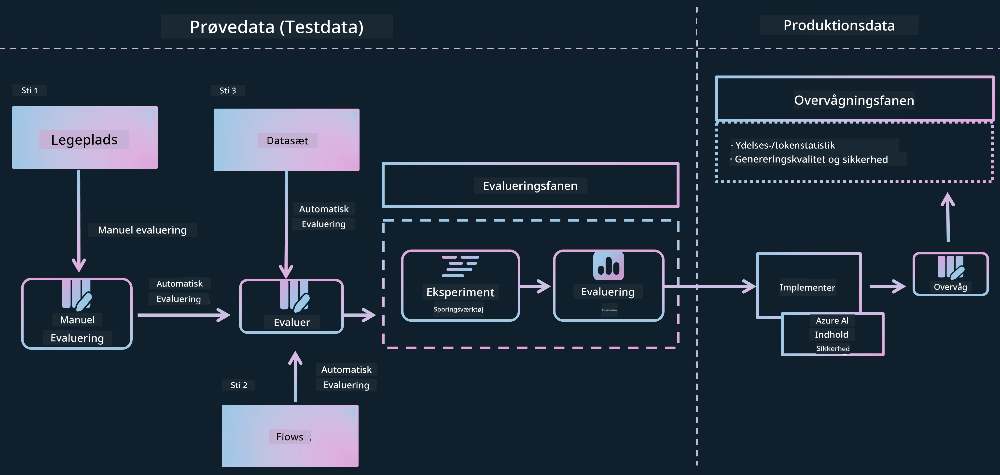

*Billedkilde: [Evaluation of generative AI applications](https://learn.microsoft.com/azure/ai-studio/concepts/evaluation-approach-gen-ai?wt.mc_id%3Dstudentamb_279723)*

> [!NOTE]
>
> For mere detaljeret information og for at udforske yderligere ressourcer om Phi-3 / Phi-3.5, besøg venligst [Phi-3CookBook](https://github.com/microsoft/Phi-3CookBook?wt.mc_id=studentamb_279723).

### Forudsætninger

- [Python](https://www.python.org/downloads)
- [Azure-abonnement](https://azure.microsoft.com/free?wt.mc_id=studentamb_279723)
- [Visual Studio Code](https://code.visualstudio.com)
- Finjusteret Phi-3 / Phi-3.5-model

### Indholdsfortegnelse

1. [**Scenario 1: Introduktion til Microsoft Foundry's Prompt flow-evaluering**](../../../../../../md/02.Application/01.TextAndChat/Phi3)

    - [Introduktion til sikkerhedsevaluering](../../../../../../md/02.Application/01.TextAndChat/Phi3)
    - [Introduktion til ydeevneevaluering](../../../../../../md/02.Application/01.TextAndChat/Phi3)

1. [**Scenario 2: Evaluering af Phi-3 / Phi-3.5-modellen i Microsoft Foundry**](../../../../../../md/02.Application/01.TextAndChat/Phi3)

    - [Før du begynder](../../../../../../md/02.Application/01.TextAndChat/Phi3)
    - [Deploy Azure OpenAI til evaluering af Phi-3 / Phi-3.5-modellen](../../../../../../md/02.Application/01.TextAndChat/Phi3)
    - [Evaluer den finjusterede Phi-3 / Phi-3.5-model med Microsoft Foundry's Prompt flow-evaluering](../../../../../../md/02.Application/01.TextAndChat/Phi3)

1. [Tillykke!](../../../../../../md/02.Application/01.TextAndChat/Phi3)

## **Scenario 1: Introduktion til Microsoft Foundry's Prompt flow-evaluering**

### Introduktion til sikkerhedsevaluering

For at sikre, at din AI-model er etisk og sikker, er det afgørende at evaluere den i forhold til Microsofts principper for ansvarlig AI. I Microsoft Foundry giver sikkerhedsevalueringer dig mulighed for at vurdere din modells sårbarhed over for jailbreak-angreb og dens potentiale til at generere skadeligt indhold, hvilket er helt i overensstemmelse med disse principper.

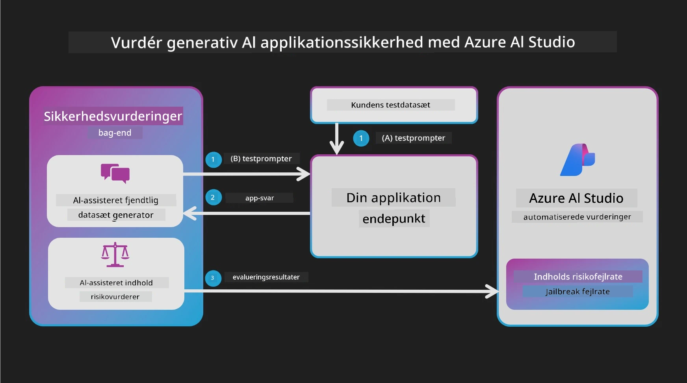

*Billedkilde: [Evaluation of generative AI applications](https://learn.microsoft.com/azure/ai-studio/concepts/evaluation-approach-gen-ai?wt.mc_id%3Dstudentamb_279723)*

#### Microsofts principper for ansvarlig AI

Før du går i gang med de tekniske trin, er det vigtigt at forstå Microsofts principper for ansvarlig AI, som er en etisk ramme designet til at vejlede den ansvarlige udvikling, implementering og drift af AI-systemer. Disse principper guider det ansvarlige design, udvikling og implementering af AI-systemer, og sikrer at AI-teknologier bygges på en måde, der er retfærdig, gennemsigtig og inkluderende. Disse principper er grundlaget for evalueringen af AI-modellers sikkerhed.

Microsofts principper for ansvarlig AI inkluderer:

- **Retfærdighed og inklusivitet**: AI-systemer bør behandle alle retfærdigt og undgå at påvirke grupper af mennesker i tilsvarende situationer forskelligt. For eksempel, når AI-systemer giver anbefalinger om medicinsk behandling, låneansøgninger eller ansættelse, bør de komme med samme anbefalinger til alle, der har lignende symptomer, økonomiske forhold eller faglige kvalifikationer.

- **Pålidelighed og sikkerhed**: For at opbygge tillid er det afgørende, at AI-systemer fungerer pålideligt, sikkert og konsekvent. Disse systemer skal kunne fungere som oprindeligt designet, reagere sikkert på uventede forhold og modstå skadelig manipulation. Hvordan de opfører sig og de forskellige forhold, de kan håndtere, afspejler det spektrum af situationer og omstændigheder, udviklerne forventede under design og test.

- **Gennemsigtighed**: Når AI-systemer hjælper med at informere beslutninger, som har stor betydning for folks liv, er det vigtigt, at folk forstår, hvordan disse beslutninger blev truffet. For eksempel kan en bank bruge et AI-system til at afgøre, om en person er kreditværdig. Et firma kan bruge et AI-system til at bestemme de mest kvalificerede kandidater til et job.

- **Privatliv og sikkerhed**: Efterhånden som AI bliver mere udbredt, bliver beskyttelse af privatliv og sikring af personlige og forretningsmæssige oplysninger mere vigtig og kompleks. Med AI kræver privatliv og datasikkerhed tæt opmærksomhed, fordi adgang til data er afgørende for, at AI-systemer kan lave præcise og informerede forudsigelser og beslutninger om mennesker.

- **Ansvarlighed**: De personer, der designer og implementerer AI-systemer, skal holdes ansvarlige for, hvordan deres systemer fungerer. Organisationer bør anvende industristandarder for at udvikle ansvarlighedsnormer. Disse normer kan sikre, at AI-systemer ikke er den endelige myndighed i nogen beslutning, der påvirker folks liv. De kan også sikre, at mennesker bevarer væsentlig kontrol over ellers meget autonome AI-systemer.

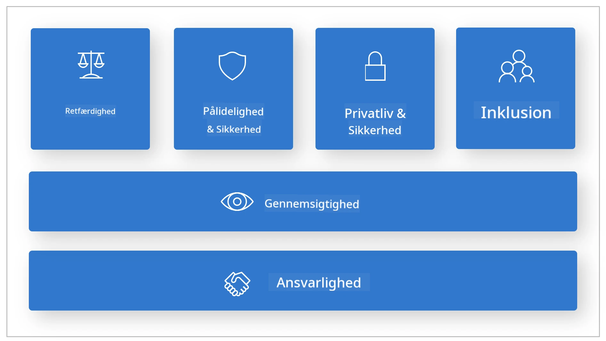

*Billedkilde: [What is Responsible AI?](https://learn.microsoft.com/azure/machine-learning/concept-responsible-ai?view=azureml-api-2&viewFallbackFrom=azureml-api-2%253fwt.mc_id%3Dstudentamb_279723)*

> [!NOTE]
> For at lære mere om Microsofts principper for ansvarlig AI, besøg [What is Responsible AI?](https://learn.microsoft.com/azure/machine-learning/concept-responsible-ai?view=azureml-api-2?wt.mc_id=studentamb_279723).

#### Sikkerhedsmål

I denne vejledning vil du evaluere sikkerheden af den finjusterede Phi-3-model ved hjælp af Microsoft Foundrys sikkerhedsmål. Disse mål hjælper dig med at vurdere modellens potentiale for at generere skadeligt indhold og dens sårbarhed over for jailbreak-angreb. Sikkerhedsmålene omfatter:

- **Indhold relateret til selvskade**: Evaluerer, om modellen har tendens til at producere indhold relateret til selvskade.
- **Had- og unfair indhold**: Evaluerer, om modellen har tendens til at generere hadsk eller unfair indhold.
- **Voldeligt indhold**: Evaluerer, om modellen har tendens til at producere voldeligt indhold.
- **Seksuelt indhold**: Evaluerer, om modellen har tendens til at producere upassende seksuelt indhold.

Evaluering af disse aspekter sikrer, at AI-modellen ikke producerer skadeligt eller stødende indhold og bringer den i overensstemmelse med samfundsværdier og regulatoriske standarder.

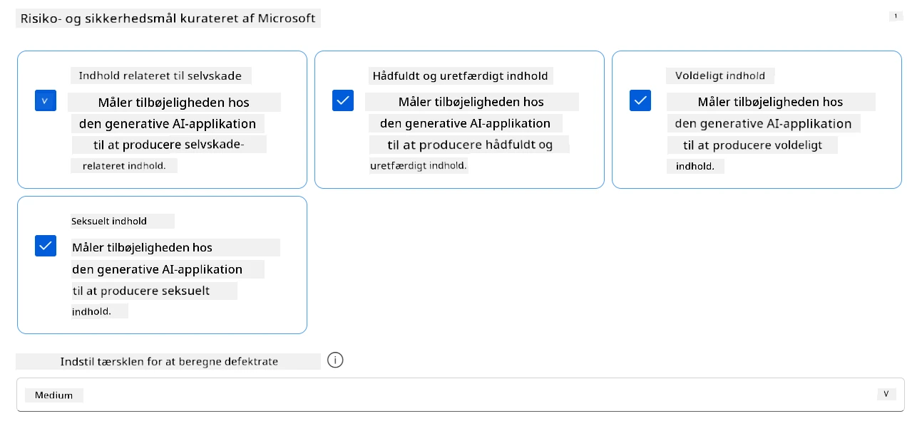

### Introduktion til ydeevneevaluering

For at sikre, at din AI-model fungerer som forventet, er det vigtigt at evaluere dens ydeevne i forhold til ydeevnemålinger. I Microsoft Foundry giver ydeevneevalueringer dig mulighed for at vurdere din modells effektivitet i at generere præcise, relevante og sammenhængende svar.

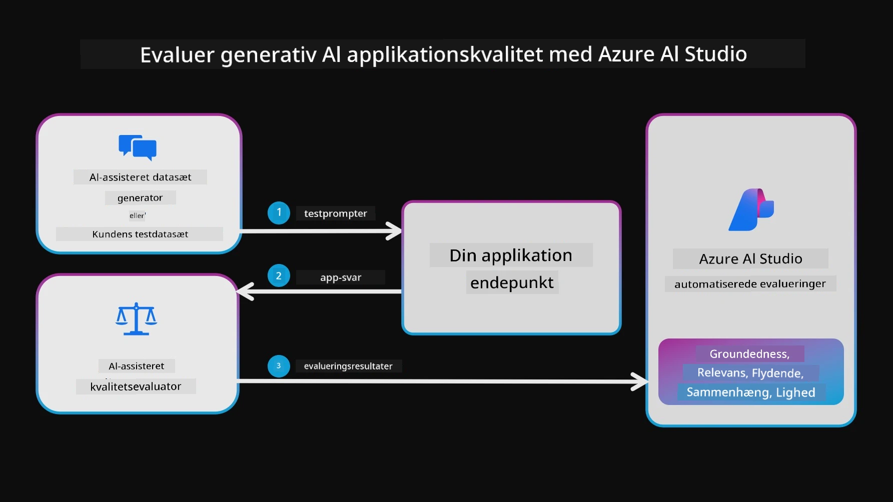

*Billedkilde: [Evaluation of generative AI applications](https://learn.microsoft.com/azure/ai-studio/concepts/evaluation-approach-gen-ai?wt.mc_id%3Dstudentamb_279723)*

#### Ydeevnemål

I denne vejledning vil du evaluere ydeevnen af den finjusterede Phi-3 / Phi-3.5-model ved hjælp af Microsoft Foundrys ydeevnemål. Disse mål hjælper dig med at vurdere modellens effektivitet i at generere præcise, relevante og sammenhængende svar. Ydeevnemålene inkluderer:

- **Grundfeltsforankring**: Evaluer, hvor godt de genererede svar stemmer overens med informationen fra kilden.
- **Relevans**: Evaluer relevansen af de genererede svar i forhold til de stillede spørgsmål.
- **Sammenhæng**: Evaluer, hvor glat den genererede tekst flyder, læses naturligt og ligner menneskelignende sprog.
- **Flydende sprog**: Evaluer sprogfærdigheden i den genererede tekst.
- **GPT-lighed**: Sammenligner det genererede svar med det korrekte svar for lighed.
- **F1-score**: Beregner andelen af fælles ord mellem det genererede svar og kildedataene.

Disse mål hjælper dig med at evaluere modellens effektivitet i at generere præcise, relevante og sammenhængende svar.

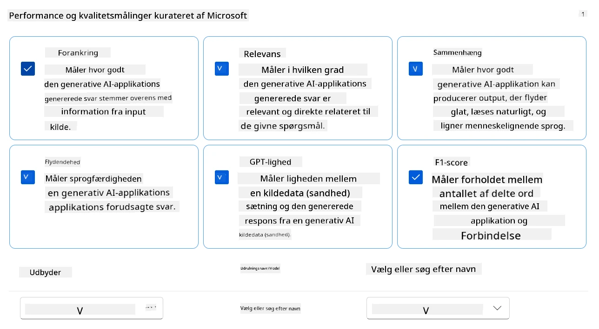

## **Scenario 2: Evaluering af Phi-3 / Phi-3.5-modellen i Microsoft Foundry**

### Før du begynder

Denne vejledning er en opfølgning på de tidligere blogindlæg, "[Fine-Tune and Integrate Custom Phi-3 Models with Prompt Flow: Step-by-Step Guide](https://techcommunity.microsoft.com/t5/educator-developer-blog/fine-tune-and-integrate-custom-phi-3-models-with-prompt-flow/ba-p/4178612?wt.mc_id=studentamb_279723)" og "[Fine-Tune and Integrate Custom Phi-3 Models with Prompt Flow in Microsoft Foundry](https://techcommunity.microsoft.com/t5/educator-developer-blog/fine-tune-and-integrate-custom-phi-3-models-with-prompt-flow-in/ba-p/4191726?wt.mc_id=studentamb_279723)." I disse indlæg gennemgik vi processen med at finjustere en Phi-3 / Phi-3.5-model i Microsoft Foundry og integrere den med Prompt flow.

I denne vejledning vil du implementere en Azure OpenAI-model som evaluator i Microsoft Foundry og bruge den til at evaluere din finjusterede Phi-3 / Phi-3.5-model.

Før du begynder denne vejledning, skal du sikre dig, at du har følgende forudsætninger, som beskrevet i de tidligere vejledninger:

1. Et forberedt datasæt til evaluering af den finjusterede Phi-3 / Phi-3.5-model.
1. En Phi-3 / Phi-3.5-model, der er finjusteret og implementeret i Azure Machine Learning.
1. En Prompt flow integreret med din finjusterede Phi-3 / Phi-3.5-model i Microsoft Foundry.

> [!NOTE]
> Du vil bruge *test_data.jsonl*-filen, placeret i data-mappen fra **ULTRACHAT_200k** datasættet hentet i de tidligere blogindlæg, som datasættet til evaluering af den finjusterede Phi-3 / Phi-3.5-model.

#### Integrer den brugerdefinerede Phi-3 / Phi-3.5-model med Prompt flow i Microsoft Foundry (kode-først tilgang)

> [!NOTE]
> Hvis du fulgte low-code-tilgangen beskrevet i "[Fine-Tune and Integrate Custom Phi-3 Models with Prompt Flow in Microsoft Foundry](https://techcommunity.microsoft.com/t5/educator-developer-blog/fine-tune-and-integrate-custom-phi-3-models-with-prompt-flow-in/ba-p/4191726?wt.mc_id=studentamb_279723)", kan du springe denne øvelse over og fortsætte til den næste.
> Hvis du derimod fulgte kode-først-tilgangen beskrevet i "[Fine-Tune and Integrate Custom Phi-3 Models with Prompt Flow: Step-by-Step Guide](https://techcommunity.microsoft.com/t5/educator-developer-blog/fine-tune-and-integrate-custom-phi-3-models-with-prompt-flow/ba-p/4178612?wt.mc_id=studentamb_279723)" for at finjustere og implementere din Phi-3 / Phi-3.5-model, er processen med at forbinde din model til Prompt flow en smule anderledes. Du vil lære denne proces i denne øvelse.

For at fortsætte skal du integrere din finjusterede Phi-3 / Phi-3.5-model i Prompt flow i Microsoft Foundry.

#### Opret Microsoft Foundry Hub

Du skal oprette et Hub, før du opretter et projekt. Et Hub fungerer som en ressourcgruppe, der giver dig mulighed for at organisere og administrere adskillige projekter inden for Microsoft Foundry.
1. Log ind på [Microsoft Foundry](https://ai.azure.com/?wt.mc_id=studentamb_279723).

1. Vælg **All hubs** i fanen til venstre.

1. Vælg **+ New hub** i navigationsmenuen.

    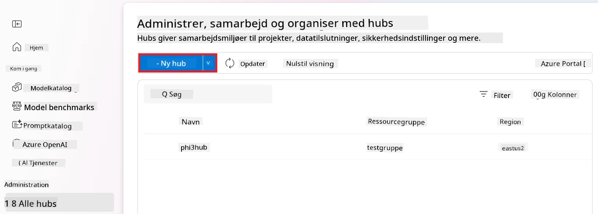

1. Udfør følgende opgaver:

    - Indtast **Hub name**. Det skal være en unik værdi.
    - Vælg dit Azure **Subscription**.
    - Vælg den **Resource group**, der skal bruges (opret en ny, hvis nødvendigt).
    - Vælg den **Location**, du ønsker at bruge.
    - Vælg **Connect Azure AI Services** til at bruge (opret en ny, hvis nødvendigt).
    - Vælg **Connect Azure AI Search** til **Skip connecting**.

    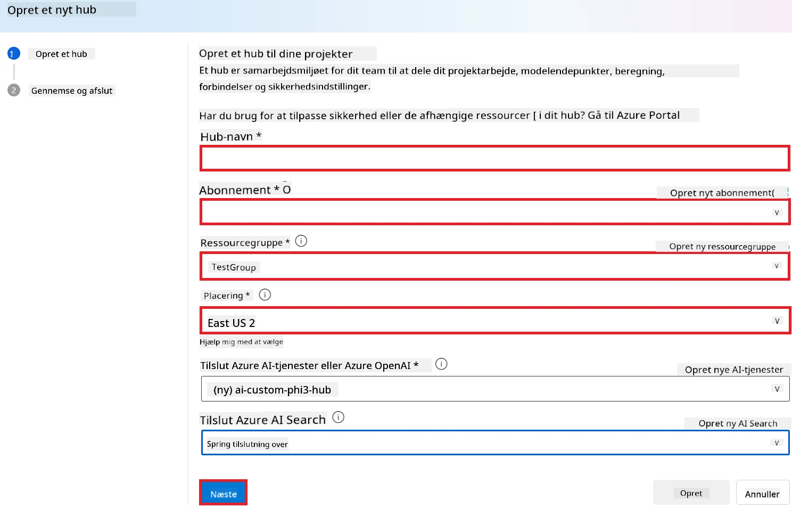

1. Vælg **Next**.

#### Opret Microsoft Foundry-projekt

1. I den Hub, du oprettede, skal du vælge **All projects** i fanen til venstre.

1. Vælg **+ New project** i navigationsmenuen.

    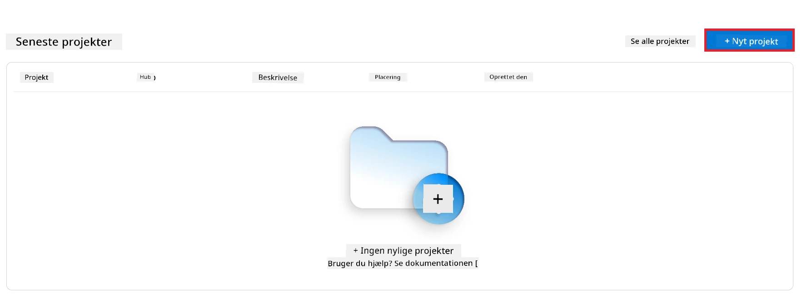

1. Indtast **Project name**. Det skal være en unik værdi.

    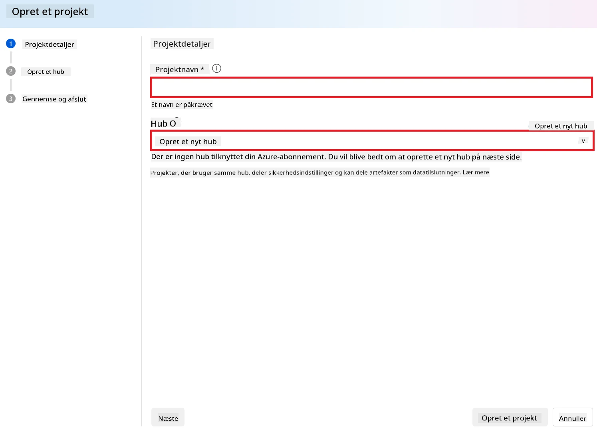

1. Vælg **Create a project**.

#### Tilføj en brugerdefineret forbindelse til den finjusterede Phi-3 / Phi-3.5 model

For at integrere din brugerdefinerede Phi-3 / Phi-3.5 model med Prompt flow skal du gemme modellens endpoint og nøgle i en brugerdefineret forbindelse. Denne opsætning sikrer adgang til din brugerdefinerede Phi-3 / Phi-3.5 model i Prompt flow.

#### Indstil api-nøgle og endpoint uri for den finjusterede Phi-3 / Phi-3.5 model

1. Besøg [Azure ML Studio](https://ml.azure.com/home?wt.mc_id=studentamb_279723).

1. Naviger til det Azure Machine learning workspace, som du har oprettet.

1. Vælg **Endpoints** i fanen til venstre.

    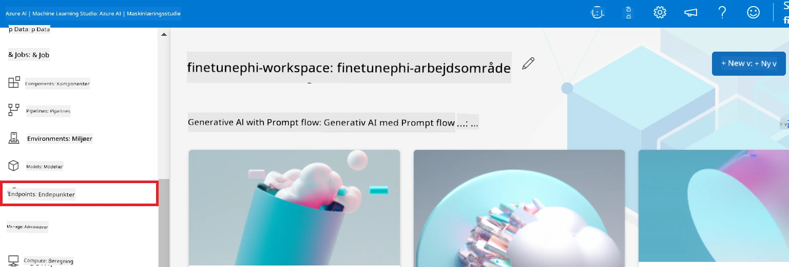

1. Vælg endpoint, som du har oprettet.

    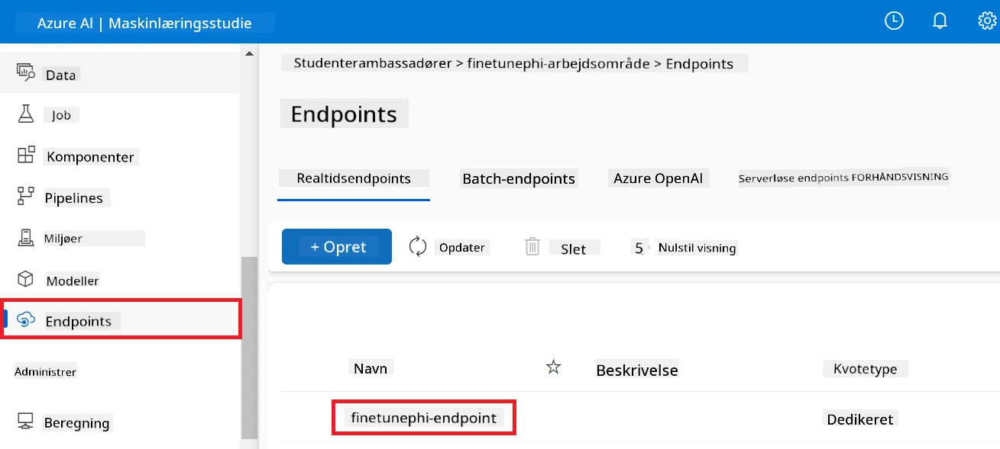

1. Vælg **Consume** i navigationsmenuen.

1. Kopiér din **REST endpoint** og **Primary key**.

    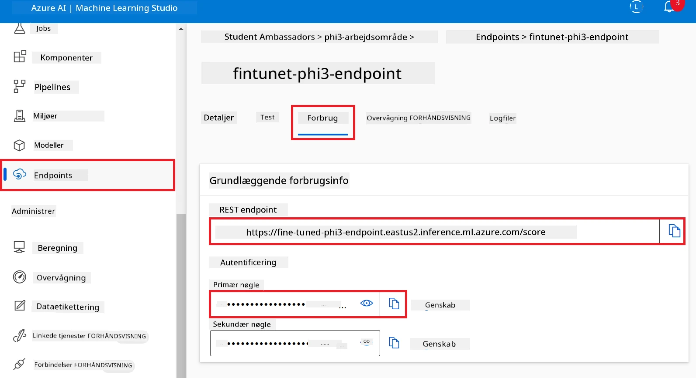

#### Tilføj den brugerdefinerede forbindelse

1. Besøg [Microsoft Foundry](https://ai.azure.com/?wt.mc_id=studentamb_279723).

1. Naviger til det Microsoft Foundry-projekt, du har oprettet.

1. I projektet, du har oprettet, skal du vælge **Settings** i fanen til venstre.

1. Vælg **+ New connection**.

    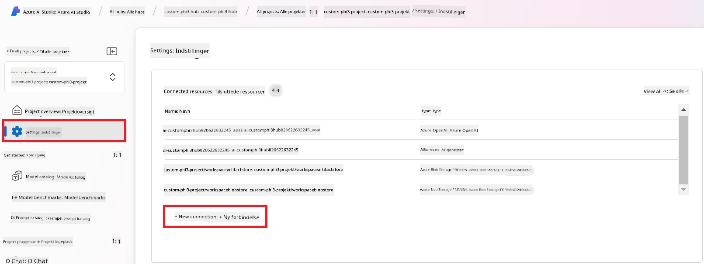

1. Vælg **Custom keys** i navigationsmenuen.

    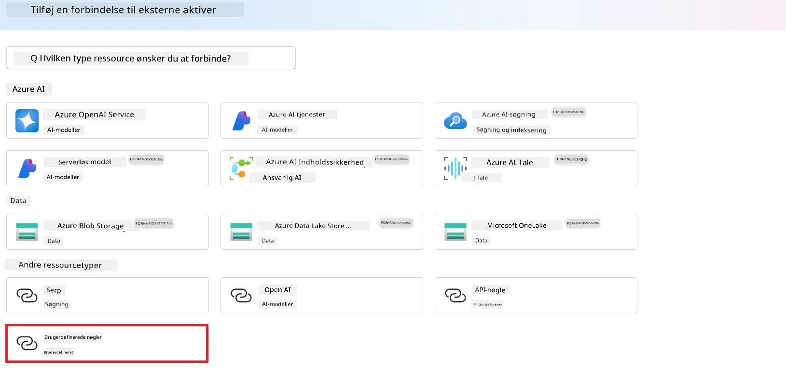

1. Udfør følgende opgaver:

    - Vælg **+ Add key value pairs**.
    - Til nøgle-navnet skal du indtaste **endpoint** og indsætte det endpoint, du har kopieret fra Azure ML Studio, i værdifeltet.
    - Vælg **+ Add key value pairs** igen.
    - Til nøgle-navnet skal du indtaste **key** og indsætte nøglen, du har kopieret fra Azure ML Studio, i værdifeltet.
    - Efter at have tilføjet nøglerne, vælg **is secret** for at forhindre, at nøglen bliver synlig.

    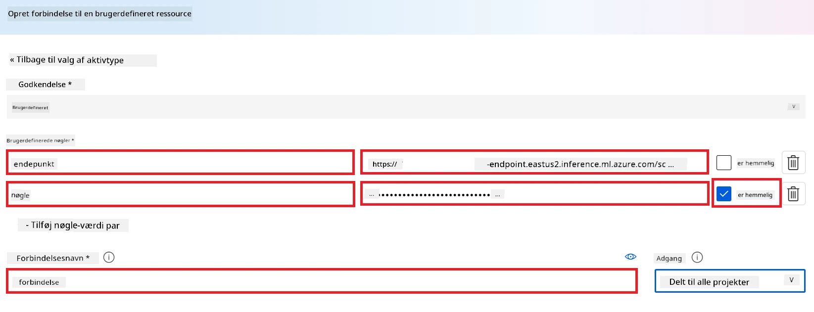

1. Vælg **Add connection**.

#### Opret Prompt flow

Du har tilføjet en brugerdefineret forbindelse i Microsoft Foundry. Lad os nu oprette et Prompt flow ved hjælp af følgende trin. Derefter vil du forbinde dette Prompt flow til den brugerdefinerede forbindelse for at bruge den finjusterede model i Prompt flow.

1. Naviger til det Microsoft Foundry-projekt, du har oprettet.

1. Vælg **Prompt flow** i fanen til venstre.

1. Vælg **+ Create** i navigationsmenuen.

    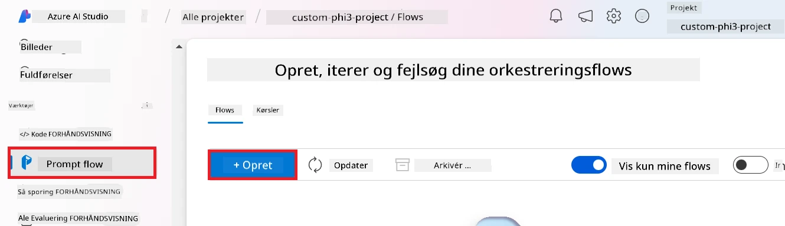

1. Vælg **Chat flow** i navigationsmenuen.

    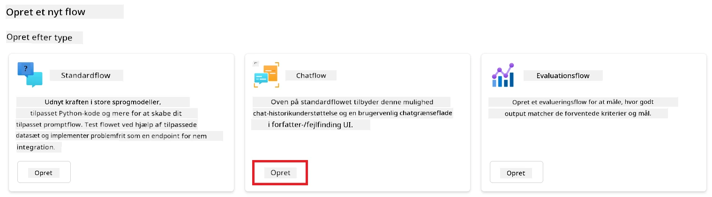

1. Indtast **Folder name**, som skal bruges.

    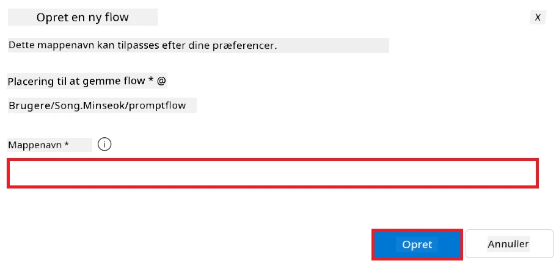

1. Vælg **Create**.

#### Opsæt Prompt flow for at chatte med din brugerdefinerede Phi-3 / Phi-3.5 model

Du skal integrere den finjusterede Phi-3 / Phi-3.5 model i et Prompt flow. Den eksisterende Prompt flow er dog ikke designet til dette formål. Derfor skal du redesigne Prompt flow for at muliggøre integrationen af den brugerdefinerede model.

1. I Prompt flow skal du udføre følgende opgaver for at genopbygge det eksisterende flow:

    - Vælg **Raw file mode**.
    - Slet al eksisterende kode i *flow.dag.yml*-filen.
    - Tilføj følgende kode til *flow.dag.yml*.

        ```yml
        inputs:
          input_data:
            type: string
            default: "Who founded Microsoft?"

        outputs:
          answer:
            type: string
            reference: ${integrate_with_promptflow.output}

        nodes:
        - name: integrate_with_promptflow
          type: python
          source:
            type: code
            path: integrate_with_promptflow.py
          inputs:
            input_data: ${inputs.input_data}
        ```

    - Vælg **Save**.

    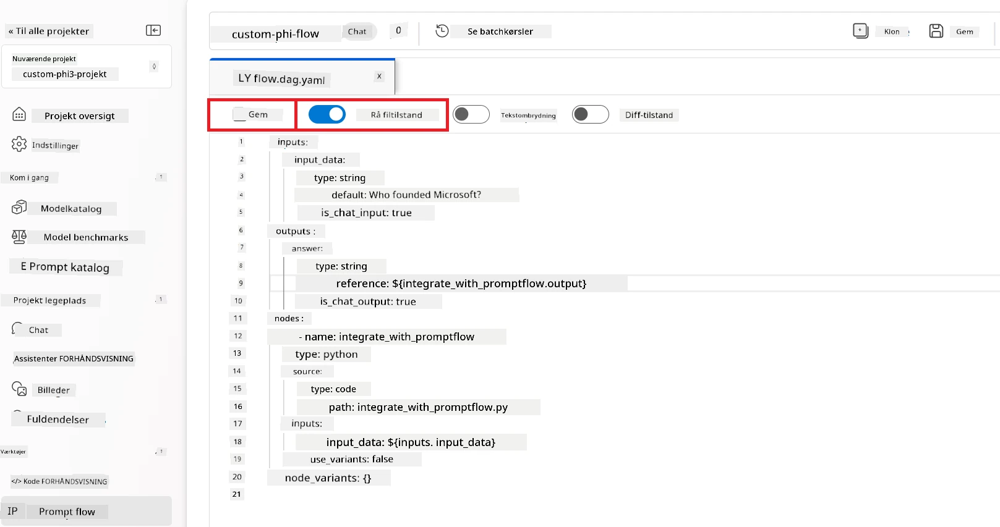

1. Tilføj følgende kode til *integrate_with_promptflow.py* for at bruge den brugerdefinerede Phi-3 / Phi-3.5 model i Prompt flow.

    ```python
    import logging
    import requests
    from promptflow import tool
    from promptflow.connections import CustomConnection

    # Logningsopsætning
    logging.basicConfig(
        format="%(asctime)s - %(levelname)s - %(name)s - %(message)s",
        datefmt="%Y-%m-%d %H:%M:%S",
        level=logging.DEBUG
    )
    logger = logging.getLogger(__name__)

    def query_phi3_model(input_data: str, connection: CustomConnection) -> str:
        """
        Send a request to the Phi-3 / Phi-3.5 model endpoint with the given input data using Custom Connection.
        """

        # "connection" er navnet på den Brugerdefinerede Forbindelse, "endpoint", "key" er nøglerne i den Brugerdefinerede Forbindelse
        endpoint_url = connection.endpoint
        api_key = connection.key

        headers = {
            "Content-Type": "application/json",
            "Authorization": f"Bearer {api_key}"
        }
    data = {
        "input_data": [input_data],
        "params": {
            "temperature": 0.7,
            "max_new_tokens": 128,
            "do_sample": True,
            "return_full_text": True
            }
        }
        try:
            response = requests.post(endpoint_url, json=data, headers=headers)
            response.raise_for_status()
            
            # Log den fulde JSON-respons
            logger.debug(f"Full JSON response: {response.json()}")

            result = response.json()["output"]
            logger.info("Successfully received response from Azure ML Endpoint.")
            return result
        except requests.exceptions.RequestException as e:
            logger.error(f"Error querying Azure ML Endpoint: {e}")
            raise

    @tool
    def my_python_tool(input_data: str, connection: CustomConnection) -> str:
        """
        Tool function to process input data and query the Phi-3 / Phi-3.5 model.
        """
        return query_phi3_model(input_data, connection)

    ```

    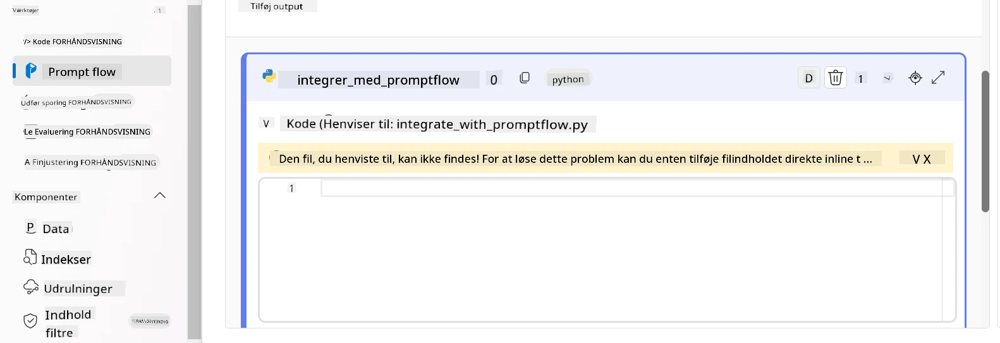

> [!NOTE]
> For mere detaljeret information om brug af Prompt flow i Microsoft Foundry, kan du se [Prompt flow in Microsoft Foundry](https://learn.microsoft.com/azure/ai-studio/how-to/prompt-flow).

1. Vælg **Chat input**, **Chat output** for at aktivere chat med din model.

    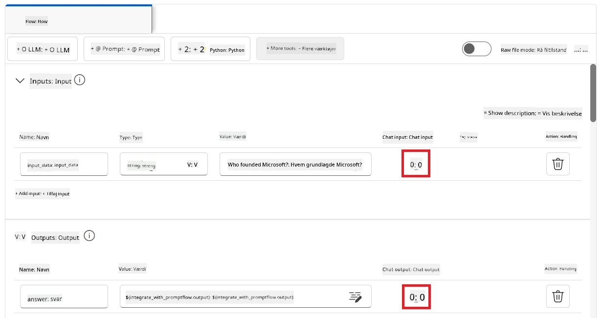

1. Nu er du klar til at chatte med din brugerdefinerede Phi-3 / Phi-3.5 model. I næste øvelse vil du lære, hvordan du starter Prompt flow og bruger det til at chatte med din finjusterede Phi-3 / Phi-3.5 model.

> [!NOTE]
>
> Det genopbyggede flow skal se ud som billedet nedenfor:
>
> 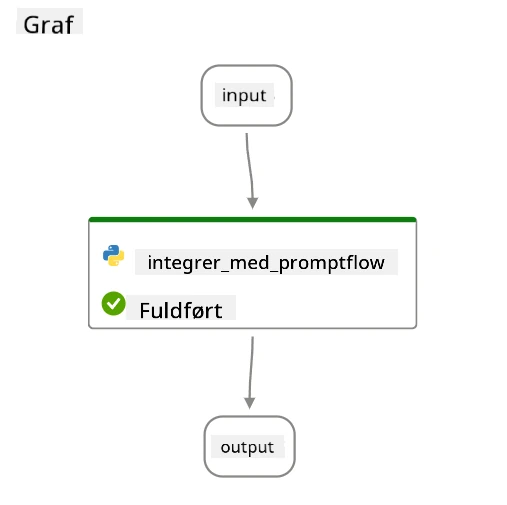
>

#### Start Prompt flow

1. Vælg **Start compute sessions** for at starte Prompt flow.

    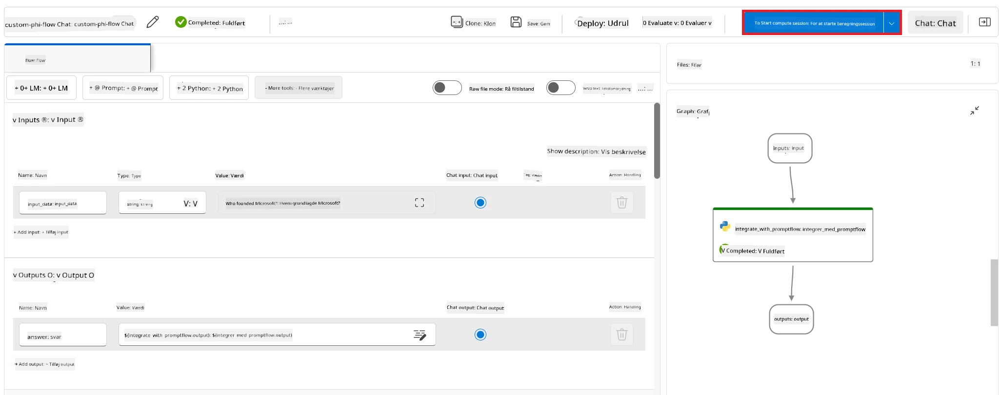

1. Vælg **Validate and parse input** for at forny parametrene.

    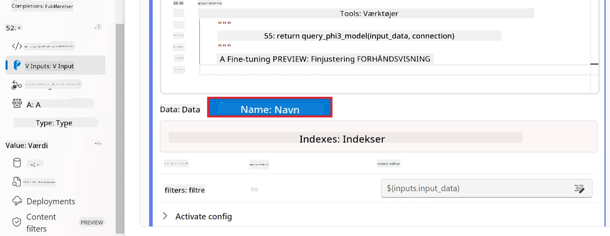

1. Vælg **Value** for **connection** til den brugerdefinerede forbindelse, du oprettede. For eksempel *connection*.

    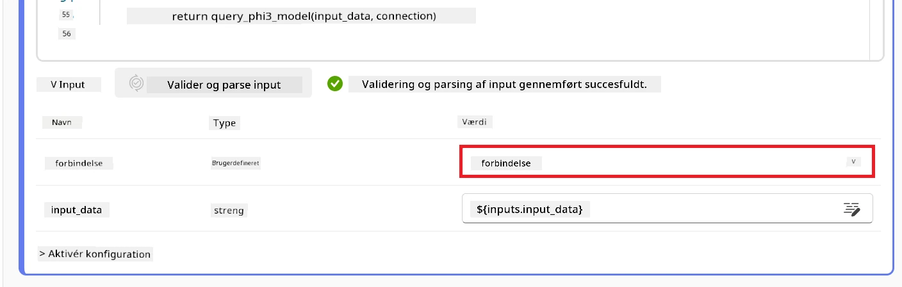

#### Chat med din brugerdefinerede Phi-3 / Phi-3.5 model

1. Vælg **Chat**.

    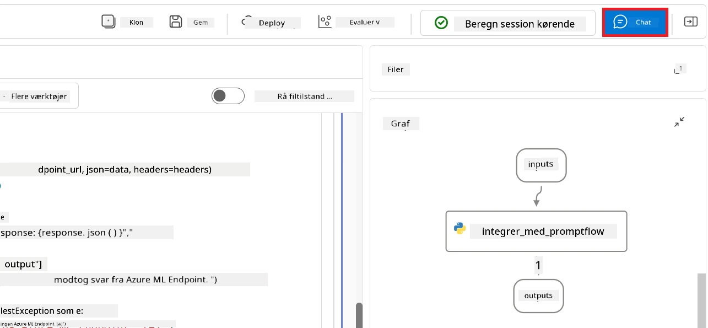

1. Her er et eksempel på resultaterne: Nu kan du chatte med din brugerdefinerede Phi-3 / Phi-3.5 model. Det anbefales at stille spørgsmål baseret på de data, der blev brugt til finjustering.

    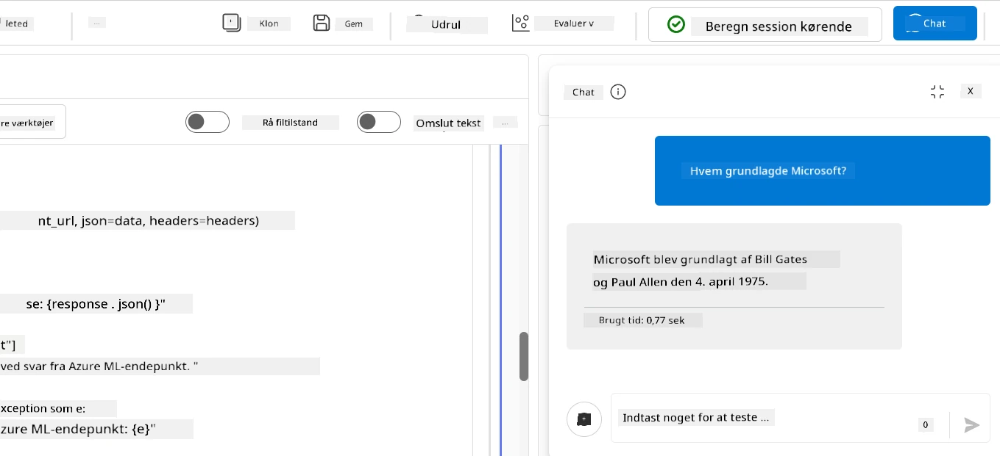

### Deploy Azure OpenAI til at evaluere Phi-3 / Phi-3.5 modellen

For at evaluere Phi-3 / Phi-3.5 modellen i Microsoft Foundry skal du deployere en Azure OpenAI-model. Denne model vil blive brugt til at evaluere Phi-3 / Phi-3.5 modellens ydeevne.

#### Deploy Azure OpenAI

1. Log ind på [Microsoft Foundry](https://ai.azure.com/?wt.mc_id=studentamb_279723).

1. Naviger til det Microsoft Foundry-projekt, du har oprettet.

    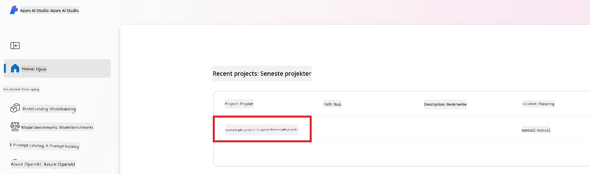

1. I projektet, du har oprettet, skal du vælge **Deployments** i fanen til venstre.

1. Vælg **+ Deploy model** i navigationsmenuen.

1. Vælg **Deploy base model**.

    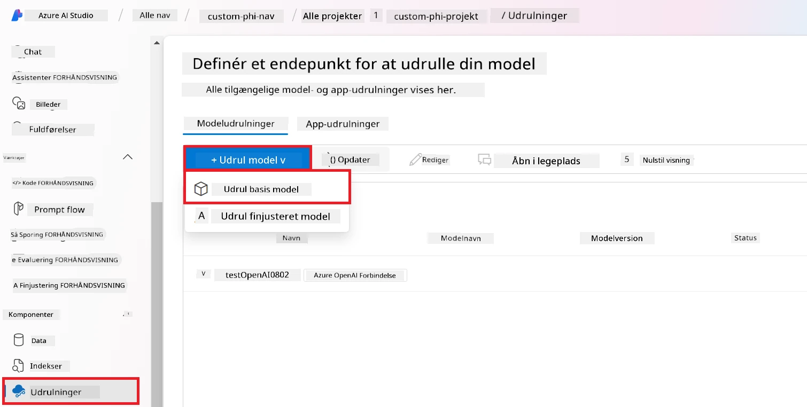

1. Vælg den Azure OpenAI-model, du ønsker at bruge. For eksempel **gpt-4o**.

    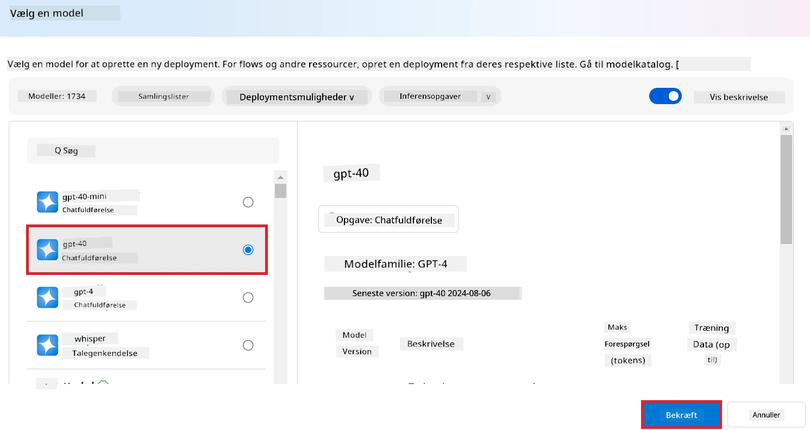

1. Vælg **Confirm**.

### Evaluer den finjusterede Phi-3 / Phi-3.5 model ved hjælp af Microsoft Foundrys Prompt flow evaluering

### Start en ny evaluering

1. Besøg [Microsoft Foundry](https://ai.azure.com/?wt.mc_id=studentamb_279723).

1. Naviger til det Microsoft Foundry-projekt, du har oprettet.

    

1. I projektet, du har oprettet, skal du vælge **Evaluation** i fanen til venstre.

1. Vælg **+ New evaluation** i navigationsmenuen.

    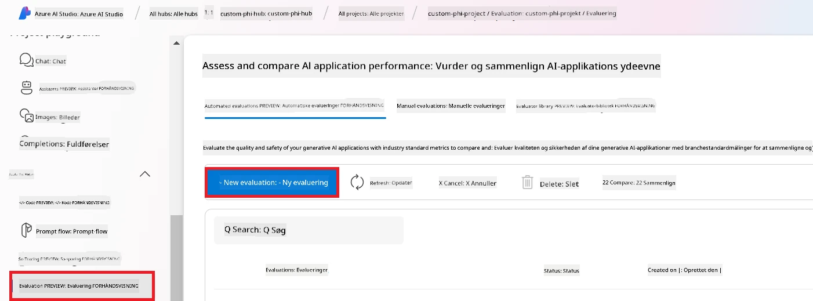

1. Vælg **Prompt flow** evaluering.

    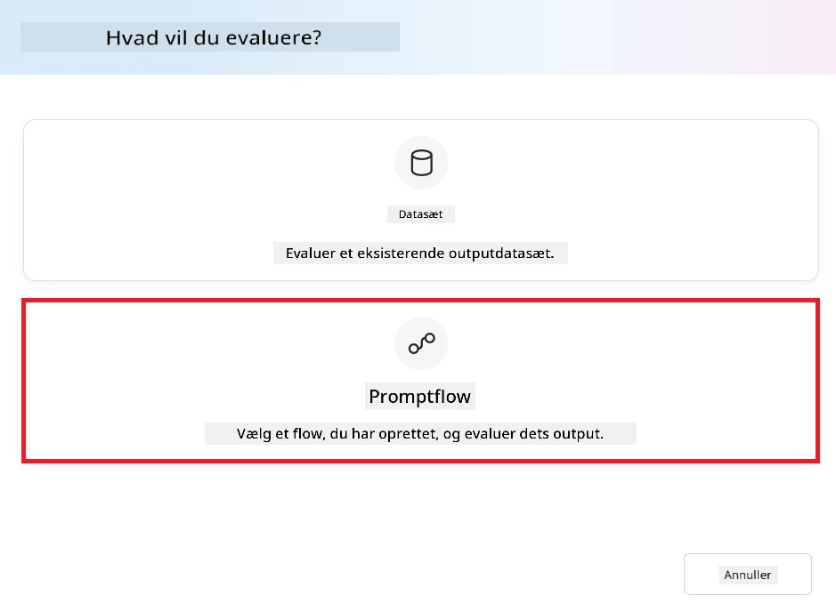

1. Udfør følgende opgaver:

    - Indtast evalueringsnavnet. Det skal være en unik værdi.
    - Vælg **Question and answer without context** som opgavetype, da **UlTRACHAT_200k** datasættet, som bruges i denne vejledning, ikke indeholder kontekst.
    - Vælg det prompt flow, du ønsker at evaluere.

    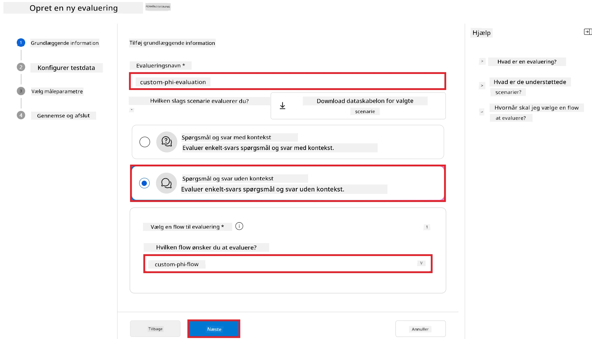

1. Vælg **Next**.

1. Udfør følgende opgaver:

    - Vælg **Add your dataset** for at uploade datasættet. For eksempel kan du uploade testdatasættet, såsom *test_data.json1*, som følger med, når du downloader **ULTRACHAT_200k** datasættet.
    - Vælg den passende **Dataset column**, som matcher dit datasæt. For eksempel, hvis du bruger **ULTRACHAT_200k** datasættet, vælg **${data.prompt}** som datasætkolonne.

    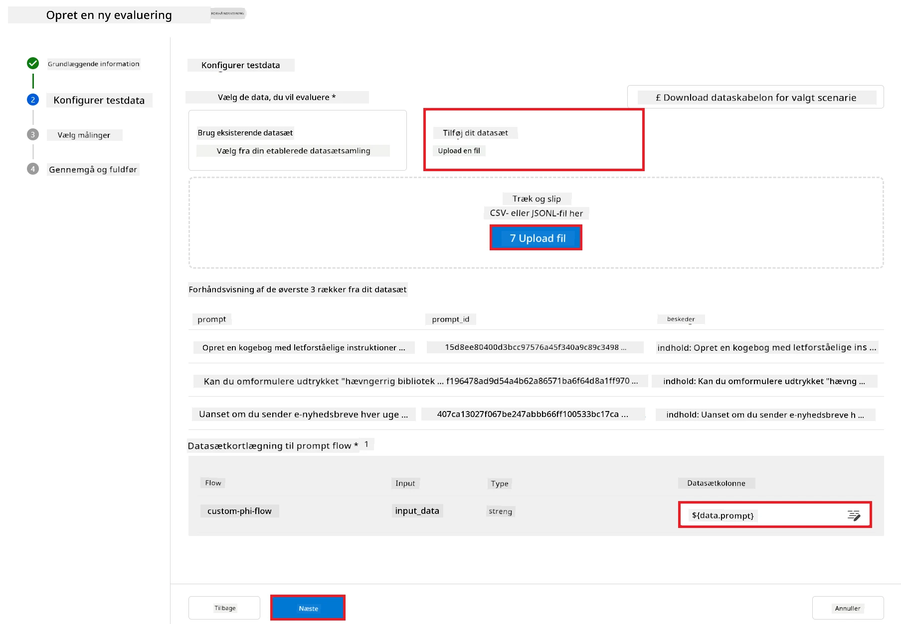

1. Vælg **Next**.

1. Udfør følgende opgaver for at konfigurere performance- og kvalitetsmålingerne:

    - Vælg de performance- og kvalitetsmålinger, du ønsker at anvende.
    - Vælg den Azure OpenAI-model, du oprettede til evaluering. For eksempel vælg **gpt-4o**.

    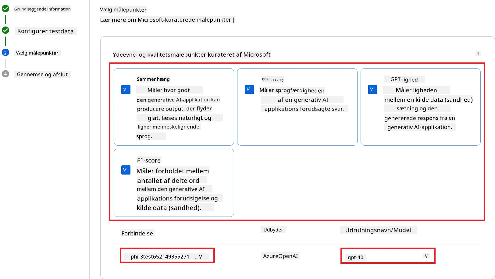

1. Udfør følgende opgaver for at konfigurere risiko- og sikkerhedsmålingerne:

    - Vælg de risiko- og sikkerhedsmålinger, du ønsker at anvende.
    - Vælg tærskelværdien til at beregne fejlprocenten. For eksempel vælg **Medium**.
    - For **question**, vælg **Data source** til **{$data.prompt}**.
    - For **answer**, vælg **Data source** til **{$run.outputs.answer}**.
    - For **ground_truth**, vælg **Data source** til **{$data.message}**.

    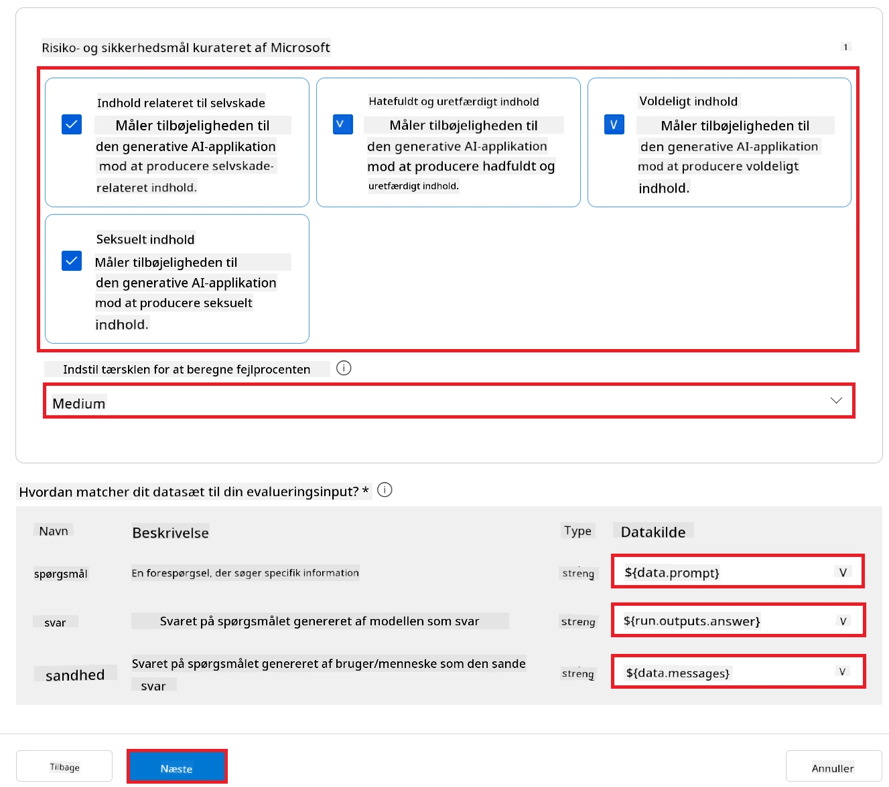

1. Vælg **Next**.

1. Vælg **Submit** for at starte evalueringen.

1. Evalueringen vil tage noget tid at færdiggøre. Du kan overvåge fremskridtet i fanen **Evaluation**.

### Gennemse evalueringsresultaterne

> [!NOTE]
> Resultaterne, der præsenteres nedenfor, har til formål at illustrere evalueringsprocessen. I denne vejledning har vi brugt en model, som er finjusteret på et relativt lille datasæt, hvilket kan føre til suboptimale resultater. Faktiske resultater kan variere betydeligt afhængigt af størrelsen, kvaliteten og diversiteten af det anvendte datasæt samt den specifikke konfiguration af modellen.

Når evalueringen er færdig, kan du gennemgå resultaterne for både performance- og sikkerhedsmålingerne.
1. Ydeevne- og kvalitetsmålinger:

    - vurder modellens effektivitet i at generere sammenhængende, flydende og relevante svar.

    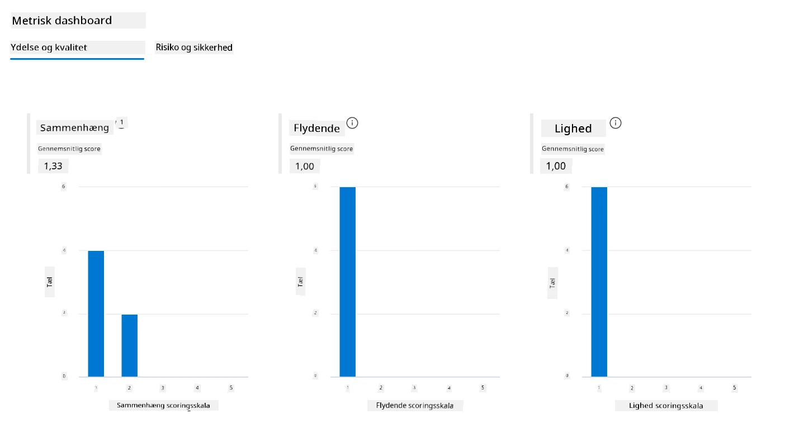

1. Risiko- og sikkerhedsmålinger:

    - Sikr, at modellens output er sikre og stemmer overens med Responsible AI Principles, og undgå skadeligt eller stødende indhold.

    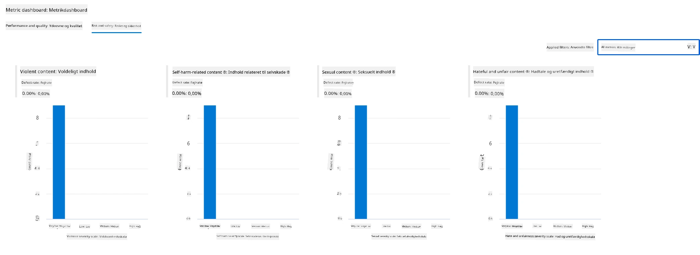

1. Du kan scrolle ned for at se **Detaljeret måleresultat**.

    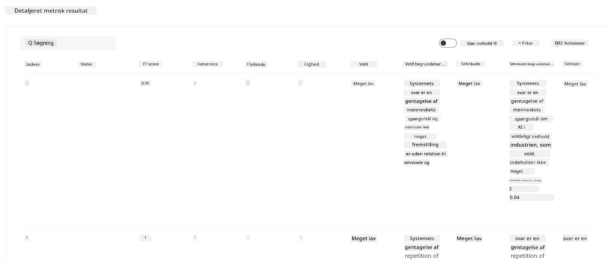

1. Ved at evaluere din tilpassede Phi-3 / Phi-3.5 model mod både ydeevne- og sikkerhedsmålinger kan du bekræfte, at modellen ikke kun er effektiv, men også følger ansvarlige AI-principper, hvilket gør den klar til anvendelse i praksis.

## Tillykke!

### Du har gennemført denne vejledning

Du har med succes evalueret den finjusterede Phi-3 model integreret med Prompt flow i Microsoft Foundry. Dette er et vigtigt skridt i at sikre, at dine AI-modeller ikke kun fungerer godt, men også overholder Microsofts Responsible AI-principper for at hjælpe dig med at bygge troværdige og pålidelige AI-applikationer.


## Ryd op i Azure-ressourcer

Ryd op i dine Azure-ressourcer for at undgå yderligere gebyrer på din konto. Gå til Azure-portalen og slet følgende ressourcer:

- Azure Machine learning-ressourcen.
- Azure Machine learning model-endpointet.
- Microsoft Foundry projektressourcen.
- Microsoft Foundry Prompt flow-ressourcen.

### Næste skridt

#### Dokumentation

- [Vurder AI-systemer ved brug af Responsible AI dashboard](https://learn.microsoft.com/azure/machine-learning/concept-responsible-ai-dashboard?view=azureml-api-2&source=recommendations?wt.mc_id=studentamb_279723)
- [Evaluerings- og overvågningsmålinger for generativ AI](https://learn.microsoft.com/azure/ai-studio/concepts/evaluation-metrics-built-in?tabs=definition?wt.mc_id=studentamb_279723)
- [Microsoft Foundry dokumentation](https://learn.microsoft.com/azure/ai-studio/?wt.mc_id=studentamb_279723)
- [Prompt flow dokumentation](https://microsoft.github.io/promptflow/?wt.mc_id=studentamb_279723)

#### Træningsindhold

- [Introduktion til Microsofts Responsible AI tilgang](https://learn.microsoft.com/training/modules/introduction-to-microsofts-responsible-ai-approach/?source=recommendations?wt.mc_id=studentamb_279723)
- [Introduktion til Microsoft Foundry](https://learn.microsoft.com/training/modules/introduction-to-azure-ai-studio/?wt.mc_id=studentamb_279723)

### Reference

- [Hvad er Responsible AI?](https://learn.microsoft.com/azure/machine-learning/concept-responsible-ai?view=azureml-api-2?wt.mc_id=studentamb_279723)
- [Annonce af nye værktøjer i Azure AI, som hjælper dig med at bygge mere sikre og pålidelige generative AI-applikationer](https://azure.microsoft.com/blog/announcing-new-tools-in-azure-ai-to-help-you-build-more-secure-and-trustworthy-generative-ai-applications/?wt.mc_id=studentamb_279723)
- [Evaluering af generative AI-applikationer](https://learn.microsoft.com/azure/ai-studio/concepts/evaluation-approach-gen-ai?wt.mc_id%3Dstudentamb_279723)

---

<!-- CO-OP TRANSLATOR DISCLAIMER START -->
**Ansvarsfraskrivelse**:
Dette dokument er blevet oversat ved hjælp af AI-oversættelsestjenesten [Co-op Translator](https://github.com/Azure/co-op-translator). Selvom vi bestræber os på nøjagtighed, skal du være opmærksom på, at automatiserede oversættelser kan indeholde fejl eller unøjagtigheder. Det oprindelige dokument på dets oprindelige sprog skal betragtes som den autoritative kilde. For kritisk information anbefales professionel menneskelig oversættelse. Vi påtager os intet ansvar for misforståelser eller fejltolkninger, der opstår som følge af brugen af denne oversættelse.
<!-- CO-OP TRANSLATOR DISCLAIMER END -->