<!--
CO_OP_TRANSLATOR_METADATA:
{
  "original_hash": "7ca2c30fdb802664070e9cfbf92e24fe",
  "translation_date": "2026-01-05T12:27:59+00:00",
  "source_file": "md/02.Application/01.TextAndChat/Phi3/E2E_Phi-3-FineTuning_PromptFlow_Integration.md",
  "language_code": "da"
}
-->
# Finjuster og integrer brugerdefinerede Phi-3-modeller med Prompt flow

Denne end-to-end (E2E) prøve er baseret på guiden "[Fine-Tune and Integrate Custom Phi-3 Models with Prompt Flow: Step-by-Step Guide](https://techcommunity.microsoft.com/t5/educator-developer-blog/fine-tune-and-integrate-custom-phi-3-models-with-prompt-flow/ba-p/4178612?WT.mc_id=aiml-137032-kinfeylo)" fra Microsoft Tech Community. Den introducerer processerne med finjustering, implementering og integration af brugerdefinerede Phi-3-modeller med Prompt flow.

## Oversigt

I denne E2E-prøve vil du lære, hvordan du finjusterer Phi-3-modellen og integrerer den med Prompt flow. Ved at udnytte Azure Machine Learning og Prompt flow vil du etablere en arbejdsgang til implementering og brug af brugerdefinerede AI-modeller. Denne E2E-prøve er opdelt i tre scenarier:

**Scenarie 1: Opsæt Azure-ressourcer og forbered til finjustering**

**Scenarie 2: Finjuster Phi-3-modellen og implementer i Azure Machine Learning Studio**

**Scenarie 3: Integrer med Prompt flow og chat med din brugerdefinerede model**

Her er en oversigt over denne E2E-prøve.

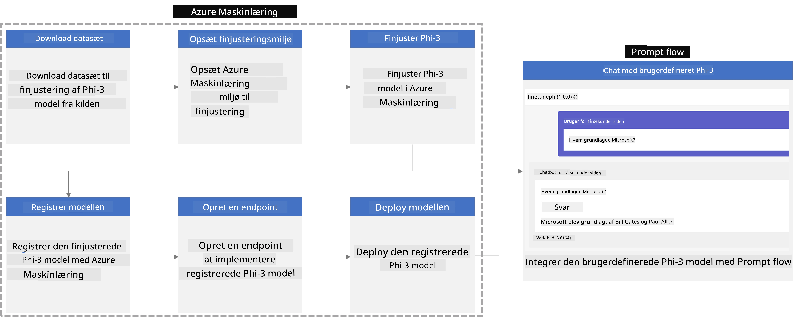

### Indholdsfortegnelse

1. **[Scenarie 1: Opsæt Azure-ressourcer og forbered til finjustering](../../../../../../md/02.Application/01.TextAndChat/Phi3)**
    - [Opret en Azure Machine Learning Workspace](../../../../../../md/02.Application/01.TextAndChat/Phi3)
    - [Anmod om GPU-kvoter i Azure-abonnement](../../../../../../md/02.Application/01.TextAndChat/Phi3)
    - [Tilføj rolle tildeling](../../../../../../md/02.Application/01.TextAndChat/Phi3)
    - [Opsæt projekt](../../../../../../md/02.Application/01.TextAndChat/Phi3)
    - [Forbered datasæt til finjustering](../../../../../../md/02.Application/01.TextAndChat/Phi3)

1. **[Scenarie 2: Finjuster Phi-3-model og implementer i Azure Machine Learning Studio](../../../../../../md/02.Application/01.TextAndChat/Phi3)**
    - [Opsæt Azure CLI](../../../../../../md/02.Application/01.TextAndChat/Phi3)
    - [Finjuster Phi-3-modellen](../../../../../../md/02.Application/01.TextAndChat/Phi3)
    - [Implementer den finjusterede model](../../../../../../md/02.Application/01.TextAndChat/Phi3)

1. **[Scenarie 3: Integrer med Prompt flow og chat med din brugerdefinerede model](../../../../../../md/02.Application/01.TextAndChat/Phi3)**
    - [Integrer den brugerdefinerede Phi-3-model med Prompt flow](../../../../../../md/02.Application/01.TextAndChat/Phi3)
    - [Chat med din brugerdefinerede model](../../../../../../md/02.Application/01.TextAndChat/Phi3)

## Scenarie 1: Opsæt Azure-ressourcer og forbered til finjustering

### Opret en Azure Machine Learning Workspace

1. Skriv *azure machine learning* i **søgefeltet** øverst på portal-siden og vælg **Azure Machine Learning** blandt de viste muligheder.

    

1. Vælg **+ Opret** fra navigationsmenuen.

1. Vælg **Ny workspace** fra navigationsmenuen.

    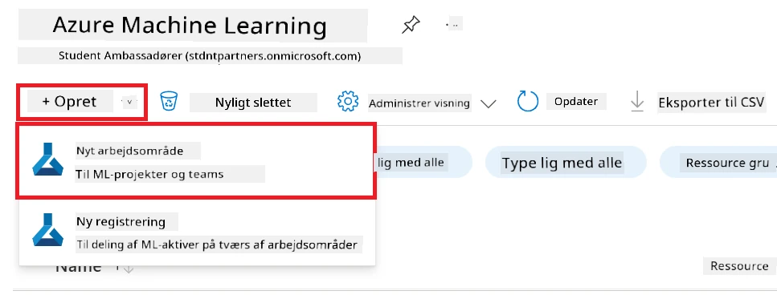

1. Udfør følgende opgaver:

    - Vælg dit Azure **Abonnement**.
    - Vælg den **Ressourcegruppe**, du vil bruge (opret en ny, hvis nødvendigt).
    - Indtast **Workspace-navn**. Det skal være en unik værdi.
    - Vælg den **Region**, du ønsker at bruge.
    - Vælg den **Storage-konto**, du vil bruge (opret en ny, hvis nødvendigt).
    - Vælg den **Nøgleboks**, du vil bruge (opret en ny, hvis nødvendigt).
    - Vælg **Application Insights**, du vil bruge (opret en ny, hvis nødvendigt).
    - Vælg **Container registry**, du vil bruge (opret en ny, hvis nødvendigt).

    

1. Vælg **Gennemse + Opret**.

1. Vælg **Opret**.

### Anmod om GPU-kvoter i Azure-abonnement

I denne E2E-prøve vil du bruge *Standard_NC24ads_A100_v4 GPU* til finjustering, hvilket kræver en kvoteanmodning, og *Standard_E4s_v3* CPU til implementering, som ikke kræver en kvoteanmodning.

> [!NOTE]
>
> Kun Pay-As-You-Go abonnementer (standardabonnementstype) er berettiget til GPU-tildeling; fordelabonnementer understøttes ikke i øjeblikket.
>
> For dem, der bruger fordelabonnementer (såsom Visual Studio Enterprise Subscription) eller som ønsker at teste finjusterings- og implementeringsprocessen hurtigt, giver denne vejledning også anvisninger til finjustering med et minimalt datasæt ved brug af en CPU. Det er dog vigtigt at bemærke, at finjusteringsresultater er betydeligt bedre, når man bruger en GPU med større datasæt.

1. Besøg [Azure ML Studio](https://ml.azure.com/home?wt.mc_id=studentamb_279723).

1. Udfør følgende opgaver for at anmode om *Standard NCADSA100v4 Family* kvote:

    - Vælg **Kvote** fra fanen til venstre.
    - Vælg den **Virtuelle maskinfamilie**, du vil bruge. For eksempel vælg **Standard NCADSA100v4 Family Cluster Dedicated vCPUs**, som inkluderer *Standard_NC24ads_A100_v4* GPU.
    - Vælg **Anmod om kvote** fra navigationsmenuen.

        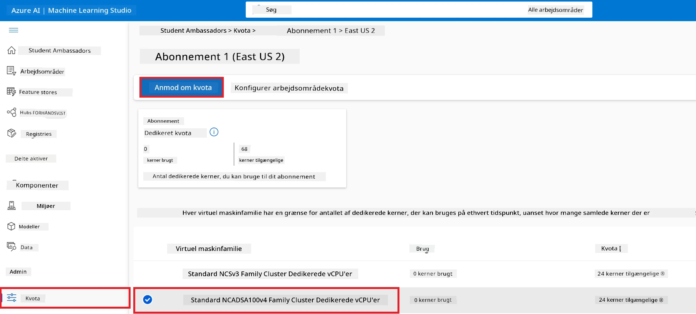

    - På siden for Anmod om kvote angiv den **Nye kernegrænse**, du ønsker at bruge. For eksempel 24.
    - Vælg **Send** for at anmode om GPU-kvoten.

> [!NOTE]
> Du kan vælge den passende GPU eller CPU til dine behov ved at henvise til dokumentet [Størrelser for virtuelle maskiner i Azure](https://learn.microsoft.com/azure/virtual-machines/sizes/overview?tabs=breakdownseries%2Cgeneralsizelist%2Ccomputesizelist%2Cmemorysizelist%2Cstoragesizelist%2Cgpusizelist%2Cfpgasizelist%2Chpcsizelist).

### Tilføj rolle tildeling

For at finjustere og implementere dine modeller skal du først oprette en User Assigned Managed Identity (UAI) og tildele den de passende tilladelser. Denne UAI vil blive brugt til godkendelse under implementeringen.

#### Opret User Assigned Managed Identity (UAI)

1. Skriv *managed identities* i **søgefeltet** øverst på portalsiden og vælg **Managed Identities** blandt de viste muligheder.

    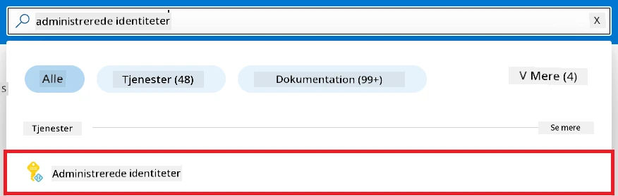

1. Vælg **+ Opret**.

    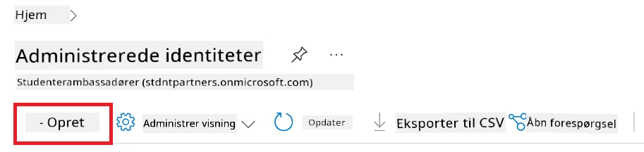

1. Udfør følgende opgaver:

    - Vælg dit Azure **Abonnement**.
    - Vælg den **Ressourcegruppe**, du vil bruge (opret en ny, hvis nødvendigt).
    - Vælg den **Region**, du ønsker at bruge.
    - Indtast **Navn**. Det skal være en unik værdi.

1. Vælg **Gennemse + opret**.

1. Vælg **+ Opret**.

#### Tilføj Contributor rolle tildeling til Managed Identity

1. Naviger til den Managed Identity-ressource, som du oprettede.

1. Vælg **Azure rolle tildelinger** fra venstre sidefanen.

1. Vælg **+ Tilføj rolle tildeling** fra navigationsmenuen.

1. På siden Tilføj rolle tildeling, udfør følgende opgaver:
    - Vælg **Scope** til **Ressourcegruppe**.
    - Vælg dit Azure **Abonnement**.
    - Vælg den **Ressourcegruppe**, du vil bruge.
    - Vælg **Rolle** til **Bidragyder**.

    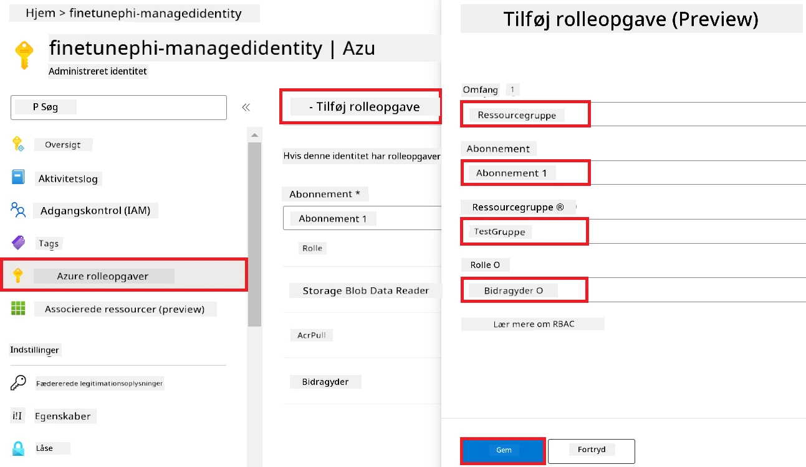

1. Vælg **Gem**.

#### Tilføj Storage Blob Data Reader rolle tildeling til Managed Identity

1. Skriv *storage accounts* i **søgefeltet** øverst på portal-siden og vælg **Storage accounts** blandt de viste muligheder.

    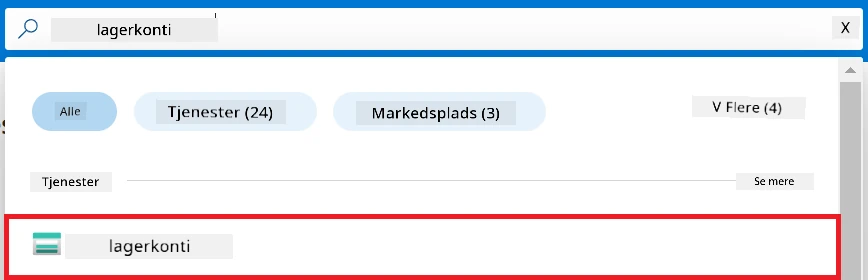

1. Vælg den storage-konto, der er tilknyttet Azure Machine Learning workspace, som du oprettede. For eksempel *finetunephistorage*.

1. Udfør følgende opgaver for at navigere til siden Tilføj rolle tildeling:

    - Naviger til den Azure Storage-konto, du oprettede.
    - Vælg **Adgangskontrol (IAM)** fra venstre sidefanen.
    - Vælg **+ Tilføj** fra navigationsmenuen.
    - Vælg **Tilføj rolle tildeling** fra navigationsmenuen.

    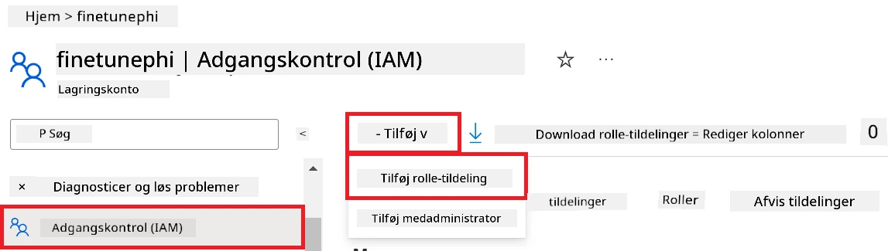

1. På siden Tilføj rolle tildeling, udfør følgende opgaver:

    - Indtast *Storage Blob Data Reader* i **søgefeltet** på Rollesiden, og vælg **Storage Blob Data Reader** blandt de viste muligheder.
    - Vælg **Næste**.
    - På side Medlemmer vælg **Tildel adgang til** **Managed identity**.
    - Vælg **+ Vælg medlemmer**.
    - På siden Vælg administrerede identiteter vælg dit Azure **Abonnement**.
    - Vælg den **Administrerede identitet** til **Managed Identity**.
    - Vælg den Managed Identity, du oprettede. For eksempel *finetunephi-managedidentity*.
    - Vælg **Vælg**.

    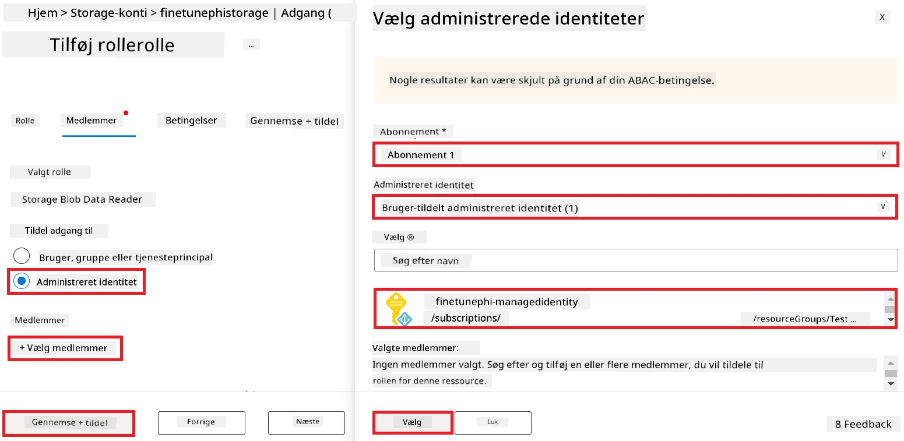

1. Vælg **Gennemse + tildel**.

#### Tilføj AcrPull rolle tildeling til Managed Identity

1. Skriv *container registries* i **søgefeltet** øverst på portal-siden og vælg **Container registries** blandt de viste muligheder.

    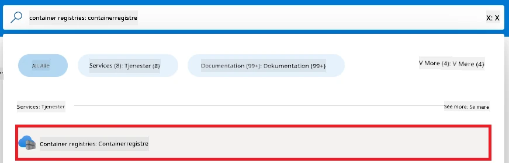

1. Vælg container registret, der er tilknyttet Azure Machine Learning workspace. For eksempel *finetunephicontainerregistries*

1. Udfør følgende opgaver for at navigere til siden Tilføj rolle tildeling:

    - Vælg **Adgangskontrol (IAM)** fra venstre sidefanen.
    - Vælg **+ Tilføj** fra navigationsmenuen.
    - Vælg **Tilføj rolle tildeling** fra navigationsmenuen.

1. På siden Tilføj rolle tildeling, udfør følgende opgaver:

    - Indtast *AcrPull* i **søgefeltet** og vælg **AcrPull** blandt de viste muligheder.
    - Vælg **Næste**.
    - På siden Medlemmer vælg **Tildel adgang til** **Managed identity**.
    - Vælg **+ Vælg medlemmer**.
    - På siden Vælg administrerede identiteter vælg dit Azure **Abonnement**.
    - Vælg den **Administrerede identitet** til **Managed Identity**.
    - Vælg den Managed Identity, du oprettede. For eksempel *finetunephi-managedidentity*.
    - Vælg **Vælg**.
    - Vælg **Gennemse + tildel**.

### Opsæt projekt

Nu vil du oprette en mappe at arbejde i og opsætte et virtuelt miljø til at udvikle et program, der interagerer med brugere og bruger lagret chat-historik fra Azure Cosmos DB til at informere sine svar.

#### Opret en mappe at arbejde i

1. Åbn et terminalvindue og skriv følgende kommando for at oprette en mappe med navnet *finetune-phi* i standardstien.

    ```console
    mkdir finetune-phi
    ```

1. Indtast følgende kommando i dit terminalvindue for at navigere til den oprettede *finetune-phi*-mappe.

    ```console
    cd finetune-phi
    ```

#### Opret et virtuelt miljø

1. Skriv følgende kommando i dit terminalvindue for at oprette et virtuelt miljø med navnet *.venv*.

    ```console
    python -m venv .venv
    ```

1. Skriv følgende kommando i dit terminalvindue for at aktivere det virtuelle miljø.

    ```console
    .venv\Scripts\activate.bat
    ```

> [!NOTE]
>
> Hvis det virkede, bør du se *(.venv)* før kommandoprompten.

#### Installer de nødvendige pakker

1. Skriv følgende kommandoer i dit terminalvindue for at installere de nødvendige pakker.

    ```console
    pip install datasets==2.19.1
    pip install transformers==4.41.1
    pip install azure-ai-ml==1.16.0
    pip install torch==2.3.1
    pip install trl==0.9.4
    pip install promptflow==1.12.0
    ```

#### Opret projektfiler
I denne øvelse skal du oprette de nødvendige filer til vores projekt. Disse filer indeholder scripts til at downloade datasættet, opsætte Azure Machine Learning-miljøet, finjustere Phi-3 modellen og deployere den finjusterede model. Du skal også oprette en *conda.yml* fil til opsætning af finjusteringsmiljøet.

I denne øvelse skal du:

- Oprette en *download_dataset.py* fil til at downloade datasættet.
- Oprette en *setup_ml.py* fil til at opsætte Azure Machine Learning-miljøet.
- Oprette en *fine_tune.py* fil i *finetuning_dir* mappen til at finjustere Phi-3 modellen ved hjælp af datasættet.
- Oprette en *conda.yml* fil til opsætning af finjusteringsmiljøet.
- Oprette en *deploy_model.py* fil til at deployere den finjusterede model.
- Oprette en *integrate_with_promptflow.py* fil til at integrere den finjusterede model og udføre modellen med Prompt flow.
- Oprette en flow.dag.yml fil til at opsætte arbejdsflowsstrukturen for Prompt flow.
- Oprette en *config.py* fil til at indtaste Azure oplysninger.

> [!NOTE]
>
> Færdig mappe struktur:
>
> ```text
> └── YourUserName
> .    └── finetune-phi
> .        ├── finetuning_dir
> .        │      └── fine_tune.py
> .        ├── conda.yml
> .        ├── config.py
> .        ├── deploy_model.py
> .        ├── download_dataset.py
> .        ├── flow.dag.yml
> .        ├── integrate_with_promptflow.py
> .        └── setup_ml.py
> ```

1. Åbn **Visual Studio Code**.

1. Vælg **File** fra menulinjen.

1. Vælg **Open Folder**.

1. Vælg *finetune-phi* mappen, som du har oprettet, og som ligger i *C:\Users\yourUserName\finetune-phi*.

    

1. I venstre side i Visual Studio Code, højreklik og vælg **New File** for at oprette en ny fil med navnet *download_dataset.py*.

1. I venstre side i Visual Studio Code, højreklik og vælg **New File** for at oprette en ny fil med navnet *setup_ml.py*.

1. I venstre side i Visual Studio Code, højreklik og vælg **New File** for at oprette en ny fil med navnet *deploy_model.py*.

    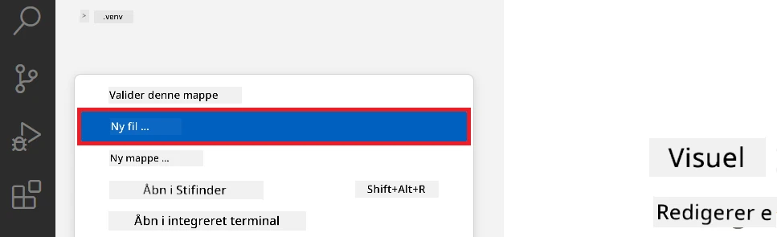

1. I venstre side i Visual Studio Code, højreklik og vælg **New Folder** for at oprette en ny mappe med navnet *finetuning_dir*.

1. I *finetuning_dir* mappen, opret en ny fil med navnet *fine_tune.py*.

#### Opret og konfigurer *conda.yml* fil

1. I venstre side i Visual Studio Code, højreklik og vælg **New File** for at oprette en ny fil med navnet *conda.yml*.

1. Tilføj følgende kode til *conda.yml* filen for at opsætte finjusteringsmiljøet til Phi-3 modellen.

    ```yml
    name: phi-3-training-env
    channels:
      - defaults
      - conda-forge
    dependencies:
      - python=3.10
      - pip
      - numpy<2.0
      - pip:
          - torch==2.4.0
          - torchvision==0.19.0
          - trl==0.8.6
          - transformers==4.41
          - datasets==2.21.0
          - azureml-core==1.57.0
          - azure-storage-blob==12.19.0
          - azure-ai-ml==1.16
          - azure-identity==1.17.1
          - accelerate==0.33.0
          - mlflow==2.15.1
          - azureml-mlflow==1.57.0
    ```

#### Opret og konfigurer *config.py* fil

1. I venstre side i Visual Studio Code, højreklik og vælg **New File** for at oprette en ny fil med navnet *config.py*.

1. Tilføj følgende kode til *config.py* filen for at indsætte dine Azure oplysninger.

    ```python
    # Azure-indstillinger
    AZURE_SUBSCRIPTION_ID = "your_subscription_id"
    AZURE_RESOURCE_GROUP_NAME = "your_resource_group_name" # "TestGroup"

    # Azure Machine Learning-indstillinger
    AZURE_ML_WORKSPACE_NAME = "your_workspace_name" # "finetunephi-workspace"

    # Azure Managed Identity-indstillinger
    AZURE_MANAGED_IDENTITY_CLIENT_ID = "your_azure_managed_identity_client_id"
    AZURE_MANAGED_IDENTITY_NAME = "your_azure_managed_identity_name" # "finetunephi-mangedidentity"
    AZURE_MANAGED_IDENTITY_RESOURCE_ID = f"/subscriptions/{AZURE_SUBSCRIPTION_ID}/resourceGroups/{AZURE_RESOURCE_GROUP_NAME}/providers/Microsoft.ManagedIdentity/userAssignedIdentities/{AZURE_MANAGED_IDENTITY_NAME}"

    # Datasæt filstier
    TRAIN_DATA_PATH = "data/train_data.jsonl"
    TEST_DATA_PATH = "data/test_data.jsonl"

    # Indstillinger for finjusteret model
    AZURE_MODEL_NAME = "your_fine_tuned_model_name" # "finetune-phi-model"
    AZURE_ENDPOINT_NAME = "your_fine_tuned_model_endpoint_name" # "finetune-phi-endpoint"
    AZURE_DEPLOYMENT_NAME = "your_fine_tuned_model_deployment_name" # "finetune-phi-deployment"

    AZURE_ML_API_KEY = "your_fine_tuned_model_api_key"
    AZURE_ML_ENDPOINT = "your_fine_tuned_model_endpoint_uri" # "https://{your-endpoint-name}.{your-region}.inference.ml.azure.com/score"
    ```

#### Tilføj Azure miljøvariabler

1. Udfør følgende opgaver for at tilføje Azure Subscription ID:

    - Skriv *subscriptions* i **søgefeltet** øverst på portalsiden og vælg **Subscriptions** fra de viste muligheder.
    - Vælg den Azure Subscription du aktuelt bruger.
    - Kopiér og indsæt dit Subscription ID i *config.py* filen.

    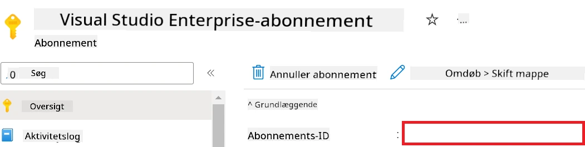

1. Udfør følgende opgaver for at tilføje Azure Workspace Navn:

    - Navigér til den Azure Machine Learning ressource, som du har oprettet.
    - Kopiér og indsæt dit kontonavn i *config.py* filen.

    

1. Udfør følgende opgaver for at tilføje Azure Resource Group Navn:

    - Navigér til den Azure Machine Learning ressource, som du har oprettet.
    - Kopiér og indsæt navnet på din Azure Resource Group i *config.py* filen.

    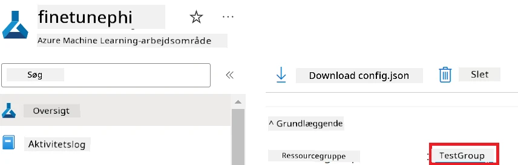

2. Udfør følgende opgaver for at tilføje Azure Managed Identity navn

    - Navigér til Managed Identities ressourcen, som du har oprettet.
    - Kopiér og indsæt navnet på din Azure Managed Identity i *config.py* filen.

    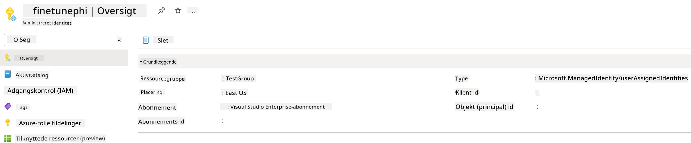

### Forbered datasæt til finjustering

I denne øvelse skal du køre *download_dataset.py* filen for at downloade *ULTRACHAT_200k* datasættet til dit lokale miljø. Du vil derefter bruge dette datasæt til at finjustere Phi-3 modellen i Azure Machine Learning.

#### Download dit datasæt med *download_dataset.py*

1. Åbn filen *download_dataset.py* i Visual Studio Code.

1. Tilføj følgende kode i *download_dataset.py*.

    ```python
    import json
    import os
    from datasets import load_dataset
    from config import (
        TRAIN_DATA_PATH,
        TEST_DATA_PATH)

    def load_and_split_dataset(dataset_name, config_name, split_ratio):
        """
        Load and split a dataset.
        """
        # Indlæs datasættet med det angivne navn, konfiguration og splitforhold
        dataset = load_dataset(dataset_name, config_name, split=split_ratio)
        print(f"Original dataset size: {len(dataset)}")
        
        # Opdel datasættet i trænings- og test-sæt (80% træning, 20% test)
        split_dataset = dataset.train_test_split(test_size=0.2)
        print(f"Train dataset size: {len(split_dataset['train'])}")
        print(f"Test dataset size: {len(split_dataset['test'])}")
        
        return split_dataset

    def save_dataset_to_jsonl(dataset, filepath):
        """
        Save a dataset to a JSONL file.
        """
        # Opret mappen, hvis den ikke findes
        os.makedirs(os.path.dirname(filepath), exist_ok=True)
        
        # Åbn filen i skrive-tilstand
        with open(filepath, 'w', encoding='utf-8') as f:
            # Gennemgå hver post i datasættet
            for record in dataset:
                # Skriv posten som et JSON-objekt og gem det i filen
                json.dump(record, f)
                # Skriv et linjeskift for at adskille poster
                f.write('\n')
        
        print(f"Dataset saved to {filepath}")

    def main():
        """
        Main function to load, split, and save the dataset.
        """
        # Indlæs og opdel ULTRACHAT_200k datasættet med en specifik konfiguration og splitforhold
        dataset = load_and_split_dataset("HuggingFaceH4/ultrachat_200k", 'default', 'train_sft[:1%]')
        
        # Udtræk trænings- og testdatasættene fra opdelingen
        train_dataset = dataset['train']
        test_dataset = dataset['test']

        # Gem træningsdatasættet i en JSONL-fil
        save_dataset_to_jsonl(train_dataset, TRAIN_DATA_PATH)
        
        # Gem testdatasættet i en separat JSONL-fil
        save_dataset_to_jsonl(test_dataset, TEST_DATA_PATH)

    if __name__ == "__main__":
        main()

    ```

> [!TIP]
>
> **Vejledning til finjustering med et minimalt datasæt ved hjælp af en CPU**
>
> Hvis du ønsker at bruge en CPU til finjustering, er denne tilgang ideel for dem med fordelabonnementer (såsom Visual Studio Enterprise Subscription) eller for hurtigt at teste finjusterings- og deployeringsprocessen.
>
> Erstat `dataset = load_and_split_dataset("HuggingFaceH4/ultrachat_200k", 'default', 'train_sft[:1%]')` med `dataset = load_and_split_dataset("HuggingFaceH4/ultrachat_200k", 'default', 'train_sft[:10]')`
>

1. Skriv følgende kommando i din terminal for at køre scriptet og downloade datasættet til dit lokale miljø.

    ```console
    python download_data.py
    ```

1. Bekræft, at datasættene blev gemt korrekt i din lokale *finetune-phi/data* mappe.

> [!NOTE]
>
> **Datasætets størrelse og finjusteringstid**
>
> I dette E2E eksempel bruger du kun 1% af datasættet (`train_sft[:1%]`). Dette reducerer væsentligt datamængden og fremskynder både upload- og finjusteringsprocesserne. Du kan justere procentdelen for at finde den rette balance mellem træningstid og modelpræstation. Brug af en mindre delmængde af datasættet mindsker tiden, der kræves til finjustering, og gør processen mere håndterbar i et E2E eksempel.

## Scenario 2: Finjuster Phi-3 model og deployér i Azure Machine Learning Studio

### Opsæt Azure CLI

Du skal opsætte Azure CLI for at autentificere dit miljø. Azure CLI gør det muligt at administrere Azure ressourcer direkte via kommandolinjen og leverer de nødvendige legitimationsoplysninger, så Azure Machine Learning kan få adgang til disse ressourcer. For at komme i gang, installer [Azure CLI](https://learn.microsoft.com/cli/azure/install-azure-cli)

1. Åbn et terminalvindue, og indtast følgende kommando for at logge ind på din Azure-konto.

    ```console
    az login
    ```

1. Vælg din Azure konto.

1. Vælg den Azure subscription, du vil bruge.

    

> [!TIP]
>
> Hvis du har problemer med at logge ind på Azure, kan du prøve at bruge en enhedskode. Åbn et terminalvindue, og indtast følgende kommando for at logge ind på din Azure konto:
>
> ```console
> az login --use-device-code
> ```
>

### Finjuster Phi-3 modellen

I denne øvelse skal du finjustere Phi-3 modellen ved hjælp af det leverede datasæt. Først definerer du finjusteringsprocessen i *fine_tune.py* filen. Derefter konfigurerer du Azure Machine Learning-miljøet og starter finjusteringsprocessen ved at køre *setup_ml.py* filen. Dette script sikrer, at finjusteringen sker inden for Azure Machine Learning-miljøet.

Ved at køre *setup_ml.py* starter du finjusteringsprocessen i Azure Machine Learning-miljøet.

#### Tilføj kode til *fine_tune.py* filen

1. Navigér til *finetuning_dir* mappen og åbn *fine_tune.py* filen i Visual Studio Code.

1. Tilføj følgende kode til *fine_tune.py*.

    ```python
    import argparse
    import sys
    import logging
    import os
    from datasets import load_dataset
    import torch
    import mlflow
    from transformers import AutoModelForCausalLM, AutoTokenizer, TrainingArguments
    from trl import SFTTrainer

    # For at undgå INVALID_PARAMETER_VALUE-fejlen i MLflow, deaktiver MLflow-integration
    os.environ["DISABLE_MLFLOW_INTEGRATION"] = "True"

    # Opsætning af logning
    logging.basicConfig(
        format="%(asctime)s - %(levelname)s - %(name)s - %(message)s",
        datefmt="%Y-%m-%d %H:%M:%S",
        handlers=[logging.StreamHandler(sys.stdout)],
        level=logging.WARNING
    )
    logger = logging.getLogger(__name__)

    def initialize_model_and_tokenizer(model_name, model_kwargs):
        """
        Initialize the model and tokenizer with the given pretrained model name and arguments.
        """
        model = AutoModelForCausalLM.from_pretrained(model_name, **model_kwargs)
        tokenizer = AutoTokenizer.from_pretrained(model_name)
        tokenizer.model_max_length = 2048
        tokenizer.pad_token = tokenizer.unk_token
        tokenizer.pad_token_id = tokenizer.convert_tokens_to_ids(tokenizer.pad_token)
        tokenizer.padding_side = 'right'
        return model, tokenizer

    def apply_chat_template(example, tokenizer):
        """
        Apply a chat template to tokenize messages in the example.
        """
        messages = example["messages"]
        if messages[0]["role"] != "system":
            messages.insert(0, {"role": "system", "content": ""})
        example["text"] = tokenizer.apply_chat_template(
            messages, tokenize=False, add_generation_prompt=False
        )
        return example

    def load_and_preprocess_data(train_filepath, test_filepath, tokenizer):
        """
        Load and preprocess the dataset.
        """
        train_dataset = load_dataset('json', data_files=train_filepath, split='train')
        test_dataset = load_dataset('json', data_files=test_filepath, split='train')
        column_names = list(train_dataset.features)

        train_dataset = train_dataset.map(
            apply_chat_template,
            fn_kwargs={"tokenizer": tokenizer},
            num_proc=10,
            remove_columns=column_names,
            desc="Applying chat template to train dataset",
        )

        test_dataset = test_dataset.map(
            apply_chat_template,
            fn_kwargs={"tokenizer": tokenizer},
            num_proc=10,
            remove_columns=column_names,
            desc="Applying chat template to test dataset",
        )

        return train_dataset, test_dataset

    def train_and_evaluate_model(train_dataset, test_dataset, model, tokenizer, output_dir):
        """
        Train and evaluate the model.
        """
        training_args = TrainingArguments(
            bf16=True,
            do_eval=True,
            output_dir=output_dir,
            eval_strategy="epoch",
            learning_rate=5.0e-06,
            logging_steps=20,
            lr_scheduler_type="cosine",
            num_train_epochs=3,
            overwrite_output_dir=True,
            per_device_eval_batch_size=4,
            per_device_train_batch_size=4,
            remove_unused_columns=True,
            save_steps=500,
            seed=0,
            gradient_checkpointing=True,
            gradient_accumulation_steps=1,
            warmup_ratio=0.2,
        )

        trainer = SFTTrainer(
            model=model,
            args=training_args,
            train_dataset=train_dataset,
            eval_dataset=test_dataset,
            max_seq_length=2048,
            dataset_text_field="text",
            tokenizer=tokenizer,
            packing=True
        )

        train_result = trainer.train()
        trainer.log_metrics("train", train_result.metrics)

        mlflow.transformers.log_model(
            transformers_model={"model": trainer.model, "tokenizer": tokenizer},
            artifact_path=output_dir,
        )

        tokenizer.padding_side = 'left'
        eval_metrics = trainer.evaluate()
        eval_metrics["eval_samples"] = len(test_dataset)
        trainer.log_metrics("eval", eval_metrics)

    def main(train_file, eval_file, model_output_dir):
        """
        Main function to fine-tune the model.
        """
        model_kwargs = {
            "use_cache": False,
            "trust_remote_code": True,
            "torch_dtype": torch.bfloat16,
            "device_map": None,
            "attn_implementation": "eager"
        }

        # foruddannet_model_navn = "microsoft/Phi-3-mini-4k-instruct"
        pretrained_model_name = "microsoft/Phi-3.5-mini-instruct"

        with mlflow.start_run():
            model, tokenizer = initialize_model_and_tokenizer(pretrained_model_name, model_kwargs)
            train_dataset, test_dataset = load_and_preprocess_data(train_file, eval_file, tokenizer)
            train_and_evaluate_model(train_dataset, test_dataset, model, tokenizer, model_output_dir)

    if __name__ == "__main__":
        parser = argparse.ArgumentParser()
        parser.add_argument("--train-file", type=str, required=True, help="Path to the training data")
        parser.add_argument("--eval-file", type=str, required=True, help="Path to the evaluation data")
        parser.add_argument("--model_output_dir", type=str, required=True, help="Directory to save the fine-tuned model")
        args = parser.parse_args()
        main(args.train_file, args.eval_file, args.model_output_dir)

    ```

1. Gem og luk *fine_tune.py* filen.

> [!TIP]
> **Du kan finjustere Phi-3.5 modellen**
>
> I *fine_tune.py* kan du ændre `pretrained_model_name` fra `"microsoft/Phi-3-mini-4k-instruct"` til enhver model, du ønsker at finjustere. Hvis du for eksempel ændrer den til `"microsoft/Phi-3.5-mini-instruct"`, bruger du Phi-3.5-mini-instruct modellen til finjustering. For at finde og bruge den model, du foretrækker, besøg [Hugging Face](https://huggingface.co/), søg efter modellen, og kopier derefter dens navn til `pretrained_model_name` feltet i dit script.
>
> <image type="content" src="../../../../imgs/02/FineTuning-PromptFlow/finetunephi3.5.png" alt-text="Finjuster Phi-3.5.">
>

#### Tilføj kode til *setup_ml.py* filen

1. Åbn *setup_ml.py* filen i Visual Studio Code.

1. Tilføj følgende kode til *setup_ml.py*.

    ```python
    import logging
    from azure.ai.ml import MLClient, command, Input
    from azure.ai.ml.entities import Environment, AmlCompute
    from azure.identity import AzureCliCredential
    from config import (
        AZURE_SUBSCRIPTION_ID,
        AZURE_RESOURCE_GROUP_NAME,
        AZURE_ML_WORKSPACE_NAME,
        TRAIN_DATA_PATH,
        TEST_DATA_PATH
    )

    # Konstanter

    # Fjern kommentaren fra følgende linjer for at bruge en CPU-instans til træning
    # COMPUTE_INSTANCE_TYPE = "Standard_E16s_v3" # cpu
    # COMPUTE_NAME = "cpu-e16s-v3"
    # DOCKER_IMAGE_NAME = "mcr.microsoft.com/azureml/openmpi4.1.0-ubuntu20.04:latest"

    # Fjern kommentaren fra følgende linjer for at bruge en GPU-instans til træning
    COMPUTE_INSTANCE_TYPE = "Standard_NC24ads_A100_v4"
    COMPUTE_NAME = "gpu-nc24s-a100-v4"
    DOCKER_IMAGE_NAME = "mcr.microsoft.com/azureml/curated/acft-hf-nlp-gpu:59"

    CONDA_FILE = "conda.yml"
    LOCATION = "eastus2" # Erstat med placeringen af din compute-klynge
    FINETUNING_DIR = "./finetuning_dir" # Sti til finjusteringsscriptet
    TRAINING_ENV_NAME = "phi-3-training-environment" # Navn på træningsmiljøet
    MODEL_OUTPUT_DIR = "./model_output" # Sti til modelens outputmappe i azure ml

    # Logopsætning for at spore processen
    logger = logging.getLogger(__name__)
    logging.basicConfig(
        format="%(asctime)s - %(levelname)s - %(name)s - %(message)s",
        datefmt="%Y-%m-%d %H:%M:%S",
        level=logging.WARNING
    )

    def get_ml_client():
        """
        Initialize the ML Client using Azure CLI credentials.
        """
        credential = AzureCliCredential()
        return MLClient(credential, AZURE_SUBSCRIPTION_ID, AZURE_RESOURCE_GROUP_NAME, AZURE_ML_WORKSPACE_NAME)

    def create_or_get_environment(ml_client):
        """
        Create or update the training environment in Azure ML.
        """
        env = Environment(
            image=DOCKER_IMAGE_NAME,  # Docker-billede til miljøet
            conda_file=CONDA_FILE,  # Conda-miljøfil
            name=TRAINING_ENV_NAME,  # Navn på miljøet
        )
        return ml_client.environments.create_or_update(env)

    def create_or_get_compute_cluster(ml_client, compute_name, COMPUTE_INSTANCE_TYPE, location):
        """
        Create or update the compute cluster in Azure ML.
        """
        try:
            compute_cluster = ml_client.compute.get(compute_name)
            logger.info(f"Compute cluster '{compute_name}' already exists. Reusing it for the current run.")
        except Exception:
            logger.info(f"Compute cluster '{compute_name}' does not exist. Creating a new one with size {COMPUTE_INSTANCE_TYPE}.")
            compute_cluster = AmlCompute(
                name=compute_name,
                size=COMPUTE_INSTANCE_TYPE,
                location=location,
                tier="Dedicated",  # Niveau for compute-klyngen
                min_instances=0,  # Mindste antal instanser
                max_instances=1  # Maksimalt antal instanser
            )
            ml_client.compute.begin_create_or_update(compute_cluster).wait()  # Vent på at klyngen oprettes
        return compute_cluster

    def create_fine_tuning_job(env, compute_name):
        """
        Set up the fine-tuning job in Azure ML.
        """
        return command(
            code=FINETUNING_DIR,  # Sti til fine_tune.py
            command=(
                "python fine_tune.py "
                "--train-file ${{inputs.train_file}} "
                "--eval-file ${{inputs.eval_file}} "
                "--model_output_dir ${{inputs.model_output}}"
            ),
            environment=env,  # Træningsmiljø
            compute=compute_name,  # Compute-klynge der skal bruges
            inputs={
                "train_file": Input(type="uri_file", path=TRAIN_DATA_PATH),  # Sti til træningsdatafilen
                "eval_file": Input(type="uri_file", path=TEST_DATA_PATH),  # Sti til evalueringsdatafilen
                "model_output": MODEL_OUTPUT_DIR
            }
        )

    def main():
        """
        Main function to set up and run the fine-tuning job in Azure ML.
        """
        # Initialiser ML-klient
        ml_client = get_ml_client()

        # Opret miljø
        env = create_or_get_environment(ml_client)
        
        # Opret eller hent eksisterende compute-klynge
        create_or_get_compute_cluster(ml_client, COMPUTE_NAME, COMPUTE_INSTANCE_TYPE, LOCATION)

        # Opret og indsend finjusteringsjob
        job = create_fine_tuning_job(env, COMPUTE_NAME)
        returned_job = ml_client.jobs.create_or_update(job)  # Indsend jobbet
        ml_client.jobs.stream(returned_job.name)  # Stream joblogs
        
        # Fang jobnavnet
        job_name = returned_job.name
        print(f"Job name: {job_name}")

    if __name__ == "__main__":
        main()

    ```

1. Erstat `COMPUTE_INSTANCE_TYPE`, `COMPUTE_NAME` og `LOCATION` med dine specifikke oplysninger.

    ```python
   # Fjern kommentaren fra følgende linjer for at bruge en GPU-instans til træning
    COMPUTE_INSTANCE_TYPE = "Standard_NC24ads_A100_v4"
    COMPUTE_NAME = "gpu-nc24s-a100-v4"
    ...
    LOCATION = "eastus2" # Erstat med placeringen af din compute-klynge
    ```

> [!TIP]
>
> **Vejledning til finjustering med et minimalt datasæt ved hjælp af en CPU**
>
> Hvis du ønsker at bruge en CPU til finjustering, er denne tilgang ideel for dem med fordelabonnementer (såsom Visual Studio Enterprise Subscription) eller for hurtigt at teste finjusterings- og deployeringsprocessen.
>
> 1. Åbn *setup_ml* filen.
> 1. Erstat `COMPUTE_INSTANCE_TYPE`, `COMPUTE_NAME` og `DOCKER_IMAGE_NAME` med følgende. Hvis du ikke har adgang til *Standard_E16s_v3*, kan du bruge en tilsvarende CPU instans eller anmode om en ny kvote.
> 1. Erstat `LOCATION` med dine specifikke oplysninger.
>
>    ```python
>    # Uncomment the following lines to use a CPU instance for training
>    COMPUTE_INSTANCE_TYPE = "Standard_E16s_v3" # cpu
>    COMPUTE_NAME = "cpu-e16s-v3"
>    DOCKER_IMAGE_NAME = "mcr.microsoft.com/azureml/openmpi4.1.0-ubuntu20.04:latest"
>    LOCATION = "eastus2" # Replace with the location of your compute cluster
>    ```
>

1. Skriv følgende kommando for at køre *setup_ml.py* scriptet og starte finjusteringsprocessen i Azure Machine Learning.

    ```python
    python setup_ml.py
    ```

1. I denne øvelse har du med succes finjusteret Phi-3 modellen ved hjælp af Azure Machine Learning. Ved at køre *setup_ml.py* scriptet har du opsat Azure Machine Learning-miljøet og startet finjusteringsprocessen defineret i *fine_tune.py*. Bemærk, at finjusteringsprocessen kan tage betydelig tid. Efter at have kørt `python setup_ml.py` kommandoen, skal du vente på, at processen bliver færdig. Du kan følge status på finjusteringsjobbet ved at følge linket, som vises i terminalen, til Azure Machine Learning portalen.

    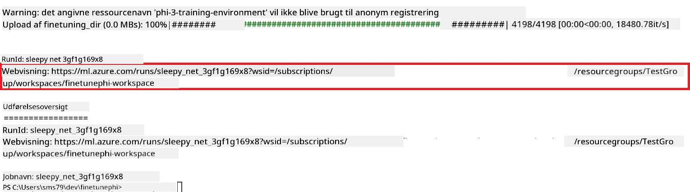

### Deployér den finjusterede model

For at integrere den finjusterede Phi-3 model med Prompt Flow, skal du deployere modellen, så den er tilgængelig til realtids inferens. Denne proces omfatter registrering af modellen, oprettelse af en online endpoint og deployment af modellen.

#### Angiv modelnavn, endpoint navn og deployment navn til deployment

1. Åbn *config.py* filen.

1. Erstat `AZURE_MODEL_NAME = "your_fine_tuned_model_name"` med det ønskede navn til din model.

1. Erstat `AZURE_ENDPOINT_NAME = "your_fine_tuned_model_endpoint_name"` med det ønskede navn til din endpoint.

1. Erstat `AZURE_DEPLOYMENT_NAME = "your_fine_tuned_model_deployment_name"` med det ønskede navn til din deployment.

#### Tilføj kode til *deploy_model.py* filen

Når du kører *deploy_model.py* filen, automatiserer det hele deploymentsprocessen. Det registrerer modellen, opretter en endpoint og udfører deployment baseret på indstillingerne i config.py filen, som indeholder modelnavnet, endpoint navnet og deployment navnet.

1. Åbn *deploy_model.py* filen i Visual Studio Code.

1. Tilføj følgende kode i *deploy_model.py*.

    ```python
    import logging
    from azure.identity import AzureCliCredential
    from azure.ai.ml import MLClient
    from azure.ai.ml.entities import Model, ProbeSettings, ManagedOnlineEndpoint, ManagedOnlineDeployment, IdentityConfiguration, ManagedIdentityConfiguration, OnlineRequestSettings
    from azure.ai.ml.constants import AssetTypes

    # Konfigurationsimporter
    from config import (
        AZURE_SUBSCRIPTION_ID,
        AZURE_RESOURCE_GROUP_NAME,
        AZURE_ML_WORKSPACE_NAME,
        AZURE_MANAGED_IDENTITY_RESOURCE_ID,
        AZURE_MANAGED_IDENTITY_CLIENT_ID,
        AZURE_MODEL_NAME,
        AZURE_ENDPOINT_NAME,
        AZURE_DEPLOYMENT_NAME
    )

    # Konstanter
    JOB_NAME = "your-job-name"
    COMPUTE_INSTANCE_TYPE = "Standard_E4s_v3"

    deployment_env_vars = {
        "SUBSCRIPTION_ID": AZURE_SUBSCRIPTION_ID,
        "RESOURCE_GROUP_NAME": AZURE_RESOURCE_GROUP_NAME,
        "UAI_CLIENT_ID": AZURE_MANAGED_IDENTITY_CLIENT_ID,
    }

    # Logningsopsætning
    logging.basicConfig(
        format="%(asctime)s - %(levelname)s - %(name)s - %(message)s",
        datefmt="%Y-%m-%d %H:%M:%S",
        level=logging.DEBUG
    )
    logger = logging.getLogger(__name__)

    def get_ml_client():
        """Initialize and return the ML Client."""
        credential = AzureCliCredential()
        return MLClient(credential, AZURE_SUBSCRIPTION_ID, AZURE_RESOURCE_GROUP_NAME, AZURE_ML_WORKSPACE_NAME)

    def register_model(ml_client, model_name, job_name):
        """Register a new model."""
        model_path = f"azureml://jobs/{job_name}/outputs/artifacts/paths/model_output"
        logger.info(f"Registering model {model_name} from job {job_name} at path {model_path}.")
        run_model = Model(
            path=model_path,
            name=model_name,
            description="Model created from run.",
            type=AssetTypes.MLFLOW_MODEL,
        )
        model = ml_client.models.create_or_update(run_model)
        logger.info(f"Registered model ID: {model.id}")
        return model

    def delete_existing_endpoint(ml_client, endpoint_name):
        """Delete existing endpoint if it exists."""
        try:
            endpoint_result = ml_client.online_endpoints.get(name=endpoint_name)
            logger.info(f"Deleting existing endpoint {endpoint_name}.")
            ml_client.online_endpoints.begin_delete(name=endpoint_name).result()
            logger.info(f"Deleted existing endpoint {endpoint_name}.")
        except Exception as e:
            logger.info(f"No existing endpoint {endpoint_name} found to delete: {e}")

    def create_or_update_endpoint(ml_client, endpoint_name, description=""):
        """Create or update an endpoint."""
        delete_existing_endpoint(ml_client, endpoint_name)
        logger.info(f"Creating new endpoint {endpoint_name}.")
        endpoint = ManagedOnlineEndpoint(
            name=endpoint_name,
            description=description,
            identity=IdentityConfiguration(
                type="user_assigned",
                user_assigned_identities=[ManagedIdentityConfiguration(resource_id=AZURE_MANAGED_IDENTITY_RESOURCE_ID)]
            )
        )
        endpoint_result = ml_client.online_endpoints.begin_create_or_update(endpoint).result()
        logger.info(f"Created new endpoint {endpoint_name}.")
        return endpoint_result

    def create_or_update_deployment(ml_client, endpoint_name, deployment_name, model):
        """Create or update a deployment."""

        logger.info(f"Creating deployment {deployment_name} for endpoint {endpoint_name}.")
        deployment = ManagedOnlineDeployment(
            name=deployment_name,
            endpoint_name=endpoint_name,
            model=model.id,
            instance_type=COMPUTE_INSTANCE_TYPE,
            instance_count=1,
            environment_variables=deployment_env_vars,
            request_settings=OnlineRequestSettings(
                max_concurrent_requests_per_instance=3,
                request_timeout_ms=180000,
                max_queue_wait_ms=120000
            ),
            liveness_probe=ProbeSettings(
                failure_threshold=30,
                success_threshold=1,
                period=100,
                initial_delay=500,
            ),
            readiness_probe=ProbeSettings(
                failure_threshold=30,
                success_threshold=1,
                period=100,
                initial_delay=500,
            ),
        )
        deployment_result = ml_client.online_deployments.begin_create_or_update(deployment).result()
        logger.info(f"Created deployment {deployment.name} for endpoint {endpoint_name}.")
        return deployment_result

    def set_traffic_to_deployment(ml_client, endpoint_name, deployment_name):
        """Set traffic to the specified deployment."""
        try:
            # Hent de aktuelle slutpunktdetaljer
            endpoint = ml_client.online_endpoints.get(name=endpoint_name)
            
            # Log den aktuelle trafiktildeling til fejlfinding
            logger.info(f"Current traffic allocation: {endpoint.traffic}")
            
            # Indstil trafiktildelingen for udrulningen
            endpoint.traffic = {deployment_name: 100}
            
            # Opdater slutpunktet med den nye trafiktildeling
            endpoint_poller = ml_client.online_endpoints.begin_create_or_update(endpoint)
            updated_endpoint = endpoint_poller.result()
            
            # Log den opdaterede trafiktildeling til fejlfinding
            logger.info(f"Updated traffic allocation: {updated_endpoint.traffic}")
            logger.info(f"Set traffic to deployment {deployment_name} at endpoint {endpoint_name}.")
            return updated_endpoint
        except Exception as e:
            # Log eventuelle fejl, der opstår under processen
            logger.error(f"Failed to set traffic to deployment: {e}")
            raise


    def main():
        ml_client = get_ml_client()

        registered_model = register_model(ml_client, AZURE_MODEL_NAME, JOB_NAME)
        logger.info(f"Registered model ID: {registered_model.id}")

        endpoint = create_or_update_endpoint(ml_client, AZURE_ENDPOINT_NAME, "Endpoint for finetuned Phi-3 model")
        logger.info(f"Endpoint {AZURE_ENDPOINT_NAME} is ready.")

        try:
            deployment = create_or_update_deployment(ml_client, AZURE_ENDPOINT_NAME, AZURE_DEPLOYMENT_NAME, registered_model)
            logger.info(f"Deployment {AZURE_DEPLOYMENT_NAME} is created for endpoint {AZURE_ENDPOINT_NAME}.")

            set_traffic_to_deployment(ml_client, AZURE_ENDPOINT_NAME, AZURE_DEPLOYMENT_NAME)
            logger.info(f"Traffic is set to deployment {AZURE_DEPLOYMENT_NAME} at endpoint {AZURE_ENDPOINT_NAME}.")
        except Exception as e:
            logger.error(f"Failed to create or update deployment: {e}")

    if __name__ == "__main__":
        main()

    ```

1. Udfør følgende for at finde `JOB_NAME`:

    - Navigér til den Azure Machine Learning ressource, som du har oprettet.
    - Vælg **Studio web URL** for at åbne Azure Machine Learning workspace.
    - Vælg **Jobs** fra venstre sidepanel.
    - Vælg eksperimentet til finjustering, for eksempel *finetunephi*.
    - Vælg jobbet, som du har oprettet.
- Kopier og indsæt dit jobnavn i `JOB_NAME = "your-job-name"` i filen *deploy_model.py*.

1. Erstat `COMPUTE_INSTANCE_TYPE` med dine specifikke oplysninger.

1. Skriv følgende kommando for at køre *deploy_model.py* scriptet og starte implementeringsprocessen i Azure Machine Learning.

    ```python
    python deploy_model.py
    ```

> [!WARNING]
> For at undgå yderligere gebyrer på din konto, skal du sørge for at slette den oprettede endpoint i Azure Machine Learning workspace.
>

#### Tjek implementeringsstatus i Azure Machine Learning Workspace

1. Besøg [Azure ML Studio](https://ml.azure.com/home?wt.mc_id=studentamb_279723).

1. Naviger til den Azure Machine Learning workspace, du oprettede.

1. Vælg **Studio web URL** for at åbne Azure Machine Learning workspace.

1. Vælg **Endpoints** fra fanen til venstre.

    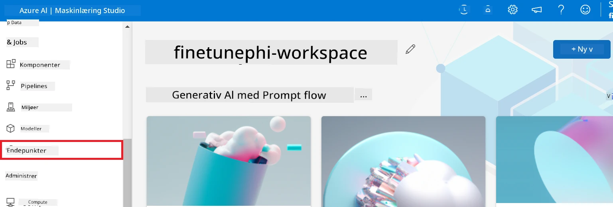

2. Vælg den endpoint, du oprettede.

    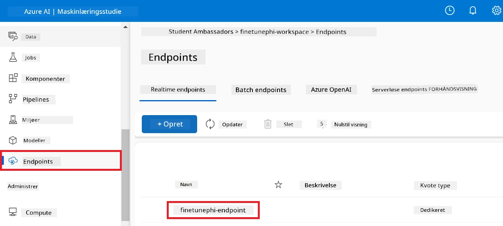

3. På denne side kan du administrere de endpoints, der blev oprettet under implementeringsprocessen.

## Scenario 3: Integrer med Prompt flow og chat med din brugerdefinerede model

### Integrer den brugerdefinerede Phi-3 model med Prompt flow

Efter en vellykket implementering af din finjusterede model, kan du nu integrere den med Prompt flow for at bruge din model i realtidsapplikationer, hvilket muliggør en række interaktive opgaver med din brugerdefinerede Phi-3 model.

#### Indstil api-nøgle og endpoint-uri for den finjusterede Phi-3 model

1. Naviger til den Azure Machine Learning workspace, du oprettede.
1. Vælg **Endpoints** fra fanen til venstre.
1. Vælg den endpoint, du oprettede.
1. Vælg **Consume** fra navigationsmenuen.
1. Kopier og indsæt din **REST endpoint** i filen *config.py*, og erstat `AZURE_ML_ENDPOINT = "your_fine_tuned_model_endpoint_uri"` med din **REST endpoint**.
1. Kopier og indsæt din **Primære nøgle** i filen *config.py*, og erstat `AZURE_ML_API_KEY = "your_fine_tuned_model_api_key"` med din **Primære nøgle**.

    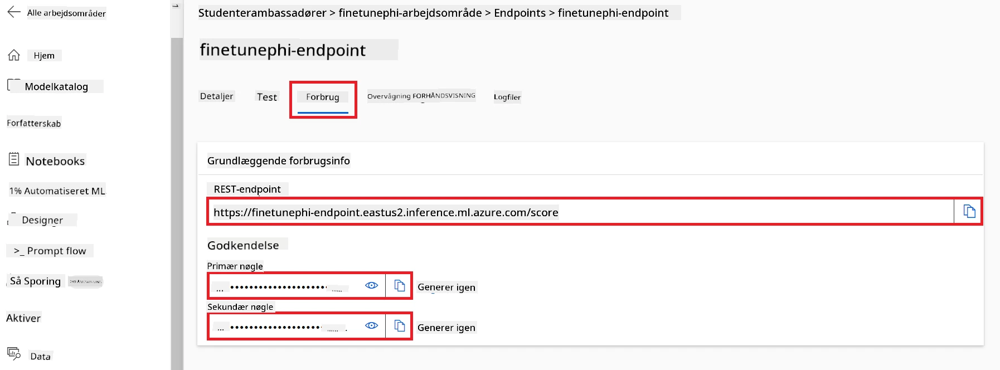

#### Tilføj kode til filen *flow.dag.yml*

1. Åbn filen *flow.dag.yml* i Visual Studio Code.

1. Tilføj følgende kode i *flow.dag.yml*.

    ```yml
    inputs:
      input_data:
        type: string
        default: "Who founded Microsoft?"

    outputs:
      answer:
        type: string
        reference: ${integrate_with_promptflow.output}

    nodes:
    - name: integrate_with_promptflow
      type: python
      source:
        type: code
        path: integrate_with_promptflow.py
      inputs:
        input_data: ${inputs.input_data}
    ```

#### Tilføj kode til filen *integrate_with_promptflow.py*

1. Åbn filen *integrate_with_promptflow.py* i Visual Studio Code.

1. Tilføj følgende kode i *integrate_with_promptflow.py*.

    ```python
    import logging
    import requests
    from promptflow.core import tool
    import asyncio
    import platform
    from config import (
        AZURE_ML_ENDPOINT,
        AZURE_ML_API_KEY
    )

    # Logopsætning
    logging.basicConfig(
        format="%(asctime)s - %(levelname)s - %(name)s - %(message)s",
        datefmt="%Y-%m-%d %H:%M:%S",
        level=logging.DEBUG
    )
    logger = logging.getLogger(__name__)

    def query_azml_endpoint(input_data: list, endpoint_url: str, api_key: str) -> str:
        """
        Send a request to the Azure ML endpoint with the given input data.
        """
        headers = {
            "Content-Type": "application/json",
            "Authorization": f"Bearer {api_key}"
        }
        data = {
            "input_data": [input_data],
            "params": {
                "temperature": 0.7,
                "max_new_tokens": 128,
                "do_sample": True,
                "return_full_text": True
            }
        }
        try:
            response = requests.post(endpoint_url, json=data, headers=headers)
            response.raise_for_status()
            result = response.json()[0]
            logger.info("Successfully received response from Azure ML Endpoint.")
            return result
        except requests.exceptions.RequestException as e:
            logger.error(f"Error querying Azure ML Endpoint: {e}")
            raise

    def setup_asyncio_policy():
        """
        Setup asyncio event loop policy for Windows.
        """
        if platform.system() == 'Windows':
            asyncio.set_event_loop_policy(asyncio.WindowsSelectorEventLoopPolicy())
            logger.info("Set Windows asyncio event loop policy.")

    @tool
    def my_python_tool(input_data: str) -> str:
        """
        Tool function to process input data and query the Azure ML endpoint.
        """
        setup_asyncio_policy()
        return query_azml_endpoint(input_data, AZURE_ML_ENDPOINT, AZURE_ML_API_KEY)

    ```

### Chat med din brugerdefinerede model

1. Skriv følgende kommando for at køre *deploy_model.py* scriptet og starte implementeringsprocessen i Azure Machine Learning.

    ```python
    pf flow serve --source ./ --port 8080 --host localhost
    ```

1. Her er et eksempel på resultaterne: Nu kan du chatte med din brugerdefinerede Phi-3 model. Det anbefales at stille spørgsmål baseret på de data, der blev brugt til finjusteringen.

    

---

<!-- CO-OP TRANSLATOR DISCLAIMER START -->
**Ansvarsfraskrivelse**:
Dette dokument er blevet oversat ved hjælp af AI-oversættelsestjenesten [Co-op Translator](https://github.com/Azure/co-op-translator). Selvom vi bestræber os på nøjagtighed, bedes du være opmærksom på, at automatiserede oversættelser kan indeholde fejl eller unøjagtigheder. Det oprindelige dokument på dets modersmål bør betragtes som den autoritative kilde. For kritisk information anbefales professionel menneskelig oversættelse. Vi påtager os intet ansvar for misforståelser eller fejltolkninger, der opstår som følge af brugen af denne oversættelse.
<!-- CO-OP TRANSLATOR DISCLAIMER END -->